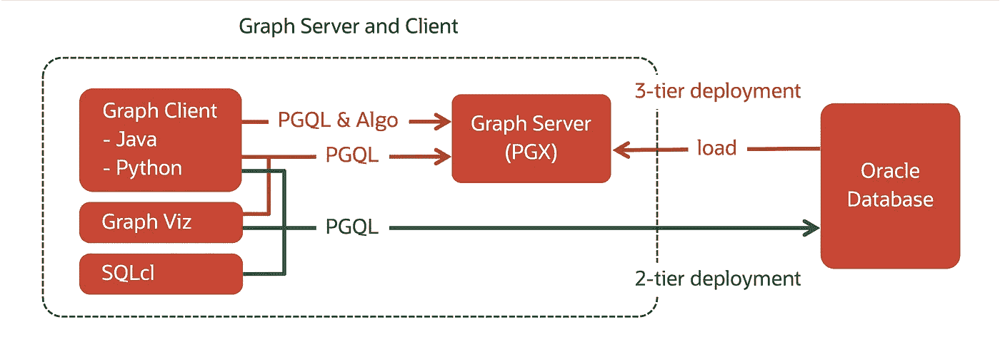
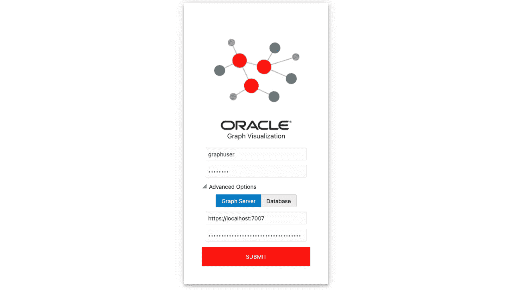
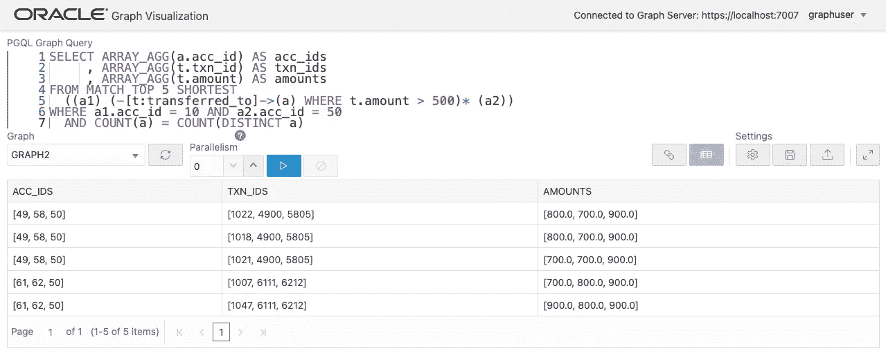
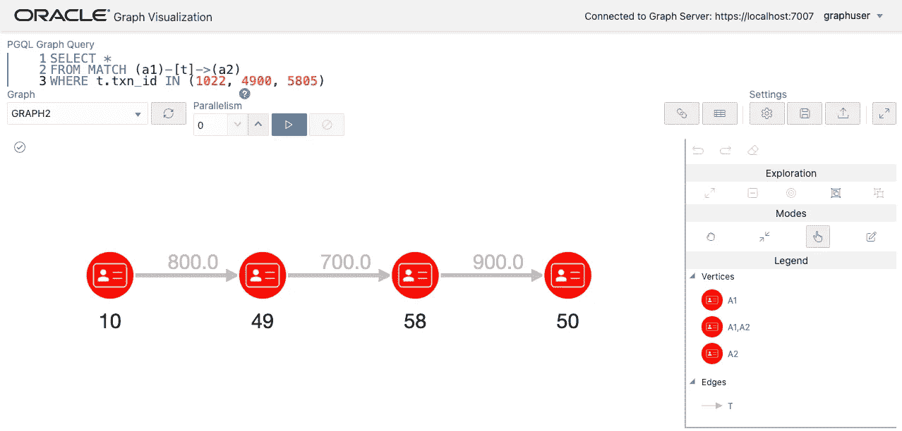
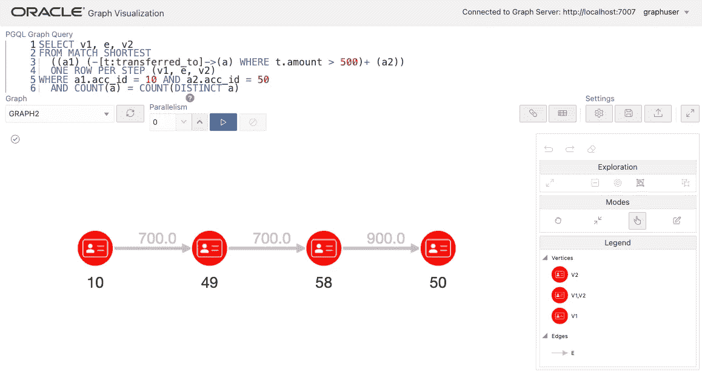
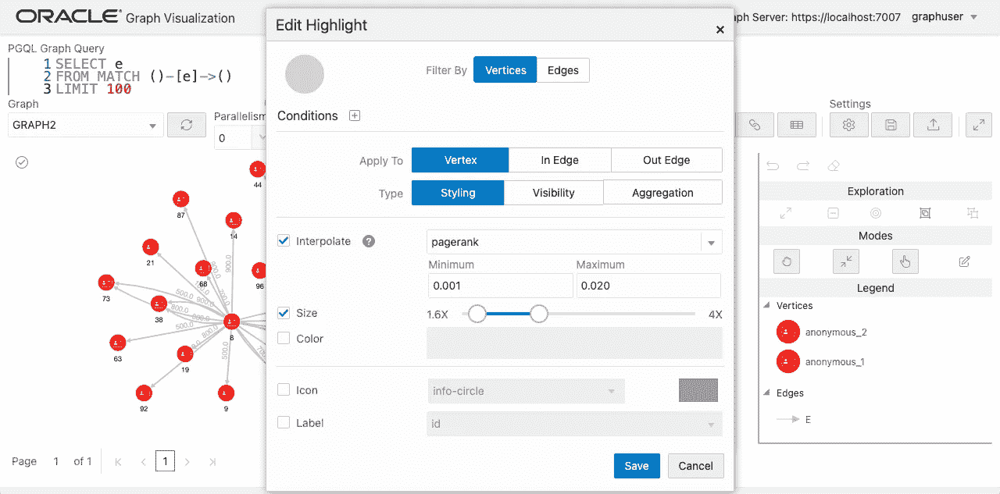
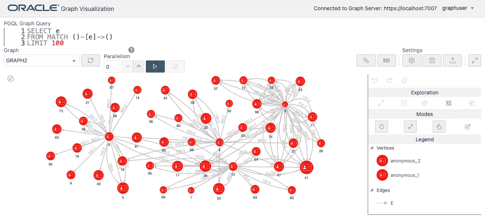
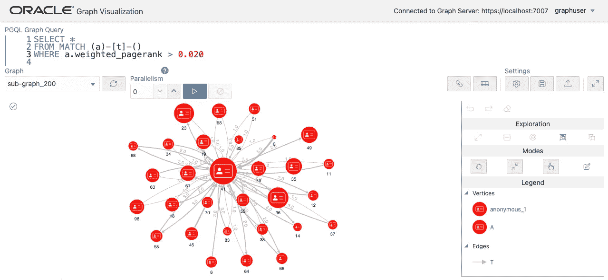

# 使用图表分析银行交易数据(第 3/3 部分)

> 原文：<https://medium.com/oracledevs/analyze-bank-transaction-data-using-graph-part-3-3-ab8ae1f68bd2?source=collection_archive---------0----------------------->


Photo by [Eduardo Soares](https://unsplash.com/@eduschadesoares?utm_source=unsplash&utm_medium=referral&utm_content=creditCopyText) on [Unsplash](https://unsplash.com/s/photos/atm?utm_source=unsplash&utm_medium=referral&utm_content=creditCopyText) (edited)

在[第 1 部分](/oracledevs/analyze-bank-transaction-data-using-graph-part-1-3-2088c6024f81)和[第 2 部分](https://ryotayamanaka.medium.com/analyze-bank-transaction-data-using-graph-part-2-3-155516bb6349)中，我们解释了我们可以使用 Oracle 数据库本身作为图形数据库来存储属性图数据集和执行 PGQL 查询。此外，为了无缝集成，`CREATE PROPERTY GRAPH`语句提供了一个声明性的映射方法，将数据集从表格转换成图形。

在本系列的这一部分中，我将向您展示如何使用第 2 部分中定义的图，除了 Oracle 数据库之外，还使用了**图形服务器**。Graph Server 由一个高性能的内存图形分析引擎和一个数据库集成组件组成。Graph Server 可用于所有版本的 Oracle 数据库，无需额外许可。我们将这种结合了 Graph Server 和 Oracle 数据库的架构称为 Oracle Graph 的“三层部署”。



**将图形加载到图形服务器**

第一步是登录安装了图形服务器和客户端的操作系统控制台。例如，如果您正在使用本文中[描述的 Docker 容器，请登录图形服务器容器，如下所示。如果您在云环境中，请使用 SSH 进行连接。](/oracledevs/build-oracle-graph-on-docker-part-2-2-407827b0b93)

```
$ docker exec -it graph-server /bin/bash
```

接下来，启动已经安装的 Python 客户端(opg4py ),连接到运行在同一台主机上的 Graph Server。

```
$ opg4py -b https://localhost:7007 -u graphuser
password: (Welcome1)

>>> setloglevel("ROOT", "WARN")
```

数据库中有一个名为 GRAPH2 的图(作为表数据集上的 PG 视图)，它是我们在第 2 部分中创建的，因此我们将加载这个图。它在 Python 中的变量名不需要相同，但是我们将使用`graph2`来减少混淆。

```
>>> graph2 = session.read_graph_by_name("GRAPH2", "pg_view")
```

该操作读取数据库中的表数据集，根据定义的映射将其转换为图形，并在图形服务器的内存中展开它。

```
>>> graph2
PgxGraph(name: GRAPH2, v: 180, e: 3100, directed: True, memory(Mb): 0)p
```

让我们试着对这个图执行一个 PGQL 查询。

```
graph2.query_pgql("""
  SELECT c.first_name, LABEL(e), a.acc_id
  FROM MATCH (c:customer)-[e:owns]->(a:account)
  WHERE c.cst_id = 10
""").print()

+--------------------------------+
| first_name | LABEL(e) | acc_id |
+--------------------------------+
| Laura      | OWNS     | 10     |
| Laura      | OWNS     | 90     |
+--------------------------------+
```

现在，您可以在图形服务器上执行 PGQL 查询，就像在数据库上一样。

**运行路径查找查询**

虽然 PGQL 查询仍然可以在数据库中执行(通过被重写为 SQL 查询)，但是当图形被部署在 Graph Server 的内存中时，我们可以预期一些查询会变得更快。寻路就是一个例子。

以下查询使用 TOP K SHORTEST 子句来检索两个帐户(一个带有`acc_id = 10`，另一个带有`accc_id = 50`)之间的最短 K(在本例中为 5)条路径。条件`COUNT(a) = COUNT(DISTINCT a)`消除了经过同一个账户不止一次的路径。

```
graph2.query_pgql("""
SELECT ARRAY_AGG(a.acc_id) AS acc_ids
     , ARRAY_AGG(t.txn_id) AS txn_ids
     , ARRAY_AGG(t.amount) AS amounts
FROM MATCH TOP 5 SHORTEST ((a1) (-[t:transferred_to]->(a))+ (a2))
WHERE a1.acc_id = 10 AND a2.acc_id = 50
  AND COUNT(a) = COUNT(DISTINCT a)
""").print()
+------------------------------------------+
| acc_ids  | txn_ids      | amounts        |
+------------------------------------------+
| [62, 50] | [1025, 6212] | [100.0, 900.0] |
| [62, 50] | [1025, 6227] | [100.0, 500.0] |
| [62, 50] | [1044, 6212] | [200.0, 900.0] |
| [62, 50] | [1044, 6227] | [200.0, 500.0] |
| [62, 50] | [1041, 6212] | [300.0, 900.0] |
+------------------------------------------+
```

您还可以包含一个条件，即所有转账的金额必须大于 500 英镑。

```
graph2.query_pgql("""
SELECT ARRAY_AGG(a.acc_id) AS acc_ids
     , ARRAY_AGG(t.txn_id) AS txn_ids
     , ARRAY_AGG(t.amount) AS amounts
FROM MATCH TOP 5 SHORTEST
  ((a1) (-[t:transferred_to]->(a) WHERE t.amount > 500)+ (a2))
WHERE a1.acc_id = 10 AND a2.acc_id = 50
  AND COUNT(a) = COUNT(DISTINCT a)
""").print()

+-----------------------------------------------------------+
| acc_ids      | txn_ids            | amounts               |
+-----------------------------------------------------------+
| [49, 58, 50] | [1022, 4900, 5805] | [800.0, 700.0, 900.0] |
| [49, 58, 50] | [1018, 4900, 5805] | [800.0, 700.0, 900.0] |
| [49, 58, 50] | [1021, 4900, 5805] | [700.0, 700.0, 900.0] |
| [61, 62, 50] | [1007, 6111, 6212] | [700.0, 800.0, 900.0] |
| [61, 62, 50] | [1047, 6111, 6212] | [900.0, 800.0, 900.0] |
+-----------------------------------------------------------+
```

如果路径的开始和结束节点是同一个节点`(a1)`，我们可以找到循环路径。

```
graph2.query_pgql("""
SELECT ARRAY_AGG(a.acc_id) AS acc_ids
     , ARRAY_AGG(t.txn_id) AS txn_ids
     , ARRAY_AGG(t.amount) AS amounts
FROM MATCH TOP 5 SHORTEST
  ((a1) (-[t:transferred_to]->(a) WHERE t.amount > 500)+ (a1))
WHERE a1.acc_id = 10
  AND COUNT(a) = COUNT(DISTINCT a)
""").print()

+------------------------------------------+
| acc_ids  | txn_ids      | amounts        |
+------------------------------------------+
| <null>   | <null>       | <null>         |
| [25, 10] | [1014, 2531] | [900.0, 700.0] |
| [25, 10] | [1028, 2531] | [900.0, 700.0] |
| [49, 10] | [1022, 4902] | [800.0, 600.0] |
| [49, 10] | [1018, 4902] | [800.0, 600.0] |
+------------------------------------------+
```

**可视化路径**

内置的图形可视化工具可以在图形服务器上可视化图形。让我们用这个来可视化找到的路径。由于图形服务器内存中的图形与用户会话相关联，我们将首先检查这个 Python 客户端会话的会话 ID。

```
>>> session
PgxSession(id: bee563a9-7378-4ec2-a8a0-00dcdd69672e, name: OPGShell)
```

使用此会话 ID 登录图形可视化。



选择 GRAPH2 作为目标图，并执行前面的路径查找查询。返回的结果将显示在表格中，因为它们不能显示在图形中。

```
SELECT ARRAY_AGG(a.acc_id) AS acc_ids
     , ARRAY_AGG(t.txn_id) AS txn_ids
     , ARRAY_AGG(t.amount) AS amounts
FROM MATCH TOP 5 SHORTEST
  ((a1) (-[t:transferred_to]->(a) WHERE t.amount > 500)+ (a2))
WHERE a1.acc_id = 10 AND a2.acc_id = 50
  AND COUNT(a) = COUNT(DISTINCT a)
```



选择一个结果路径，我们可以通过使用事务 id 列表来可视化它。这一系列查询和它们之间的逻辑将在真实系统的应用层中实现。

```
SELECT *
FROM MATCH (a1)-[t]->(a2)
WHERE t.txn_id IN (1022, 4900, 5805)
```



这种可视化可以在下面的一个查询中完成。关键字`OEN ROW PER STEP`检索路径中的步骤，并将它们映射到新的变量`v1, e, v2`。

```
SELECT v1, e, v2
FROM MATCH SHORTEST
  ((a1) (-[t:transferred_to]->(a) WHERE t.amount > 500)+ (a2))
  ONE ROW PER STEP (v1, e, v2)
WHERE a1.acc_id = 10 AND a2.acc_id = 50
AND COUNT(a) = COUNT(DISTINCT a)
```



**运行图形算法**

Graph Server 内置了很多图算法，我们先来试试大家熟知的 PageRank 算法。PageRank 根据传入边的数量及其源节点的重要性来计算图中节点的重要性。

```
>>> analyst.pagerank(graph2)
VertexProperty(name: pagerank, type: double, graph: GRAPH2)
```

该算法将计算结果存储为新顶点属性`pagerank`的值，其类型为 double。

让我们也看看程度中心性。这个分数就是连接的边的总数。我们还将分别计算传入和传出边的总数。

```
analyst.degree_centrality(graph2)
analyst.in_degree_centrality(graph2)
analyst.out_degree_centrality(graph2)
```

使用 PGQL 查询可以很容易地检索到结果。从同一界面操作查询和算法的能力是 Graph Server 的一个优势。

```
graph2.query_pgql("""
SELECT
  a.acc_id
, a.pagerank
, a.degree
, a.in_degree
, a.out_degree
FROM MATCH (a)
ORDER BY a.pagerank DESC
LIMIT 10
""").print()

+-----------------------------------------------------------------+
| acc_id | pagerank             | degree | in_degree | out_degree |
+-----------------------------------------------------------------+
| 41     | 0.019603664018674367 | 102    | 62        | 40         |
| 33     | 0.015104950170843338 | 108    | 58        | 50         |
| 5      | 0.014983680499273774 | 92     | 42        | 50         |
| 24     | 0.014966074159304933 | 89     | 49        | 40         |
| 36     | 0.014897989873184218 | 71     | 41        | 30         |
| 40     | 0.014860174576443065 | 72     | 32        | 40         |
| 23     | 0.014700205912993914 | 84     | 54        | 30         |
| 73     | 0.0141410094293568   | 77     | 47        | 30         |
| 30     | 0.013816617289907915 | 102    | 52        | 50         |
| 32     | 0.013339752300665857 | 42     | 32        | 10         |
+-----------------------------------------------------------------+
```

算法添加的新属性也可以在图形可视化中看到。例如，您可以根据 PageRank 分数更改顶点的大小。



如果你仔细观察，你会发现有些顶点比其他的大。



**变换图形**

在上一节中，我们运行了算法来寻找顶点的重要性，但是我们实际上需要考虑一些关于目标图的事情。该图有客户顶点、账户顶点、所有权边和资金转移边。但是，如果我们想只关注转移关系的客户的重要性，我们**不应该在计算中包括**客户顶点和所有权边缘。此外，两个账户之间经常存在多条转移边，但一些算法在没有这种**多条转移边**的情况下会更有效或产生更有效的结果。本节将向您展示如何使用 PGQL 修改查询来转换图形。

首先，由于当前在内存中的图(`graph2`)具有由算法添加的新属性，我们再次从数据库加载该图以恢复其初始状态。

```
graph2 = session.read_graph_by_name("GRAPH2", "pg_view")
```

以下查询删除客户顶点。当删除一个或两个端点顶点时，也会删除“悬空”边。

```
graph3 = graph2.clone_and_execute_pgql("""
**DELETE c FROM MATCH (c:customer)**
""")
```

从下面显示的图形大小，我们可以看到 80 个顶点和 100 条边被删除。

```
>>> graph3
PgxGraph(name: sub-graph_xx, v: 100, e: 3000, directed: True, memory(Mb): 0)
```

接下来，当有多个转移边时，我们将它们合并为一个。在这里，我们想要保存账户之间已经进行了多少次转账的信息，所以我们添加了一个新的属性，`cnt`。要存储的值应该是整数，但是我们将这个属性的类型设置为 double，因为我们稍后运行的算法支持 double。

```
>>> graph3.create_edge_property("double", "cnt")
EdgeProperty(name: cnt, type: double, graph: sub-graph_xx)
```

此时，新属性`cnt`的值都被设置为 0。

```
graph3.query_pgql("""
**SELECT t.cnt, COUNT(t)
FROM MATCH ()-[t:transferred_to]->()
GROUP BY t.cnt
ORDER BY t.cnt ASC**
""").print()+----------------+
| cnt | COUNT(t) |
+----------------+
| 0.0 | 3000     |
+----------------+
```

当有一个或多个转移边(考虑它们的方向)时，下一个查询将为每对帐户创建一个新边。在每个聚合中，原始传输边的数量存储在新边的`cnt`属性中。

```
graph4 = graph3.clone_and_execute_pgql("""
**INSERT EDGE e BETWEEN a1 AND a2
  LABELS ( transferred_to ) PROPERTIES ( e.cnt = COUNT(t) )
FROM MATCH (a1)-[t:transferred_to]->(a2)
GROUP BY a1, a2**
""")
```

此时，带有`cnt = 0`的边是原来的 3000 条转移边，其他的是新添加的边。

```
graph4.query_pgql("""
**SELECT t.cnt, COUNT(t)
FROM MATCH ()-[t:transferred_to]->()
GROUP BY t.cnt
ORDER BY t.cnt ASC**
""").print()+----------------+
| cnt | COUNT(t) |
+----------------+
| 0.0 | 3000     |
| 1.0 | 682      |
| 2.0 | 485      |
| 3.0 | 328      |
| 4.0 | 55       |
| 5.0 | 17       |
| 6.0 | 6        |
| 7.0 | 2        |
| 9.0 | 1        |
+----------------+
```

用条件`cnt = 0`删除原来的边。

```
graph5 = graph4.clone_and_execute_pgql("""
**DELETE t
FROM MATCH ()-[t:transferred_to]->()
WHERE t.cnt = 0**
""")
```

仅保留新添加的转移边。

```
graph5.query_pgql("""
**SELECT t.cnt, COUNT(t)
FROM MATCH ()-[t:transferred_to]->()
GROUP BY t.cnt
ORDER BY t.cnt ASC**
""").print()+----------------+
| cnt | COUNT(t) |
+----------------+
| 1.0 | 682      |
| 2.0 | 485      |
| 3.0 | 328      |
| 4.0 | 55       |
| 5.0 | 17       |
| 6.0 | 6        |
| 7.0 | 2        |
| 9.0 | 1        |
+----------------+
```

**再次运行图形算法**

现在，我们将以与上述相同的方式使用转换后的图来计算中心性得分。

```
analyst.**pagerank**(graph5)
analyst.**degree_centrality**(graph5)
analyst.**in_degree_centrality**(graph5)
analyst.**out_degree_centrality**(graph5)
```

在 PGQL 中获取结果。您应该会看到与之前不同的结果。

```
graph5.query_pgql("""
**SELECT
  a.acc_id
, a.pagerank
, a.degree
, a.in_degree
, a.out_degree
FROM MATCH (a)
ORDER BY a.pagerank DESC
LIMIT 10**
""").print()+-----------------------------------------------------------------+
| acc_id | pagerank             | degree | in_degree | out_degree |
+-----------------------------------------------------------------+
| 41     | 0.015927856082418812 | 52     | 27        | 25         |
| 33     | 0.01572808354417436  | 55     | 28        | 27         |
| 73     | 0.01467580042697759  | 44     | 22        | 22         |
| 53     | 0.014544138405858852 | 45     | 21        | 24         |
| 59     | 0.014241045755115847 | 41     | 24        | 17         |
| 49     | 0.014199578954729926 | 29     | 21        | 8          |
| 47     | 0.014141568475804285 | 43     | 22        | 21         |
| 5      | 0.013433911533465633 | 46     | 21        | 25         |
| 68     | 0.012841252743896187 | 43     | 20        | 23         |
| 90     | 0.01278925469055179  | 38     | 22        | 16         |
+-----------------------------------------------------------------+
```

最后，我们还将尝试加权 PageRank 算法。由于每条边都有一个`cnt`属性，我们将把它视为一个权重，因此`cnt`越高，PageRank 传播的就越强。我们将运行算法，将 edge 属性作为第二个参数。

```
cnt = graph5.get_edge_property("cnt")
analyst.**weighted_pagerank**(graph5, cnt)
```

我们可以看到两种计算结果之间的排名差异。

```
graph5.query_pgql("""
**SELECT
  a.acc_id
, a.pagerank
, a.weighted_pagerank
FROM MATCH (a)
ORDER BY a.pagerank DESC
LIMIT 10**
""").print()+------------------------------------------------------+
| acc_id | pagerank             | weighted_pagerank    |
+------------------------------------------------------+
| 41     | 0.015927856082418812 | 0.02090853868414549  |
| 33     | 0.01572808354417436  | 0.016067973689548414 |
| 73     | 0.01467580042697759  | 0.015001994965949424 |
| 53     | 0.014544138405858852 | 0.011917160588132424 |
| 59     | 0.014241045755115847 | 0.01275290770633708  |
| 49     | 0.014199578954729926 | 0.013315017840049879 |
| 47     | 0.014141568475804285 | 0.01222283230220626  |
| 5      | 0.013433911533465633 | 0.016221144544670288 |
| 68     | 0.012841252743896187 | 0.011829108962126801 |
| 90     | 0.01278925469055179  | 0.011897751825643397 |
+------------------------------------------------------+
```

我们可以从图形可视化中访问转换后的图形，所以让我们来可视化具有最高加权 PageRank 分数的顶点和连接的顶点。边缘的厚度现在代表重量。

```
SELECT *
FROM MATCH (a)-[t]-()
WHERE a.weighted_pagerank > 0.020
```



本文展示了我们可以将数据库中定义的图加载到 Graph Server 中，并对内存中的图运行路径查找查询和图算法。3 层部署的独特设计实现了数据库上定义的图形与高性能内存图形分析的无缝集成。

最后，我展示了如何使用 PGQL 修改查询来转换用于分析的图形。对于像这样的简单情况，数据库中的 SQL 聚合也可以实现相同的转换。不过，这种图转换技术有时非常强大，例如，在将多跳路径转换为单条边时。以后我会介绍这样复杂的用例。

请从以下网址了解有关 **Oracle Graph** 的更多信息:

*   [中](/tag/oracle-graph) (=所有带有 Oracle Graph 标签的文章)
*   [堆栈溢出](https://stackoverflow.com/questions/tagged/oracle-graph) (=带 oracle-graph 标签的问题)
*   [Slack AnDOUC](https://join.slack.com/t/andouc/shared_invite/zt-1a2hmiz6f-vLlblcQyv0t9FMraMMP5uQ) (=邀请链接，请访问#graph)
*   [Slack OracleDevRel](https://join.slack.com/t/oracledevrel/shared_invite/zt-uffjmwh3-ksmv2ii9YxSkc6IpbokL1g) (=邀请链接，请访问#oracle-db-graph)