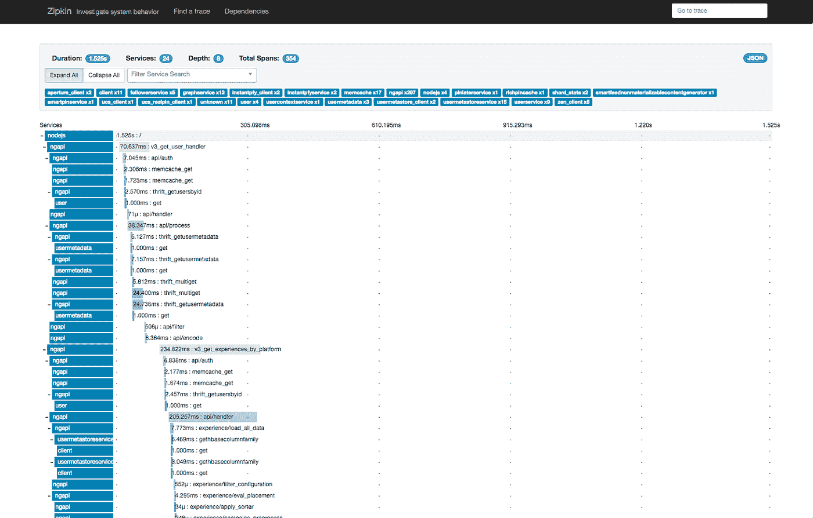
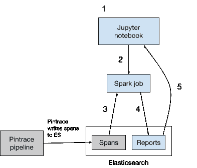
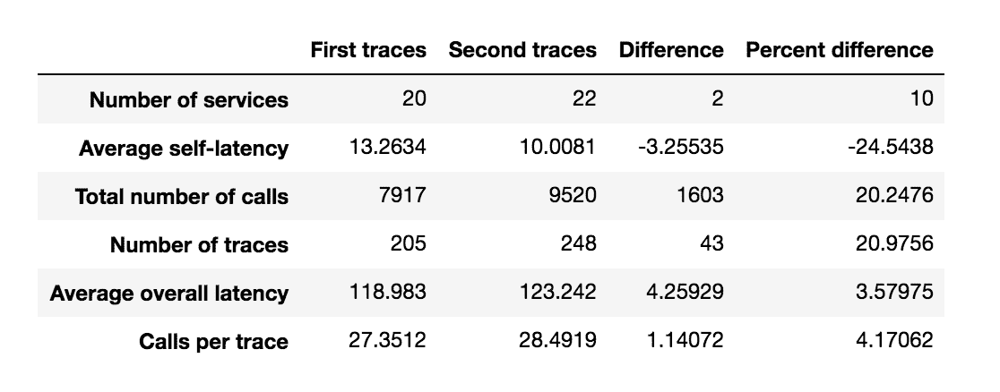
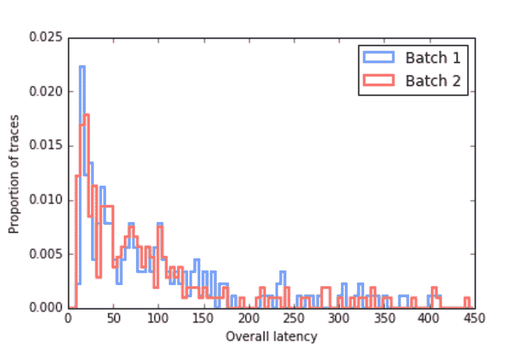
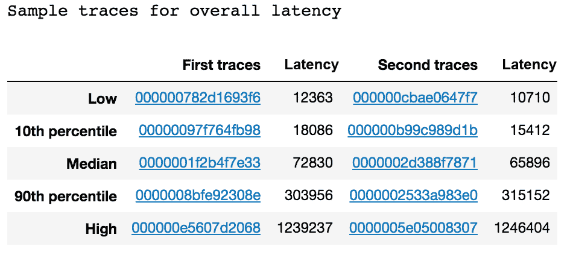
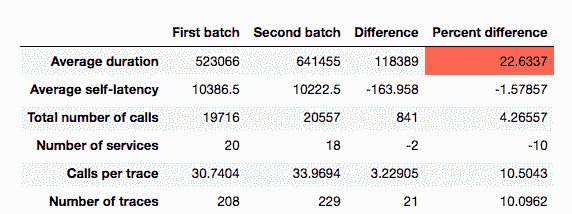
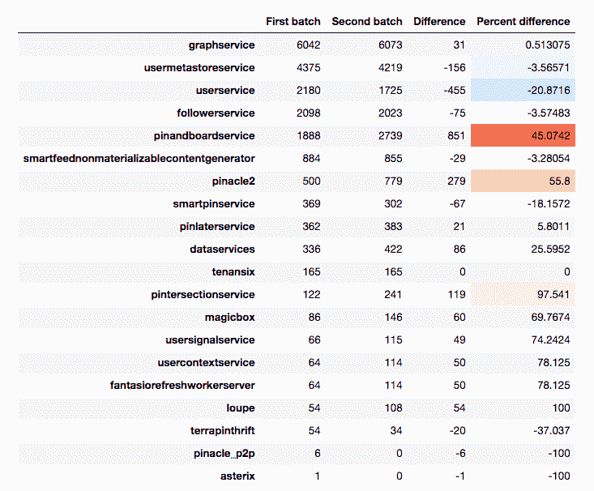

# 分析分布式跟踪数据

> 原文：<https://medium.com/pinterest-engineering/analyzing-distributed-trace-data-6aae58919949?source=collection_archive---------2----------------------->

Brittany Herr | Pinterest 工程实习生
Naoman Abbas | Pinterest 可见性工程师

今年早些时候，我们开源了分布式追踪管道 [Pintrace](/@Pinterest_Engineering/distributed-tracing-at-pinterest-with-new-open-source-tools-a4f8a5562f6b) 。当请求通过后端时，跟踪会跟踪请求，跟踪它在哪里以及如何花费时间。跟踪由跨度组成，每个跨度代表一个操作。在 Pinterest，每个 trace 有几十个服务和几百个网络调用。来自分布式跟踪的信息提供了对我们后端发生的事情的深入了解，并有助于识别瓶颈。

但是，一个跟踪并不能代表每分钟记录的数千个跟踪(更不用说每分钟从数百万个请求中抽取这些跟踪了)。此外，任何单个跟踪都可能是异常值或记录不正确。当评估 Pinterest 后端的整体性能时，我们需要使用跟踪数据，以便让我们看到一个更大的画面。这就是我们构建 Pintrace 跟踪分析器的原因，它执行跟踪的聚合分析。在更长的一段时间内查看来自数千条跟踪的统计数据，不仅可以剔除异常值/有问题的跟踪，还可以提供性能的整体视图。

*Waterfall diagram depicting a single trace. Each row is a span: in each span, the light blue block represents the time taken for that span, and the dark blue label has the service name.*

## **Pintrace 痕迹分析器**

这个工具的强大之处在于它能够比较两批跟踪——显示两批跟踪中每一批的统计数据，并突出显示变化。指标的意外和重大变化可能表明部署中出现了问题。我们关注 Pintrace Trace Analyzer 的两个指标:

1.  每个服务的延迟:一个服务执行它的操作需要多长时间。
2.  网络调用次数:服务被调用的次数。

其中任何一个显著的(意外的)变化都可能意味着代码中的错误，这可能导致生产问题，导致 Pinners 的等待时间增加。从成千上万的跟踪信息中看到延迟模式的变化或网络调用中的峰值，可以揭示产品代码中需要关注的区域。

## **工作原理**

有了这个工具，工程师可以根据用户的要求，通过比较两组不同的轨迹来找出问题所在。这里的“不同”可以指:

*   不同的时间段，即部署或事件之前和之后。
*   跨不同设备，例如 web 和 iOS。
*   来自不同的国家。
*   请求类型，例如 v3_home_feed 和 v3_get_pin

跟踪分析器由两个主要部分组成——一个 [Spark](https://spark.apache.org/) 作业(用于高容量数据处理)和一个 [Jupyter](http://jupyter.org/) 笔记本 UI。

*Workflow of Trace Analyzer. Blue components were built in this project and grey components already existed as part of Pintrace.*

1.  用户在 Jupyter 界面中输入两组跟踪规格。
2.  Python 脚本使用用户参数将 Spark 作业发送到 [Chronos](https://mesos.github.io/chronos/) 。
3.  Spark 作业从 [Elasticsearch](https://www.elastic.co/products/elasticsearch) 获取跨度数据。
4.  该作业运行分析并将结果推送到 Elasticsearch。
5.  Jupyter 从 Elasticsearch 获取结果，并向用户显示可视化报告。

以下是由报告生成的几个示例图:

*Overview table comparing two batches of traces.*

*Histogram showing overall latency for traces in each batch.*

*Sample traces (trace ID and value) for various percentiles that link to the traces in Pintrace.*

## **这对我们意味着什么**

该工具可以更高效地锁定问题源，并减少延迟事件。我们运行了一个特定日期(性能差)的跟踪数据与正常性能的比较报告。

*Overview table that shows a huge latency increase.*

下表对每个服务的 RPC 数量进行了细分，我们发现对服务“pinandboardservice”的调用数量出现峰值

这表明对 API 的不必要调用降低了请求速度。有了这样的信息，我们可以快速检测问题的根源并修复任何错误。

## **未来步骤**

我们在事故发生后使用这个工具来识别错误发生的位置并诊断发生了什么。我们渴望继续探索未来 Pintrace 的扩展，因为这只是分布式跟踪的冰山一角。其他一些可能的使用案例包括:

*   将其与我们的部署流程集成，以检测新版本的应用程序是否会导致性能问题。这将允许我们使用该工具作为预防措施，而不是被动地作为调试工具。
*   自动生成报告，以便工程师可以轻松检查每天的部署状态。
*   当 RPC 延迟或数量达到特定阈值时设置警报。

随着我们跟踪工具的扩展，这个工具的用例将会扩展。例如，我们计划向每个跟踪添加版本控制或实验信息，这样我们就可以跨这些不同点比较统计数据。

到目前为止，我们实现的内容为聚合跟踪分析奠定了基础。通过向该项目添加扩展，我们将能够进一步利用跟踪数据，最终为 Pinners 提供更快的体验。

鸣谢:为本项目做出贡献的是 Rob Claire 和 Xiaoqiao Meng。