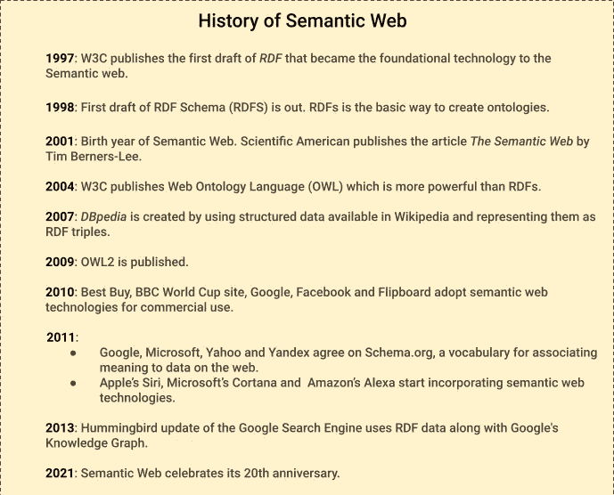
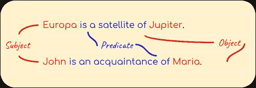
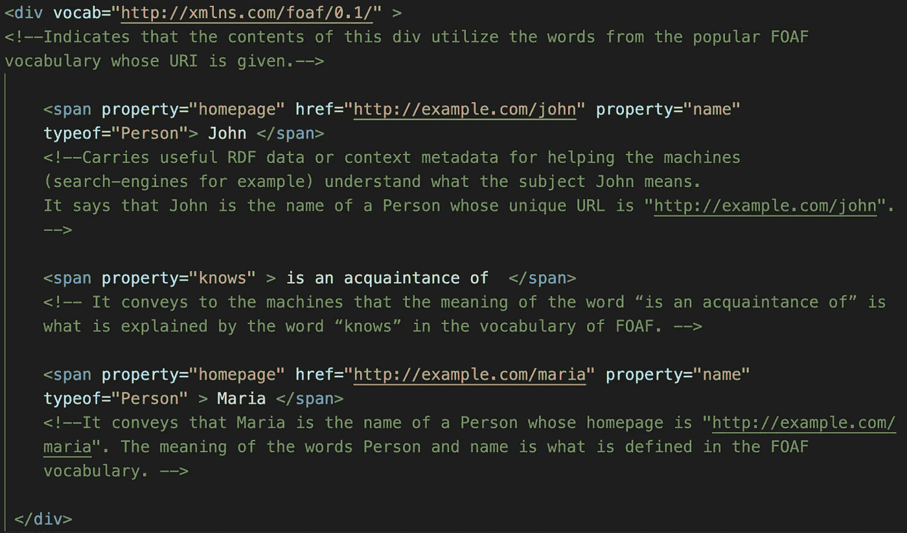
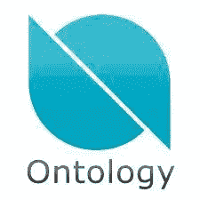
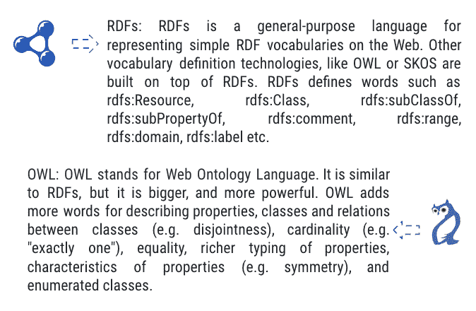
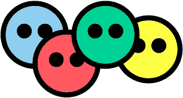
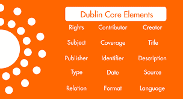
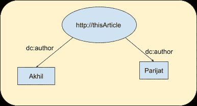
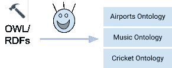

# 语义网剖析

> 原文：<https://medium.com/globant/anatomy-of-the-semantic-web-347e532429c0?source=collection_archive---------3----------------------->

合著者: [Akhilanand Singh](https://medium.com/u/a374b7fde953?source=post_page-----347e532429c0--------------------------------)

**会不会有一个更智能的网络，当这些软件代理从一个页面漫游到另一个页面时，可以在相关元信息的帮助下连接文档，然后从中推断出有意义的信息？**

从前，在童话里，有一面魔镜。镜子拥有所有的知识，它可以回答任何摆在它面前的问题。

在我们这个时代，我们有万维网，我们几乎可以用它来做任何事情。搜索引擎执行关键字搜索并返回文档列表作为结果。通读文档，理解它们，并得出我们问题的答案——这是留给我们的任务，不像传说中的魔镜。不是很神奇！对吗？

会不会有一个更智能的 web，当这些软件代理从一个页面漫游到另一个页面时，可以在相关元信息的帮助下连接文档，然后从中推断出有意义的信息？

寻找让计算机更好地理解网络上的事物的技术让计算机科学家们忙碌了很长时间。**语义网**(也称为 **Web 3.0** )是蒂姆·伯纳斯·李的一个愿景，为当前 Web 的不足提供了一个有效的解决方案。

# 花哨的名词！但是它实际上能做什么呢？

**语义网**可以帮助我们解决一些实际问题，比如:

**疾病治疗&药物发现**
在语义网中，医疗专业人员以机器可理解的形式在网上的一些文档中维护他们关于症状、疾病和治疗的知识。此外，制药公司以类似的格式保存他们关于药物、剂量和过敏的信息。

现在想象一下，如果一家医院能够使用一个自然的决策支持系统，将保存在这些文档中的知识与患者数据结合起来。这样的系统可以提出治疗建议，监测药物疗效和可能的副作用。很酷，不是吗？

**虚拟代理售票**
航空公司在 web 上以语义形式保存它们的时间表、机票价格等。利用这些数据和公司的员工数据，虚拟助理可以根据旅行者的选择、最短路线等来订票。

# 听起来很有趣！那么什么是语义网呢？

语义 web 是当前 web 的扩展，在当前 web 中，信息是相互关联的，并且它被赋予了明确的、定义良好的含义，以使计算机能够从其上可用的大量文档中推断或推断出一些东西。

本文试图使用 w3c 的概念和技术，如 RDF、RDFs、RDFa、OWL、SparQL 和 Protege，来解释语义网的概念以及实现这个梦想需要什么。

# 我们是在谈论再造网络吗？

一方面，我们有数以百万计的文件散布在互联网上，另一方面，我们正在谈论调整软件代理，使它们变得足够智能，为我们提供经过处理的推断信息。

大体上有两种方法可以解决这个问题-

**解决方法 1:**

***让网络文档保持原样，让搜索引擎变得更聪明。如果我们能在机器代理上工作，让他们足够强大，让他们开始从一个或多个文件中推断事实，那将是非常好的。这种想法不要求在大量的 web 文档中做任何改变，因此它非常有吸引力。***

这种想法的愚蠢之处在于，一个单词或句子可以根据其使用的上下文有不同的含义。例如，单词 bank 在下面的句子中有非常不同的意思-

我们人类在阅读上述句子时，运用我们的认知能力来理解每个句子的上下文，从而正确理解句子。对机器来说也是如此，我们必须以某种形式提供上下文，以便它们也能像我们一样理解句子。现在真正的问题出现了，我们把上下文存储在哪里，以便机器在阅读句子时可以随时使用它？这个问题的答案在第二种方法中。

**解决方案方法 2:**

在文档中添加上下文信息，然后调整搜索引擎来破译它们。

为了表达句子中的上下文数据，语义网提出了一个称为 RDF(资源描述框架)的框架。根据 RDF 框架，web 文档中的一个句子在逻辑上被分成三个部分——主语**和宾语**，宾语**，谓语**和谓语**——它们被称为**三元组**。**

比如，我们来看看下面两句话——

该框架建议给句子中的主语、谓语和宾语元素赋予唯一的 **URIs** (统一资源标识符)，使它们可以明确地识别。

“欧罗巴”的 URI 可以是描述欧罗巴是什么的网页。同样，也可以有一个关于“木星”的页面，里面会有关于它的详细信息。谓词“是的卫星”可以在将被普遍知晓的词汇表中被唯一地识别。在第二个句子中,“约翰”和“玛利亚”可以有它们自己独特的页面，由 URIs 标识，谓词“是...的熟人”可以在另一个谈论关系的独特词汇中定义。

# **让我们来谈谈嵌入 RDF 数据(上下文元数据)的一些实际代码！**

句子中三元组的元数据对人类用户来说是不可见的，但是它们应该作为特殊的 HTML 属性保存在网页中，以帮助搜索引擎和其他机器。下面的 web 文档是一个 HTML，其中添加了 RDF 数据作为每个标签的属性。

在上面的文档中，可以观察到一些新的 HTML 属性，如 vocab、property 和 typeof。它们来自一种叫做 RDFa 的技术，其中“a”代表 HTML 属性。 **RDFa** 给出了一组属性，允许将 **RDF** **数据**合并到 HTML 文档中。注意，RDFa 属性不是供人使用的，它们是用来在 Web 文档中表达机器可读数据的。

价值观主页、姓名、人员和认识是来自“朋友的朋友”(简称 FOAF)词汇表的单词，该词汇表是位于 URI[“http://xmlns . com/foaf/0.1/”](http://xmlns.com/foaf/0.1/)的机器可理解术语的明确定义的**词汇表**。

# 我们对语义网有不同的词汇吗？

词汇表是一种知识模型，它定义了特定领域内的一组概念以及这些概念之间的关系。简而言之，词汇表只不过是以机器可理解的方式定义的特定领域的术语表。词汇也被称为本体。本体论是形而上学的一个分支，而形而上学又是哲学的一个分支。本体论研究的是存在。

在上面的例子中，FOAF 词汇表被用来定义句子中的谓语。

本体通常是特定领域的。例如，医疗保健领域的本体论将不同于工程师定义的本体论。医学专家使用他们特定的本体来表示关于症状、疾病和治疗的知识。制药公司使用他们自己的本体来表示关于药物、剂量和过敏的信息。

目前存在两种本体定义语言- **RDFs** 和 **OWL** 。

Namespaces of RDF and OWL respectively: [http://www.w3.org/2000/01/rdf-schema#](http://www.w3.org/2000/01/rdf-schema#), [http://www.w3.org/2002/07/owl#](http://www.w3.org/2002/07/owl#)

让我们来看看一些流行的本体论:

**FOAF** : [FOAF](http://xmlns.com/foaf/spec/) (朋友的朋友的首字母缩写)是描述人、他们的活动以及他们与其他人和物体的关系的本体。它包含单词或元素，如 foaf:姓氏、foaf:名字、foaf:姓名、foaf:家庭、Foaf:认识等等。

**DC** : Dublin Core (DC)是一个本体，它拥有为网络创建数字“图书馆卡片目录”的词汇。Dublin Core 由为搜索引擎程序提供扩展的编目信息和改进的文档索引的元素组成。

**:社会互联的在线社区( [SIOC](http://rdfs.org/sioc/ns#) )本体用于描述在线社区，如论坛、博客、邮件列表、维基。它通过强调对这些社区产品的描述(帖子、回复、帖子等)来补充 FOAF。SIOC 是一个轻量级本体(17 个类，61 个对象属性，25 个数据类型属性)。**

****

# **我们需要什么特殊的技能来使网络语义化？**

**语义网需要三种开发者。**

**1) **语义数据生产者:****

****

**第一类开发人员是那些将 RDF 数据附加到网页上的人，这样普通的网页就变成了语义网页。他们需要了解 RDFa、RDFs、OWL 和一些流行的词汇，如朋友的朋友(FOAF)词汇、dublin core (DC)词汇、creative commons (CC)词汇等。看到我们今天在互联网上拥有的巨大网页，这个世界需要大量这样的开发者。**

**2) **本体矿工:****

****

**这些人创造了新的特定领域的本体。为此，他们使用像 Protege 这样的可视化工具来创造新的词汇。这些开发人员需要对 OWL 有更深的理解，他们还需要深入的领域知识。**

**3) **语义数据消费者:****

****

**第三种类型的语义开发人员是那些增强搜索引擎并创建其他智能机器代理来解析 HTML 文档中的 RDF 元数据，使用查询语言 SPARQL 从中获取含义并进行推理的人。**

# **好吧！有人在研究这个吗？**

**BBC 2010 年世界杯网站是采用语义网技术的一个显著例子。每支球队的每个球员都有自己的网页，搜索引擎可以轻松地从一个内容转到下一个内容，这是非常了不起的。**

**脸书使用的是 RDFa 的缩写版本。他们想让成千上万的开发者尽可能简单地将语义元数据放入他们的网页。**

**谷歌的搜索引擎从 2011 年开始采用知识图谱，这让我们可以享受搜索结果中丰富的片段。如今，谷歌搜索引擎不再专注于搜索字符串，而是搜索实体或现实世界中的物体。**

**Airbnb 对在线酒店评论进行语义内容分析，以确定酒店客户满意和不满意的主要驱动因素。【2020 年，博世创建了新的本体，并使用 SIB 框架，在语义上整合博世制造数据，用于表面贴装过程的分析。**

# **结论**

**当前网络向语义网络的迁移是缓慢的，因为很难用软件可理解的语言来表达抽象概念，如自然情感。另一个挑战是数据的信任和适当性问题，另一个因素是对它的无知。**

**虽然，即使有意图，开发者如何确定可信的本体？语义网的本体必须由多年来维护它的社区来开发、管理和认可。**

**谷歌、微软、雅虎和 Yandex 联合提出了一个名为 Schema.org 的解决方案，用一个通用的词汇表在网页中推广结构化数据。如果 schema.org 不断增长的用户群有任何迹象的话，向语义网的迁移是不可避免的。这是当前网络的未来，肯定是一个可实现的梦想。**