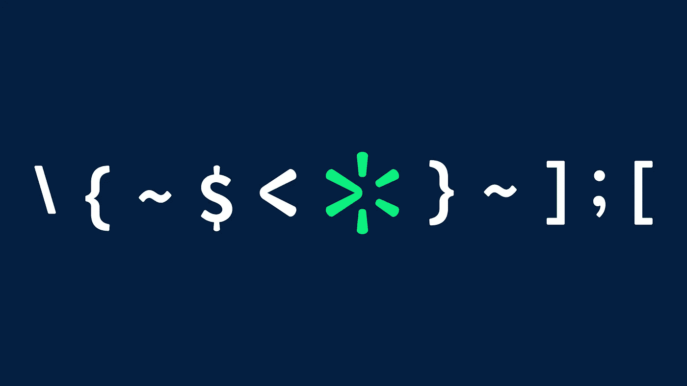
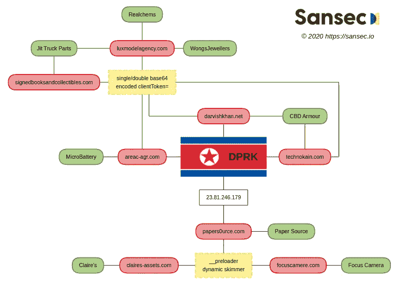
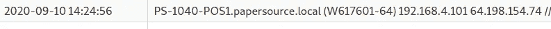

# 主播和拉扎勒斯又在一起了？

> 原文：<https://medium.com/walmartglobaltech/anchor-and-lazarus-together-again-24744e516607?source=collection_archive---------0----------------------->



2020 年 7 月 6 日，SanSec 报告称，被称为 Lazarus/HIDDEN COBRA 的朝鲜 APT 组织正在对网站进行 MageCart 式攻击[1]。

在他们的报告中有两处提到很有趣，PaperSource 和 FocusCamera[1]。



Photo Credit: [SanSec](https://sansec.io/research/north-korea-magecart)

整个朝鲜链接似乎取决于 LeaseWeb 中的 IP 重用，这是一个薄弱环节，但有时可能会有关于事件的非公开细节。更有趣的方面是我们可以为故事提供的一些背景，即与 TrickBot/Anchor 的联系。你可能还记得，这不是这个[网络犯罪团伙第一次被抓到与 Lazarus](https://www.zdnet.com/article/trickbot-gang-is-now-a-malware-supplier-for-north-korean-hackers/) 合作。

文章“恶意软件在 24 小时内被移除，但一周后，相同的恶意软件在同一家商店重新出现”也很有趣。[1]这表明攻击者在环境中有一个立足点或“锚”。

# 聚焦摄像机

在阅读了 SanSec 的报告后，这个名字立即脱颖而出，它出现在我们之前围绕 PowerTrick[4]的工作中，PowerTrick 是由 TrickBot/Anchor actors 开发和利用的 powershell 框架。该公司似乎最初在 2019 年 10 月左右被 TrickBot 攻破，然后演员们开始使用 PowerTrick 来扭转局面。

```
3|C:\WINDOWS\system32|NYIT581|FC\NYIT581$|NT AUTHORITY\SYSTEM|4C4C4544-004C-4310-8031-CAC04F575231|Microsoft Windows 10 Pro|64-bit|18036|0|1|[]|455|1200|2019-10-31 17:56:22|2019-10-30 22:09:51|
```

PowerTrick bot 列出网络设备:

```
\\101718-1628
\\101718-1900
\\11012018-1018
\\111218-1913
\\ABE-NEW
\\CONNCESHIPSRV
\\CONNECTSHIP
\\DES-0001
\\FBARETURN
\\FCNYAV1              fcnyav1
\\FCNYMAIL1
\\FOCUSCA-782GU8N
\\FOCUSCA-9146562
\\FOCUSCA-MGL6SO0
\\FOCUSCA-QHRB0KS
\\FOCUSCA-UIHGRK3
\\LKWD-20
\\MICHAELBACK
\\MONSOONSERVER
\\NAS-BF-27-4E         nas-BF-27-4E
\\NASBACKUP            nasbackup
\\NEW01
\\NY-061418-1757
\\NY-062918-1421
\\NY-100318-1432
\\NY-AMZ-002
\\NY-AMZN-060618       Hudy kryman
\\NY-BUY-003
\\NY-BUYER-AA          yoni Baum
\\NY-CONF-01
\\NY-CONF-02
\\NY-CONF-03
\\NY-ER-CCTV-SCRN
\\NY-KIT-070318        miriam mozyrskiy
\\NY-KIT-BILECKI
\\NY-LGSTC-PHILIP
\\NY-MARKETING         Isaac Shalev
\\NY-MINCHA
\\NY-REFURB-0001
\\NYACCT-0001
\\NYACCT162
\\NYACT004
\\NYACT179
\\NYACT180
\\NYACT183
\\NYACT188
\\NYACT189
\\NYASS178A
\\NYASST159
\\NYASST193
\\NYBUY0001            Robert Silberman - Buyer
\\NYBUY078
\\NYBUY102
\\NYBUY148
\\NYBUY149
\\NYBUY151
\\NYBUY151A
\\NYBUY153
\\NYBUY165
\\NYBUY209
\\NYBUY210
\\NYBUY303
\\NYBUY306
\\NYBUY307
\\NYBUY331
\\NYBUY333
\\NYBUY343
\\NYBYD151A
\\NYCAMERA01
\\NYCUSV049A
\\NYCUSV065
\\NYCUSV071
\\NYCUSV084
\\NYDC
\\NYDOMAINCTRL
\\NYEBAY002
\\NYEBAY128
\\NYEBAY345
\\NYFBA349
\\NYFBA351
\\NYGOV101
\\NYHR007
\\NYIT054              Chaim Geller
\\NYIT087
\\NYIT097
\\NYIT335
\\NYIT350
\\NYIT353
\\NYIT355
\\NYIT355A
\\NYIT581
\\NYKEYACCESS          NYKEYACCESS.FC.LOCAL
\\NYKIT-001
\\NYMAN164A
\\NYMGMT-RBERG
\\NYMGMT243BBB
\\NYOVER007
\\NYRCV001
\\NYRTNS141
\\NYRTNS281
\\NYRTNS285
\\NYSALES349
\\NYVIRTUALPC05
\\NYWAL347
\\NYWARE282A
\\NYWEB0001            car byers
\\REFURDBASE
\\SCRAPER-PC
\\STORE-01             Cashier-01
\\STORE-02             Cashier-02
\\STR-CCTV
\\VIEWPOINT
\\VMWAREVC
\\WHSE1
\\WINDOWS-0SD9E3K
\\WINDOWS-16M2FRN
\\WINDOWS-1O2SBEG
\\WINDOWS-851OD2Q
\\WINDOWS-HSDST7A
\\WINDOWS-I2SBFRI
\\WINDOWS-JNI13EQ
\\WINDOWS-Q88PP4L
\\WINDOWS-SQFPH6T
The command completed successfully.
```

# 纸张来源

我们有理由相信 PaperSource 最初也是 TrickBot，后来是 Anchor 和 MemScraper，这是之前详述的 Anchor 框架的 POS 组件[5]。



PaperSource MemScraper infection

鉴于这些发现，我们有两种可能性:

SanSec NK 属性不正确，TrickBot 参与者也有兴趣在 MageCart 风格的攻击中利用 jsSniffers 攻击受害者网站。

SanSec NK 的归属是正确的，这是 Lazarus 参与 TrickBot 感染机构的又一个例子。

作者:杰森·里维斯和约书亚·普拉特

# 参考

1.  [https://www . zdnet . com/article/trick bot-gang-now-a-malware-supplier-for-north-Korean-hackers/](https://www.zdnet.com/article/trickbot-gang-is-now-a-malware-supplier-for-north-korean-hackers/)
2.  【https://sansec.io/research/north-korea-magecart 
3.  [https://Intel 471 . com/blog/partners-in-crime-north Koreans-and-elite-Russian-speaking-cyber criminals/](https://intel471.com/blog/partners-in-crime-north-koreans-and-elite-russian-speaking-cybercriminals/)
4.  [https://www.darkreading.com/vulnerabilities-威胁/trick bot-group-adds-new-powershell-based-back door-to-arsenal/d/d-id/1336769](https://www.darkreading.com/vulnerabilities---threats/trickbot-group-adds-new-powershell-based-backdoor-to-arsenal/d/d-id/1336769)
5.  [https://labs . sentinel one . com/the-deadly-planeswalker-how-the-trick bot-group-United-high-tech-crime ware-apt/](https://labs.sentinelone.com/the-deadly-planeswalker-how-the-trickbot-group-united-high-tech-crimeware-apt/)