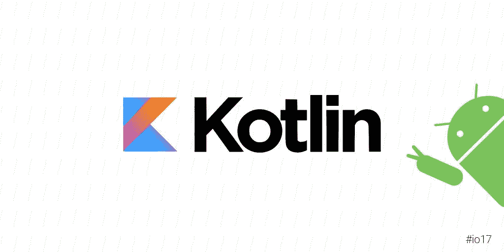
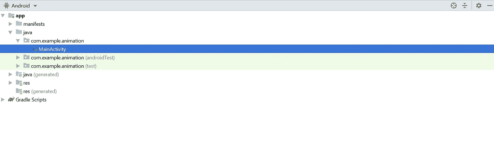
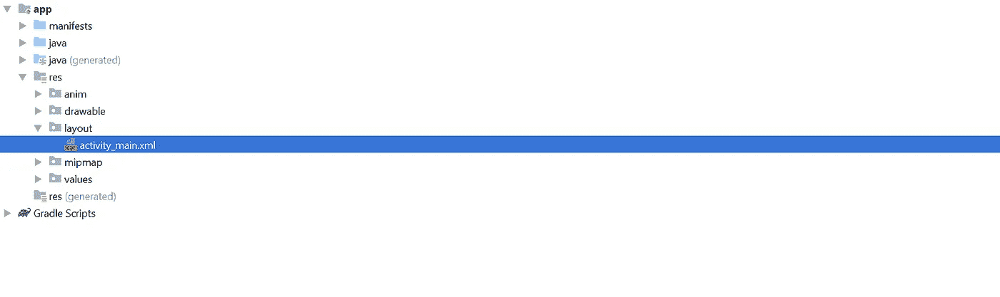
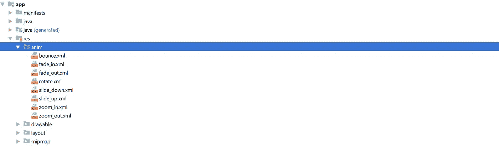
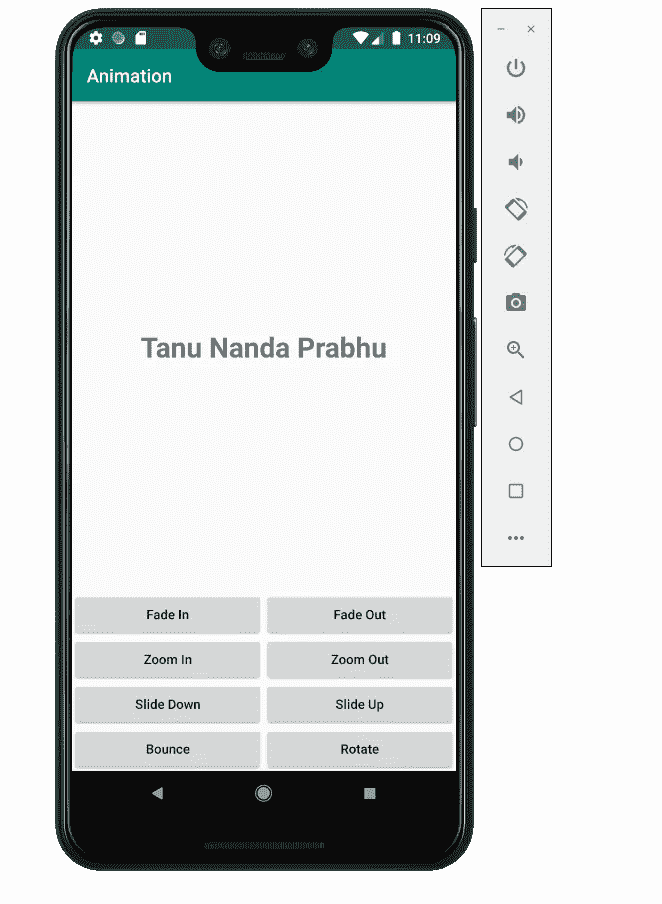

# 使用 Kotlin 的 Android 动画

> 原文：<https://blog.kotlin-academy.com/android-animation-using-kotlin-ef385b5b5dea?source=collection_archive---------1----------------------->

在本教程中，让我们使用 Kotlin 编程在 Android Studio 上制作一些基本的动画。



Credits: [Twitter](https://twitter.com/android/status/864911929143197696)

在本教程中，您将学习一种使用 Kotlin 编程语言在 Android Studio 中执行动画的简单方法。我已经尽了最大努力来提供好的文档和所有的指导，以使本教程更具可读性。如果你是 Kotlin 编程新手，想学习 Kotlin 编程的基础知识，那么请通过下面的链接，我写了一个 Kotlin 编程的基础教程:

[](https://medium.com/@tanunprabhu95/8-minute-crash-course-on-kotlin-programming-language-e8a804ed3d8a) [## 关于 Kotlin 编程语言的 8 分钟速成课程。

### 让我们了解一下 Kotlin 编程语言的基础知识。

medium.com](https://medium.com/@tanunprabhu95/8-minute-crash-course-on-kotlin-programming-language-e8a804ed3d8a) 

我根据 YouTube 上的一段视频编写了这篇教程，这段视频来自于 [CodeAndroid](https://www.youtube.com/watch?v=K7waTmNi_x0&t=2s) 。这是一个非常好的视频，但作者没有给出好的文档，所以这是我写这篇文章的原因。

**我将整个教程分为如下所示的五个步骤:**

1.  设置 Android Studio 环境。
2.  更改布局(XML 文件)。
3.  向文本添加动画。
4.  编写科特林代码。
5.  在内置仿真器上运行结果。

让我们开始吧:

## 1.设置 Android Studio 环境

这是第一步，也是非常重要的一步。创建一个新项目，为统一起见，将其命名为“**动画**”。关于在 Android Studio 中创建一个项目的更多细节，请浏览 Android Studio 的官方文档，它会给你足够的设置环境的指导。

[](https://developer.android.com/studio/projects/create-project) [## 创建项目| Android 开发者

### Android Studio 可以轻松创建各种外形的 Android 应用，如手机、平板电脑、电视和穿戴设备等

developer.android.com](https://developer.android.com/studio/projects/create-project) 

## 2.更改布局(XML 文件)

一旦你建立了 Android Studio 环境，下一步就是编写包含我们动画的主活动的代码。当你设置好环境后，Android Studio 需要一些时间来加载所有的文件，几秒钟后它会自动创建并加载我们将要操作的两个文件:

1.  **MainActivity.kt (Kotlin 文件)**
2.  **activity_main.xml (XML 文件)**

要找到第一个，只需展开**app>Java>com . example . animation>main activity**如下图所示:



用 activity_main.xml 展开 **app > res >布局> activity_main.xml** 如下图所示:



让我们更改 **activity_main.xml** 并在 xml 文件中添加新值

```
*<?***xml version="1.0" encoding="utf-8"***?>* <**RelativeLayout xmlns:android="http://schemas.android.com/apk/res/android"
    xmlns:app="http://schemas.android.com/apk/res-auto"
    xmlns:tools="http://schemas.android.com/tools"
    android:layout_width="match_parent"
    android:layout_height="match_parent"
    tools:context=".MainActivity"**> <**TextView
        android:id="@+id/textView"
        android:layout_width="match_parent"
        android:layout_height="match_parent"
        android:layout_above="@+id/btn_layout"
        android:gravity="center"
        android:text="Tanu Nanda Prabhu"
        android:textSize="30sp"
        android:textStyle="bold"** /><**LinearLayout
        android:id="@+id/btn_layout"
        android:layout_width="match_parent"
        android:layout_height="wrap_content"
        android:layout_alignParentBottom="true"
        android:orientation="vertical"**> <**LinearLayout
            android:layout_width="match_parent"
            android:layout_height="wrap_content"
            android:orientation="horizontal"
            android:weightSum="2"**> <**Button
                android:id="@+id/fade_in"
                android:layout_width="0dp"
                android:layout_height="match_parent"
                android:layout_weight="1"
                android:text="Fade In"
                android:textAllCaps="false"** /> <**Button
                android:id="@+id/fade_out"
                android:layout_width="0dp"
                android:layout_height="match_parent"
                android:layout_weight="1"
                android:text="Fade Out"
                android:textAllCaps="false"** /> </**LinearLayout**> <**LinearLayout
            android:layout_width="match_parent"
            android:layout_height="wrap_content"
            android:orientation="horizontal"
            android:weightSum="2"**> <**Button
                android:id="@+id/zoom_in"
                android:layout_width="0dp"
                android:layout_height="match_parent"
                android:layout_weight="1"
                android:text="Zoom In"
                android:textAllCaps="false"** /> <**Button
                android:id="@+id/zoom_out"
                android:layout_width="0dp"
                android:layout_height="match_parent"
                android:layout_weight="1"
                android:text="Zoom Out"
                android:textAllCaps="false"** /> </**LinearLayout**> <**LinearLayout
            android:layout_width="match_parent"
            android:layout_height="wrap_content"
            android:orientation="horizontal"
            android:weightSum="2"**> <**Button
                android:id="@+id/slide_down"
                android:layout_width="0dp"
                android:layout_height="match_parent"
                android:layout_weight="1"
                android:text="Slide Down"
                android:textAllCaps="false"** /> <**Button
                android:id="@+id/slide_up"
                android:layout_width="0dp"
                android:layout_height="match_parent"
                android:layout_weight="1"
                android:text="Slide Up"
                android:textAllCaps="false"** /> </**LinearLayout**> <**LinearLayout
            android:layout_width="match_parent"
            android:layout_height="wrap_content"
            android:orientation="horizontal"
            android:weightSum="2"**> <**Button
                android:id="@+id/bounce"
                android:layout_width="0dp"
                android:layout_height="match_parent"
                android:layout_weight="1"
                android:text="Bounce"
                android:textAllCaps="false"** /> <**Button
                android:id="@+id/rotate"
                android:layout_width="0dp"
                android:layout_height="match_parent"
                android:layout_weight="1"
                android:text="Rotate"
                android:textAllCaps="false"** /> </**LinearLayout**> </**LinearLayout**></**RelativeLayout**>
```

首先，我将改变根布局为 [RelativeLayout](https://developer.android.com/guide/topics/ui/layout/relative) ，我将使用 [LinearLayout](https://developer.android.com/reference/android/widget/LinearLayout) 以按钮的形式放置动画。第二，我使用了[线性布局](https://developer.android.com/guide/topics/ui/layout/linear)，这是因为我想让所有的按钮水平或垂直对齐，在 Linear Layout 中，UI 元素水平或垂直排列。在 XML 文件中，大多数代码都是不言自明的，例如文本视图、按钮及其属性。大部分代码只是不同 id 的重复。所以尽量不要因为理解 XML 文件太深而迷惑自己。只需确保将按钮放置在线性布局中。

将动画添加到文本中。

在这一步中，在 **res** 文件夹中添加 8 个单独的 XML 文件。为了统一，创建一个名为 **anim、**的新的 **Android 资源目录**，然后在其中放置所有 8 个不同的 XML 文件，如下所示。要创建 xml 文件，只需右键单击，然后单击文件，然后添加文件名以及扩展名. XML。



确保您已经如上所示命名了文件。下面是所有不同动画的 XML 代码，只是相应地复制并粘贴到不同的文件中。所有的动画 XML 代码都是不言自明的。你可以用这些代码制作几乎所有的动画。

**bounce.xml**

```
<**set
    xmlns:android="http://schemas.android.com/apk/res/android"
    android:interpolator="@android:anim/linear_interpolator"
    android:fillAfter="true"**> <**translate
        android:fromYDelta="100%"
        android:toYDelta="-20%"
        android:duration="300"** /> <**translate
        android:startOffset="500"
        android:fromYDelta="-20%"
        android:toYDelta="10%"
        android:duration="150"** /> <**translate
        android:startOffset="1000"
        android:fromYDelta="10%"
        android:toYDelta="0"
        android:duration="100"** />
</**set**>
```

**fade_in.xml**

```
*<?***xml version="1.0" encoding="utf-8"***?>* <**set xmlns:android="http://schemas.android.com/apk/res/android"
    android:interpolator="@android:anim/linear_interpolator"**>
    <**alpha
        android:duration="1000"
        android:fromAlpha="0.1"
        android:toAlpha="1.0"** />
</**set**>
```

**fade_out.xml**

```
*<?***xml version="1.0" encoding="utf-8"***?>* <**set xmlns:android="http://schemas.android.com/apk/res/android"
    android:interpolator="@android:anim/linear_interpolator"**>
    <**alpha
        android:duration="1000"
        android:fromAlpha="1.0"
        android:toAlpha="0.1"** />
</**set**>
```

**rotate.xml**

```
*<?***xml version="1.0" encoding="utf-8"***?>* <**rotate xmlns:android="http://schemas.android.com/apk/res/android"
    android:duration="1000"
    android:fromDegrees="0"
    android:interpolator="@android:anim/linear_interpolator"
    android:pivotX="50%"
    android:pivotY="50%"
    android:startOffset="0"
    android:toDegrees="360"** />
```

**slide_down.xml**

```
*<?***xml version="1.0" encoding="utf-8"***?>* <**set xmlns:android="http://schemas.android.com/apk/res/android"**>
    <**translate
        android:duration="1000"
        android:fromYDelta="-100%"
        android:toYDelta="0"** />
</**set**>
```

**slide_up.xml**

```
<**set xmlns:android="http://schemas.android.com/apk/res/android"**>
    <**translate
        android:duration="1000"
        android:fromYDelta="0"
        android:toYDelta="-100%"** />
</**set**>
```

**zoom_in.xml**

```
*<?***xml version="1.0" encoding="utf-8"***?>* <**set xmlns:android="http://schemas.android.com/apk/res/android"
    android:fillAfter="true"**>
    <**scale xmlns:android="http://schemas.android.com/apk/res/android"
        android:duration="1000"
        android:fromXScale="1"
        android:fromYScale="1"
        android:pivotX="50%"
        android:pivotY="50%"
        android:toXScale="1.5"
        android:toYScale="1.5"**> </**scale**>
</**set**>
```

**zoom_out.xml**

```
*<?***xml version="1.0" encoding="utf-8"***?>* <**set xmlns:android="http://schemas.android.com/apk/res/android"
    android:fillAfter="true"** > <**scale
        xmlns:android="http://schemas.android.com/apk/res/android"
        android:duration="1000"
        android:fromXScale="1.0"
        android:fromYScale="1.0"
        android:pivotX="50%"
        android:pivotY="50%"
        android:toXScale="0.5"
        android:toYScale="0.5"** >
    </**scale**></**set**>
```

## 4.编写科特林代码

现在让我们做主要部分。我们已经完成了所有的外部工作，但是现在内部的工作正在等待 Kotlin 的编码。下面是下面 Kotlin 代码的解释。

让我们用科特林语言编码。

```
**package** com.example.animation**import** android.animation.Animator**import** androidx.appcompat.app.AppCompatActivity
**import** android.os.Bundle
**import** android.os.Handler
**import** android.view.View
**import** android.view.animation.Animation
**import** android.view.animation.AnimationUtils
**import** kotlinx.android.synthetic.main.activity_main.***class** MainActivity : AppCompatActivity() { **override fun** onCreate(savedInstanceState: Bundle?) {
    **super**.onCreate(savedInstanceState)
    setContentView(R.layout.*activity_main*) fade_in.setOnClickListener **{** textView.*visibility* = View.*VISIBLE* **val** animation = AnimationUtils.loadAnimation(**this**, R.anim.*fade_in*)
      textView.startAnimation(animation)
    **}** fade_out.setOnClickListener **{
      val** animation = AnimationUtils.loadAnimation(**this**, R.anim.*fade_out*)
      textView.startAnimation(animation)
      Handler().postDelayed(**{** textView.*visibility* = View.*GONE* **}**, 1000)
    **}** zoom_in.setOnClickListener **{
      val** animation = AnimationUtils.loadAnimation(**this**, R.anim.*zoom_in*)
      textView.startAnimation(animation)
    **}** zoom_out.setOnClickListener **{
      val** animation = AnimationUtils.loadAnimation(**this**, R.anim.*zoom_out*)
      textView.startAnimation(animation)
    **}** slide_down.setOnClickListener **{
      val** animation = AnimationUtils.loadAnimation(**this**, R.anim.*slide_down*)
      textView.startAnimation(animation)
    **}** slide_up.setOnClickListener **{
      val** animation = AnimationUtils.loadAnimation(**this**, R.anim.*slide_up*)
      textView.startAnimation(animation)
    **}** bounce.setOnClickListener **{
      val** animation = AnimationUtils.loadAnimation(**this**, R.anim.*bounce*)
      textView.startAnimation(animation)
    **}** rotate.setOnClickListener **{
      val** animation = AnimationUtils.loadAnimation(**this**, R.anim.*rotate*)
      textView.startAnimation(animation)
    **}
  }
}**
```

每当使用按钮时，通过使用 [setOnClickListener](https://developer.android.com/reference/android/widget/Button) 指定其动作。我们将表演的不同动画是**淡入、淡出、放大、缩小、向下滑动、向上滑动、旋转和弹跳。**现在用上述名称创建 8 个函数，然后调用**animation utils . load animation**，传递参数如下(我们使用该关键字的原因是我们引用当前对象)和动画 XML 文件的位置(在这种情况下，您必须为所有动画编写 8 个单独的 XML 文件，然后将它们存储在 res 文件夹中)，因此它是 **R.anim. *fade_in，*r . anim .*fade _ out***我将在下一节详细讨论这一点。同时，当您编写这些方法及其函数时，您必须导入它们的库。你不必担心 Android Studio 内置了 IntelliJ，它会自动建议你导入库。

## **5)在内置仿真器上运行结果。**

这是一个简单的步骤，你所要做的就是在一个内置的模拟器上运行代码。在此之前，运行你的代码检查是否有错误。为此，只需点击右上角看起来像播放按钮的绿色按钮或按下 **Shift + F10。**一旦你没有得到错误，你可以使用内置的模拟器来查看输出。现在来设置一个模拟器，观看下面的视频，它可以帮助你设置一个模拟器或你的选择:

YouTube: [Vlad Voytenko](https://www.youtube.com/watch?v=LgRRmgfrFQM&t=390s)

你想在哪个版本或什么手机上运行输出并不重要。从 2019 年开始我就用谷歌 Pixel 3XL 作为我的模拟器(因为我是 Pixel 粉丝)。下面是模拟器结果的快照。



下面是我撰写这篇文章的原始 YouTube 视频:

YouTube: [CodeAndroid](https://www.youtube.com/watch?v=K7waTmNi_x0&t=243s)

**本教程就这些了，这些都是一些可以在 Android Studio 上用 Kotlin 进行的基本动画。我希望你明白这个教程，如果你有任何疑问，那么评论区是你的，我会回答你的问题。谢谢你们阅读我的文章。祝你愉快。**

# 单击👏说“谢谢！”并帮助他人找到这篇文章。

了解卡帕头最新的重大新闻。学院，[订阅时事通讯](https://kotlin-academy.us17.list-manage.com/subscribe?u=5d3a48e1893758cb5be5c2919&id=d2ba84960a)，[观察 Twitter](https://twitter.com/ktdotacademy) 关注我们 medium。

如果您需要 Kotlin 工作室，请查看我们如何帮助您: [kt.academy](https://www.kt.academy/) 。

[](https://kotlin-academy.us17.list-manage.com/subscribe?u=5d3a48e1893758cb5be5c2919&id=d2ba84960a)