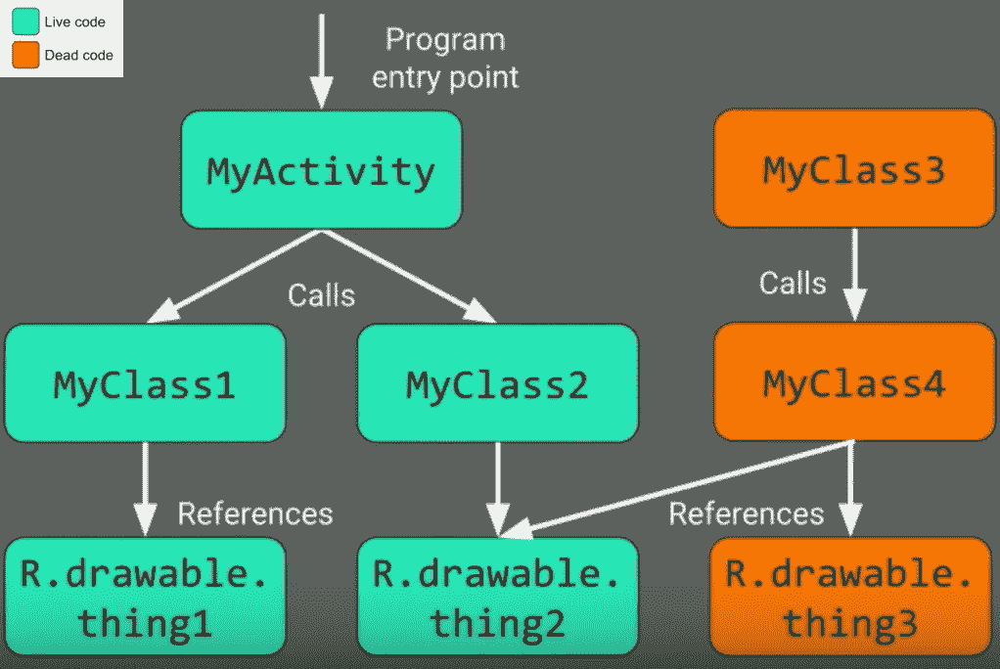
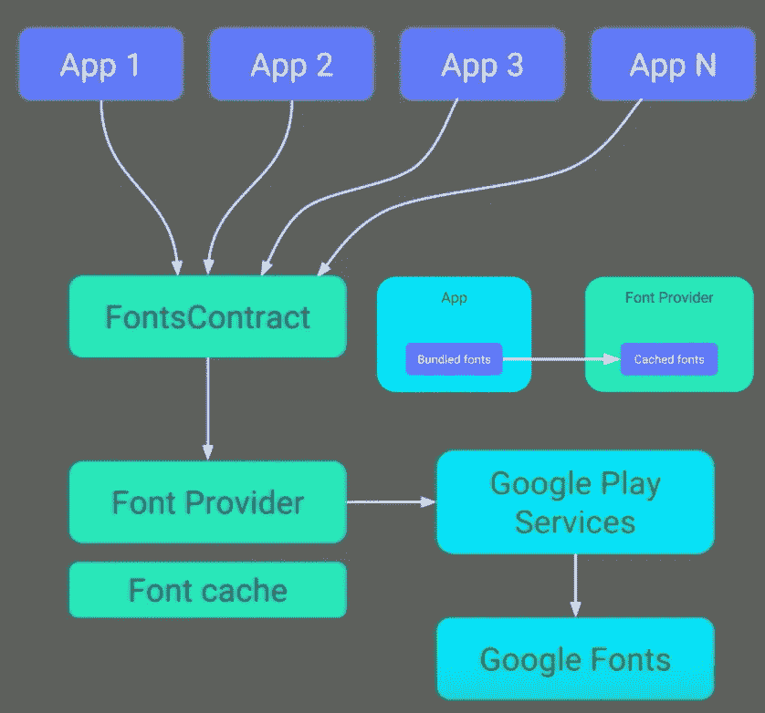
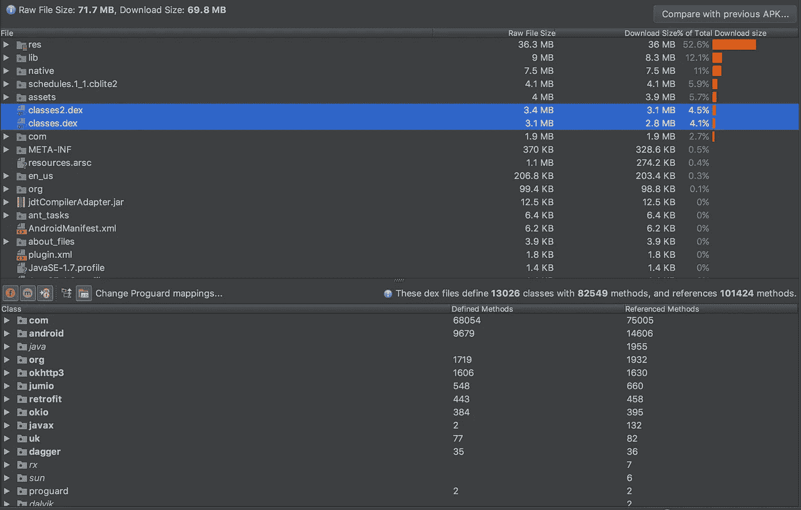
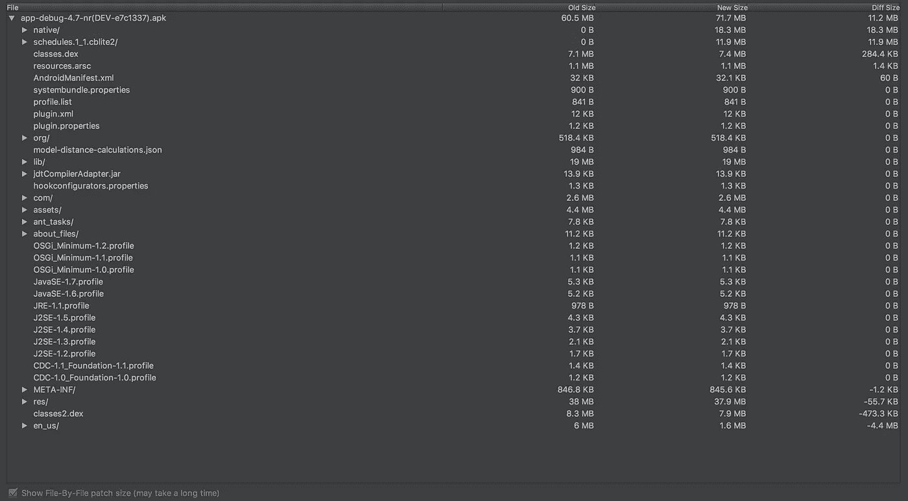

# Android 应用程序大小分析

> 原文：<https://medium.com/globant/android-app-size-analysis-759cc3dbdede?source=collection_archive---------1----------------------->


在我之前的文章中，我谈到了 iOS 应用程序的[应用程序大小分析。在这篇文章中，我将谈论同样的 Android 应用程序。显然，当你拥有遍布全球的 **2B** 全球活跃用户时，你会希望你的应用能根据你的业务达到最大化。此外，这一点很重要，因为最近谷歌 PlayStore 的统计数据显示，如果应用程序的下载大小(OTA)大于 **100 MB** ，取消用户设备上此类应用程序下载的几率会增加 **20%** 。](/@avijeet.dutta13/ios-app-size-analysis-76206a18a666)

类似的统计数据也适用于应用程序的安装大小。安装容量超过 **100 MB** 的应用从设备上卸载的可能性是 **8** 倍。

*那么你应该怎么做呢？*

## **1。使用程序:**

对于发布版本，这是默认启用的。

```
android {
    buildTypes {
        release {
            minifyEnabled true
        }
    }
}
```

ProGuard 是一个完整的程序 Java 代码优化器。它主要做三件重要的事情:

a)它通过改变代码表示而不改变核心功能来优化代码。

b)它混淆了类型、方法、字段、类等的名称，这增加了程序的效率。

c)死代码消除:这是三个中最重要的。android 程序可以被认为是一个图，其中类、方法、字段作为节点，方法调用和引用作为边。Proguard 保留了应用程序的直接入口点，这些入口点只是应用程序清单文件中定义的 Android 组件(活动、服务、内容提供商、广播接收器和自定义应用程序类)。



Live Code vs Dead Code

## **2。构建多个 apk:**

```
android {
    splits {
        density {
            enabled true
        }
    }
}
```

该功能根据应用的屏幕密度和 CPU 架构来定制要安装在特定设备上的应用，而不是下载/安装通用 apk，后者具有永远不会在设备中使用的额外资源。这基本上意味着根据屏幕密度和 CPU 架构分割你的应用程序，然后一起上传到 PlayStore。如果你认为这是一个很大的工作量；不要担心，谷歌有一个更好的方法来管理这个问题，通过 [Google Play 应用程序签名](https://developer.android.com/studio/publish/app-signing.html#sign-apk)，还有额外的好处，可以减轻应用程序的整个签名过程，包括保管*应用程序的发布密钥库*等等。

## 3.**使用矢量绘制:**

```
android {
    defaultConfig {
        vectorDrawables.useSupportLibrary true
    }
}
```

这仅仅意味着所有屏幕密度的一个**单一资产**。Android [支持库](https://developer.android.com/topic/libraries/support-library/rev-archive.html)版本 **23.2** 引入了对矢量可绘制向后兼容的支持，直到 **API 14** 。此外，Android N 还支持矢量绘制中的渐变。需要注意的一点是，复杂的向量会降低 CPU 和 RAM 的使用速度。所以当你想在应用程序中使用矢量图像时，应该进行彻底的分析。这基本上是应用程序大小缩减与应用程序性能成本之间的权衡。使用矢量图像的应用程序相对小于使用 *xxxhdpi* 图像的多应用程序。

## 4.删除不需要的替代资源:

```
android {
    defaultConfig {
        ...
        resConfigs "en", "fr" 
    }
}
```

上面的 Gradle 配置显示该应用程序只支持英语和法语。这有助于消除应用程序中未使用的资源。例如，一个或多个应用程序依赖项中包含的消息的字符串翻译使用了应用程序不支持的语言。因此，使用此设置，任何未指定语言的资源都将被删除。

## 5.使用可下载的字体

这是 Android 平台新增的功能。谷歌明白(通过对 PlayStore 上排名前 25 的应用程序的调查)PlayStore 上的大多数应用程序使用通用字体。现在，由于字体与应用程序捆绑在一起，从操作系统的角度来看，设备上的不同应用程序都有字体的副本。此外，大多数字体都没有为移动优化。谷歌通过*可下载字体想出了解决这个问题的办法。*



Apps making use of common Fonts through Google Play Service’s Font Provider

可下载字体是通过应用程序中的 Google Play 服务提供的按需字体。这可从[支持库 26](https://developer.android.com/preview/features/downloadable-fonts.html) 获得。这有许多优点，即节省蜂窝数据、电话存储器、节省磁盘空间等等。需要时，通过网络获取字体。使用*字体提供者*可以帮助你通过 Google Play 服务使用所有的 Google 字体目录(超过 **800** )。

## 6.在 Android Studio 中使用 APK 分析器:

这个工具是你所能得到的最好的了解你的应用程序中打包了什么的工具。因此，明智地使用这个工具，为你的应用程序做出明智的决定。随着 Android Studio 3.0 和 *AAPT2* 的推出，这将带来更多的东西。尤其是最重要的是包含了 ProGuard 映射，将文件映射到发布版本上相应的模糊代码。这有助于您了解应用程序中包含的详细信息。



APK Analyzer depicting App Size break-up and method count information.

不仅如此，你还应该经常考虑将一个 App 的最新 apk 与之前的 apk 进行比较。这有助于您理解应用程序两个版本之间的差异，并对其进行验证。也许根据分析删除代码中不必要的东西。



APK diff between two versions of an App

遵循这些技巧应该让你尽可能地收紧你的应用程序的腰围。