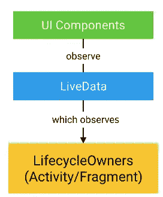

# Android 架构组件——LiveData(第 1 部分)

> 原文：<https://medium.easyread.co/android-architecture-components-livedata-pt-1-133cad38e67e?source=collection_archive---------1----------------------->

**LiveData** 是数据持有者。它能够被观察到，可以保存任何类型的数据，最重要的是，它还具有*生命周期意识。*这提供了一个**异步机制**来使用**观察者模式提供数据变化。这是一个非常相似但非常简化的版本，是流行且非常强大的 RxJava 或 RxKotlin 的版本。最大的区别在于，LiveData**尊重附加到**的 Android 组件的生命周期，并且仅当组件处于“活动”状态时才交付数据更改。这种 LiveData 避免了内存泄漏、由于停止活动而导致的崩溃和其他问题。**



Architecture Component

LiveData 有许多有趣特征

*   当观察器被绑定到一个生命周期时，防止内存泄漏
*   防止由于停止活动而导致的崩溃
*   数据总是最新的
*   顺利处理配置更改
*   使得资源共享成为可能
*   自动处理生命周期

这也有另一个隐含的好处**你的代码变得更容易测试**。您去掉了测试起来更复杂的组件，如果您使用 [LiveData](https://developer.android.com/topic/libraries/architecture/livedata.html) 与活动进行通信，您可以在测试期间订阅它们并模拟所有可能的组合。Joe Birch 写了一篇关于测试架构组件的好文章。

例:用科特林语写的

```
**private val fullname** = MutableLiveData<String>()

*// Called on app launch* **fun** initNetworkRequest() {
    *// expensive operation, e.g. network request* **fullname**.*value* = **"Andriiginting"** }**fun** getFullname(): LiveData<String> {
    **return fullname** }*// Called on Activity creation* getFullname().observe(**this**, *Observer* **{** user **->** Log.d(TAG, user) **}**)
```

让我们讨论一下代码片段

```
**private val fullname** = MutableLiveData<String>()
```

val 表示该变量不能被重新赋值或终结。Kotlin 是强类型的，即每个变量都有一个显式类型。如果它可以被推断出来，那么你可以避免写它，就像这个例子。否则也可以写成:
**val full name:**mutable livedata<String>**= mutable livedata<String>**

```
**fun** getFullname(): LiveData<String> {**return fullname**}
```

**在 Kotlin 单元中没有空类型。Kotlin 足够聪明，可以将 setter/getter 放入这样的属性中**

```
getFullname().observe(**this**, *Observer* **{** user **->** Log.d(TAG, user) **}**)
```

**这里使用了一个匿名的 Observer 类，Kotlin 会自动决定覆盖哪个方法(看一下 Java 代码来帮助你理解 Kotlin 在做什么)。**

# **参考**

**[https://developer.android.com/jetpack/docs/guide](https://developer.android.com/jetpack/docs/guide)**