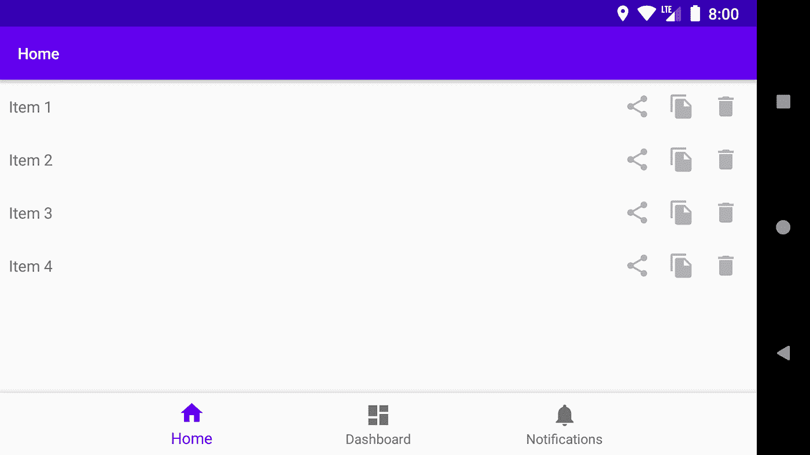

# Android:如何在大屏幕上带来优化的体验

> 原文：<https://medium.com/androiddevelopers/android-at-large-how-to-bring-optimized-experiences-to-the-big-screen-a50a6784e59d?source=collection_archive---------0----------------------->

## 了解如何为平板电脑、可折叠平板电脑、笔记本电脑和桌面设备等大型显示设备打造卓越体验

对于许多人来说，Android 是智能手机的代名词，考虑到超过 25 亿用户在智能手机设备上运行 Android，这并不奇怪。然而，Android 设备现在有许多不同的形状、大小和外形:从可穿戴设备和健身设备到汽车、笔记本电脑和电视。

在本文中，我们将探讨如何为更大的显示设备(平板电脑、可折叠设备、笔记本电脑和桌面设备)打造出色的体验。我们将涵盖:

*   用户界面和 UX 注意事项
*   应用连续性
*   多窗口环境
*   多显示器环境
*   测试

# 范式转变

当谈到为更大的屏幕准备你的应用程序时，你需要考虑的不仅仅是屏幕大小。更大的屏幕外形会影响人们使用你的应用程序的方式，他们与用户界面的交互方式，以及他们对你的应用程序的关注。

人们使用智能手机进行快速操作，通常是在移动中，在纵向模式下，通过触摸与用户界面进行交互。智能手机用户很少在手机上安装第二块屏幕、键盘和鼠标。

平板电脑的外形并不像手机那样移动:我们看不到人们用平板电脑在城市里跑来跑去。用户通常在平板电脑上进行更复杂的操作，在应用程序上花费更多时间，并且通常在风景中工作。然而，UI 交互仍然以触摸为主。

跨越这两种交互范例的是可折叠设备。虽然你将在很大程度上应用从智能手机和平板电脑外形学到的知识，但可折叠带来了极限长宽比的挑战，从折叠时的 21 比 9 到展开时的近 1 比 1。

在桌面环境中，我们有最大的屏幕，用户与应用程序互动的时间更长，专注于完成特定的任务。也是，键盘和触控板第一。一些设备没有触摸屏，所以许多关于人们如何与 UI 交互的假设不再有效。这个环境首先是景观。用户还对其他桌面环境有所期待，特别是使用多个窗口的能力，在这些窗口中，应用程序可以随意调整大小，以适应几乎任何方向或纵横比。

因此，与它的智能手机版本相比，当你考虑如何处理不同的屏幕尺寸和长宽比时，你需要考虑新的布局和导航模式，以及支持它们的资源。

# UX 和用户界面注意事项

## 处理不同的长宽比

在你的应用程序占据整个屏幕的设备上，大屏幕的外形意味着你需要允许 1:1 到 21:9 的宽高比。在台式机外形上，用户可能会应用更极端的宽高比。以一个通讯应用程序为例，用户可以将它放在屏幕边缘的一个又高又窄的窗口中，这样他们就可以在使用另一个占据屏幕其余部分的应用程序时查看和回复消息。

没有灵丹妙药可以解决纵横比的多样性，您需要尽可能地测试和支持这些。

然而，如果你的应用程序的内容不适合某些纵横比，请使用 Android 10 中引入的 minAspectRatio 标志，或 [maxAspectRatio](https://developer.android.com/guide/topics/manifest/activity-element.html#maxaspectratio) 标志，将你的应用程序限制在可行的纵横比内。

## 导航模式

当您开始支持各种不同的设备时，导航模式可能会被打破。以底部导航为例，这是一个简单的照片浏览器应用程序。

这种导航在智能手机上运行良好。很容易辨别触摸目标在哪里，一个项目在哪里结束，另一个项目在哪里开始。然而，当在桌面环境中运行时，由于显示器很宽，很难弄清楚项目在哪里结束，什么是可操作的。

对于大屏幕，更好的方法是将选项放在屏幕的左侧。如果有人在平板电脑上使用你的应用程序，这个位置会将选项放在靠近他们手持设备的地方，使选择更加方便。

左侧导航也是人们在网页中习惯使用的一种模式。

## 布局

照片浏览器的例子表明，当你简单地在宽屏上重用智能手机布局时，项目列表会留下很多空白。更好地利用空间并不意味着应用主从模式，在屏幕上添加尽可能多的内容。你应该想办法让更多的信息浮出水面，或者让任务更有效率。

例如，溢出菜单中的选项可以被拉出。因此，人们可以直接选择那个选项，而不是点击三次来编辑，因为那里有空间放置它。

更大的屏幕也使得提供更多身临其境的体验成为可能。例如，在媒体浏览或生产力应用程序中，有更多的方法让人们参与进来。值得注意的是，对于如何利用这些额外的空间，没有一个放之四海而皆准的解决方案。

与此同时，值得看看[材料研究](https://material.io/design/material-studies/about-our-material-studies.html)寻找灵感。材料设计团队已经为几个产品创建了设计研究，包括完整的设计模型。

其中一项研究是[回复、](https://material.io/design/material-studies/reply.html) [一款电子邮件客户端](http://material.io/design/material-studies/reply.html)的设计目标是清晰、易读、直观、易用，同时为其品牌展现友好和竞争力。

在这项研究中，不同屏幕尺寸之间的消息内容没有显著变化。然而，导航从智能手机布局中的底部导航变为大屏幕上的导航抽屉，默认情况下在最大屏幕上弹出。

这个例子展示了大屏幕上的额外空间不需要超载额外的信息，但是空白可以用来使内容更容易阅读。

另一项研究是金融应用程序 [Rally](http://material.io/design/material-studies/rally.html) ，它旨在显示尽可能多的信息，以便用户可以快速了解他们需要什么来对自己的财务做出决定，然后出去继续生活。

## 输入模式

随着外形因素向桌面发展，使用触摸作为输入媒介的可能性越来越小。输入可以通过手写笔或鼠标和键盘。因此，你需要考虑如何将你在桌面平台上看到的一些输入范式带到你的应用中。

例如，考虑处理右键单击(上下文)动作，这是通过设置 contextClickListener 并将长按行为映射到右键单击来实现的。

另一个有助于向人们展示事物是可操作的有用技术是悬停动作。例如，当鼠标悬停在操作项上时，可以使用 setOnHoverListener 更改颜色或高度，如下所示:

或者更新鼠标指针，例如将其改变为手形图标以指示抓取或选择功能。这是一个简单的单行实现:

## 应用连续性

应用程序连续性是指应用程序在收到配置更改时无缝恢复用户状态的能力，例如，确保它处于文本中的相同编辑位置或视频中的回放位置。

在智能手机中，旋转通常是基于上下文的，例如切换到横向观看视频。在大屏幕设备上，由于支持多窗口，应用程序连续性的重点变成了需要用最少的 jank 重新绘制和重新布局你的应用程序。在这个动画中，Play Store 应用程序从底部导航的小窗口变成了左侧导航的大窗口。

为了实现平稳过渡，要确保 onCreate 和 lifecycle 方法能够快速循环。为此，请确保您没有在这些方法上执行网络操作或大量内存读取。此外，在这些方法上执行的这些类型的任务通常会导致崩溃，从而导致糟糕的用户体验。

[resizeableActivity](https://developer.android.com/guide/topics/manifest/activity-element.html#resizeableActivity) 标志是一个 manifest 标志，用于指示应用程序是否支持多窗口和多显示环境。但是，将此设置为 false 并不意味着您的活动永远不需要调整大小。例如，在可折叠设备上，如果有人打开设备，你必须正确处理配置更改，并确保恢复正确的状态。

但是，如果你有一个活动被设置为无法调整大小，并且其方向被锁定，Android 10 help 中的新 compat 模式可以保证当设备展开时，你的应用程序不会发生配置变化。

在 compat 模式下，右下角有一个活动或应用程序重启按钮，供用户重启应用程序。这个按钮使你的应用程序能够获得新的全局配置并在可用屏幕上绘图。

## 处理配置更改

当设备打开时，应用程序会更改 smallestScreenSize、ScreenSize 和 screenLayout 的配置。如果您不能自己处理这个问题，那么您应该使用 onSaveInstanceState 和 ViewModels 来存储您的数据和配置更改时的用户状态。

如果您自己在清单中处理它，您将获得 handleConfigChange 的回调，并可以交换布局或资源。

为了获得最佳体验，您应该在清单中将 resizeableActivity 声明为 true。此外，建议您让操作系统尽可能多地处理这些配置更改，因为在很多边缘情况下，您可能会错过一些东西，例如为不同的显示密度交换资源。

# 多窗口

## 多重恢复

在配有大显示屏的设备上，人们希望在多窗口环境中并排使用应用程序。Android 10 为管理这种类型的环境引入了一个重要的变化:多恢复。

在 Android 10 之前，在多窗口环境下，只有一个可见的活动处于恢复状态。这对用户来说可能是混乱的，因为没有哪个活动被恢复的视觉指示。

使用多重恢复，所有可见活动都处于恢复状态。然而，应用程序仍可能处于暂停状态，例如，透明活动位于活动之上，或者活动不可聚焦，如画中画。

这种改变是以一种最小化你需要做的改变的方式来实现的:在大多数情况下，你的应用不需要做任何改变就可以在多重恢复模式下工作。但是，您可能需要对只能处理独占访问的资源进行更改。

例如，如果有三个活动想要使用摄像机，那么只有一个活动可以访问摄像机。在这种情况下，您需要处理来自摄像机的 onDisconnect 回调，并监听摄像机的可用性。请注意，将 resizeActivity 设置为 false 并不能保证对这些资源的访问，因为您可以在 Activity 的顶部放置一个浮动 activity，或者在辅助显示中放置一个想要使用摄像机的 activity。

Android 10 引入了一个新的回调，[ontouposedactivitychanged](https://developer.android.com/reference/android/app/Activity.html#onTopResumedActivityChanged(boolean))，当活动是“顶部”恢复的活动时，它会被通知。

New lifecycle callbacks for top-resumed

这转化为 Android 9 和更早版本的恢复状态。

## 拖放式

拖放并不是 Android 中的新特性，但在多窗口环境中工作时，它很有意义。特别是对于生产力应用程序，用户希望对文本和图像使用拖放操作。

由于添加拖放可能会涉及到，我们建议您查看 Android 开发者指南，在那里您可以找到[全面的文档和一些很棒的代码示例](https://d.android.com/guide/topics/ui/drag-drop)。

# 了解更多信息

我们已经在这篇文章中讨论了很多内容，并且回顾了让你的应用程序在更大的屏幕上工作所需要做的大部分关键事情。在这个指南上找到更多关于可折叠的[的信息，或者在 Chrome OS 应用指南](https://developer.android.com/guide/topics/ui/foldables)上找到 ChromeOS 应用[。](https://developer.android.com/chrome-os/intro)

要获得更多见解，请收听游戏开发商 Gameloft 的[应用、游戏和见解播客](https://developer.android.com/podcasts/apps-games-insights)集 [*构建更大的屏幕和更好的游戏体验*](http://appsgamesinsights.googledevelopers.libsynpro.com/building-for-larger-screens-and-better-game-experiences-episode-7?linkId=86702316) 。