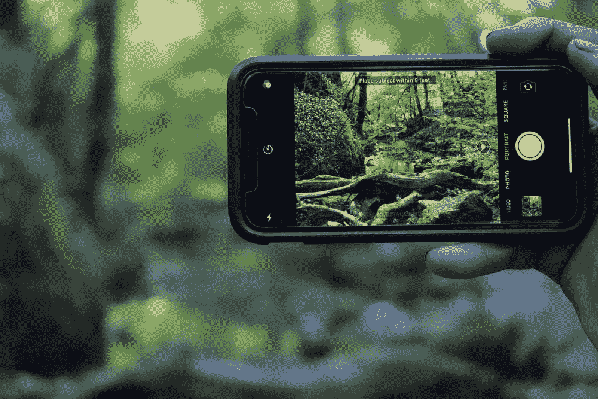

# Android CameraX——崛起

> 原文：<https://medium.com/quick-code/android-camerax-an-emergence-119fba29ac75?source=collection_archive---------6----------------------->

Photo by [Douglas Gausi](https://unsplash.com/@douglasgausi?utm_source=unsplash&utm_medium=referral&utm_content=creditCopyText) on [Unsplash](https://unsplash.com/s/photos/phone-camera-android?utm_source=unsplash&utm_medium=referral&utm_content=creditCopyText)

在最近发布的 Android 11 中引入并升级了几个 API。目标是创建简单直观的 API，让 Android 开发人员能够利用 Android 平台支持的创新理念。

这些 API 包括:

1.  媒体控制 API
2.  系统用户界面
3.  设备控制
4.  生物认证更新
5.  照相机
6.  AppCompat
7.  网络工具包

在本文中，我将重点介绍 **CameraX —** 这是一个 API，它将允许 Android 工程师快速可靠地构建相机应用程序。CameraX 处于测试阶段，在 90%的 Android 测试实验室设备上运行。它与以前的相机 API 如[相机 2](https://developer.android.com/training/camera2?authuser=1) 和[相机](https://developer.android.com/reference/android/hardware/Camera)API 建立在相同的基础上。所以现在开发人员可以用他们 Camera2 代码来扩展 CameraX 实现。

CameraX 的一个很酷的地方是它引入了**用例——**用例允许你作为一个开发者专注于你需要完成的任务，而不是管理其他特定于设备的改进。其他冷却功能包括:

*   **A p** [**回顾**](https://developer.android.com/training/camerax/preview) —作为一名 Android 开发人员，您可以在捕捉图像之前查看显示器上的图像。
*   **我** [**图像分析**](https://developer.android.com/training/camerax/analyze)**——这针对的是集成到机器学习套件的开发者。作为一名 Android 开发人员，你可以无缝地访问一个缓冲区，用于传递到你的机器学习模型算法中。**
*   ****我** [**法师捕捉**](https://developer.android.com/training/camerax/take-photo)——保存高质量图像。**

**接下来，我们将使用一个示例代码来查看一些简单的步骤，它将帮助您作为 Android 开发人员使用 CameraX API 来设置和实现预览。**

1.  **在布局 **activity_main.xml** 文件中添加 PreviewView 元素。**

**在您的 **MainActivity.kt** 文件中。**

1.  **创建 CameraProvider 的实例，然后在创建视图后验证其初始化是否成功。**
2.  **通过使用 builder 类创建预览，将预览绑定到我们设置的相机提供程序。首先，我们指定所需的 camera LensFacing 选项，然后，我们将 surfaceProvider 上选定的相机和任何其他用例绑定到活动的生命周期，最后，我们将预览连接到 PreviewView。**

**享受使用 CameraX 的乐趣。**

**感谢您的参与:-)**