# Android — CI / CD 高级版

> 原文：<https://medium.easyread.co/android-ci-cd-advanced-63ac3cde12bd?source=collection_archive---------0----------------------->

## 第 5 部分—自动签署您的 APK 并上传到 Play Store

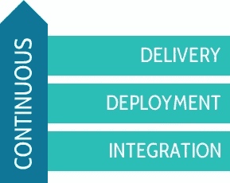

请看看我的[上一篇文章](https://medium.com/@mochadwi/android-ci-cd-getting-started-c3dc936806c8)，这样你就可以无缝地继续这篇文章。

通过这样配置，您可能会遇到许多问题。没关系，那是学习的一部分。如果你抓耳挠腮，那么我们开始吧，我收集了我在这个旅程中遇到的许多错误。

# 向导

## **将你的游戏商店链接到 firebase**

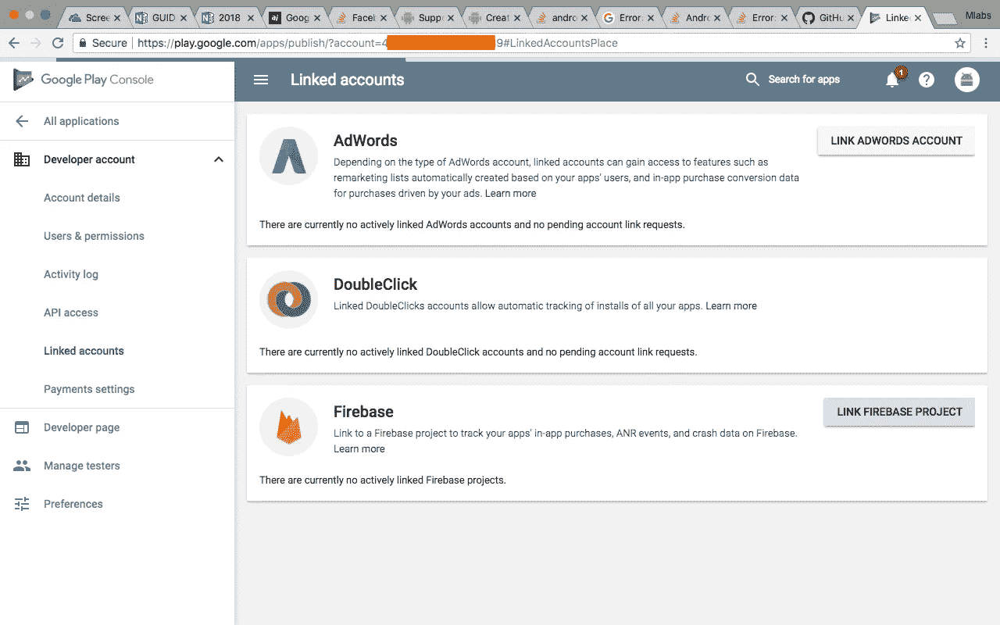

## **选择你的项目**

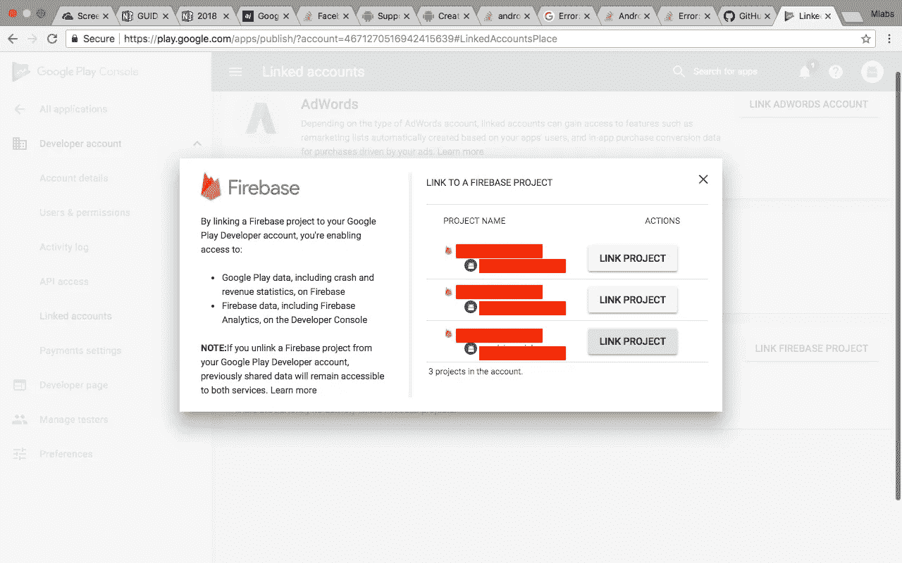

## **关联账户**

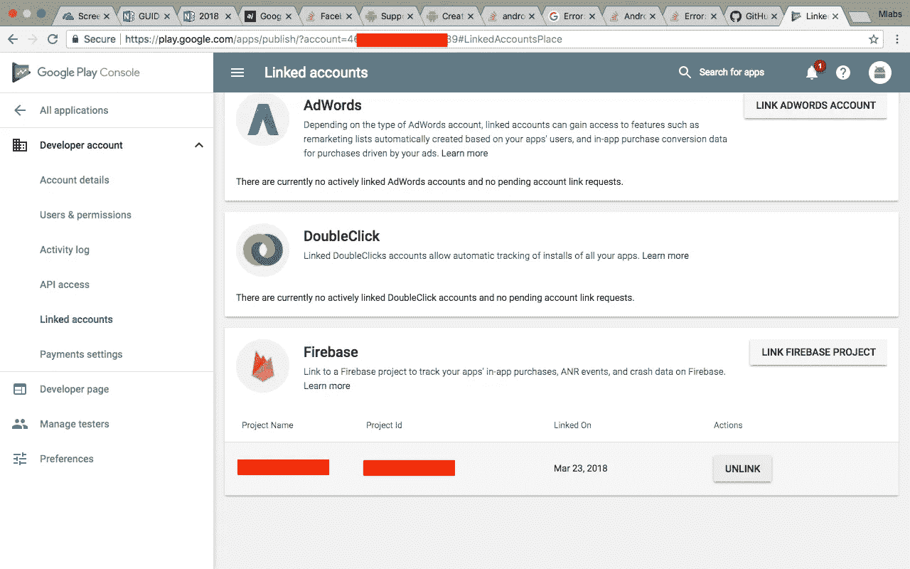

## 创建新的服务帐户

*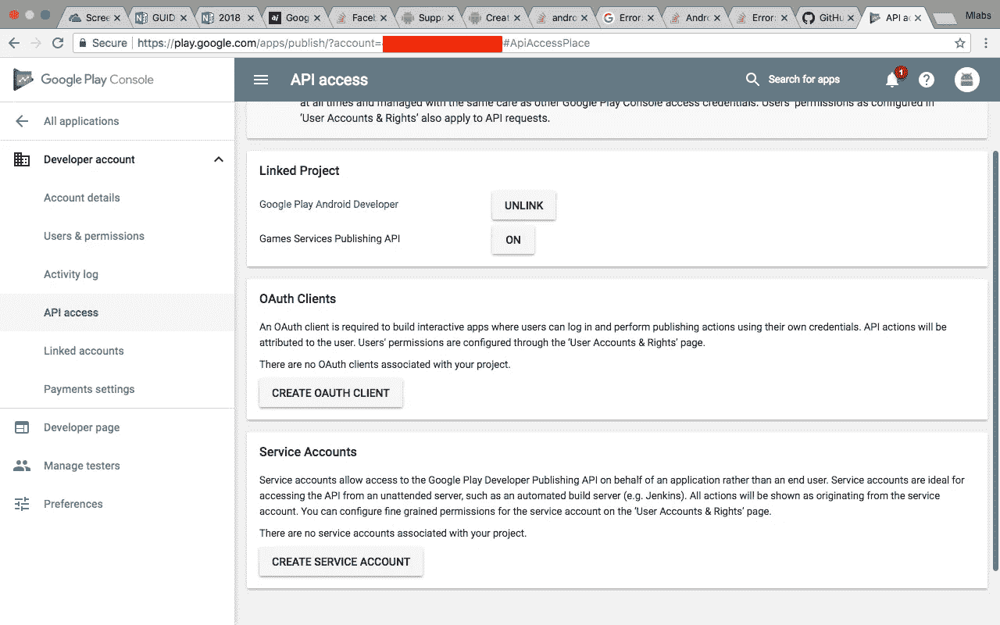*

## ***Oauth 已创建***

*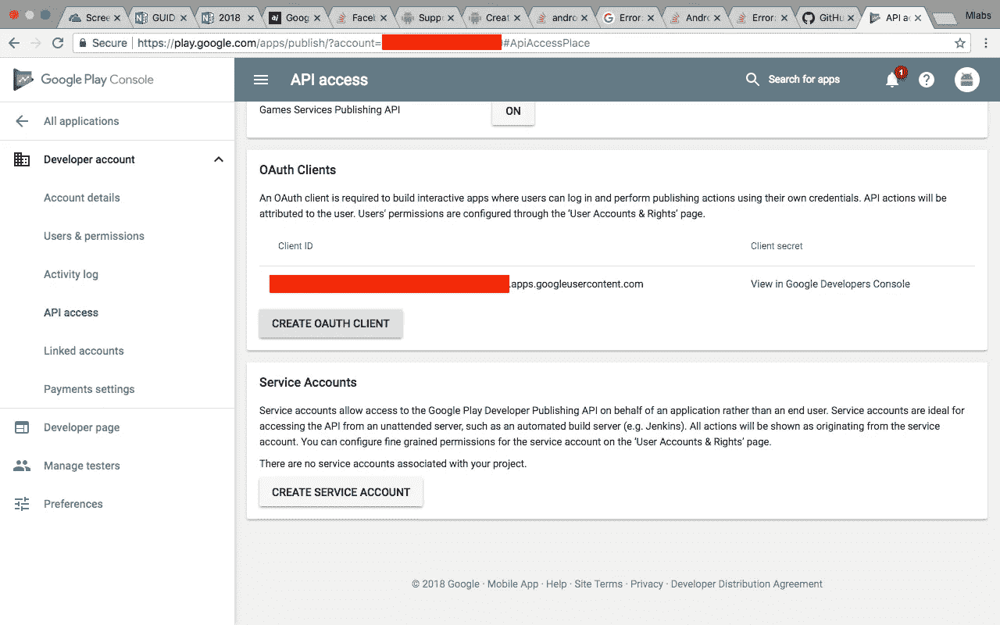*

## *转到 Google API 控制台来配置您的服务帐户*

*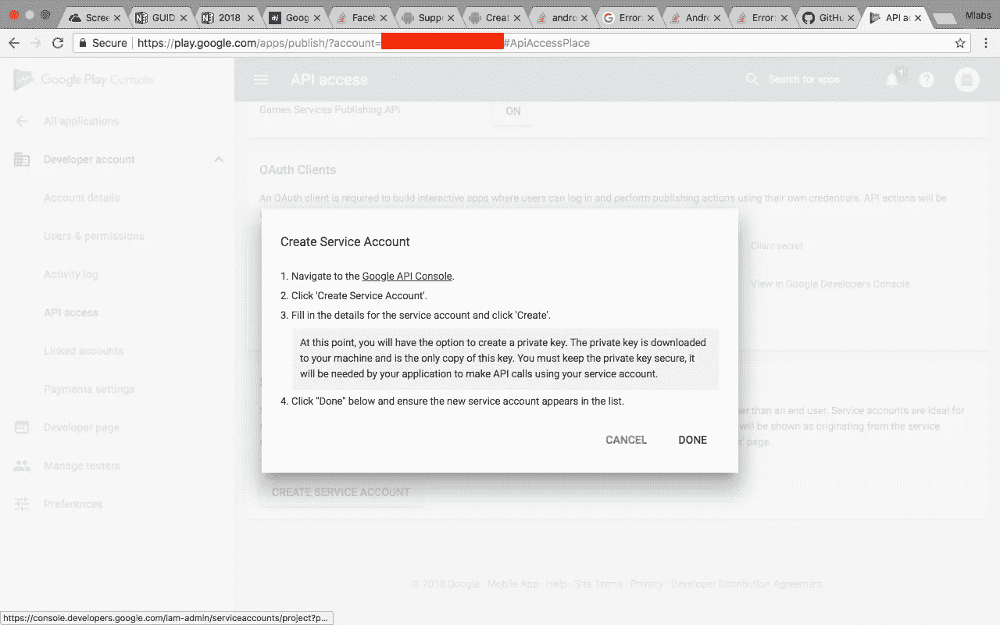*

## *点击 ***创建服务账户****

*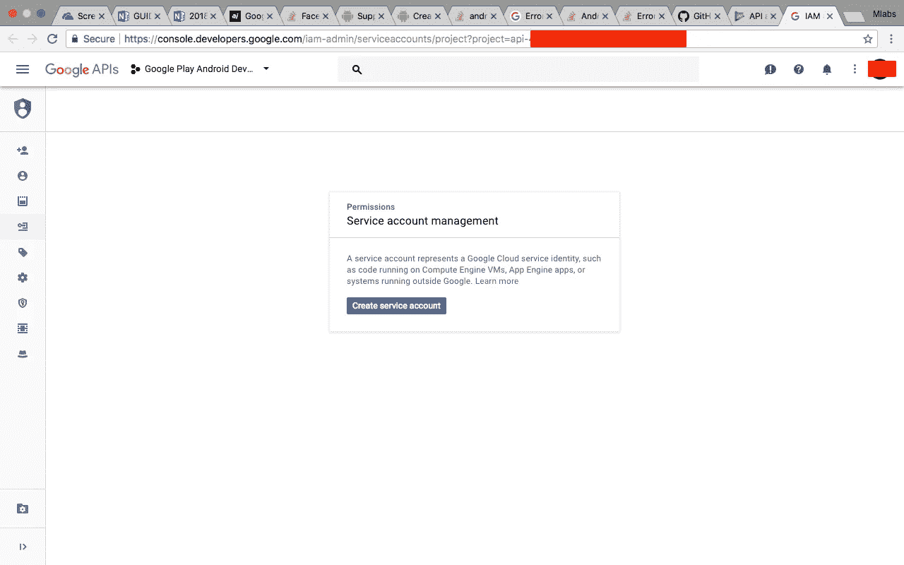*

## *为您的服务帐户选择角色*

*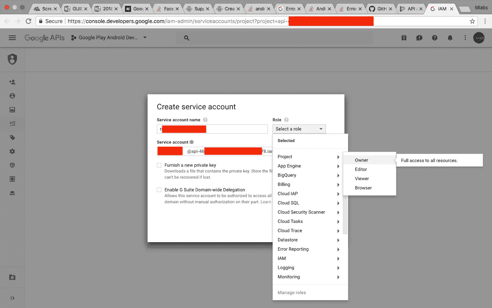*

## *以 JSON 的形式下载私钥(为了方便使用，在 Android Studio 上)*

*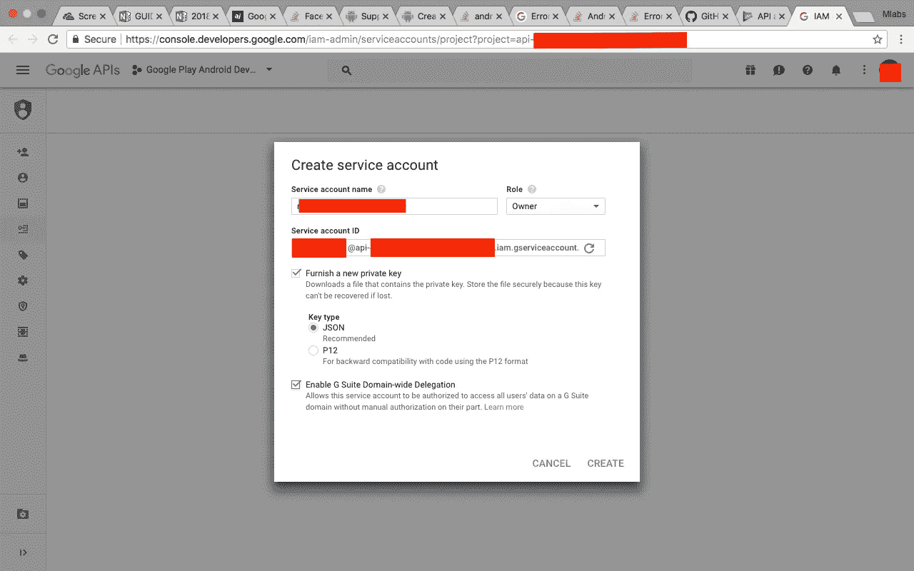*

## *自动下载*

*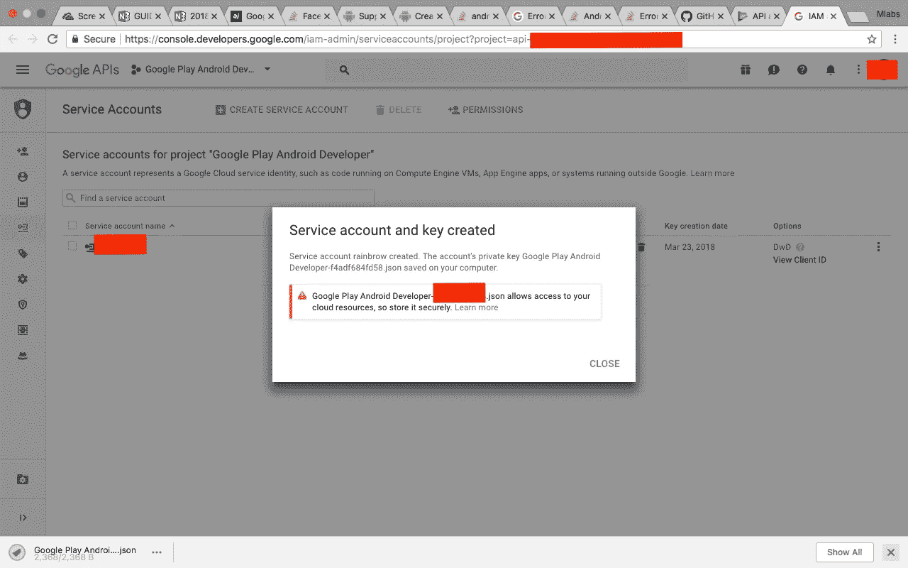*

## *记下你的服务账户*

*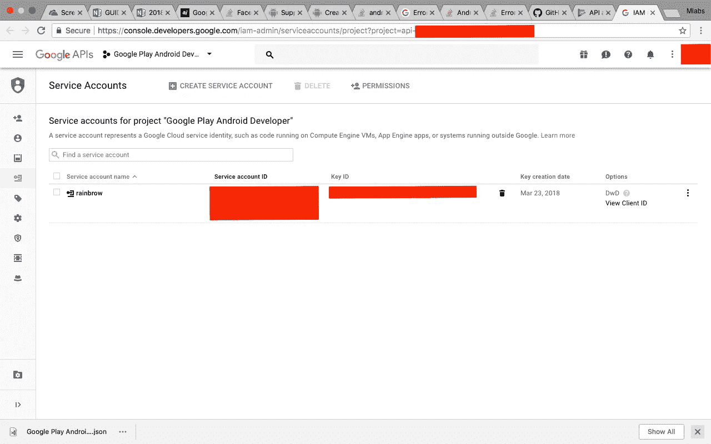*

## *检查你的游戏商店，它就在那里*

*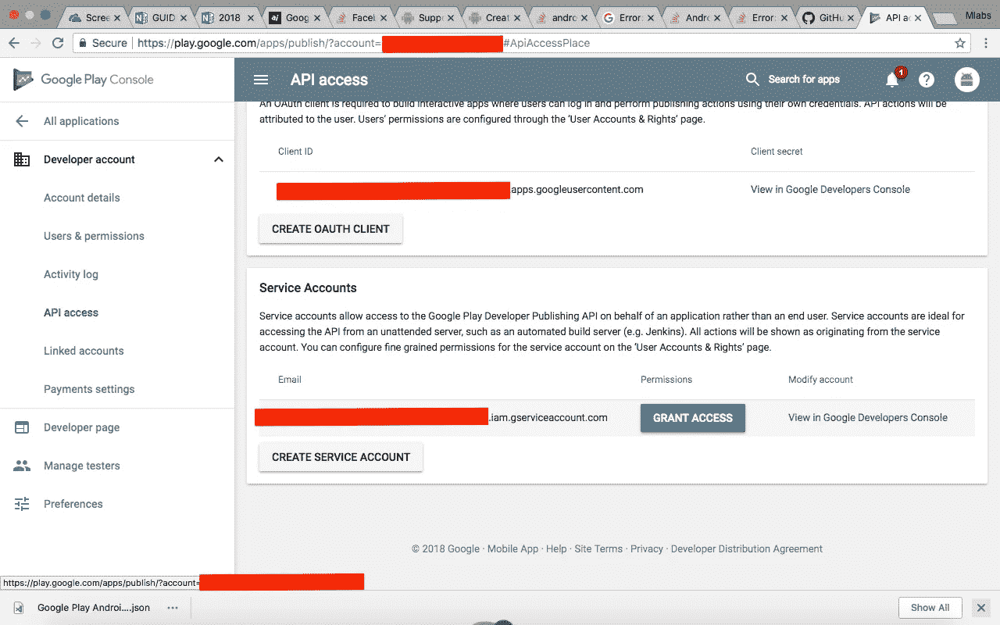*

## *配置您对 play store 的权限*

*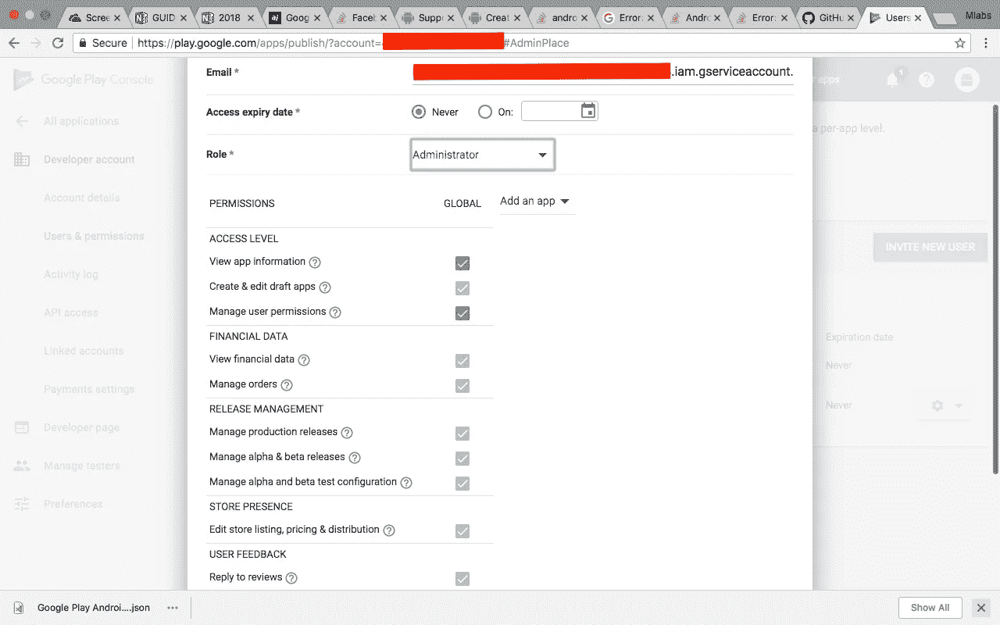*

## *请检查您的许可*

*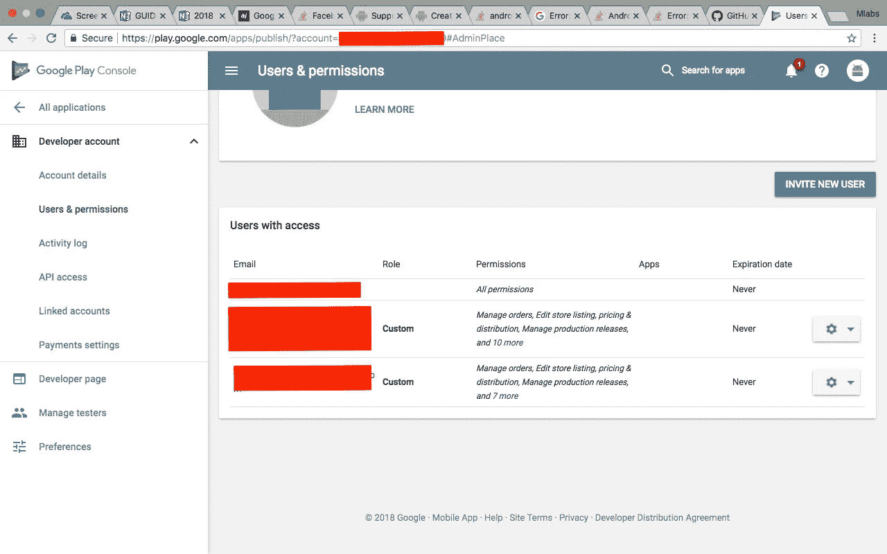*

*就是这样~*

# *解决纷争*

## *通过添加正确的版本签名配置进行修复*

```
*Try:
Run gradlew tasks to get a list of available tasks. Run with — info or — debug option to get more log output.* Exception is:
org.gradle.execution.TaskSelectionException: Task ‘publishProductionRelease’ not found in root project ‘your-app’.*
```

***确保您的密钥库未被篡改，并且您的密钥库密码正确。***

## *通过启用谷歌 Play 商店 API 进行修复*

```
*Execution failed for task ‘:app:publishApkProductionRelease’.
> com.google.api.client.googleapis.json.GoogleJsonResponseException: 403 Forbidden
 {
 “code” : 403,
 “errors” : [ {
 “domain” : “usageLimits”,
 “message” : “Access Not Configured. Google Play Developer API has not been used in project [project-id] before or it is disabled. Enable it by visiting [https://console.developers.google.com/apis/api/androidpublisher.googleapis.com/overview?project=](https://console.developers.google.com/apis/api/androidpublisher.googleapis.com/overview?project=517204485730)[project-id] then retry. If you enabled this API recently, wait a few minutes for the action to propagate to our systems and retry.”,
 “reason” : “accessNotConfigured”,
 “extendedHelp” : “[https://console.developers.google.com/apis/api/androidpublisher.googleapis.com/overview?project=](https://console.developers.google.com/apis/api/androidpublisher.googleapis.com/overview?project=517204485730)[project-id]"
 } ],
 “message” : “Access Not Configured. Google Play Developer API has not been used in project [project-id] before or it is disabled. Enable it by visiting [https://console.developers.google.com/apis/api/androidpublisher.googleapis.com/overview?project=](https://console.developers.google.com/apis/api/androidpublisher.googleapis.com/overview?project=517204485730)[project-id] then retry. If you enabled this API recently, wait a few minutes for the action to propagate to our systems and retry.”
 }*
```

*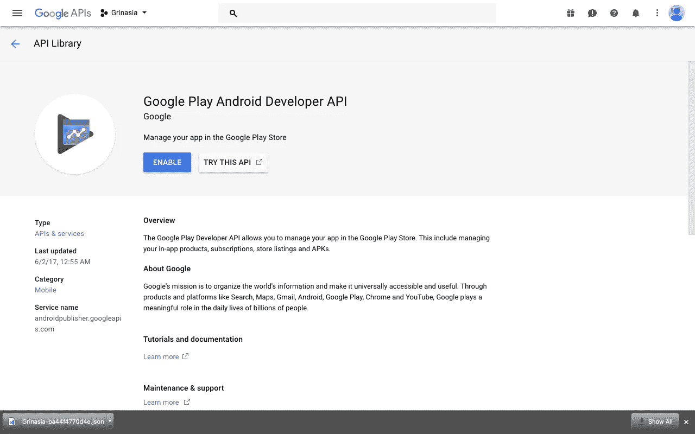*

## *通过将项目 id 链接到 Google Play 开发人员进行修复*

```
*Caused by: com.google.api.client.googleapis.json.GoogleJsonResponseException: 403 Forbidden
{
 “code” : 403,
 “errors” : [ {
 “domain” : “androidpublisher”,
 “message” : “The project id used to call the Google Play Developer API has not been linked in the Google Play Developer Console.”,
 “reason” : “projectNotLinked”
 } ],
 “message” : “The project id used to call the Google Play Developer API has not been linked in the Google Play Developer Console.”
}*
```

*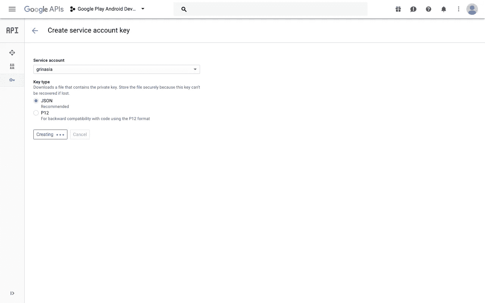*

*下载您的实际项目 id JSON 或 p12 文件。通过点击上面的错误 url*

## *通过增加您实际版本代码来修复它*

```
*{
 “code” : 403,
 “errors” : [ {
 “domain” : “androidpublisher”,
 “message” : “APK specifies a version code that has already been used.”,
 “reason” : “apkUpgradeVersionConflict”
 } ],
 “message” : “APK specifies a version code that has already been used.”
}*
```

*是的，这是不言自明的只是升级你的实际 ***版本代码*** + 1 比玩商店 versoin*

## *通过使用实际的签名版本来修复它*

```
*Caused by: com.google.api.client.googleapis.json.GoogleJsonResponseException: 403 Forbidden
{
 “code” : 403,
 “errors” : [ {
 “domain” : “androidpublisher”,
 “message” : “APK has not been signed with the upload certificate.”,
 “reason” : “apkNotSignedWithUploadCertificate”
 } ],
 “message” : “APK has not been signed with the upload certificate.”
}*
```

*不要发布密钥库，甚至不要发布到你的私有仓库！！！保护好它。
你可以在这里查看我的文章[关于清除你的远程历史](https://medium.com/@mochadwi/git-purging-your-history-69d72e45b9ce)*

## *如果您指定了自定义元数据，请在此处记下[和](https://github.com/Triple-T/gradle-play-publisher#play-store-metadata)*

```
*:app:publishListingRelease FAILEDFAILURE: Build failed with an exception.* What went wrong:
Execution failed for task ‘:app:publishListingRelease’.
> com.google.api.client.googleapis.json.GoogleJsonResponseException: 500 Internal Server Error
 {
 “code” : 500,
 “message” : null
 }*
```

## *改变你的实际语言*

```
*Caused by: com.google.api.client.googleapis.json.GoogleJsonResponseException: 403 Forbidden
{
 “code” : 403,
 “errors” : [ {
 “domain” : “androidpublisher”,
 “message” : “The default language for your application is not currently supported.”,
 “reason” : “invalidDefaultLanguage”
 }, {
 “domain” : “androidpublisher”,
 “message” : “Invalid contact phone number specified for this app.”,
 “reason” : “invalidAppContactPhone”
 } ],
 “message” : “The default language for your application is not currently supported.”
}*
```

## *没有为语言*设置高分辨率图标*

```
*Execution failed for task ‘:app:publishListingProductionRelease’.
> com.google.api.client.googleapis.json.GoogleJsonResponseException: 403 Forbidden
 {
 “code” : 403,
 “errors” : [ {
 “domain” : “androidpublisher”,
 “message” : “This app has no high resolution icon set for language en_US.”,
 “reason” : “noHiResIcon”
 }, {
 “domain” : “androidpublisher”,
 “message” : “This app has no feature graphic set for language en_US.”,
 “reason” : “noFeatureGraphic”
 }, {
 “domain” : “androidpublisher”,
 “message” : “This app has too few screenshots for language en_US.”,
 “reason” : “tooFewScreenshots”
 } ],
 “message” : “This app has no high resolution icon set for language en_US.”
 }*
```

***确保在 play store 控制台上检查您的默认语言，如果没有，请先设置您的图标***

## *由于三重版本，zipAlignEnabled*

*[](https://stackoverflow.com/a/47309056/3763032) [## 错误:类没有这样的属性:zipAlignEnabled

### 加入 Stack Overflow，学习、分享知识，打造您的职业生涯。当我尝试…时，不断收到这个错误

stackoverflow.com](https://stackoverflow.com/a/47309056/3763032)* 

## ***参考文献***

1.  *[访问 Android 版本中的 Gradle 命令行-P 变量](https://stackoverflow.com/a/29692395/3763032)*
2.  *[Signing configs with gradle android](https://coderwall.com/p/zrdsmq/signing-configs-with-gradle-android)*
3.  *[How to create a release signed apk file using Gradle?](https://stackoverflow.com/questions/18328730/how-to-create-a-release-signed-apk-file-using-gradle)*
4.  *[Configure Gradle to sign your APK](https://developer.android.com/studio/publish/app-signing.html#gradle-sign)*
5.  *[Auto Publish Android App ke Play Store](https://medium.com/@showcheap/auto-publish-android-app-ke-play-store-cf0f52e5f6d4)*
6.  *[How to build and publish your React Native Android applications using GitLab CI](https://gitlab.com/gitlab-com/blog-posts/issues/331)*
7.  *[How publish to Google Play from Gitlab’s CI](https://gitlab.com/gitlab-com/blog-posts/issues/204)*
8.  *[Building Nativescript apps on Gitlab CI](https://davidmburke.com/2018/01/27/building-nativescript-on-gitlab-ci/)*
9.  *[GitLab CI/CD Variables](https://docs.gitlab.com/ee/ci/variables/)*

****Happy coding, guys!!!****

**Artikel ini di tulis oleh* [*Mochamad Iqbal Dwi Cahyo*](https://medium.com/u/62a4f05ca52a?source=post_page-----63ac3cde12bd--------------------------------) *beliau seorang enthusiast dan photographer. Follow profilnya untuk mendapatkan update-an terbaru artikel-artikel beliau.**

**Jika anda merasa artikel ini menarik dan bermanfaat, bagikan ke lingkaran pertemanan anda, agar mereka dapat membaca artikel ini.
Atau jika anda tertarik untuk membagikan cerita anda pada publikasi ini, anda boleh mengirimkan cerita anda ataupun mengikuti langkah-langkah yang ada* [***disini***](https://medium.com/easyread/about-easyread-74b20960e180) *.**