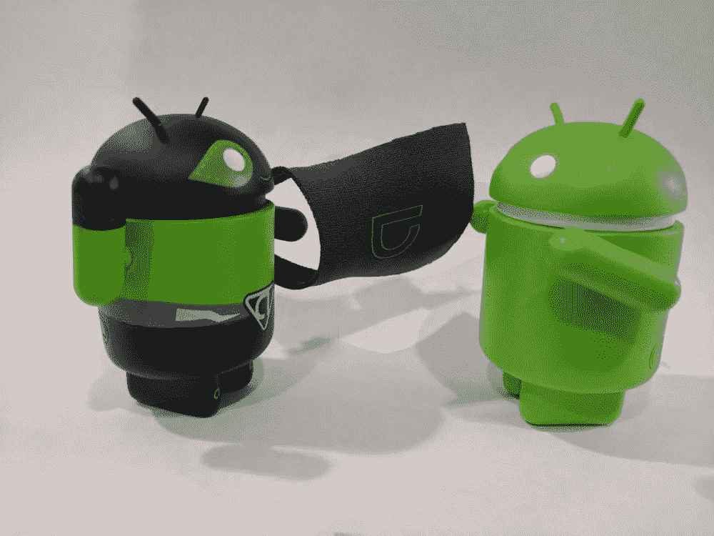
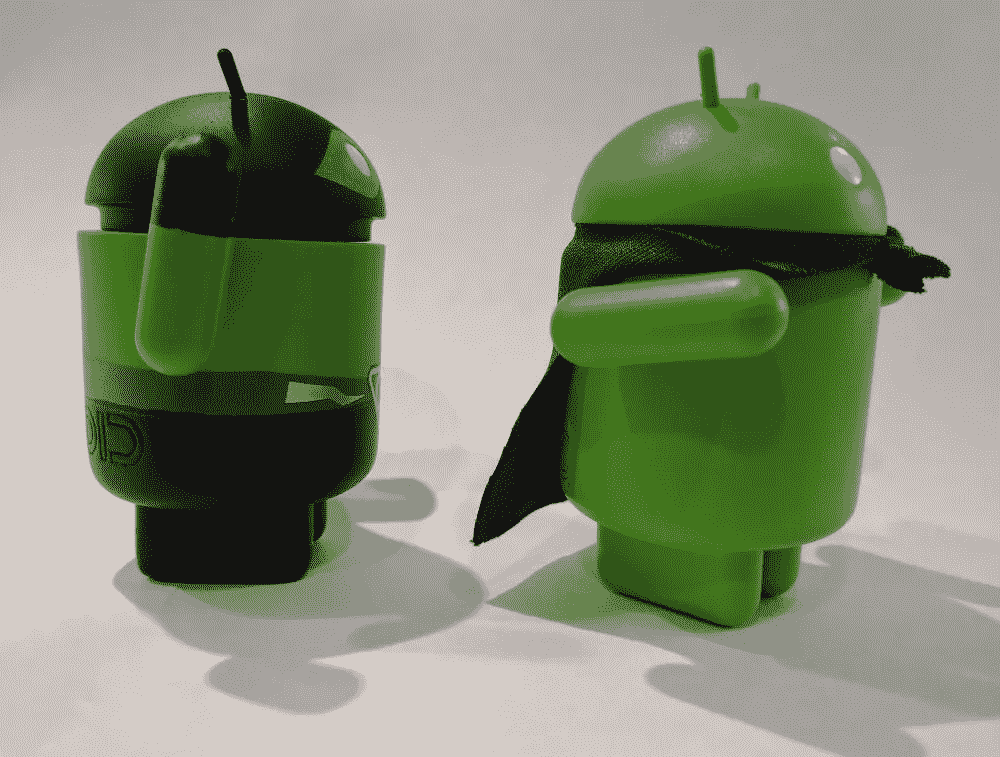
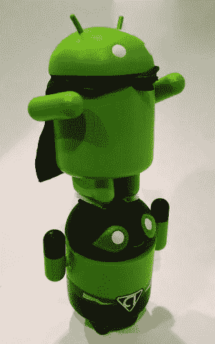

# Android 数据绑定:双向方式

> 原文：<https://medium.com/androiddevelopers/android-data-binding-2-way-your-way-ccac20f6313?source=collection_archive---------0----------------------->



## 制作自定义双向绑定属性

您可能还记得上一篇文章[中的内容](/google-developers/android-data-binding-lets-flip-this-thing-dc17792d6c24#.jnjdgyoo8)，双向数据绑定允许您自动将用户输入的数据传输回您的数据模型。当[我写了关于自定义设置器的文章](/google-developers/android-data-binding-custom-setters-55a25a7aea47#.966qs44lp)时，你们中的一些人已经意识到这对于双向数据绑定是不够的。我本打算把这个留到以后，但我不想让你一直等着。

## 颜色选择器刷新程序

正如您在[自定义设置器](/google-developers/android-data-binding-custom-setters-55a25a7aea47#.8x1b2k7ex)文章中所知道的，我有一个自定义视图 ColorPicker，它有一个属性“color ”,并支持一个“OnColorChangeListener ”,当用户选择新的颜色时，它会发出通知:

```
**public class** ColorPicker **extends** View {
    **private int color**;

    **public void** setColor(**int** color) {
        **this**.**color** = color;
        invalidate();
    }

    **public int** getColor() {
        **return color**;
    } **public void** addListener(OnColorChangeListener listener) {
        //...
    } **public void** removeListener(OnColorChangeListener listener) {
        //...
    } //...
}
```

我想使用双向绑定“@={expression}”语法支持 color 属性的双向绑定:

```
<**com.example.myapp.ColorPicker
    android:layout_width="wrap_content"
    android:layout_height="wrap_content"
    *app:color="@={color}"***/>
```

## 我们用什么吸气剂？

如果我们有一个简单的 getter 匹配属性中使用的类型，我们可以使用 InverseBindingMethod:

```
@InverseBindingMethods({
  @InverseBindingMethod(type = ColorPicker.**class**,
                        attribute = **"color",** method = **"getColor"**)
})
**public class** ColorPickerBindingAdapters {
}
```

这里，我已经明确地将方法属性设置为“getColor”InverseBindingMethod 根据属性名将方法名默认为 getter，所以即使我没有显式设置它，它也会默认为“getColor”。

如果需要做比调用 getter 方法更复杂的事情，就需要使用 InverseBindingAdapter。这里，我已经将颜色(无论是什么类型)转换成了整数。我还需要一个常规的绑定适配器来转换另一个方向:

```
**public class** ColorPickerBindingAdapters {
    @InverseBindingAdapter(attribute = **"color"**)
    **public static int** getColor(ColorPicker view) {
        **return** convertColorToInt(view.getColor());
    }

    @BindingAdapter(**"color"**)
    **public static void** setColor(ColorPicker view, **int** color) {
        view.setColor(convertIntToColor(color));
    }
}
```



## 钩住事件

既然数据绑定知道 getter 使用哪种方法，它还必须连接一个侦听器来知道值何时改变。幸运的是，在前一篇文章中，我们在 ColorPicker [中连接了一个监听器。然而，数据绑定并不真正理解“onColorChange”是什么，所以我们必须使用它的 InverseBindingListener 来挂钩数据更改事件。](/google-developers/android-data-binding-custom-setters-55a25a7aea47#.966qs44lp)

对于每个双向绑定，都会生成一个合成事件属性，其名称与该属性相同，但带有后缀“AttrChanged”在这种情况下，事件属性是“colorAttrChanged”这允许我们创建一个 BindingAdapter 来将事件监听器关联到视图。我也不想像以前一样失去分配“onColorChange”事件的能力，所以绑定适配器必须寻找两种事件类型:

```
@BindingAdapter(value = {**"onColorChange"**, **"colorAttrChanged"**},
                requireAll = **false**)
**public static void** setListeners(ColorPicker view,
              **final** OnColorChangeListener onColorChangeListener,
              **final** InverseBindingListener inverseBindingListener) {
    ColorPicker.OnColorChangeListener newListener;
    **if** (inverseBindingListener == **null**) {
        newListener = onColorChangeListener;
    } **else** {
        newListener = **new** ColorPicker.OnColorChangeListener() {
            @Override
            **public void** onColorChange(ColorPicker colorPicker,
                                      **int** newColor) {
                **if** (onColorChangeListener != **null**) {
                    onColorChangeListener.onColorChange(colorPicker,
                                                        newColor);
                }
                inverseBindingListener.onChange();
            }
        };
    }

    ColorPicker.OnColorChangeListener oldListener = 
            ListenerUtil.*trackListener*(view, newListener,
                                       R.id.colorChangeListener);

    **if** (oldListener != **null**) {
        view.removeListener(oldListener);
    }
    **if** (newListener != **null**) {
        view.addListener(newListener);
    }
}
```

当使用双向绑定表达式时，数据绑定框架将为“colorAttrChanged”属性分配 InverseBindingListener。既然我们已经将监听器连接到 onColorChanged 事件，数据绑定框架将知道何时将值赋回模型。



## 防止无限循环

用户做出更改后，事件被触发，值被接收，然后在模型上设置该值。[如前一篇文章中所讨论的，一个可观察模型然后通知](/p/9de4ff3fe038/)有一个变更，数据绑定框架将该值分配给视图。然后，视图再次通知一个变更，再次接收值，然后再次在模型上设置值。整个事情永远这样继续下去，每一帧一次。这对电池寿命不好。

不幸的是，Android 数据绑定不会自动处理这一点，所以您必须打破循环。您可以通过在视图的 setter 中进行检查，或者在通知代码中没有值更改时不通知来实现这一点。但是，您不能总是控制视图的源，因此您可以在使用绑定适配器设置值之前进行检查:

```
@BindingAdapter(**"color"**)
**public static void** setColor(ColorPicker view, **int** color) {
    **if** (color != view.getColor()) {
        view.setColor(color);
    }
}
```

## 概述

现在，您已经准备好为自定义视图的属性启用双向数据绑定了。

1.  添加一个 InverseBindingMethod 或 InverseBindingAdapter 来标识如何从视图中检索数据。
2.  添加一个 BindingAdapter 来连接 InverseBindingListener，以侦听属性值的更改。
3.  通过在 BindingAdapter 或视图的 setter 中添加值检查来确保没有无限循环。