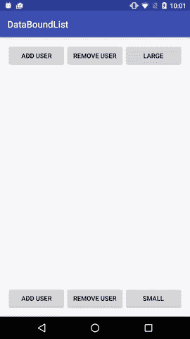

# Android 数据绑定:列举技巧

> 原文：<https://medium.com/androiddevelopers/android-data-binding-list-tricks-ef3d5630555e?source=collection_archive---------0----------------------->


## 对于那些小小的视图列表

我在想以前的一篇文章，在那篇文章中[我写了使用 Android 数据绑定和 recycle view](/google-developers/android-data-binding-recyclerview-db7c40d9f0e4#.mhdx00m3r)。如果您有一个元素列表，但并不真正需要 RecyclerView 来处理它，该怎么办？毕竟，如果你只打算在屏幕上展示三到四种元素，而且它们永远不会被回收，那么就没有必要拿出大家伙。

开发人员通常会遍历他们的条目并手动创建视图:

```
**for** (Account item : items) {
    ItemBinding itemBinding =
        ItemBinding.*inflate*(getLayoutInflater(), parent, **true**);
    itemBinding.setData(item);
}
```

这很简单。如果我们可以绑定到 XML 中的列表，那不是很好吗？类似这样的事情会很棒:

```
<**LinearLayout
    app:entries="@{entries}"
    app:layout="@{@layout/item}"
    ...**/>
```

## 简单列表绑定适配器

我想使用条目列表在 LinearLayout 中创建视图，并将这些视图绑定到列表中的值。每个不同的布局都有自己生成的绑定类，所以如果我想做一个通用的绑定适配器，我不能只调用普通的 setter。我当然不想使用反射——它的成本很高。相反，[就像使用 RecyclerView](/google-developers/android-data-binding-recyclerview-db7c40d9f0e4#.mhdx00m3r) 一样，我们可以使用*约定*来解决问题。

我们将使用只有一个变量的约定，并且该变量总是被命名为某个一致的值。无论列表中有什么，布局都只有一个名为“data”的变量然后，我们可以使用 ViewDataBinding.setVariable()方法来绑定布局中的数据。

```
@BindingAdapter({**"entries"**, **"layout"**})
**public static** <T> **void** setEntries(ViewGroup viewGroup,
                                  List<T> entries, **int** layoutId) {
    viewGroup.removeAllViews();
    **if** (entries != **null**) {
        LayoutInflater inflater = (LayoutInflater)
            viewGroup.getContext()      
                .getSystemService(Context.***LAYOUT_INFLATER_SERVICE***);
        **for** (**int** i = 0; i < entries.size(); i++) {
            T entry = entries.get(i);
            ViewDataBinding binding = DataBindingUtil
                .*inflate*(inflater, layoutId, viewGroup, **true**);
            binding.setVariable(BR.***data***, entry);
        }
    }
}
```

你可以像这样把它绑定到你的视图组:

```
<**LinearLayout
    app:entries="@{entries}"
    app:layout="@{@layout/item}"
    ...**/>
```

上面的 LinearLayout 将使用 item.xml 布局自动添加子元素，并将“data”变量设置为条目中的条目。这可用于 addView()足以管理子视图的任何视图组。

## 动态列表

上面的绑定适配器非常适合静态列表，但是如果您的列表动态地改变了呢？也许用户添加了一个新选项，该选项必须添加到单选按钮列表中。ObservableList 让我们能够观察变化并做出反应。我们使用 OnListChangedCallback 来观察列表的变化:

```
@BindingAdapter({**"entries"**, **"layout"**})
**public static** <T> **void** setEntries(ViewGroup viewGroup,
        ObservableList<T> oldEntries, **int** oldLayoutId,
        ObservableList<T> newEntries, **int** newLayoutId) {
    **if** (oldEntries == newEntries && oldLayoutId == newLayoutId) {
        **return**; *// nothing has changed* }

    EntryChangeListener listener =
            ListenerUtil.*getListener*(viewGroup, R.id.***entryListener***);
    **if** (oldEntries != newEntries && listener != **null**) {
        oldEntries.removeOnListChangedCallback(listener);
    }

    **if** (newEntries == **null**) {
        viewGroup.removeAllViews();
    } **else** {
        **if** (listener == **null**) {
            listener =
                    **new** EntryChangeListener(viewGroup, newLayoutId);
            ListenerUtil.*trackListener*(viewGroup, listener,
                    R.id.***entryListener***);
        } **else** {
            listener.setLayoutId(newLayoutId);
        }
        **if** (newEntries != oldEntries) {
            newEntries.addOnListChangedCallback(listener);
        }
        *resetViews*(viewGroup, newLayoutId, newEntries);
    }
}
```

setEntries()绑定适配器中有几件事情值得注意。首先，我使用数据绑定的特性，该特性允许我获取旧值和新值。通过提供两倍于属性的数据参数，第一组参数接收旧值，第二组接收新值。我用它来从旧条目列表中删除侦听器。

其次，Android 数据绑定通常会监视列表的变化，当发生变化时，它会重新计算表达式。我想管理绑定适配器中的更改，这样当没有实例更改发生时，它不会做任何事情。我使用 ListenerUtil 跟踪 EntryChangeListener，一个 OnListChangedCallback。ListenerUtil 跟踪侦听器，以便可以在调用之间检索它，我使用它，以便可以删除或修改旧的侦听器，并可能将它添加到新列表中。我需要提供一个标识符作为键，所以我创建了一个:

```
<**resources**>
    <**item type="id" name="entryListener"**/>
</**resources**>
```

第三，setEntries()依赖 EntryChangeListener 在只有数据更改时更新子视图。否则，它将完全替换子视图。例如，如果布局 ID 改变，我们丢弃旧的子元素，然后重新填充整个元素。

除此之外，它相当简单。以下是它使用的其他方法:

```
**private static** ViewDataBinding bindLayout(LayoutInflater inflater,
        ViewGroup parent, **int** layoutId, Object entry) {
    ViewDataBinding binding = DataBindingUtil.*inflate*(inflater,
            layoutId, parent, **false**);
    binding.setVariable(BR.***data***, entry);
    **return** binding;
}

**private static void** resetViews(ViewGroup parent, **int** layoutId,
        List entries) {
    parent.removeAllViews();
    **if** (layoutId == 0) {
        **return**;
    }
    LayoutInflater inflater = (LayoutInflater) parent.getContext()
            .getSystemService(Context.***LAYOUT_INFLATER_SERVICE***);
    **for** (**int** i = 0; i < entries.size(); i++) {
        Object entry = entries.get(i);
        ViewDataBinding binding = *bindLayout*(inflater, parent,
                layoutId, entry);
        parent.addView(binding.getRoot());
    }
}
```

这些基本上完成了原始绑定适配器中的工作。resetViews()方法首先从 ViewGroup 中删除所有视图，然后膨胀视图并绑定列表中的数据。

您可以拥有一个简单的 EventChangeListener，它每次都会重置视图:

```
**private static class** EntryChangeListener
            **extends** ObservableList.OnListChangedCallback {
    **private final** ViewGroup **mTarget**;
    **private int mLayoutId**;

    **public** EntryChangeListener(ViewGroup target, **int** layoutId) {
        **mTarget** = target;
        **mLayoutId** = layoutId;
    }

    **public void** setLayoutId(**int** layoutId) {
        **mLayoutId** = layoutId;
    }

    @Override
    **public void** onChanged(ObservableList observableList) {
        *resetViews*(**mTarget**, **mLayoutId**, observableList);
    }

    @Override
    **public void** onItemRangeChanged(ObservableList observableList,
                                   **int** start, **int** count) {
        *resetViews*(**mTarget**, **mLayoutId**, observableList);
    }

    @Override
    **public void** onItemRangeInserted(ObservableList observableList,
                                    **int** start, **int** count) {
        *resetViews*(**mTarget**, **mLayoutId**, observableList);
    }

    @Override
    **public void** onItemRangeMoved(ObservableList observableList,
                                 **int** from, **int** to, **int** count) {
        *resetViews*(**mTarget**, **mLayoutId**, observableList);
    }

    @Override
    **public void** onItemRangeRemoved(ObservableList observableList,
                                   **int** start, **int** count) {
        *resetViews*(**mTarget**, **mLayoutId**, observableList);
    }
}
```

老实说，对于大多数用例来说，这可能已经足够好了。你不应该对大量的视图使用它——这就是 RecyclerView 的用途。然而，如果我想在发生变化时激活视图，我希望更好地处理变化事件。您可能会考虑这样的变更监听器:

```
@Override
**public void** onItemRangeChanged(ObservableList observableList,
                               **int** start, **int** count) {
    TransitionManager.*beginDelayedTransition*(**mTarget**);
    **final int** end = start + count;
    **for** (**int** i = start; i < end; i++) {
        Object data = observableList.get(i);
        View view = **mTarget**.getChildAt(i);
        ViewDataBinding binding = DataBindingUtil.*getBinding*(view);
        binding.setVariable(BR.***data***, data);
    }
}
```

它只是重新绑定当前视图中的数据。不幸的是，如果我们有非常智能的转换，这可能行得通，但是当数据改变时，默认的转换不知道做什么。相反，我们必须实际替换视图:

```
@Override
**public void** onItemRangeChanged(ObservableList observableList,
                               **int** start, **int** count) {
    LayoutInflater inflater = (LayoutInflater) **mTarget**.getContext()
            .getSystemService(Context.***LAYOUT_INFLATER_SERVICE***);
    TransitionManager.*beginDelayedTransition*(**mTarget**);
    **final int** end = start + count;
    **for** (**int** i = start; i < end; i++) {
        Object data = observableList.get(i);
        ViewDataBinding binding = *bindLayout*(inflater, 
            **mTarget**, **mLayoutId**, data);
        binding.setVariable(BR.***data***, observableList.get(i));
        **mTarget**.removeViewAt(i);
        **mTarget**.addView(binding.getRoot(), i);
    }
}
```

现在，当视图改变时，我们可以看到一个很好的淡出和淡入效果。其余实现的方法相当简单，使用 TransitionManager 来激活视图。

```
@Override
**public void** onItemRangeInserted(ObservableList observableList,
                                **int** start, **int** count) {
    TransitionManager.*beginDelayedTransition*(**mTarget**);
    **final int** end = start + count;
    LayoutInflater inflater = (LayoutInflater) **mTarget**.getContext()
            .getSystemService(Context.***LAYOUT_INFLATER_SERVICE***);
    **for** (**int** i = end - 1; i >= start; i--) {
        Object entry = observableList.get(i);
        ViewDataBinding binding =
            *bindLayout*(inflater, **mTarget**, **mLayoutId**, entry);
        **mTarget**.addView(binding.getRoot(), start);
    }
}

@Override
**public void** onItemRangeMoved(ObservableList observableList,
                             **int** from, **int** to, **int** count) {
    TransitionManager.*beginDelayedTransition*(**mTarget**);
    **for** (**int** i = 0; i < count; i++) {
        View view = **mTarget**.getChildAt(from);
        **mTarget**.removeViewAt(from);
        **int** destination = (from > to) ? to + i : to;
        **mTarget**.addView(view, destination);
    }
}

@Override
**public void** onItemRangeRemoved(ObservableList observableList,
                               **int** start, **int** count) {
    TransitionManager.*beginDelayedTransition*(**mTarget**);
    **for** (**int** i = 0; i < count; i++) {
        **mTarget**.removeViewAt(start);
    }
}
```

## 考虑

您可能会尝试使用列表绑定技术，而不是 RecyclerView。*不要*。数据绑定列表不能替代 RecyclerView。相反，使用它来绑定到一小部分在布局中可见的视图。一个好的经验是，如果你必须滚动列表，使用 RecyclerView。如果没有，就使用数据绑定。

我最初使用的例子只有四行代码，但我不知何故制作了一个将近 150 行代码的绑定适配器。但是现在已经写好了，我可以在应用程序的任何地方使用它来填充我的小型数据驱动 UI 列表。它甚至会随着值的变化而变化，我永远不用担心直接更新视图。现在你也不用担心了。

你可以在这里看到 [DataBoundList 项目中的代码。在这个项目中，用户在列表中被添加和删除，它动态地更新一个 LinearLayout。您永远不会将它用于用户列表，因为它很容易滚动。这意味着您应该使用 RecyclerView，但这只是一个演示。我希望您会发现这种方法对于在应用程序中将列表绑定到视图组非常有用。](https://github.com/google/android-ui-toolkit-demos)



Sample Project Showing Data Bound LinearLayout to an ObservableList