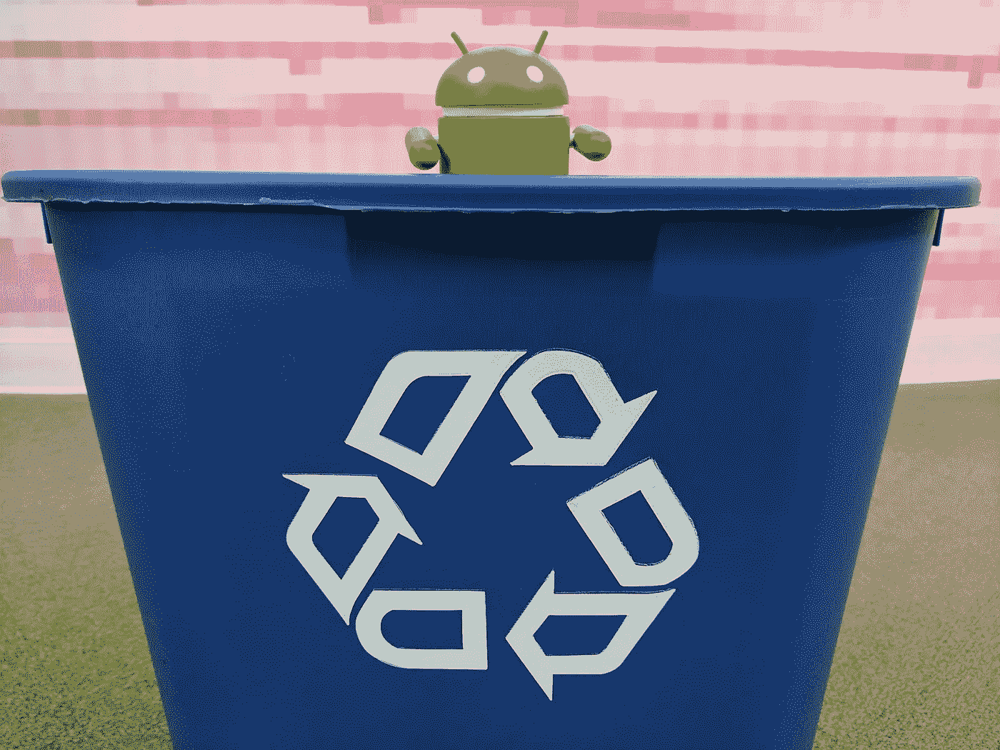

# Android 数据绑定:RecyclerView

> 原文：<https://medium.com/androiddevelopers/android-data-binding-recyclerview-db7c40d9f0e4?source=collection_archive---------0----------------------->



## 减少、重用、重新绑定

虽然有时我喜欢这么想，但作为一个术语，*数据绑定*并不总是指 Android 数据绑定。RecyclerView 有自己将数据绑定到 UI 的方式。RecyclerView 有一个[适配器](https://developer.android.com/reference/android/support/v7/widget/RecyclerView.Adapter.html)，它有两个非常重要的方法，我们实现这两个方法来绑定数据:

```
RecyclerView.ViewHolder onCreateViewHolder(ViewGroup parent,
                                           **int** viewType);

**void** onBindViewHolder(RecyclerView.ViewHolder holder, **int** position);
```

RecyclerView 在其 API 中将常见的[视图持有者模式](https://developer.android.com/training/improving-layouts/smooth-scrolling.html)作为一等公民公开。在 onCreateViewHolder()中，视图被创建，视图持有者包含对它们的引用，以便可以快速设置数据。然后在 onBindView()中，将特定的数据分配给视图。

## RecyclerView 中的 Android 数据绑定

[正如上一篇文章](/google-developers/android-data-binding-adding-some-variability-1fe001b3abcc#.1o06zcbx5)中所讨论的，Android 数据绑定可以像视图持有者模式一样对待。理想情况下，我们只需从 onCreateViewHolder()返回生成的绑定类，但它不扩展 recycle view . ViewHolder。因此，绑定类将必须由 view holder 包含在*中。*

```
**public class** MyViewHolder **extends** RecyclerView.ViewHolder {
    **private final** ItemBinding **binding**;

    **public** MyViewHolder(ItemBinding binding) {
        **super**(binding.getRoot());
        **this**.**binding** = binding;
    }

    **public void** bind(Item item) {
        **binding**.setItem(item);
        **binding**.executePendingBindings();
    }
}
```

现在，我的适配器可以使用 Android 数据绑定来创建和绑定:

```
**public** MyViewHolder onCreateViewHolder(ViewGroup parent,
                                       **int** viewType) {
    LayoutInflater layoutInflater =
        LayoutInflater.*from*(parent.getContext());
    ItemBinding itemBinding = 
        ItemBinding.*inflate*(layoutInflater, parent, **false**);
    **return new** MyViewHolder(itemBinding);
}

**public void** onBindViewHolder(MyViewHolder holder, **int** position) {
    Item item = getItemForPosition(position);
    holder.bind(item);
}
```

如果您仔细观察，您会在 MyViewHolder.bind()的末尾看到 executePendingBindings()。这将强制绑定立即运行，而不是延迟到下一帧。RecyclerView 将在 onBindViewHolder 之后立即测量视图。如果视图中有错误的数据，因为绑定一直等到下一帧，那么它将被不正确地测量。executePendingBindings()很重要！

## 重用视图保持器

如果您以前曾经使用过 RecyclerView 的 ViewHolder，您可以看到我们保存了一些样板代码，其中的数据被设置到视图中。不幸的是，我们仍然必须为不同的 RecyclerViews 编写一堆 ViewHolders。如果有多种视图类型，如何扩展也不清楚。我们可以解决这些问题。

通常只将一个数据对象传递给一个数据绑定类，就像上面的 *item* 一样。当您拥有这种模式时，可以使用命名约定为所有 RecyclerViews 和所有视图类型创建一个视图容器。我们将使用的约定是将单视图模型对象命名为“obj”您可能更喜欢“item”或“data”，但是如果我使用“obj”，在示例中会更容易识别。

```
**public class** MyViewHolder **extends** RecyclerView.ViewHolder {
    **private final** ViewDataBinding **binding**;

    **public** MyViewHolder(ViewDataBinding binding) {
        **super**(binding.getRoot());
        **this**.**binding** = binding;
    }

    **public void** bind(Object obj) {
        **binding**.setVariable(BR.***obj***, obj);
        **binding**.executePendingBindings();
    }
}
```

在 MyViewHolder 中，我使用的是 ViewDataBinding，它是所有生成的绑定的基类，而不是特定的 ItemBinding。这样，我就可以在我的视图容器中支持任何布局。我还使用 setVariable()而不是类型安全但特定于类的 setObj()方法，这样我就可以分配我需要的任何视图模型对象类型。重要的部分是变量必须命名为“obj ”,因为我在 setVariable()中使用 BR.obj 作为键。这意味着您的布局文件中必须有一个变量标记，如下所示:

```
<**variable name="obj" type="Item"**/>
```

当然，您的变量将具有数据绑定布局所需的任何类型，而不是“Item”

然后，我可以创建一个可用于我的所有 RecyclerView 适配器的基类。

```
**public abstract class** MyBaseAdapter
                **extends** RecyclerView.Adapter<MyViewHolder> {
    **public** MyViewHolder onCreateViewHolder(ViewGroup parent,
                                           **int** viewType) {
        LayoutInflater layoutInflater =
                LayoutInflater.*from*(parent.getContext());
        ViewDataBinding binding = DataBindingUtil.*inflate*(
                layoutInflater, viewType, parent, **false**);
        **return new** MyViewHolder(binding);
    }

    **public void** onBindViewHolder(MyViewHolder holder,
                                 **int** position) {
        Object obj = getObjForPosition(position);
        holder.bind(obj);
    } @Override
    **public int** getItemViewType(**int** position) {
        **return** getLayoutIdForPosition(position);
    }

    **protected abstract** Object getObjForPosition(**int** position);

    **protected abstract int** getLayoutIdForPosition(**int** position);
}
```

在这个适配器中，布局 ID 被用作视图类型，以便更容易展开正确的绑定。这使适配器可以处理任意数量的布局，但最常见的用法是使用单个布局的 RecyclerView，因此我们可以为此创建一个基类:

```
**public abstract class** SingleLayoutAdapter **extends** MyBaseAdapter {
    **private final int layoutId**;

    **public** SingleLayoutAdapter(**int** layoutId) {
        **this**.**layoutId** = layoutId;
    }

    @Override
    **protected int** getLayoutIdForPosition(**int** position) {
        **return layoutId**;
    }
}
```

## 还剩下什么？

来自 RecyclerView 的所有样板文件现在都已处理完毕，剩下要做的就是最难的部分:从 UI 线程中加载数据，当数据发生变化时通知适配器，等等。Android 数据绑定只是减少了枯燥的部分。

您还可以扩展这种技术来支持多个变量。通常提供一个事件处理程序对象来处理像点击事件这样的事情，您可能希望将其与视图模型类一起传递。如果您总是传入活动或片段，您可以添加这些变量。只要使用一致的命名，就可以对所有的 RecyclerViews 使用这种技术。

将 Android 数据绑定与 RecyclerViews 结合使用非常简单，并且显著减少了样板代码。也许你的应用程序只需要一个视图持有者，你就再也不需要编写 onCreateViewHolder()或 onBindViewHolder()了！