# Android 开发峰会回顾:Android Studio 3.6+或 4.0+有什么新功能？

> 原文：<https://medium.easyread.co/android-dev-summit-recap-whats-new-in-android-studio-3-6-or-4-0-b4aa96193f5d?source=collection_archive---------5----------------------->

这是 2019 年 10 月 24 日至 25 日在美国举行的 Android Dev 峰会的摘要。好的信息，我们也可以在下面的链接中观看直播。

 [## 安卓开发者峰会|安卓开发者

### AndroidDevSummit 终于来了！在此观看主题演讲、现场会议和独家直播内容…

developer.android.com](https://developer.android.com/dev-summit) 

在这个故事中，我将与您分享“Android Studio 中的新功能”这一环节的概要。仔细讨论...

# 构建速度细节

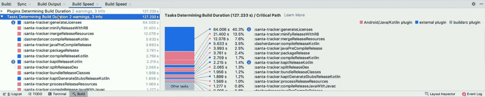

详细分解本地或插件的进程构建时间。

# 预览撰写

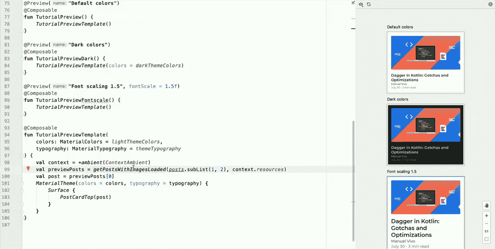

预览新的现代用户界面工具包，Jetpack 撰写。

# 改变观点

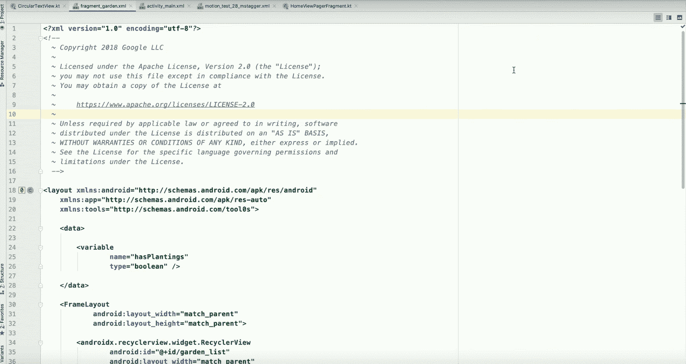

通过工具栏更快地在文本、写作和设计之间切换。

# 布局检查器

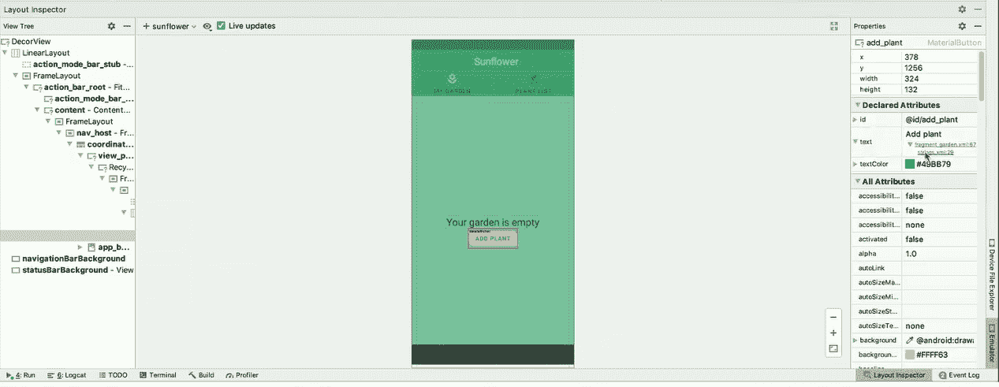

查看实时运行的布局细节，令人惊讶的是我们可以点击数据来源的细节

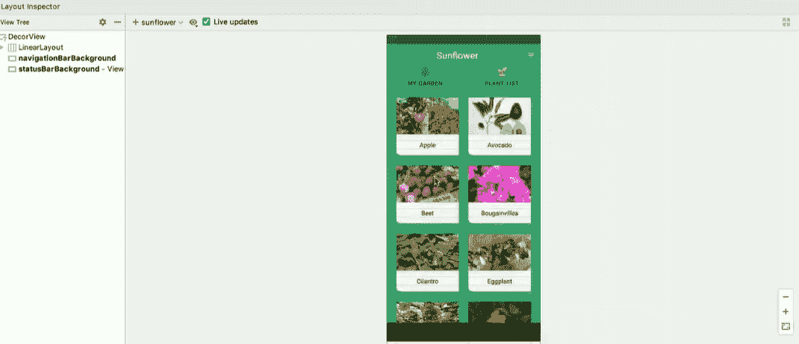

除此之外，我们还可以显示三维布局。哇！

# 运动编辑器

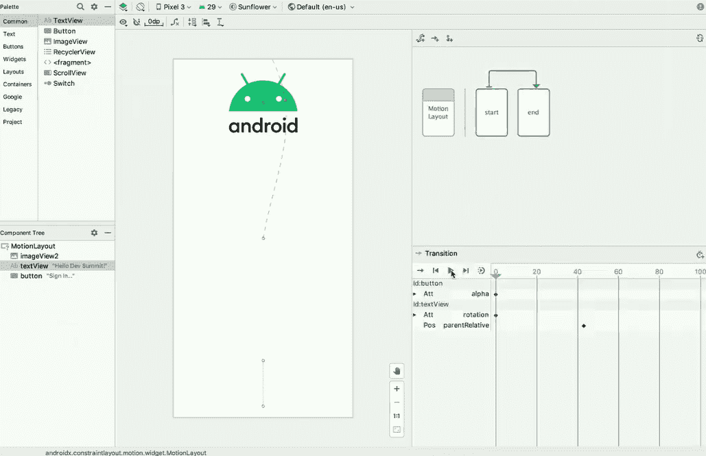

在 MotionLayout 中轻松创建动画/运动。您只需要定义起始页和结束页。

# 矢量资产风格

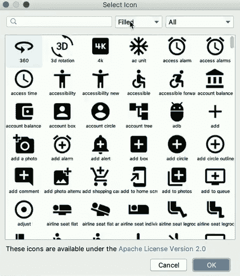

你可以选择填充、轮廓、圆形、尖形、双色。

# 带参数的日志

您可以使用 **logm** 创建关于带参数的方法的日志

# **多显示器模拟器**

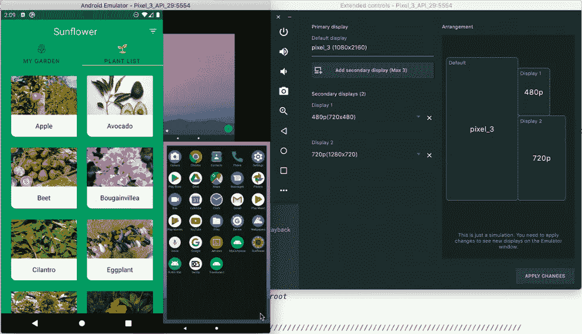

我们可以在一个地方拆分不同大小的仿真器

# 仿真器中的路由测试

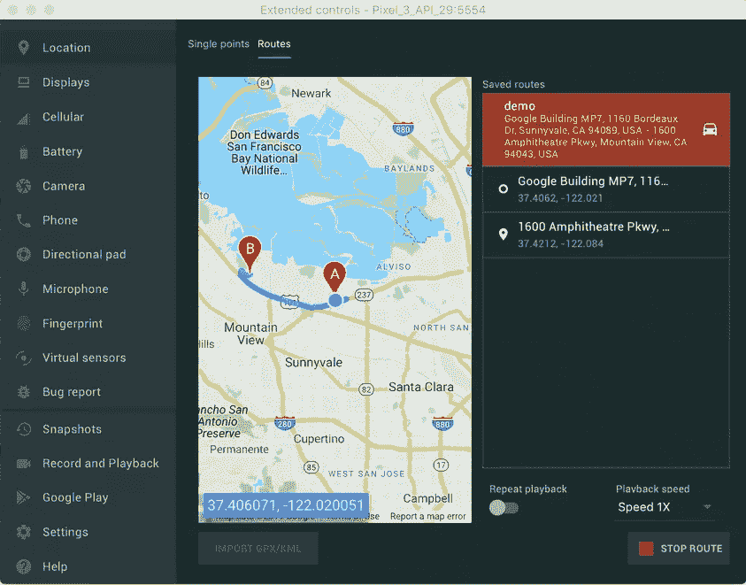

你可以像在谷歌地图中一样，测试路由的过程，从一个地方移动到另一个地方。

# 布局编辑器改进

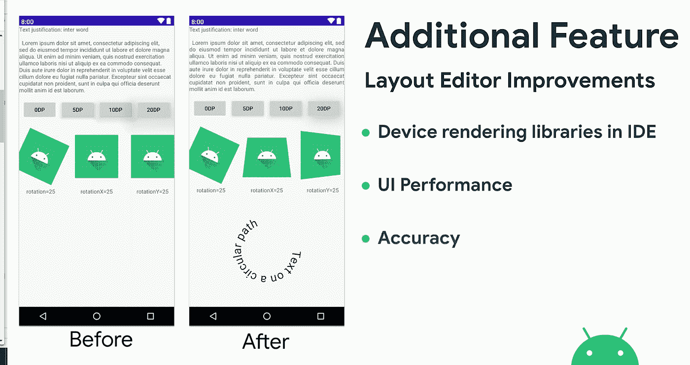

现在，IDE 可以直接在预览中渲染库

# 新建片段向导和片段模板

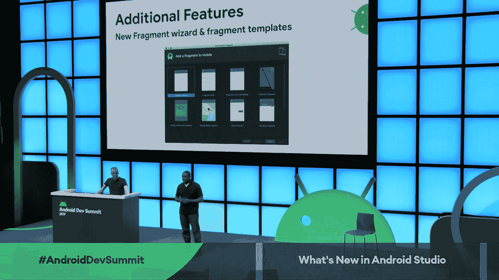

创建片段时的附加选择模板

# 仿真器中的双臂支持

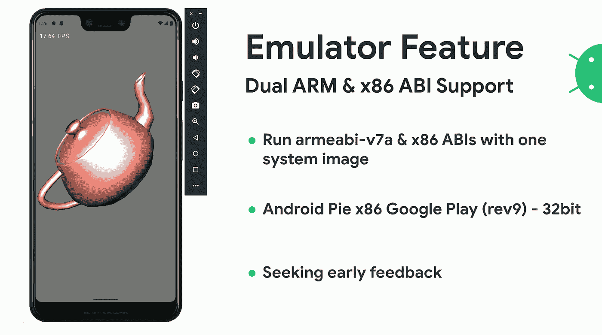

用一个系统映像运行 armeaby-v7a & x86 ABIs。

# Chrome 操作系统支持

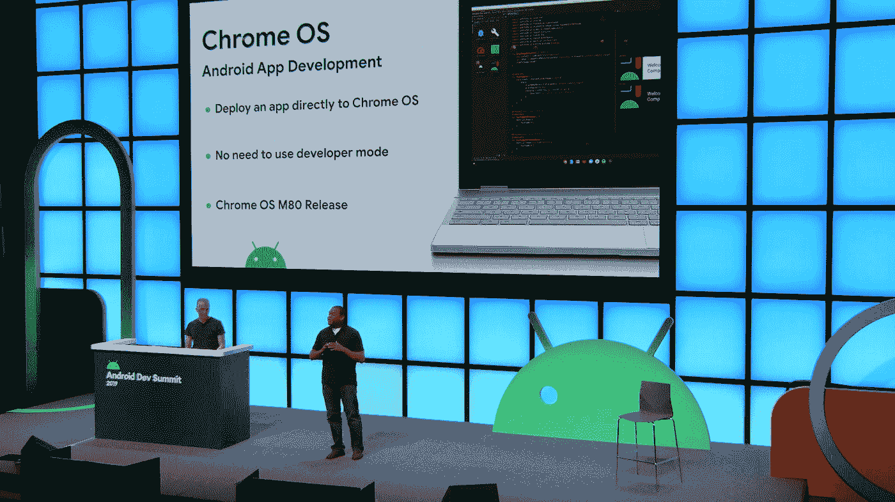

完全支持 Android Studio for Chrome OS

# 性能改进

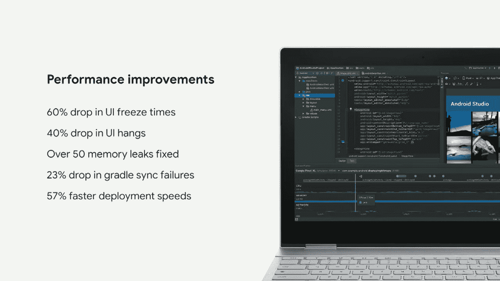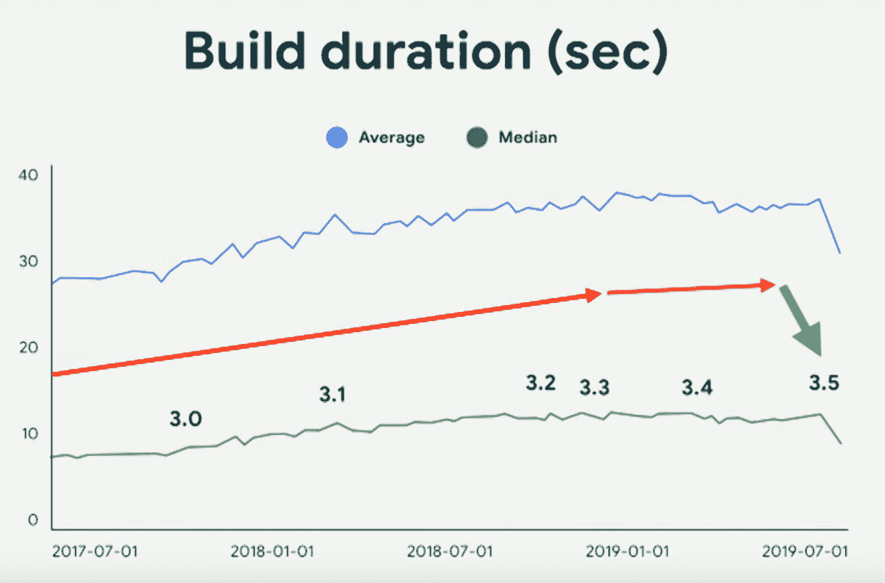

比以前更快的构建时间总是在增长。

TL；速度三角形定位法(dead reckoning)

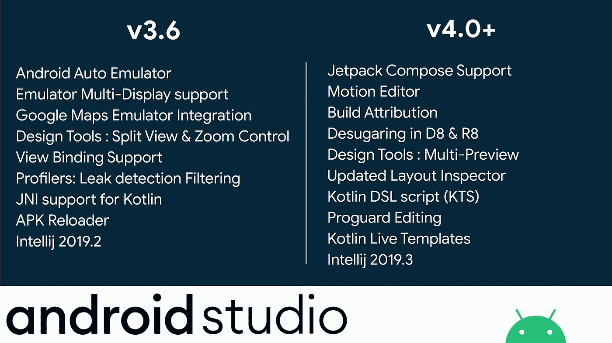

这是对 Android Studio 新功能的总结，我已经迫不及待地想在发布中看到它了。

如果你想尝试这个特性，你可以下载金丝雀版本来获得最新的工具

 [## Android Studio 预览| Android 开发者

### 提前获得 Android Studio 的最新功能和改进。

developer.android.com](https://developer.android.com/studio/preview/) 

如果你想看完整版，你可以看这个视频

谢谢，如果你觉得这个有用，就多鼓掌这个故事。我会幸福的:)

> "交换礼物，你们会彼此相爱。"
> 
> —先知穆罕默德