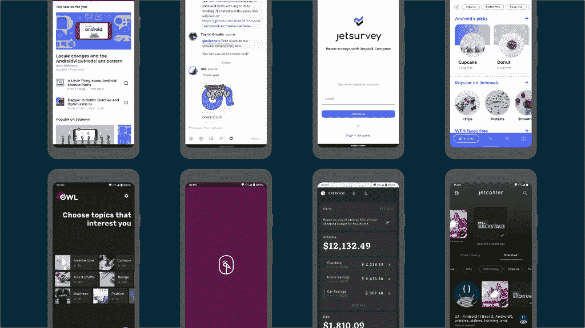
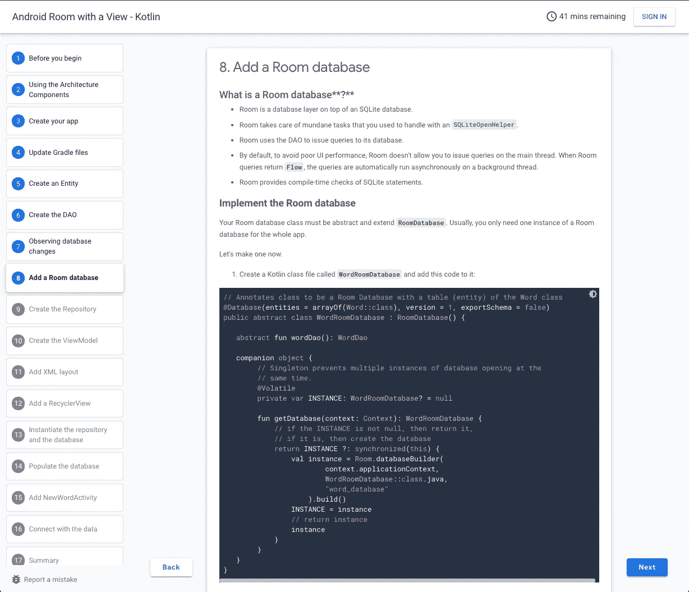
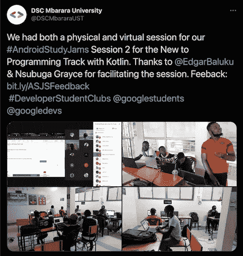
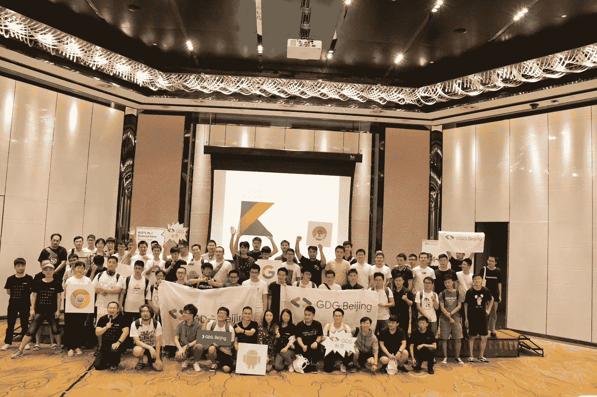
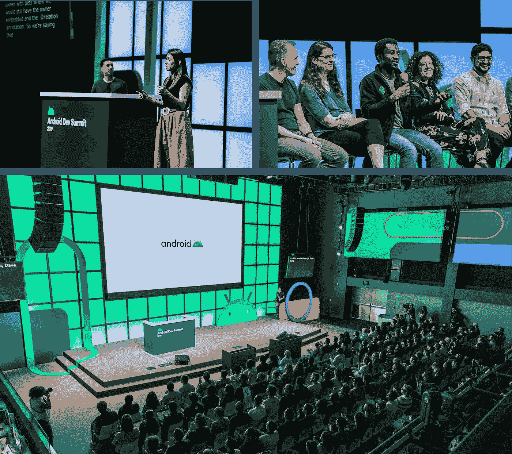

# 安卓开发者关系正在招聘

> 原文：<https://medium.com/androiddevelopers/android-developer-relations-is-hiring-28eaa41e902a?source=collection_archive---------3----------------------->

## **帮助我们培养下一代开发人员**

无论是在手机、汽车、电视还是手表上，应用程序都是让 Android 成为人们喜爱的平台的关键。根据 [Stack Overflow 的 2020 年开发者调查，作为一个受欢迎的移动平台，Android 正在蓬勃发展，全球有 1/4 的开发者为 Android 开发。](https://insights.stackoverflow.com/survey/2020#technology-platforms-all-respondents5)

在 Android Developer Relations(简称 Android DevRel)中，我们的使命是帮助人们构建具有最新 Android 和 Play 功能的优秀应用程序，让任何人都能够成为一名出色的 Android 开发者，并随着 Android 和 Play 的发展为开发者倡导*。这真的很值得，因为我们每天都可以看到应用的未来，并帮助我们的开发伙伴实现伟大的成就。面对如此大的任务，我们正在招聘工程师、技术作家和项目经理——如果这能让你有所启发，我们很乐意与你交谈！查看本博客末尾的链接，申请加入我们的团队。*

但是首先，Android DevRel 实际上是做什么的？我们的团队编写代码、创建内容、发展事业、发展社区、举办会议等等。请继续阅读，了解更多信息。

## **代码**

DevRel 的核心是帮助开发者，其中很大一部分是通过代码。事实上，代码是我们创造的几乎所有东西的基础——无论是教程、视频、博客，还是整个多单元教育课程。我们制作各种东西，从解释如何执行特定功能的简单代码片段，到示例应用程序[，如 Jet*](https://github.com/android/compose-samples) 或展示所有东西如何组合在一起的 [Google I/O 应用程序](https://github.com/google/iosched)。在创建示例代码的过程中，您可能是第一个使用新 API 构建东西的开发人员！我们称之为“零顾客”,这是一个重要的角色，你可以通过反馈直接影响产品的方向(是的，一些尝试和错误！)

Create code samples that inspire and help people to learn

## **内容**

在帮助开发者的过程中，我们最终产生了大量的内容——文档、教程、截屏、演讲、博客帖子、播客等等。将复杂的主题分解成学习路径是一种艺术——对初学者和高级开发人员都有帮助——这是我们每天都在做的事情。从引入新概念，到提炼最佳实践，再到全面记录新 API 的功能，我们的职责是帮助开发人员了解 Android 并在其上茁壮成长。虽然我们的输出是内容本身，但重要的是要注意工程是这个的核心。为了教会开发人员如何使用这些技术，我们首先必须自己深入理解它们。

Create teaching materials that help millions of developers

## **职业生涯**

应用程序将你与生活中的人联系起来，帮助你更容易地做事，甚至帮助你学习新技能。在过去的一年里，我们中的许多人不得不寻找新的做事方式，这使我们比以往任何时候都更频繁地接触应用程序，同时增加了对应用程序开发人员的需求。事实上，开发人员的就业增长速度是其他职业的 5.5 倍([美国劳工统计局](https://www.bls.gov/ooh/computer-and-information-technology/software-developers.htm#tab-6))。在 Android DevRel 中，我们很荣幸能够建立[课程](https://developer.android.com/courses/android-basics-kotlin/course)，并与世界各地的大学和学生团体合作，培养下一代开发人员的技能。

Create content & organize programs to help people learn Android development

## **社区**

我们中的许多人是 Android 开发者(和粉丝！)在我们加入 DevRel 之前，我们的角色最令人满意的一个方面是与世界各地的开发人员会面和联系。我们与谷歌的开发者生态系统团队合作，通过活动、社交媒体和 Slack 定期与[谷歌 Android 开发者专家](https://developers.google.com/community/experts)、谷歌开发者团体，当然还有个人社区成员进行互动。我们喜欢听人们在做什么，在力所能及的地方伸出援手，并在整个社区建立联系，以便人们可以相互学习。

Help developers learn from other developers in local communities around the world

## **会议**

社区聚集的地方之一是在会议上——Android 有很多这样的会议。虽然你可以学到一项技能或了解最新的软件设计模式(嘿 MVC，90 年代打电话来想要回它的模式)，但人们总是说他们从会议中获得的最有价值的东西是与其他开发人员联系。亲自与人见面(旁注:等不及我们能再次见面了！)是建立一个你可以依靠的人际网络的重要组成部分——无论你是陷入下一个项目，还是在寻求职业建议。虽然这些会议中有许多是由机构群体自己举办的，但我们在世界各地都参与了这些活动，并期待着与这些机构群体进行互动。我们还在 Google I/O 组织了 Android 开发者峰会和 Android track。

Be part of the team that organizes & talks at marquee Android events

## **来加入我们吧**

想加入 Android DevRel？看看下面的一些角色。谷歌经常使用单一列表来方便人们申请——所以如果在职位名称中没有写 Android DevRel，就在求职信中告诉他们你有兴趣加入我们的团队。

请继续阅读，了解目前可用的角色(截至 2021 年 8 月 26 日):

**DevRel 工程**

工程师在:

*   [华沙，PL](https://careers.google.com/jobs/results/122993425428423366/)
*   [班加罗尔，在](https://careers.google.com/jobs/results/137831804338873030/)
*   [新加坡](https://careers.google.com/jobs/results/75198031248401094/)
*   英国伦敦(链接待定)

工程经理:

*   [班加罗尔，在](https://careers.google.com/jobs/results/129536348408160966/)

**DevRel 项目经理**

*   [美国山景城](https://careers.google.com/jobs/results/76496270476092102/)

**科技写作**

*   加州山景城[或华盛顿州贝尔维尤](https://careers.google.com/jobs/results/132434177778688710-technical-writer-software-engineering)和英国伦敦[的作家](https://careers.google.com/jobs/results/95007730047034054/)
*   加利福尼亚州[山景城](https://careers.google.com/jobs/results/85555727776522950/)和英国[伦敦](https://careers.google.com/jobs/results/90897536539075270/)的经理