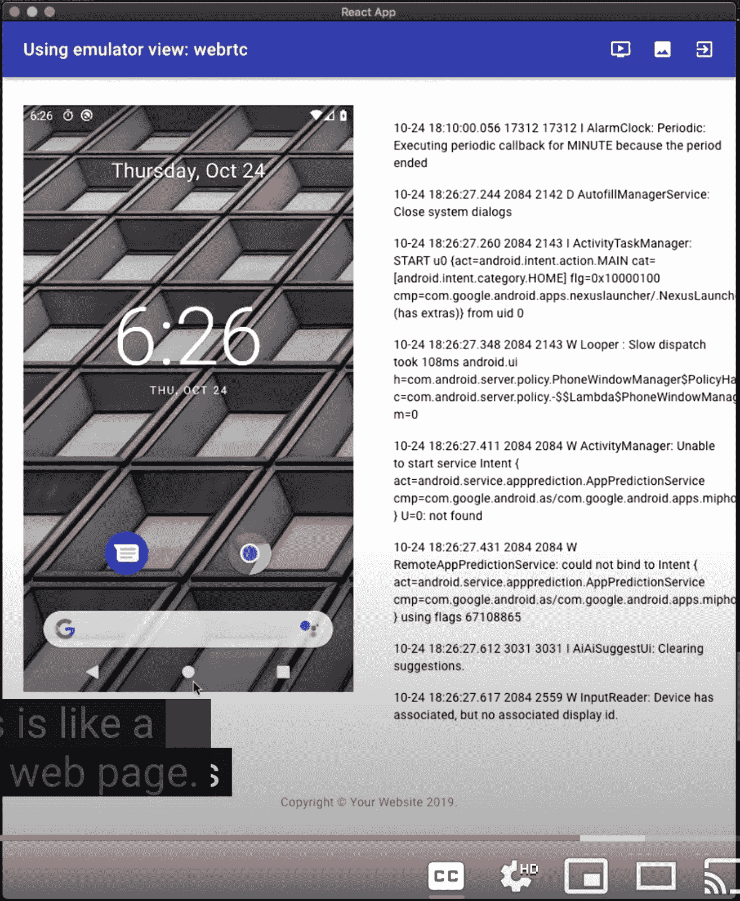

# CI 环境中的 Android 模拟器

> 原文：<https://medium.com/androiddevelopers/android-emulator-in-a-ci-environment-dd65f63cdcd?source=collection_archive---------0----------------------->

## 了解如何创建 Docker 映像并远程访问调试信息

能够在一个持续集成的环境中对你的 Android 应用程序进行测试，在确保你的产品质量方面向前迈进了一大步。然而，创建一个映像来为您的持续集成机器重新创建一个一致的环境可能是一个挑战。作为应对这一挑战的第一步，您可以使用预构建的容器或脚本来构建 Linux 的 Docker 映像。在这篇文章中，我将解释如何使用预构建的容器和脚本做什么。

# Android 模拟器 Docker 预构建

借助我们预先构建的 Android 模拟器容器，在持续集成(CI)或持续部署(CD)环境中设置和运行 Android 模拟器变得前所未有的简单。这些容器使您能够找到并运行模拟器的正确版本，而没有令人头痛的依赖管理。这些容器还使得将自动化测试作为 CI 或 CD 系统的一部分进行扩展变得容易，而没有物理设备场的成本。

之前，我们发布了 [Android 模拟器下载和 Docker 图像生成器脚本](https://android-developers.googleblog.com/2019/10/continuous-testing-with-new-android.html)来帮助开发人员简化部署和调试远程模拟器。这些脚本使得找到正确的系统映像、管理系统依赖性和运行 Android 模拟器变得更加容易。

我们现在更进一步，为每个主要的仿真器版本提供预构建的 Android 仿真器容器。这些容器消除了运行生成器脚本的需要，节省了时间和复杂性。预构建的容器支持那些用 Docker 脚本构建的容器所提供的所有特性，例如 [adb](https://github.com/google/android-emulator-container-scripts#communicating-with-the-emulator-in-the-container) 和 [web](https://github.com/google/android-emulator-container-scripts#make-the-emulator-accessible-on-the-web) 访问。

运行这些容器需要 Linux KVM，可以通过在裸机或具有嵌套虚拟化的虚拟机上运行来实现。正确的选择取决于您的云提供商，请参见[文档](https://github.com/google/android-emulator-container-scripts/blob/master/REGISTRY.MD#requirements-and-recommendations)获取建议。

以下脚本展示了如何将 Android 模拟器容器集成到您的系统中，并使用它来运行测试。

查看[自述文件](https://github.com/google/android-emulator-container-scripts)了解更多关于开始使用和利用 Android 模拟器容器的信息。这是我们首次提供预构建的仿真器容器，因此请在[问题跟踪器](https://github.com/google/android-emulator-container-scripts/issues)上报告任何问题或功能请求。

# 详细的容器脚本

Github repo[Google](https://github.com/google)/[android-emulator-container-scripts](https://github.com/google/android-emulator-container-scripts)包含了我们针对 Docker 上的 Android 模拟器的解决方案背后的内部工作原理。这些脚本目前只适用于 Linux，并且需要访问 KVM 管理程序。这是一组使用 emu-docker 命令的最小脚本，包括以下功能:

*   `[emu-docker list](/androiddevelopers/android-emulator-in-a-ci-environment-dd65f63cdcd)`:查询已发布的 Docker 兼容系统镜像和仿真器引擎二进制文件，显示其下载 URL。这在 stable 和 Canary 通道中提供了所有已发布系统映像和模拟器的动态生成列表。该列表使用描述 SDK 管理器中仿真器和系统映像版本的相同数据，因此它总是最新的。
*   `[emu-docker create <emulator-zip> <systemimage-zip> [ — dest docker-src-dir(getcwd()/src by default)](/androiddevelopers/android-emulator-in-a-ci-environment-dd65f63cdcd)`:为指定的系统映像和仿真器创建一个自定义的本地 Docker 映像。
*   `[docker run -e ADBKEY=”$(cat ~/.android/adbkey)” — device /dev/kvm — publish 8554:8554/tcp — publish 5555:5555/tcp <docker-image-id>](/androiddevelopers/android-emulator-in-a-ci-environment-dd65f63cdcd)`:使用端口 8554 进行 gRPC 通信，使用端口 5555 进行 ADB 通信(`[adb connect localhost:5555](/androiddevelopers/android-emulator-in-a-ci-environment-dd65f63cdcd)`将启用 ADB 访问)，启动与`[<docker-image-id>](/androiddevelopers/android-emulator-in-a-ci-environment-dd65f63cdcd)`相关的仿真器和系统映像。
*   `[emu-docker interactive — start](/androiddevelopers/android-emulator-in-a-ci-environment-dd65f63cdcd)`:一个交互式提示，逐步完成 Docker 图像的列表、下载、创建和启动步骤。

# 与 Docker 实例交互

创建并启动 Docker 实例后，有两种方式与它交互:使用 ADB 或通过 WebRTC 进行远程流传输。这些方法描述如下

# 亚洲开发银行(Asian Development Bank)

使用 [ADB](https://developer.android.com/studio/command-line/adb) 提供了 logcat 和 shell 访问以及全部 ADB 命令，只需要 adb connect `[localhost:5555](/androiddevelopers/android-emulator-in-a-ci-environment-dd65f63cdcd)`(如果不同，用所需的 ADB 端口替换 5555)。

# 通过 WebRTC 进行远程流传输

我们提供了一个设置，其中 [Envoy](https://www.envoyproxy.io/) 、 [Nginx](https://www.nginx.com/) 、[令牌服务](https://github.com/google/android-emulator-container-scripts/blob/master/js/jwt-provider/README.md)，以及仿真器容器与 docker-compose 一起工作，以公开一个 WebRTC/gRPC 端点来与仿真器交互。在使用前面的步骤创建了一个模拟器容器之后，脚本包含了`[create_web_container.sh](/androiddevelopers/android-emulator-in-a-ci-environment-dd65f63cdcd)`，在本地情况下，它捕获了创建容器和生成用于发送加密流量的密钥的过程。创建 web 容器后，`[docker-compose -f js/docker/docker-compose.yaml](/androiddevelopers/android-emulator-in-a-ci-environment-dd65f63cdcd)` up 或`[docker-compose -f js/docker/docker-compose.yaml -f js/docker/development.yaml](/androiddevelopers/android-emulator-in-a-ci-environment-dd65f63cdcd)` up(用于亚行同时访问)可用于启动和协调一切。默认情况下，它们在本地机器的端口 80 上公开交互式仿真器，因此将浏览器指向 localhost 应该能够与仿真器交互:

这些脚本仍在开发中，我们希望使用 [Github 问题跟踪器](https://github.com/google/android-emulator-container-scripts/issues)得到反馈。你也可能对用新的 Android 模拟器工具进行的[持续测试感兴趣，它提供了更多的背景知识。](https://android-developers.googleblog.com/2019/10/continuous-testing-with-new-android.html)