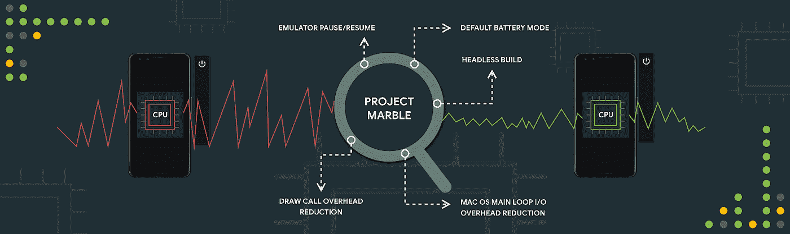
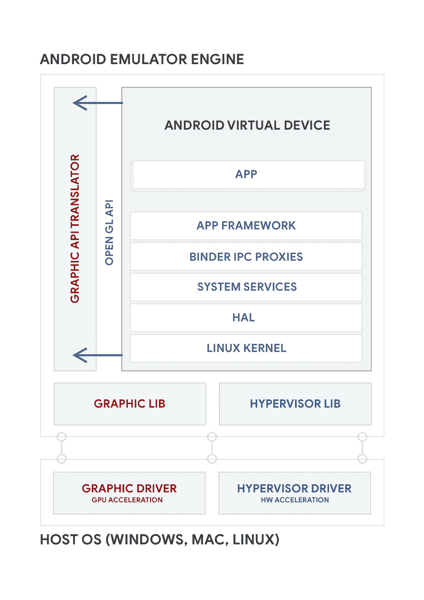
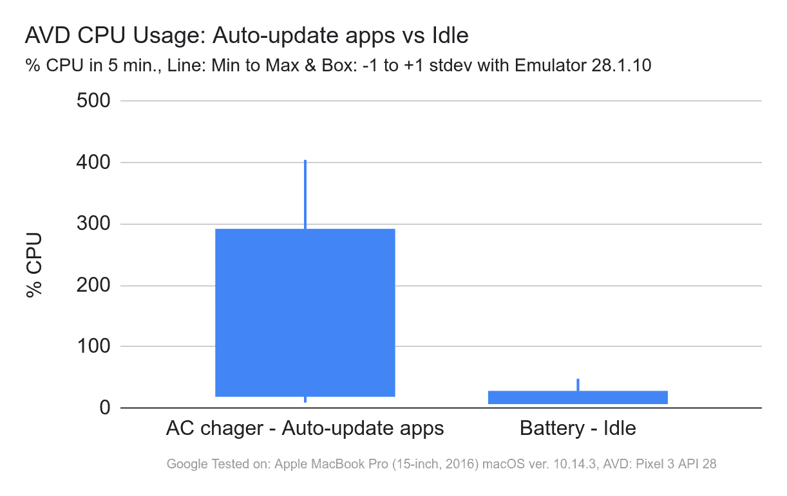
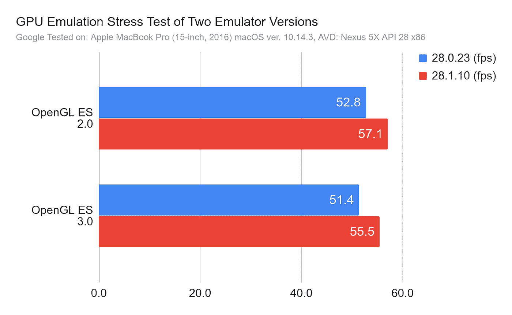
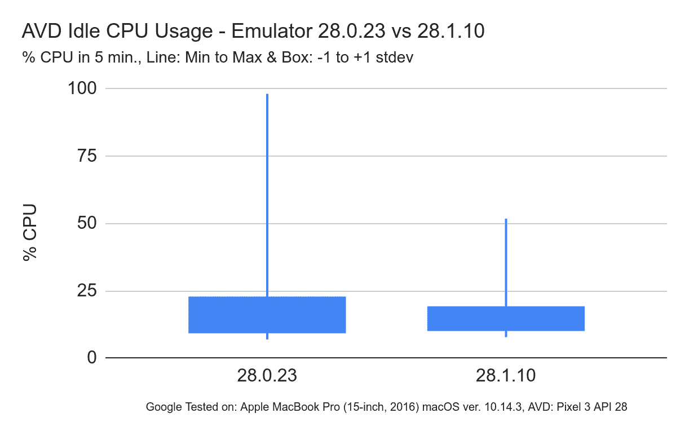
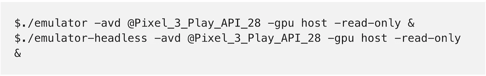
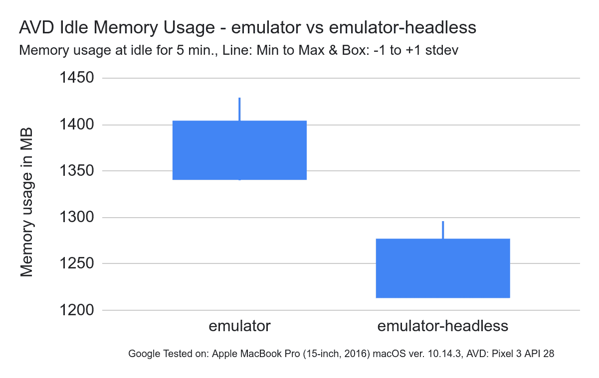

# Android 模拟器:项目大理石改进

> 原文：<https://medium.com/androiddevelopers/android-emulator-project-marble-improvements-1175a934941e?source=collection_archive---------3----------------------->

*发帖人:安卓产品经理林子闳*

这是 Android 工作室团队深入探讨[项目大理石](https://android-developers.googleblog.com/2019/01/android-studio-33.html)的一些细节和幕后的一系列博客文章中的第三篇。以下帖子由仿真器团队的林子闳(产品经理)、杨凌峰(技术主管)和胡波(技术主管)撰写。

今天，我们很高兴地向您介绍我们在大理石项目期间在 Android 模拟器中取得的进展。我们的核心目标之一是让 Android 模拟器成为应用程序开发的首选设备。物理 Android 设备很棒，但我们的目标是增加功能和性能，使您在开发和测试 Android 应用程序时更加高效。

我们听说许多应用开发者喜欢我们最近对模拟器所做的改进，从 2 秒启动时间、GPU 图形加速到[快照](https://developer.android.com/studio/run/emulator#snapshots)。但是，我们也听说 Android 模拟器消耗了您的开发计算机上太多的系统资源。为了解决这个问题，我们在 Project Marble 中努力优化 Android 模拟器的 CPU 使用。在不偏离最初设计原则的情况下，我们在过去几个月的 Marble 项目中对 Android 模拟器的能效和绘制速率进行了重大改进。在本帖中，我们将介绍我们在金丝雀频道[上发布的 Android Emulator 28.1 的进展。](https://developer.android.com/studio/preview/install-preview#change_your_update_channel)

# 保留设计原则，同时减少开销

Android Emulator 的主要好处是为开发人员提供了一种可扩展的方法，可以在各种设备配置和屏幕分辨率上测试最新的 Android APIs，而无需为每种配置购买物理设备。因此，在 Android Emulator 上测试应用应该尽可能接近在物理设备上测试，同时保持虚拟设备的优势。

为了支持最新的系统映像，我们有意将 Android 模拟器设计得尽可能接近物理设备，作为一个模拟器而不是仿真器。这种方法确保了 API 的正确性和 Android 系统行为和交互的高保真度。当一个新的 Android 版本出来时，我们只需要确保我们的硬件抽象层(HALs)和内核与仿真器和新的系统映像兼容，而不必自己从头开始重新实现新 Android 版本的 Android API 的所有更改。这种架构的最终结果是，它大大加快了模拟器采用新系统映像的速度。

然而，这种全系统仿真方法会增加 CPU 周期和内存访问的开销。相比之下，基于模拟器的方法会以可能更少的开销在主机系统上包装类似的 API。因此，我们面临的挑战是保持全系统仿真的准确性和维护优势，同时减少 CPU 和内存开销。

# Android 仿真器架构的研究

Android 模拟器在称为 Android 虚拟设备(AVD)的虚拟机中运行 Android 操作系统。AVD 包含完整的 [Android 软件栈](https://source.android.com/devices/architecture)，它就像在物理设备上一样运行。高层架构图如下。

*Android Emulator System Architecture*

由于整个 Android 操作系统独立于主机操作系统运行，即使没有任何用户输入，运行 Android 模拟器也会导致主机上的后台活动。在做了一些技术调查后，当 AVD 空闲时，以下任务是 CPU 周期的主要消耗者:

*   谷歌 Play 商店——当有新版本时，应用程序会自动更新。
*   后台服务——一些按需服务在假设设备正在充电时保持高 CPU 使用率。
*   动画——比如[的动态壁纸](https://android-developers.googleblog.com/2010/02/live-wallpapers.html)。

对于这些领域，我们进行了一系列深入的技术调查，并选择了以下五大解决方案来优化 Android 模拟器。

1.  默认电池模式
2.  仿真器暂停/恢复
3.  减少呼叫开销
4.  macOS 主循环 IO 开销减少
5.  无头构建

## **改进 1 —默认电池模式**

之前，Android 模拟器将 AVD 的电池充电模式设置为使用[交流电源](https://developer.android.com/reference/android/os/BatteryManager.html#BATTERY_STATUS_CHARGING)。经过深思熟虑的讨论和数据分析，我们得出的结论是，最好在默认情况下将 AVD 设置为电池模式。这是因为大多数 Android 框架、服务和应用程序都经过了优化，以节省电池寿命，这些优化只有在设备(无论是物理设备还是虚拟设备)认为它正在使用电池而不是用交流电源充电时才会生效。

然而，仅仅默认 AVD 使用电池是不够的。这是因为处于电池模式也会导致屏幕在一段时间后自动关闭。这可能会让在笔记本电脑或台式机上使用模拟器的用户感到困惑，他们希望应用程序不会随机进入睡眠状态，需要被唤醒。为了避免这种情况，Android Emulator 将在每次冷启动完成时使用 [ADB shell 命令](https://developer.android.com/reference/android/provider/Settings.System#SCREEN_OFF_TIMEOUT)将屏幕关闭超时设置为最大值(~24 天)。

随着这些变化，谷歌 Play 商店将不会在电池模式下自动更新应用程序，并避免系统过载。然而，[切换回交流充电模式仍然可以触发应用](https://support.google.com/googleplay/answer/113412?hl=en)的自动更新。这实际上让开发者可以控制何时自动更新应用。这可以防止关键用例中的干扰，例如当用户只想构建和测试单个应用程序时。下图比较了电池和交流电源的 CPU 使用情况:

*AVD CPU Usage: Auto-update app vs Idle*

## **改进#2 —仿真器暂停/恢复**

在许多情况下，您可能希望立即保证模拟器在关键任务(如编辑/构建/部署循环的编辑和构建步骤)期间不会在后台消耗 CPU 周期。为了解决这个问题，我们正在开发一个控制台命令和界面来完全暂停模拟器的 CPU 使用。这可以通过遵循控制台命令显式暂停/恢复 AVD 来实现。

*Android Emulator: Pause command line options*

这里的挑战是如何用 Android Studio 协调这个 Android 模拟器的状态变化。因此，当应用部署发生时，我们自动恢复模拟器。我们仍在研究这一机制，很高兴听到您的[想法和反馈](https://source.android.com/setup/contribute/report-bugs#developer-tools)。

## 改进# 3——减少绘图调用开销

我们还对 Android 模拟器引擎进行了更改，使其在绘图方面更高效，从而在测试屏幕上有许多对象的图形密集型应用程序时，带来更流畅的用户体验。例如，与 v28.0.23 相比，Emulator v28.1.10 在 [GPU emulation 压力测试应用](https://github.com/google/gpu-emulation-stress-test)上的绘图速度提高了 8%。我们还在 Android Q 中进行进一步优化，并将在 [Android Q 预览版](https://developer.android.com/preview)期间分享额外的更新。

*Emulator OpenGL ES FPS: 28.0.23 vs 28.1.10*

## 改进 4 — macOS 主循环 IO 开销减少

一个完整的系统仿真器必须维护某种方法来通知虚拟 OS 磁盘和网络上的 I/O 操作已经完成。Android 模拟器基于 [QEMU](https://www.qemu.org/) ，使用一个主循环和 iothreads 来完成这个。它在 Linux 和 Windows 上的开销很低。然而，在 macOS 上，由于使用了 select()系统调用，我们看到主循环的 CPU 使用率更高。这一点往往没有得到有效实施。macOS 确实提供了一种低开销的方法来等待 I/O: [kqueue](https://developer.apple.com/library/archive/documentation/System/Conceptual/ManPages_iPhoneOS/man2/kqueue.2.html) 。我们发现，当前基于 select()的主 I/O 循环可以用基于 [kqueue](https://developer.apple.com/library/archive/documentation/System/Conceptual/ManPages_iPhoneOS/man2/kqueue.2.html) 的主 I/O 循环替换。这大大降低了主循环的 CPU 使用率，从大约 10%降低到大约 3%。由于这并没有说明所有空闲 CPU 的使用情况，所以图表(如下)没有显示太多变化。尽管如此，差异仍然是明显的。

AVD Idle CPU Usage — Emulator 28.0.23 vs 28.1.10

## 改进 5——无头构建

对于那些使用持续集成系统来构建 Android 应用的人，我们也在这方面进行了性能改进。通过关闭 Android 模拟器中的用户界面，您可以使用 access 一种新的无模拟器模式。这种新模式在后台运行测试，使用更少的内存。这也减少了大约 100MB，主要是因为我们用于用户界面的 [Qt](https://www.qt.io/) 库没有被加载。当不需要 UI 和用户交互时，这也是运行自动化测试的好选择。增量可以通过启动 2 个仿真器 AVD 实例来测量，如下所示。请注意，命令行示例明确指定了主机 GPU 模式，以确保在相同的条件下进行比较。

*Android Emulator: Headless emulator command line option*

*AVD Idle Memory Usage — emulator vs emulator-headless*

## 后续步骤

要使用这篇博客中提到的性能和资源优化，请下载 Android Emulator 28.1，今天可以在金丝雀频道下载。我们很高兴与你们分享这个早期的进展，但我们肯定还没有完成。我们邀请您今天尝试 Android 模拟器的最新更新，并将您的[反馈](https://developer.android.com/studio/report-bugs.html#emulator-bugs)发送给我们。