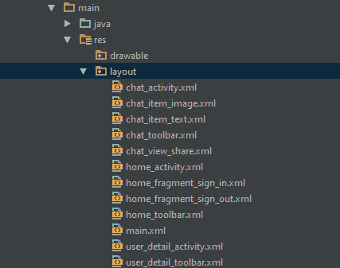
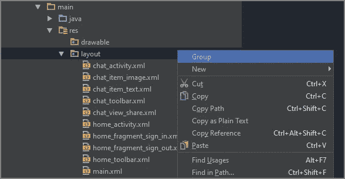
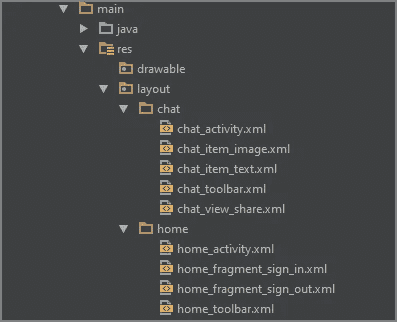
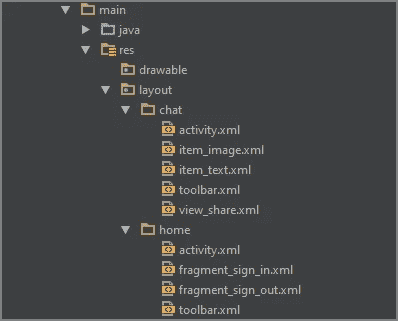
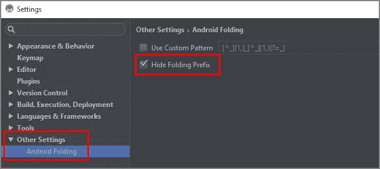
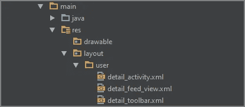
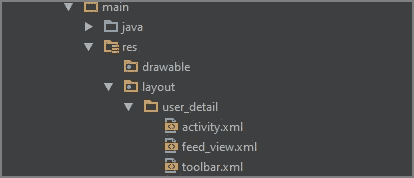
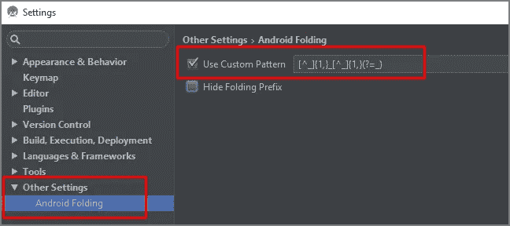

# Android 文件分组插件 v1.1

> 原文：<https://medium.com/google-developer-experts/android-file-grouping-plugin-v1-1-170361ce921d?source=collection_archive---------3----------------------->

这个插件可以在项目结构视图中将你的文件显示为一组不同的文件夹。它有助于组织布局和其他资源。

File grouping

**注:**

*   它**不**移动文件。
*   它**不**创建文件夹。

# 装置

1.  下载最新的 *Android 文件 Grouping.zip* 文件[这里](https://github.com/dmytrodanylyk/folding-plugin/releases)
2.  打开*安卓工作室*
3.  在工具栏菜单中选择*文件* | *设置* | *插件*
4.  点击*从磁盘安装*并选择*Android File grouping . zip*
5.  重启*安卓工作室*

# 使用

1.  瑞克点击*布局*文件夹(或任何其他)
2.  在上下文菜单中点击*组* / *解组*

# 限制

*Android 项目视图*定义了自己的结构，不允许通过任何扩展修改结构。确保您在*项目结构视图*和**中，而不是在 Android 项目视图**中。

# 有什么新鲜事？

感谢[*Serhiy Kyrylyuk*](https://github.com/skyrylyuk)Android 文件分组插件现在更新到 1.1 版，增加了两个新功能。

## 隐藏折叠前缀

Without hiding folding prefix

With hiding folding prefix

此功能使您能够显示不带前缀的文件名。

这样的话

*   在工具栏菜单中选择*文件* | *设置*
*   选择*其他设置*
*   勾选*隐藏折叠前缀*
*   折叠和展开文件夹以刷新项目视图

Settings

## 自定义前缀模式

Without custom prefix pattern

With custom prefix pattern

此功能使您能够设置过滤时下划线的位置。

这样的话

*   在工具栏菜单中选择*文件* | *设置*
*   选择*其他设置*
*   勾选*使用自定义模式*并定义模式*
*   折叠和展开文件夹以刷新项目视图
*   **注意:**默认模式将采用文件名的前两个下划线来创建文件夹。

Settings