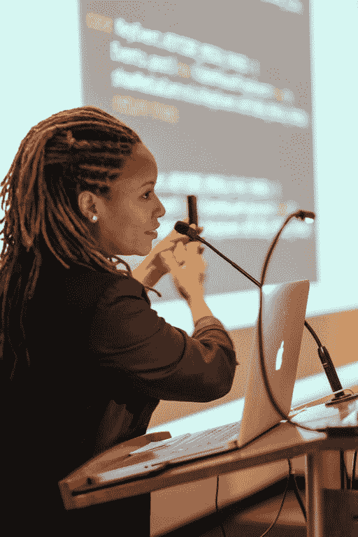

# 安卓 GDE·安妮丝·戴维斯鼓励其他女性开发者保持好奇和自信

> 原文：<https://medium.com/google-developer-experts/android-gde-annyce-davis-encourages-other-women-developers-to-be-inquisitive-and-confident-bcc0c8fb3bb1?source=collection_archive---------8----------------------->

在女性历史月，我们庆祝几位谷歌开发专家。在 Meetup 上认识一下安卓 GDE 和工程副总裁 Annyce Davis。

*作者凯蒂·金德·沃格尔*

*凯文·埃尔南德斯审核*

当安妮丝·戴维斯(Annyce Davis)第一次开始学习 Android 开发时，她被为她随身携带的设备创建应用程序的能力迷住了。“这个生态系统很年轻，充满了机遇和挑战，”她说。“我终于可以向我的朋友和家人展示我每天都在做什么了！”

她说，Android 开发者支持多种外形和设备的事实使得 Android 开发变得有趣和具有挑战性。“在一种类型的 Android 设备上工作的东西不一定在另一种设备上工作，”她说。"能够有耐心解决细微差别使它成为一个具有挑战性的职业."

在她的职业生涯中，Annyce 有机会开发跨多种外形和各种环境的 Android 应用程序。她为 Android 电视和平板电脑设计了专注于视频流的应用程序。在她职业生涯的另一个阶段，她为互联网连接受限的低端设备设计。“在每种情况下，我都能够使用 Android 平台的特定方面来完成工作，”她说。“我很高兴能开发出全球数百万人使用的应用程序。我也很高兴成为 Android 生态系统不断发展的一部分。”

她已经通过博客帖子、Meetup 活动和会议讨论，向成千上万的人讲授了 Android 开发。Annyce 目前在 Meetup 担任工程副总裁，她表示 Android 为组织提供了灵活性、大量资源和社区支持。“随着 Android 的发展，学习和开发变得越来越容易，”她说。“此外，社区支持也是无与伦比的。你有很多资源可以在需要的时候获得帮助。”

当安妮丝回顾自己的职业生涯时，她说她希望自己当时能更勇敢地提出问题。她建议其他女性开发人员在寻求帮助或信息时要自信，不要害怕犯错。“当我愿意把自己放在那里，只是问的时候，我经历了职业生涯中最大的成长，”她说。“脆弱和向他人伸出援手帮助我加速了成长。扩大你的人脉，不要害怕寻求帮助。”

*在* [*在 Twitter 上关注 Annyce】@ brwngrldev*](https://twitter.com/brwngrldev)*|在*[*LinkedIn*](https://www.linkedin.com/in/annycedavis)*上了解更多关于 anny ce 的信息。*

[*谷歌开发者专家计划*](https://developers.google.com/community/experts) *是一个由经验丰富的技术专家、影响者和思想领袖组成的全球网络，他们通过在活动中发言和发布内容来积极支持开发者、公司和技术社区。*