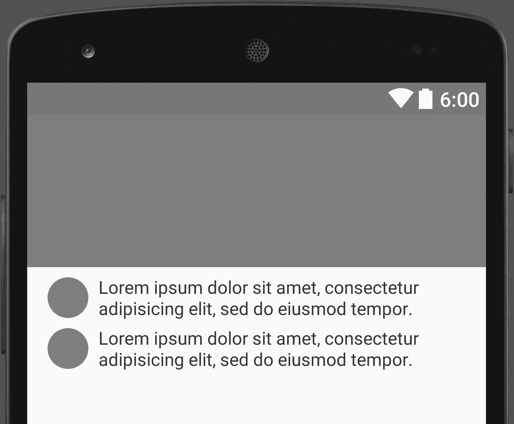
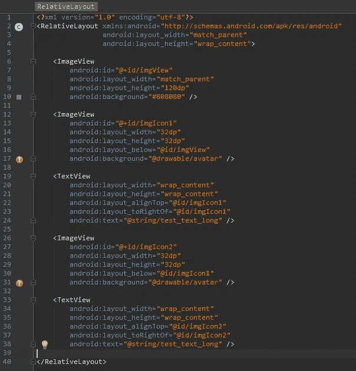
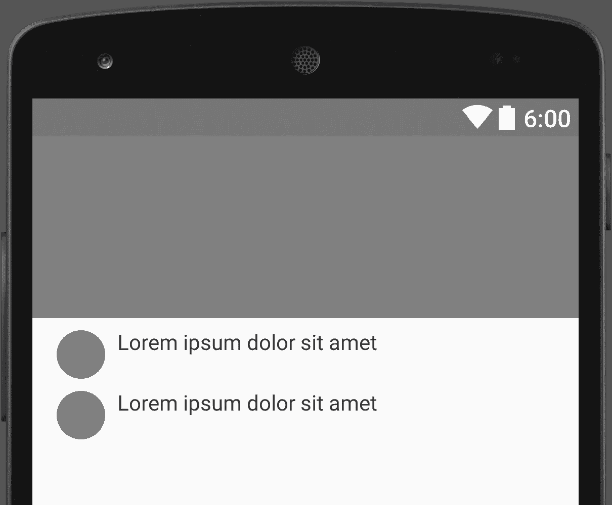
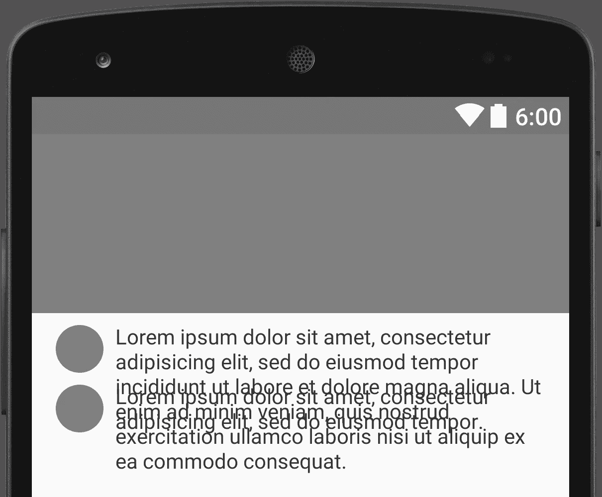
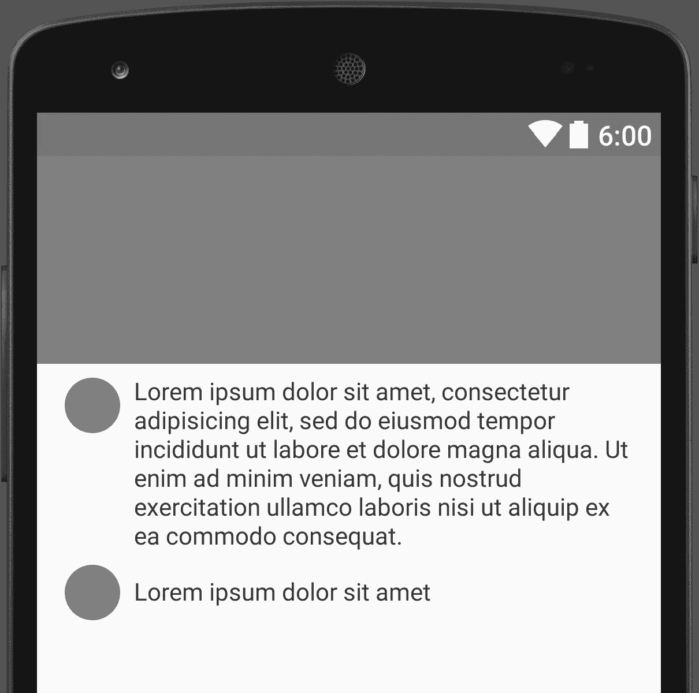
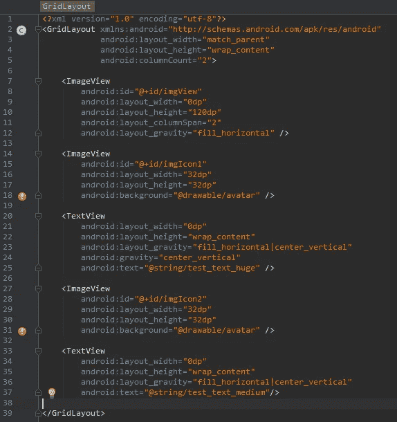

# Android 网格布局

> 原文：<https://medium.com/google-developer-experts/android-grid-layout-1faf0df8d6f2?source=collection_archive---------0----------------------->

> android 开发人员每天都会问自己一个问题——使用哪种布局？

距离 *GridLayout* 发布— [新布局小部件:空间和 GridLayout](http://android-developers.blogspot.com/2011/11/new-layout-widgets-space-and-gridlayout.html) *已经有一段时间了。*

android 开发世界关于 *GridLayout* 的现状如下:

*   大多数 android 开发者甚至不知道这样的布局存在。
*   一些 android 开发者知道 GridLayout，但出于某种原因，他们不使用这种布局。
*   只有少数 android 开发者花时间玩 GridLayout 并积极使用它。

我写这篇文章的原因，是因为我认为这个布局被不公平地遗忘了。

# 为什么我们需要网格布局？

*GridLayout* 让你可以用一个根视图创建基于网格的布局。

> 我可以使用嵌套的 LinearLayout 来创建网格！

是的，但是在太深的层次结构中会有性能问题。

> 我可以使用 RelativeLayout 来创建网格！

是的，但是 *RelativeLayout* 有一些限制，例如:

*   无法同时控制沿两个轴的对齐。
*   当小工具占用的空间比你预期的多时，它们会离开屏幕/重叠，因为你不能使用 *weigh* 等。

换句话说，*relative layout*——不够灵活，不够灵敏。

# 样品

让我们实现一个简单的布局，它由一个大图像、两个小图标和这些图标旁边的文本组成。

Preview

***相对布局***

通过 *RelativeLayout* 很容易实现这种布局。这里的关键属性是 *layout_below、* *layout_toRightOf* 和 *layout_alignTop* 。

Code

乍一看，一切似乎都很完美，直到你开始用不同的文本大小测试你的布局。

**问题 1** 无法同时控制沿两个轴的对齐。

单行文本应该与图标垂直居中，不幸的是 *RelativeLayout* 不提供这种可能性。

Preview

**问题 2** 小部件重叠

多行文本导致重叠，因为文本通过 *layout_alignTop* 属性与图标对齐。

Preview

***GridLayout***

正如你在下图中看到的 *GridLayout* 产生了更好的结果:

*   文本与图标垂直对齐。
*   多行文本向下推送小部件。

Preview

那么如何取得这样的成绩呢？首先将 *GridLayout* 定义为根布局。接下来计算你有多少列，并定义 *android:columnCount* 属性，在这个例子中我们有 2 列。

当您在 *GridLayout* 中定义视图时，它们被一个接一个地放置，因此没有必要显式地定义视图的行和列。

如果你想拉伸 2 行或更多行/列的视图，你可以使用*layout _ column span/layout _ rowSpan*属性。

最重要的是要记住——如果你想让你的视图使用所有可用的空间，**不要将你的视图的**宽度设置为 *match_parent，*将其设置为 *0dp* 以及 *layout_gravity="fill"* 属性。

Code

# 结论

GridLayout 在合适的人手里会是一个强大的工具。它提供了极大的灵活性和性能。另一方面，它需要一些时间来了解它是如何工作的，你通常需要更多的时间来开发和维护这样的布局。

优点:

*   灵活性
*   单根布局

缺点:

*   学习曲线
*   维护