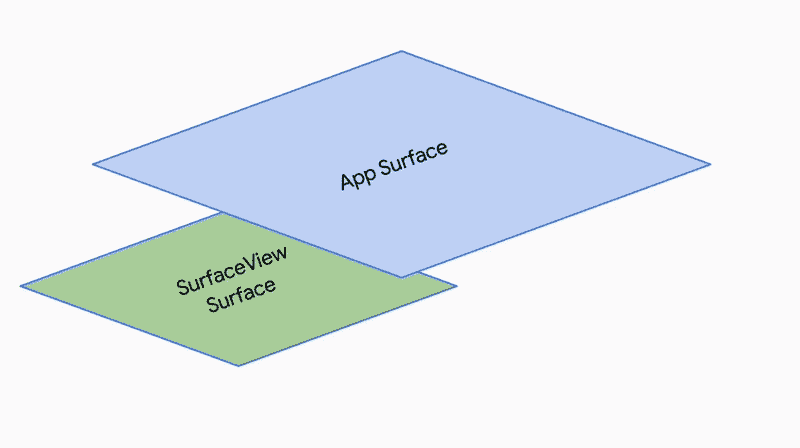

# Android HDR |从 TextureView 迁移到 SurfaceView(第一部分)——如何迁移

> 原文：<https://medium.com/androiddevelopers/android-hdr-migrating-from-textureview-to-surfaceview-part-1-how-to-migrate-6bfd7f4b970e?source=collection_archive---------2----------------------->


关于如何从 TextureView 迁移到更受欢迎的 SurfaceView 以在支持的设备上播放 HDR 的技术指南的第 1 部分。

# 介绍

用户每天都在创建和消费更多的内容，尤其是视频内容。无论是社交媒体、视频通话，还是点播观看您最喜爱的电影，我们都知道用户希望获得最高质量的内容。

这就是为什么在 Android 上，我们致力于支持应用程序开发人员采用 10 位 HDR(高动态范围)。

最近在 Android 开发者峰会上，我们谈到了使用 Android Camera 提高您的社交体验质量。在这次演讲中，我们描述了如何让 HDR 视频捕捉在 Android 13 中工作，以及 HDR 如何通过 10 位颜色支持带来更明亮和更高对比度的视频。

Mozart Louis @ ADS 22 talking about HDR Video Capture with Android 13

我的同事 Ray 也谈到了 HDR 10 位捕获、回放和共享的全部内容。

Raymond Tiong @ ADS 22 talking about HDR Capture, Playback and Sharing

为了支持 HDR 10 位，你需要使用 SurfaceView，要么使用 [ExoPlayer](https://developer.android.com/guide/topics/media/exoplayer) (我们推荐)，要么使用你自己定制的支持 10 位的解码器。

许多开发人员选择使用 TextureView 而不是 SurfaceView 来绘制屏幕外的内容，但这是以使用 SurfaceView 带来的几个好处为代价的。

本系列旨在帮助开发人员从 TextureView 迁移出来，充分利用 SurfaceView 来显示所有内容。我们将深入探讨 SurfaceView 的内部工作原理，以及如何用 TextureView 替换部分(如果不是全部)现有功能。

让我们从如何从 TextureView 迁移到 SurfaceView 开始这个系列。这里有很多内容要介绍，所以系好安全带，准备好进入安卓 HDR 的土地吧！

# 近距离观察 SurfaceView

[SurfaceView](https://developer.android.com/reference/android/view/SurfaceView) 从 API 1 的 Android 开始就有了。根据定义，它提供了一个嵌入在视图层次结构内部的专用绘图表面。这意味着 SurfaceView 的每个实例都存在于自己的平面上。事实上，当显示 SurfaceView 时，它实际上是在屏幕上切出一个洞来直接显示内容。这是一个直观的例子:



Here you can imagine your app being the “App Surface.” SurfaceView cuts a hole within your app’s surface and displays content from the underlying surface directly to your screen.

驱动表面视图的基础表面被分配硬件覆盖。这意味着内容可直接用于显示控制器进行扫描输出，而无需复制到应用程序 UI 中。这带来了以下好处:

*   更高的能效。
*   10 位 HDR 支持(取决于设备显示屏的支持)。
*   DRM 播放支持。

有了所有这些惊人的好处，以及它从 Android 开始就存在的事实，为什么开发人员还要使用 TextureView 呢？

# 为什么开发人员使用 TextureView？

[**TextureView**](https://developer.android.com/reference/android/view/TextureView) 在 API 14 中引入。一般的想法是，因为 TextureView 是较新的 API，所以 TextureView 在各方面都应该比 SurfaceView 好。TextureView 确实比 SurfaceView 有一些优势，例如，与 surface view 不同，TextureView 不创建单独的窗口，而是像常规视图一样工作。这一关键差异允许 TextureView 具有半透明性、任意旋转和复杂的裁剪。

例如，您可以通过调用以下命令使 TextureView 半透明:

```
myView.setAlpha(0.5f)
```

虽然这在某些情况下非常有用，但它会带来性能损失和额外的电池消耗([我们这里有一些数字](https://exoplayer.dev/battery-consumption.html#video-playback))。这是因为 TextureView 内容必须从底层表面内部复制到显示这些内容的视图中。这种复制操作使 TextureView 的效率低于 SurfaceView，后者将其内容直接显示在屏幕上。

开发人员使用 TextureView 的另一个原因是，直到 API 24，SurfaceView 渲染才与视图动画正确同步。在早期版本中，当一个 SurfaceView 被放入一个滚动容器中时，或者当它被动画化时，这可能会导致不必要的效果。这样的效果包括视图的内容看起来稍微滞后于它应该显示的地方，以及当经历动画时视图变黑。

为了在 API 24 之前实现流畅的动画或视频滚动，因此有必要使用 TextureView 而不是 SurfaceView。

尽管如此，我们仍然建议在大多数情况下使用 SurfaceView。在以下情况下使用 TextureView:

*   你需要半透明，任意旋转和复杂的剪辑。
*   你需要支持 API 23 及以下，但是使用 API 24+的 SurfaceView。

如果可能的话，开发人员应该使用 [ExoPlayer](https://developer.android.com/guide/topics/media/exoplayer) ，因为它减少了决定 TextureView 或 SurfaceView 的需要，并处理 HDR 显示的所有复杂性。

# 从 TextureView 移到 SurfaceView

在本节中，我们将介绍如何从 TextureView 过渡到 SurfaceView，并给出相关指导。当 TextureView 中可用的内容在 SurfaceView 中不可用时，我们将提供代码和总体建议。下面是我们将要学习的一些例子:

*   **使用**[**media player**](https://developer.android.com/reference/android/media/MediaPlayer)**在 TextureView 或 SurfaceView 上显示本地视频。**
*   使用 MediaFormat 和 MediaCodec 创建一个简单的解码器来解码和显示 10 位 HLG HEVC 视频内容。
*   **识别在 TextureView 上显示 10 位内容时的色彩质量问题以及如何解决它(第二部分)。**
*   **展示 SurfaceView 如何处理转换的 HDR 垂直视频轮播实现(第三部分)。**

在这些例子中，我们将注意到 TextureView 和 SurfaceView 之间的差异。所有代码样本都在 Kotlin 中，可以在我们的 [**图形样本**](https://github.com/android/graphics-samples/tree/main/TextureViewtoSurfaceView) 库中找到！下载资源库，跟随我们深入了解 TextureView 和 SurfaceView 之间的过渡步骤

# **先决条件# 1——让我们创建一些定制的、固定的方面视图**

TextureView 和 SurfaceView 不会根据显示内容的长宽比自动调整它们的框架大小。这可能会导致视图失真。因此，我们需要创建一个**fixedaspectextureview**和 **FixedAspectSurfaceView** 。

这些只是辅助类，它们将覆盖 **onMeasure()** 函数，以允许我们设置特定的纵横比，如 **16 乘 9** 。我们将通过创建一个 **setAspectRatio()** 函数来设置它。

caYou can view the full implementation for [**FixedAspectTextureView.kt**](https://github.com/android/graphics-samples/blob/main/TextureViewtoSurfaceView/app/src/main/java/com/android/textureview_surfaceview/views/FixedAspectTextureView.kt) & [**FixedAspectSurfaceView.kt**](https://github.com/android/graphics-samples/blob/main/TextureViewtoSurfaceView/app/src/main/java/com/android/textureview_surfaceview/views/FixedAspectSurfaceView.kt) files within our Graphics samples.

# 先决条件#2 —我们需要一些样本内容！

我们需要一些 HDR 的内容，试图显示在屏幕上。目前并非所有设备都支持 HDR 视频捕捉，在我们的[图形样本](https://github.com/android/graphics-samples)中，我们已经包含了样本文件。这些都是在 Pixel 7 Pro 上拍摄的，有些有 HDR，有些没有。这将是了解差异的一个很好的起点，尤其是在显示 10 位 HDR 内容时。

您也可以随时使用自己的内容。


并从一个 [**Constants.kt**](https://github.com/android/graphics-samples/blob/main/TextureViewtoSurfaceView/app/src/main/java/com/android/textureview_surfaceview/Constants.kt) 类中引用它们(必要时更改):

好了，一切都结束了，让我们进入逻辑！

# 在 TextureView 和 SurfaceView 上播放本地视频

我们将使用 MediaPlayer 播放我们的非 HDR 视频，以展示 TextureView 和 SurfaceView 在实现上的差异。MediaPlayer 会将媒体渲染到给定的任何表面上，因此这将同时适用于 TextureView 和 SurfaceView。如前所述，如果您正在使用 ExoPlayer 进行视频播放，这将全部由库为您处理。要了解如何开始使用 ExoPlayer，请参见 [ExoPlayer 文档](https://exoplayer.dev/)。

让我们创建[**texture view video player . kt**](https://github.com/android/graphics-samples/blob/main/TextureViewtoSurfaceView/app/src/main/java/com/android/textureview_surfaceview/examples/single/TextureViewVideoPlayer.kt)。我们在这里使用视图绑定来绑定到我们的[**texture _ view _ player . XML**](https://github.com/android/graphics-samples/blob/main/TextureViewtoSurfaceView/app/src/main/res/layout/texture_view_player.xml)**:**

这里要指出的重点是，我们的类实现了[**surfaceturistener**](https://developer.android.com/reference/android/view/TextureView.SurfaceTextureListener)**，**这是一个我们需要获取 TextureView 操作的重要回调的接口。SurfaceView 也有类似的回调函数，我们将在后面进行比较。

从 API 33 开始， **SurfaceTextureListener** 要求您实现 4 个回调:

*   **onsurfaceetextureavailable()—**当 TextureView 的表面纹理准备就绪时调用。
*   **onSurfaceTextureSizeChanged()—**当表面纹理的缓冲区大小改变时调用。
*   **onsurfaceetexturedestroyed()—**当指定的表面纹理将要被破坏时调用。
*   **onSurfaceTextureUpdated()—**通过 SurfaceTexture.updateTexImage()更新指定的表面纹理时调用。如果需要，您可以在这里进行逐帧突变。

我们可以使用这些回调，将我们的 MediaPlayer 连接到 SurfaceTexture，并提供媒体播放。它的实现如下所示:

实现后，您应该会得到这样的结果！


现在，让我们使用 SurfaceView 而不是 TextureView 创建一个完全相同的场景。[**surfaceviewvideoplayer . kt**](https://github.com/android/graphics-samples/blob/main/TextureViewtoSurfaceView/app/src/main/java/com/android/textureview_surfaceview/examples/single/TextureViewVideoPlayer.kt)**，:**

这本质上是相同的交易，但你可以看到，我们没有使用**表面纹理绘制器**，而是使用[表面夹具**。回调**](https://developer.android.com/reference/android/view/SurfaceHolder.Callback) 。该接口接收关于表面变化的信息。每个 SurfaceView 都会有一个这样的界面，可以通过 [Surfaceview.getHolder()](https://developer.android.com/reference/android/view/SurfaceView#getHolder()) 访问。所以我们可以调用**binding . surfaceviewvideoplayerview . holder . add callback(this)**，实现 SurfaceHolder 回调。截至 API33，可用的回调包括:

*   **surfaceCreated() —** 在表面创建后立即调用。
*   **surfaceChanged() —** 在对表面进行任何结构更改(格式或大小)后，立即调用该函数。
*   **surfaceDestroyed() —** 在一个表面即将被销毁之前调用。

我们可以使用 **SurfaceHolder** 回调来实现我们的 MediaPlayer，就像我们使用**surface texture listener:**一样

实现后，我们应该会看到与 TextureView 完全相同的行为。好像什么都没变！


# SurfaceTextureListener 和 SurfaceHolder 的异同。回收

你已经看到了 TextureView 的 callback(surface texture listener)和 SurfaceView 的 callback (SurfaceHolder。回调)在功能上几乎是相同的。本质上，

*   **onsurfaceetextureavailable()**= =**surface created()**
*   **onsurfaceetexturedestroyed()**= =**surface destroyed()**
*   **onsurfaceetexturesizechanged()**类似于 **surfaceChanged()**

这使得我们可以轻松地将 SurfaceView 与 MediaPlayer 配合使用，而无需做太多更改。

你会发现两者的不同之处在于**表面固定器。回调**在 **SurfaceTextureListener** 中没有与**onSurfaceTextureUpdated()**等价的。在这种情况下，每次有新的视频帧时都会调用 onSurfaceTextureUpdated()，这对于按帧处理和所需的分析非常有用。根据你的工作，这可能是至关重要的。

使用 SurfaceView，您必须在 MediaCodec 和 SurfaceView 之间截取帧，以获得相同的功能。

# TextureView 和 SurfaceView 的生命周期差异

这两个视图之间的另一个关键区别是底层的[表面](https://developer.android.com/reference/android/view/Surface)生命周期是如何处理的。当表面视图不可见时，基础表面将被破坏。对于 TextureView 来说，情况并非如此。TextureView 的表面纹理依赖于与窗口的连接和分离，而不是可见性事件。

这意味着，根据您的使用情况，您可能会遇到表面视图变成空白或黑色的情况，因为其表面已被破坏。当我们实现我们的垂直 HDR 视频传送带时，我们将在第 3 部分对此做更多的介绍。

# 使用 MediaCodec 在 SurfaceView 上播放 HDR 内容

播放 HDR 内容需要使用 [MediaCodec](https://developer.android.com/reference/android/media/MediaCodec) 类。此类提供对低级媒体编解码器(即编码器/解码器组件)的访问。它是 Android 低级多媒体支持基础设施的一部分。

创建一个优化的解码器不属于本指南的范围，但是我们在我们的图形示例中创建了一个简单的 [CustomVideoDecoder.kt](https://github.com/android/graphics-samples/blob/main/TextureViewtoSurfaceView/app/src/main/java/com/android/textureview_surfaceview/decoder/CustomVideoDecoder.kt) ，它能够解码我们的 HDR 文件。重要的是要注意，这个解码器只意味着解码视频和跳过音频。

在 [CustomVideoDecoder.kt](https://github.com/android/graphics-samples/blob/main/TextureViewtoSurfaceView/app/src/main/java/com/android/textureview_surfaceview/decoder/CustomVideoDecoder.kt) 中，我们不需要为我们的 **MediaFormat** 实例显式地将 **KEY_PROFILE** 设置为 **HEVCProfileMain10** ，因为 **MediaExtractor** 在内部为我们处理了那部分。

如果您希望手动设置格式，请在您的 **MediaFormat** 实例上使用 **setInteger()** 方法，如下所示:

在**进程**方法的顶部，我们调用 **setUpDecoder()** 方法，该方法将使用我们的 MediaFormat MIME 类型为文件中的**hevcprofimain 10**创建一个解码器。

根据您使用的编解码器类型，设备可能支持也可能不支持。

您可以通过调用**mediacodeclist . finddecoderforformat():**提前检查代码是否受支持

现在，随着解码器的创建，我们可以实现另一个 **SurfaceViewVideoPlayer** ，但取而代之的是，使用我们的自定义解码器而不是 MediaPlayer。让我们称这个为[**surfaceviewvideoplayerdr . kt**](https://github.com/android/graphics-samples/blob/main/TextureViewtoSurfaceView/app/src/main/java/com/android/textureview_surfaceview/examples/single/SurfaceViewVideoPlayerHDR.kt)**并覆盖我们的开放基类[**surfaceviewvideoplayer . kt**](https://github.com/android/graphics-samples/blob/main/TextureViewtoSurfaceView/app/src/main/java/com/android/textureview_surfaceview/examples/single/SurfaceViewVideoPlayer.kt)**:****

**为了连接我们的自定义解码器，我们只需要覆盖 **surfaceCreated()** 和 **surfaceDestroyed()** 方法，并在那里初始化我们的解码器。**

**这样，你现在应该可以在屏幕上看到正在播放的 10 位 HLG·HDR 文件了。**

****

# **继续第 2 部分——处理颜色冲蚀**

**有了上面的一切，你应该能够得到一些 HDR 内容的回放，并看到 TextureView 和 SurfaceView 在实现上的区别！**

**提醒一下，在我们的[图形示例](https://github.com/android/graphics-samples)中有一个完整的示例应用程序，可以用来查看运行中的代码。**

**在[第二部分](/androiddevelopers/android-hdr-migrating-from-textureview-to-surfaceview-part-2-dealing-with-color-washout-60d57d0ab129)中，我们将讨论如何处理“颜色冲刷”，当你试图在 8 位 TextureView 上显示 10 位内容时会发生这种情况，以及如何解决这个问题。**