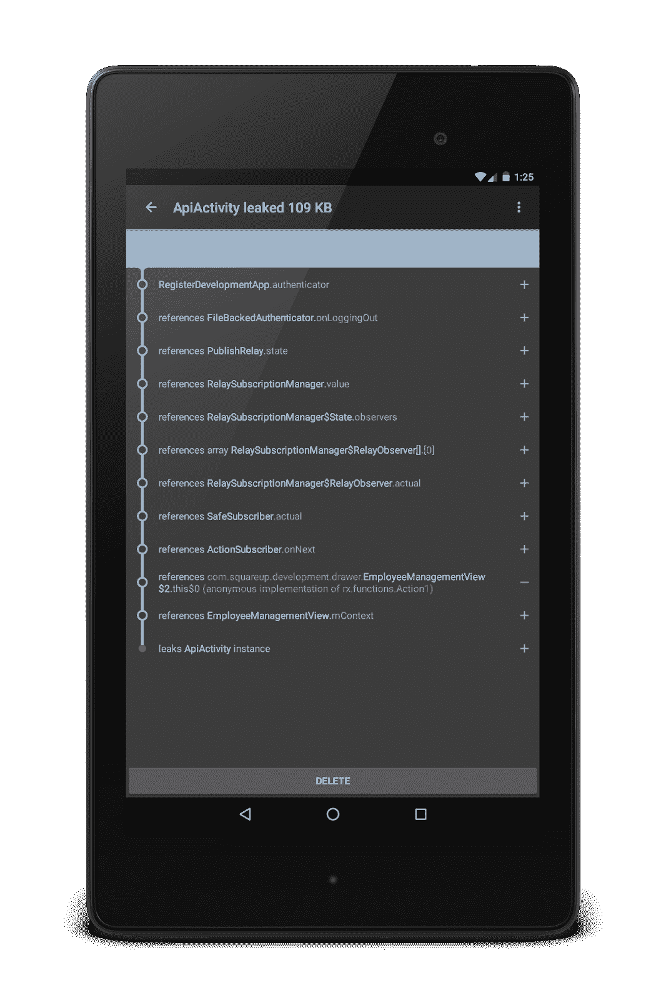
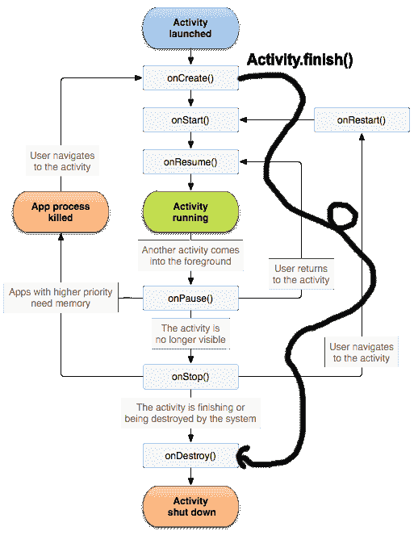

# Android 泄漏模式:视图中的订阅

> 原文：<https://medium.com/square-corner-blog/android-leak-pattern-subscriptions-in-views-18f0860aa74c?source=collection_archive---------0----------------------->

> 注意，我们已经行动了！如果您想继续了解 Square 的最新技术内容，请访问我们的新家[https://developer.squareup.com/blog](https://developer.squareup.com/blog)

在 Square Register Android 中，我们依靠自定义视图来构建我们的应用程序。有时一个视图会监听一个比该视图寿命更长的对象的变化。

例如，HeaderView 可能想要侦听来自验证者单例的用户名更改:

onFinishInflate()是一个很好的地方，可以让一个膨胀的定制视图找到它的子视图，所以我们这样做，然后我们订阅用户名更改。

上面的代码有一个**重大 bug** :我们**从来不退订**。当视图消失时，Action1 保持订阅状态。因为 Action1 是一个匿名类，所以它保留了对外部类 HeaderView 的引用。**整个视图层次现在正在泄漏**，并且不能被垃圾收集。

为了修复这个 bug，让我们在视图**与窗口**分离时取消订阅

问题解决了吗？不完全是。我最近在看一份 LeakCanary 报告，它是由一段非常相似的代码引起的:

让我们再看一下代码:

不知何故 **View.onDetachedFromWindow()没有被调用**，这导致了泄漏。

在调试的时候，我发现 **View.onAttachedToWindow()也没有被调用**。如果一个视图从未被附加，显然它不会被分离。所以，**调用 View.onFinishInflate()，而不是 View.onAttachedToWindow()** 。

让我们进一步了解 View.onAttachedToWindow():

*   当一个视图被添加到一个带有窗口的**父视图中时，onAttachedToWindow()被**立即从 addView()中调用**。**
*   当一个视图被添加到一个没有窗口的**父视图时，onAttachedToWindow()将被调用，当那个父视图被附加到一个窗口**时。

我们正在以典型的 Android 方式扩大视图层次:

此时，**视图层次结构中的每个视图都收到了 View.onFinishInflate()回调**，但没有收到 View.onAttachedToWindow()回调。原因如下:

> **View.onAttachedToWindow()在第一次视图遍历时被调用，在 Activity.onStart()之后的某个时间**

[ViewRootImpl](https://github.com/android/platform_frameworks_base/blob/76fdbb7/core/java/android/view/ViewRootImpl.java#L1516) 是 onAttachedToWindow()调用被调度的地方:

很酷，所以我们不会依赖 onCreate()，但是 onStart()之后呢？那不总是在 onCreate()之后调用吗？

不总是！[activity . oncreate()](https://developer.android.com/reference/android/app/Activity.html#onCreate(android.os.Bundle))javadoc 给了我们答案:

> *您可以从这个函数中调用 finish()，在这种情况下，onDestroy()将立即被调用* ***，而不会执行任何剩余的活动生命周期*** *(onStart()、onResume()、onPause()等)。*

找到了。

我们在 onCreate()中验证活动意图，如果该意图的内容无效，则立即调用 finish()并返回错误结果:

视图层次是膨胀的，但从未附加到窗口，因此从未分离。

这是旧活动生命周期图的更新版本:

有了这些知识，我们现在可以将订阅代码移动到 onAttachedToWindow():

无论如何，这是更好的:对称是好的，不像最初的实现，我们可以添加和删除视图任意次。