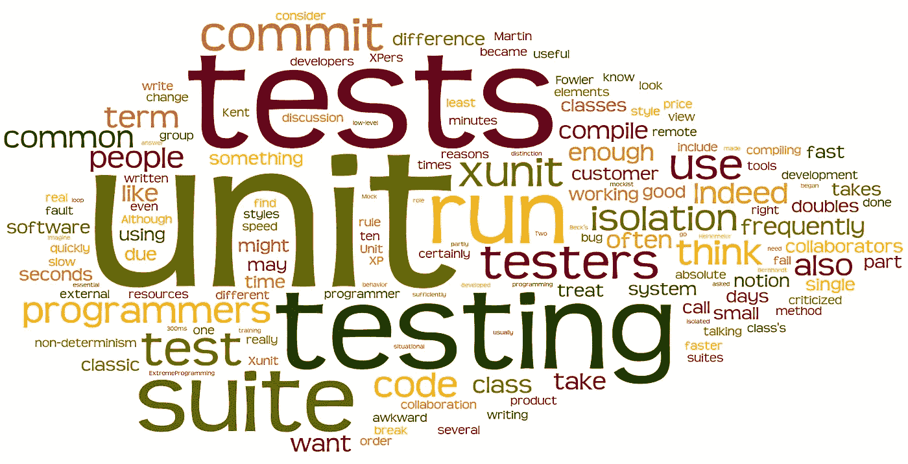
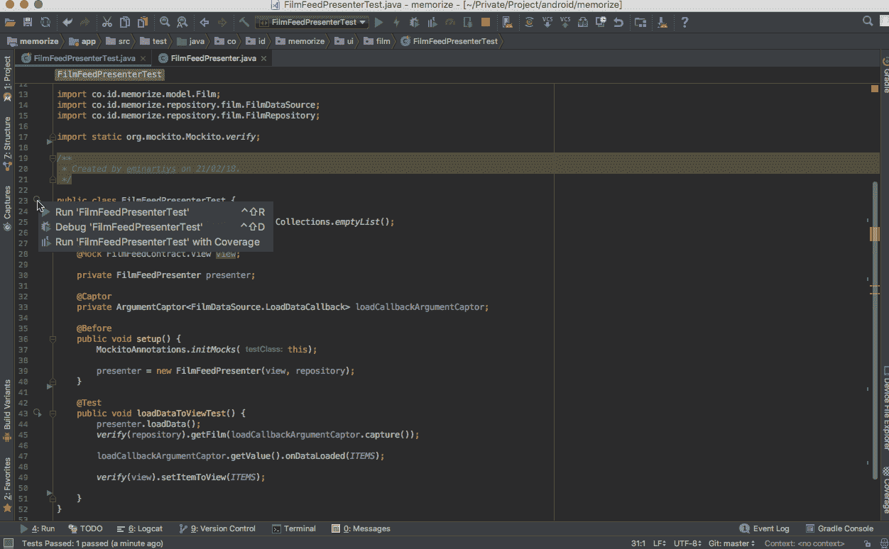
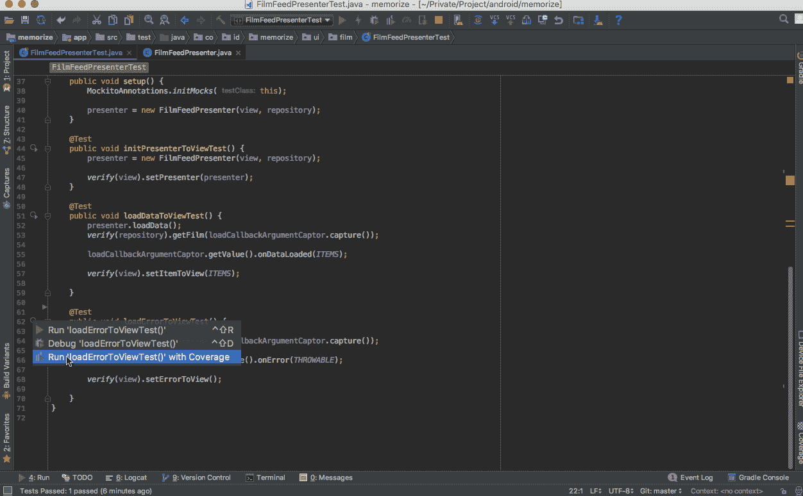

# Android MVP Series : Implementasi Unit Test pada Android MVP

> 原文：<https://medium.easyread.co/android-mvp-series-implementasi-unit-test-pada-android-mvp-f1971c44cf1c?source=collection_archive---------1----------------------->

## Bagaimana cara mengimplementasikan Local Unit Test di Android



Unit Testing image from Google Images

Setelah berhasil membuat Aplikasi Android dengan arsitektur MVP, saya akan melanjutkan dengan membahas implementasi ***Unit Testing*** pada Android. Secara umum, **unit testing** adalah praktek pengujian fungsi dan unit-unit dari kode yang sudah kita tulis untuk menyatakan apakah kode tersebut sudah sesuai dengan spesifikasi yang kita inginkan.

Implementasi unit test yang akan dibahas kali ini menggunakan ***jUnit*** dan ***Mockito Framework*** *.* Oleh karena itu pastikan untuk menambahkan *library* tersebut pada file *build.gradle* proyek Android anda.

Sebelumnya saya akan menjelaskan apa itu **jUniT** dan **Mockito Framework** yang dipakai dalam melakukan unit test pada postingan ini.

# jUnit

> **JUnit** is a [unit testing](https://en.wikipedia.org/wiki/Unit_testing) [framework](https://en.wikipedia.org/wiki/Software_framework) for the [Java programming language](https://en.wikipedia.org/wiki/Java_(programming_language)) . JUnit has been important in the development of [test-driven development](https://en.wikipedia.org/wiki/Test-driven_development) , and is one of a family of [unit testing](https://en.wikipedia.org/wiki/Unit_testing) frameworks which is collectively known as [xUnit](https://en.wikipedia.org/wiki/XUnit) that originated with [SUnit](https://en.wikipedia.org/wiki/SUnit) . — [Wikipedia](https://en.wikipedia.org/wiki/JUnit)

Berdasarkan pengertian diatas, maka jUnit adalah *framework* untuk unit testing pada bahasa pemograman Java. Sangat penting pada pengembangan TDD dan masih serupa dengan *framework* unit testing lainnya seperti *xUnit* dan *sUnit.* Menggunakan ***annotation*** untuk menspesifikasikan sebuah test *.* Contoh.

```
**public** **class** **FoobarTest** {
    @BeforeClass
    **public** **static** void setUpClass() **throws** Exception {
        *// Code executed before the first test method*
    }

    @Before
    **public** void setUp() **throws** Exception {
        *// Code executed before each test*
    }

    @Test
    **public** void testOneThing() {
        *// Code that tests one thing*
    }

    @Test
    **public** void testAnotherThing() {
        *// Code that tests another thing*
    }
}
```

# **Mockito**

> **Mockito** is a mocking framework that tastes really good. It lets you write beautiful tests with a clean & simple API. Mockito doesn’t give you hangover because the tests are very readable and they produce clean verification errors. — [Mockito Docs](http://site.mockito.org)

*Nah* , sedangkan Mockito adalah *framework* yang digunakan untuk proses *mocking* atau pembuatan objek serupa yang membuat kita dapat membuat test yang *simple* dan *clean* . Contoh.

```
import static org.mockito.Mockito.*;

*// mock creation*
**List mockedList = mock(List.class);** 
*// using mock object - it does not throw any "unexpected interaction" exception*
**mockedList.add("one");**
mockedList.clear();

*// selective, explicit, highly readable verification*
**verify(mockedList).add("one");**
verify(mockedList).clear();
```

# Bagaimana Implementasinya ?

Setelah kita berhasil menambahkan kedua *library* diatas, lalu kita akan menambahkan *unit testing* pada aplikasi Android yang kita buat. Sebelumnya, saat kita menambahkan *script* di *build.gradle* untuk menambahkan *library* jUnit dan Mockito tadi, kita memakai `**testCompile**` , dimana artinya bahwa setiap file unit test yang kita buat harus diletakkan di *package test* bukan *package main* seperti biasanya. Sekarang kita akan melakukan unit test pada presenter kita sebelumnya, yaitu **FilmFeedPresenter** .

Pertama kali, kita membuat sebuah *class* baru di *package test,* yaitu **FilmFeedPresenterTest.java** . Pada *class* inilah kita akan menambahkan *method* unit test untuk melakukan test pada presenter yang tadi. Setelah membuat *class* tersebut, maka yang perlu kita lakukan selanjutnya adalah membuat sebuah *method* dengan *annotation* `**@Before**` pada *class* tersebut. Disini saya menamakan *method* tersebut dengan nama `**setup()**` . *Annotation* `**@Before**` disini akan memberitahu kepada jUnit untuk selalu menjalankan *method* `**setup()**` tersebut setiap kali test dijalankan. Oleh karena itu, saya menamakan *method* ini dengan `**setup()**` karena di *method* inilah kita melakukan step-step yang diperlukan untuk menyediakan kebutuhan *class* presenter untuk menjalankan test.

Seperti pada *class* **FilmFeedPresenter** yang kita buat, kita membutuhkan **repository** dan **view** pada *class* tersebut, sehingga setiap test dijalankan maka kedua class ini harus selalu ada.

Pada contoh di atas, kita memakai *annotation* `**@Mock**` saat membuat objek view dan repository tadi. *Nah* , disinilah kegunaan dan penjelasan mengenai konsep *library* Mockito, yaitu proses pembuatan sebuah objek yang menyerupai objek aslinya tanpa perlu berhubungan secara langsung dengan objek aslinya. Misalnya repository disini akan berhubungan dengan sumber data, tetapi meskipun kita memakai repository saat melakukan test, kita tidak akan mengubah nilai dari data yang asli, karena repository yang kita pakai hanya objek yang menyerupai repository aslina. Selain itu, dengan Mockito kita juga bisa tidak mempedulikan objek apa sebenarnya yang digunakan oleh *class* seperti repository dan view yang tadi *.* Pemakaiannya cukup mudah, hanya dengan menambahkan `**MockitoAnnotations.initMocks(this)**` pada method `**setup()**` . Yang artinya semua variabel yang memiliki *annotation* `**@Mock**` akan diinstansiasi saat menjalankan test.

*Nah* , selanjutnya kita masuk ke *method* apa yang akan kita test dari presenter tadi. Pada **FilmFeedPresenter** kita memiliki sebuah *method* `**loadData()**` , maka kita dapat membuat testnya seperti berikut.

## Sedikit membingungkan? Oke, mari saya jelaskan.

Method yang akan ditest ialah `**loadData()**` , maka kita akan membuat sebuah *method* di file test, misalnya kita beri nama `**loadDataToViewTest()**` . Pada *method* inilah kita akan menambahkan unit test kita.

Pertama yang perlu dilakukan adalah, mari kita lihat *method* pada presenter kita, step apa *sih* yang akan kita lakukan saat *method* tersebut dipanggil. *Nah* , ternyata pada method `**loadData()**` , kita akan memanggil repository untuk mengambil data film. Repository akan memanggil *method* `**getFilm()**` yang menerima sebuah `**CallbackListener**` untuk mengembalikan data. Jadi pada file test yang kita buat tadi, kita tambahkan sebuah variabel `**ArgumentCaptor**` yang berperan sebagai callback listener kita nantinya. ArgumentCaptor yang kita miliki merupakan callback listener dari `**FilmDataSource**` , jadi variabel yang kita buat akan seperti ini.

```
@Captor private ArgumentCaptor<FilmDataSource.LoadDataCallback> loadCallbackArgumentCaptor;
```

Setelah itu, callback listener yang kita miliki tadi memiliki sebuah *method* `**onDataLoaded(List<Film> list)**` yang akan mengembalikan `**List Film**` ke repository untuk ditampilkan ke view melalui presenter. Untuk itu kita perlu membuat sebuah *static* variabel `**List Film**` pada file test kita yang akan digunakan sebagai hasil dari callback tersebut. List yang kita buat boleh berupa data kosong atau tipuan. Yang penting adalah variabel tersebut harus setipe dan sesuai dengan kembalian callback listener yang tadi. Contoh.

```
private static final **List<Film> *ITEMS***= Collections.*emptyList*();
```

Sekarang balik lagi ke presenter yang tadi, bahwa yang dilakukan di *method* `**loadData()**` kita akan memanggil `**repository.getFilm(callback)**` maka kita akan mengecek **“apakah ketika method loadData() dipanggil, maka akan *method* akan memanggil repository.getFilm(callback)”** . Untuk membuktikan hal tersebut kita dapat menulisnya dengan kode.

```
***verify***(**repository**).**getFilm**(**loadCallbackArgumentCaptor.capture()**);
```

Baris kode ini akan memverifikasi **“apakah benar bahwa method repository.getFilm(callback) terpanggil”.** Sekarang balik lagi ke presenter, ternyata jika callback listener masuk ke *method* `**onDataLoaded(List<Film> list)**` maka kita akan memanggil view untuk menampilkan data List Film tersebut dengan *method* `**view.setItemToView(List)**` . Jadi yang akan kita lakukan selanjutnya pada file test kita ialah, **membuat variabel ArgumentCaptor listener kita yang tadi akan menangkap dan mengembalikan List Film** . Maka kita dapat menulisnya dengan kode.

```
**loadCallbackArgumentCaptor.getValue().onDataLoaded(*ITEMS*);**
```

Selanjutnya kita akan membuktikan **“apakah view akan memanggil *method* setItemToView() untuk menampilkan data ke *Activity* atau *Fragment* jika callback listener mengembalikan List Film”** . Untuk membuktikan hal tersebut, kita dapat membuatnya dengan kode.

```
***verify*(view).setItemToView(*ITEMS*);**
```

Kode ini sama seperti sebelumnya, yaitu memverifikasi bahwa `**view.setItemToView(ITEMS)**` akan terpanggil. Pastikan objek yang akan dibuktikan pada setiap method sama dengan yang dikembalikan oleh setiap method. Setelah itu, jika tidak ada lagi yang dilakukan *method* `**loadData()**` , sekarang saatnya kita menjalankan file testnya. Jika kita berhasil menambahkan testnya dengan benar, maka test akan memberikan warna hijau. Jika masih gagal maka test akan memberikan warna merah.



Test Passed

Selain itu, misalnya callback listener kita memiliki 2 *method* yang dapat dikembalikan, yaitu jika berhasil akan mengembalikan method `**onDataLoaded(List<Film> list)**` dan jika gagal akan mengembalikan *method* `**onError(Throwable throwable)**` . Maka kita juga perlu melakukan test kepada *method* tersebut.

```
@Override
public void loadData() {
    repository.getFilm(new FilmDataSource.LoadDataCallback() {
        @Override
        public void onDataLoaded(List<Film> films) {
            view.setItemToView(films);
        } @Override
        public void onError(Throwable e) {
            view.setErrorToView();
        }
    });
}
```

Misalnya untuk mengetes tahapan di `**onError(Throwable throwable)**` kita menambahkan *method* `**loadDataErrorToView()**` pada file test kita. Maka hasilnya akan menjadi.

```
@Test
public void loadDataToViewTest() {
    presenter.loadData();

    *verify*(repository)
.getFilm(loadCallbackArgumentCaptor.capture());

    loadCallbackArgumentCaptor.getValue().onDataLoaded(*ITEMS*);

    *verify*(view).setItemToView(*ITEMS*);

}

@Test
public void loadErrorToViewTest() {
    **presenter.start();

    *verify*(repository)
.getFilm(loadCallbackArgumentCaptor.capture());

    loadCallbackArgumentCaptor.getValue().onError(*THROWABLE*);

    *verify*(view).setErrorToView();**

}
```

Sama seperti sebelumnya, kita perlu **membuat variabel ArgumentCaptor listener kita yang tadi akan menangkap dan mengembalikan Throwable** .

```
private static final **Throwable *THROWABLE* = new Throwable();****loadCallbackArgumentCaptor.getValue().onError(*THROWABLE*);**
```

Lalu pada `**onError(Throwable throwable)**` view kita akan memanggil *method* `**setErrorToView()**` , maka kita dapat membuatnya dengan.

```
***verify*(view).setErrorToView();**
```

Kode ini akan membuktikan **“apakah jika callback listener dikembalikan, maka view yang ditampilkan adalah Error View”** .



Test Passed

*Nah* . kira-kira demikianlah cara kita menambahkan unit test pada aplikasi Android kita. Jika kita menambahkan *method* lainnya, atau presenter lainnya atau kita mengubah step yang ada dalam *method* presenter kita yang tadi, maka kita perlu menambah dan memperbaharui unit test kita tersebut.

Yang paling penting pada pengerjaan unit test ini ialah, setiap test yang kita buat harus mengcover semua method kita baik itu *flow* yang normal, atau yang error atau tahapan-tahapan yang dilakukan juga sesuai. Jika kita memanggil step B terlebih dahulu, sedangkan pada implementasinya kita melakukan step A, maka test kita tidak akan *passed* . Banyak sekali skenario yang perlu dilakukan dan ditambahkan pada unit test. Tulisan kali ini hanya membahas secara general.

Untuk pengembangan selanjutnya, dapat kamu lihat pada repo ini [**memorize**](https://github.com/eminartiys/memorize) . Semoga artikel ini bermanfaat bagi kamu yang ingin mencoba. Kamu juga dapat melihat beberapa sumber dan implementasikan sesuai yang kamu mengerti. *Happy Learning!* 😃

*If you have any questions or complains, please feel free to contact me in these social networks:* [*twitter*](https://twitter.com/eyseminarti) *,* [*linkedin*](http://linkedin.com/in/eminarti-sianturi-08a369102) *, or* [*email*](mailto:eminartiys@gmail.com) *. I’ll try to do my best to answer if I can, otherwise we will learn together :).*

## Referensi

1.  [https://github.com/googlesamples/android-architecture](https://github.com/googlesamples/android-architecture)
2.  [https://caster.io/lessons/model-view-presenter-part-4-writing-fast-junit-jvm-tests-with-mockito](https://caster.io/lessons/model-view-presenter-part-4-writing-fast-junit-jvm-tests-with-mockito)