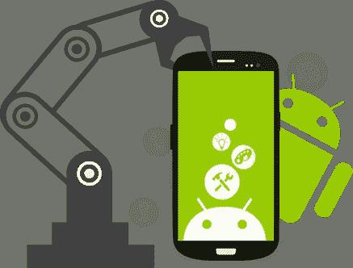
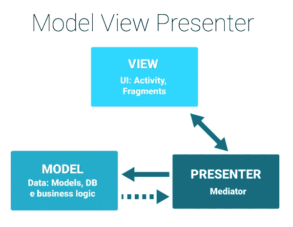

# Android MVP Series : Membangun Aplikasi Android dengan Arsitektur MVP

> 原文：<https://medium.easyread.co/android-mvp-series-membangun-aplikasi-android-dengan-arsitektur-mvp-fbf1f77ecaec?source=collection_archive---------0----------------------->

## Bagaimana membuat aplikasi android dengan arsitektur MVP ?



Build Android Application image taken from Google Image

Halooo.. Beberapa waktu yang lalu salah seorang junior saya dikampus dulu bertanya mengenai pengembangan aplikasi Android menggunakan arsitektur MVP. Setelah memberi beberapa penjelasan singkat kepada dia, saya menjadi tertarik untuk membuat beberapa tulisan mengenai pengembangan aplikasi Android dengan arsitektur MVP. Mungkin sudah banyak sumber yang dapat kita jadikan referensi membuat aplikasi Android dengan arsitektur MVP, tetapi tidak ada salahnya saya juga menulisnya, *bukan* ? 😃
Tulisan-tulisan yang saya buat kali ini merupakan sebuah seri yang saya beri judul *“* ***Android MVP Series”*** *. Nah* , oke mari kita mulai saja.

# Apa itu MVP Arsitektur?

**Model-View-Presenter** atau yang biasa disingkat menjadi **MVP** adalah sebuah konsep arsitektur pengembangan aplikasi yang memisahkan antara tampilan aplikasi dengan proses bisnis yang bekerja pada aplikasi. Arsitektur ini akan membuat pengembangan aplikasi kita menjadi lebih terstuktur, mudah di- *test* dan juga mudah di- *maintain.*

Berikut penjelasan masing-masing layer pada **MVP** .
- **View,** merupakan layer untuk menampilkan data dan interaksi ke *user* . View biasanya berupa *Activity, Fragment* atau *Dialog* di Android. View ini juga yang langsung berkomunikasi dengan *user* .
- **Model** , merupakan layer yang menunjuk kepada objek dan data yang ada pada aplikasi.
- **Presenter,** merupakan layer yang menghubungkan komunikasi antara Model dan View. Setiap interaksi yang dilakukan oleh *user* akan memanggil Presenter untuk memrosesnya dan mengakses Model lalu mengembalikan responnya kembali kepada View *.*



Model View Presenter image taken from Google Images

***Nah* sebenarnya *apasih* manfaat dari penerapan arsitektur seperti ini?**
Pada penjelasan diatas, pemisahan kode program berdasarkan fungsi dapat membuat struktur kode kita lebih rapi dan tentu saja lebih mudah di- *test* . Seperti yang kita ketahui, berbagai View yang kita gunakan biasanya bergantung keras ( *tighly-coupled* ) dengan *library* Android, sehingga kita akan kesulitan untuk melakukan *testing* pada aplikasi kita, misalnya *unit testing* . Dengan struktur pengembangan aplikasi ini, kita dapat membuat aplikasi kita lebih *maintainable* dan *testable* .

# Bagaimana Implentasinya?

Pada seri tulisan saya kali ini, saya membuat sebuah proyek sederhana yang akan menjadi acuan saya dalam menulis setiap part-nya. Selain itu saya juga memakai beberapa *library* yang memudahkan dalam membuat aplikasi Android, yaitu:
- [**Butter Knife**](http://jakewharton.github.io/butterknife/) , merupakan *library* yang membantu untuk menyederhanakan penulisan komponen view di Android. Biasanya saat mendeklarasikan sebuah komponen view, maka kita akan memakai ***findViewById*** . Dengan butter knife penulisannya akan lebih sederhana.
- [**Dagger**](https://google.github.io/dagger/) , merupakan *library* yang digunakan untuk proses ***Injection*** pada aplikasi kita. Merupakan penerapan ***Dependency Injection*** *.* Biasanya saat membuat sebuah objek, kita juga membutuhkan objek lain pada instansiasi objek tersebut, jika tanpa *dependency injection* maka setiap kita melakukan instansiasi objek maka kita juga harus membuat objek-objek yang lain dibutuhkan sehingga kode kita akan kotor dan sulit dipahami.

Selain memakai arsitektur MVP, aplikasi Android yang saya bangun juga menerapkan [**Repository Pattern**](https://martinfowler.com/eaaCatalog/repository.html) . Yang dimaksud dengan **Repository** disini adalah sebuah abstraksi dari *data layer* yang berfungsi mengatur aliran data pada aplikasi. Repository ini biasanya berupa sebuah *interface* yang memiliki beberapa *method* dimana *class* yang mengimplementasikannya akan mengimplementasikan *method-* nya juga. Repository inilah yang nantinya akan dipakai oleh presenter untuk proses pengolahan data.

## Contract Class

*Nah* , misalnya seperti contoh aplikasi yang saya bangun disini, aplikasi *List Film* . Pada aplikasi ini kita dapat melihat daftar film yang disediakan oleh *API* [Studio-Ghibli](https://ghibliapi.herokuapp.com/#section/Studio-Ghibli-API) . Pertama kita dapat membuat sebuah *activity* atau *fragment* sebagai tampilan aplikasi kita.

Disini belum ada implementasi antara presenter dan view. Untuk membuatnya, mari kita deklarasikan sebuah ***Contract Class*** yang merupakan sebuah *interface* , dimana didalam *class* ini kita akan membuat *interface* Presenter dan View yang nantinya akan dipakai oleh View yang tadi. Sebelumnya saya juga membuat sebuah *Base class* untuk Presenter dan View yang berisikan *method* umum.

```
public interface BaseView<T> {
    void setPresenter(T presenter);
}public interface BasePresenter {
    void start();
}
```

Kamu boleh menambahkan apa saja pada *base class* sesuai kebutuhan kamu, begitu juga untuk setiap *contract class* diatas, kamu boleh menambahkan *method* atau *interface* lain tergantung kebutuhan. Sekarang, *interface* View yang ada pada *contract class* tadi kita impelementasikan pada Activity atau Fragment kita yang tadi.

```
public class FilmFeedFragment extends Fragment **implements** **FilmFeedContract.View** {

    private FilmFeedContract.Presenter presenter;

    @Override
    public void onAttach(Context context) {
        super.onAttach(context);
        // instansiasi presenter
        new FilmFeedPresenter(this, repository);
    } @Override
    public void onResume() {
        super.onResume();
        // call presenter
        **if (presenter != null) {
            presenter.start();
        }**
    }

    **@Override
    public void setPresenter(FilmFeedContract.Presenter presenter) {
        this.presenter = presenter;
    }**

    **@Override
    public void setItemToView(List<Film> list) {**
        //implementasi view
    **}**
}
```

Sekarang Activity atau Fragment ini sudah mengimplementasikan *interface* View yang ada pada *contract class* dan proses pengolahan ada akan diserahkan ke presenter melalui method `**presenter.start**` . Lalu bagaimana dengan di Presenter?

*Nah,* dipresenter inilah kita akan merespon setiap interaksi yang dilakukan user pada aplikasi kita. Misalnya seperti menampilkan data. Pada kode diatas, kita dapat melihat impelementasi *interface* Presenter yang ada di *contract class* tadi. Seperti yang dijelaskan diatas, bahwa kita menggunakan repository untuk komunikasi data, maka disini *method* `**loadData()**` akan memanggil repository.

Selain *remote* , kita juga dapat memiliki data dari lokal, dan tentu saja kita dapat menambahkannya pada aplikasi kita dan impelementasikan *interface method* yang ada pada data source yang tadi. Setelah presenter memanggil repository untuk mendapatkan data, dan pada repository, akan memanggil *remote data source* , dan dikembalikan melalui *callback* , maka kita memperoleh data yang akan ditampilkan pada Activity atau Fragment kita

```
@Override
public void loadData() {
    repository.getFilm(new FilmDataSource.LoadDataCallback() {
        @Override
        public void onDataLoaded(List<Film> films) {
            view.setItemToView(films);
        }
    });
}
```

Dapat kita lihat pada *callback* `**onDataLoaded()**` kita akan memanggil `**view.setItemToView()**` yang sebelumnya sudah kita implementasikan pada Activity kita. Jadi sekarang giliran Activity kita yang akan melakukan proses rendering view dengan data yang dikembalikan oleh presenter.

*Nah* , kira-kira begitulah gambaran dari implementasi arsitektur MVP yang saya gunakan pada aplikasi saya. Untuk pengembangan selanjutnya, dapat kamu lihat pada repo ini [**memorize**](https://github.com/eminartiys/memorize) . Semoga artikel ini bermanfaat bagi kamu yang ingin mencoba. Kamu juga dapat melihat beberapa sumber dan implementasikan sesuai yang kamu mengerti. Pada dasarnya, pengertian dari arsitektur inilah yang perlu kamu pahami, bagaimana kamu mengimplementasikannya, mungkin boleh kamu coba sendiri. *Happy Learning* ! 😃

*If you have any questions or complains, please feel free to contact me in these social networks:* [*twitter*](https://twitter.com/eyseminarti) *,* [*linkedin*](http://linkedin.com/in/eminarti-sianturi-08a369102) *, or* [*email*](mailto:eminartiys@gmail.com) *. I’ll try to do my best to answer if I can, otherwise we will learn together :).*

## Referensi

1.  [https://github.com/googlesamples/android-architecture](https://github.com/googlesamples/android-architecture)
2.  [https://caster.io/courses/mvp](https://caster.io/courses/mvp)