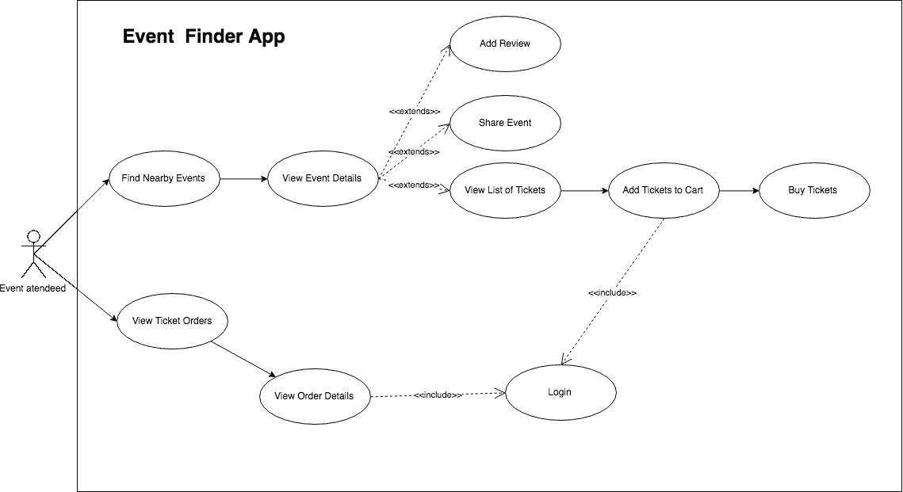

# Android 导航组件—第 1 部分

> 原文：<https://medium.com/google-developer-experts/android-navigation-components-part-1-236b2a479d44?source=collection_archive---------4----------------------->

photo by burst.shopify.com

上周，我参加了在加州山景城举行的谷歌 I/O 2018。这是一件大事，很多事情都被宣布了。在所有这些东西中，导航组件吸引了我的大部分注意力。

我不知道是因为演示中的视觉效果，还是因为它自称的简单，但它们是我在会议期间想到的全部。

这让我开始思考如何在我目前从事的项目中使用它。

我决定从一个个人项目开始探索，希望尽快把它带到我在 [Shopify](https://medium.com/u/bab76dfc19b0?source=post_page-----236b2a479d44--------------------------------) 工作的项目中。

我花了不到一个小时从文档中学习基础知识，并转换了我个人项目的第一个流程。我认为这令人印象深刻，但是当我开始转换其他流并试图将它们放在一起时，事情就变得困难了。

这些困难与导航库本身无关，而是我之前在设计应用程序时所做决定的影响。

我打算写一系列的文章来解释如何使用导航组件。

在这篇文章中，我将从我认为确保你的应用结构良好所需要的准备工作开始，而不是直接跳到实现上。

我希望在这篇文章中所做的准备工作会让我们在实现阶段翻译你的应用程序来使用导航组件的过程变得简单一些。

# **了解 App 结构**

谈到导航，最重要的是结构。

一个结构有许多不同的方式，在我们周围的许多不同的系统中。结构为系统和机制提供支持，以允许系统的不同部分进行通信或移动。

房屋蓝图是一种常见的结构，非常容易想象。它将不同的房屋隔间和它们之间的移动方式(走廊、楼梯、门)放在一起。

我们构建的应用程序也呈现这些特征，并有需要互联的地方。

也就是说，我们需要确保我们的应用程序有一个很好的结构。根据 [Google I/O 2013](https://www.youtube.com/watch?v=XpqyiBR0lJ4) 上的这段视频，一个结构良好的应用具有以下三个特性:

**1。让事情变得简单高效**。

**2。把相关的东西放在一起，不相关的东西分开。**

**3。通过一致的导航管理复杂性。**

# **如何创建一个好的 App 结构？**

创建一个好的应用程序结构首先要了解你的应用程序是做什么的。

如果你在 Play Store 中已经有了一个成熟的应用程序，你可能会忍不住说这不适合你。但是重新思考重新开始有很大的价值。这将有助于你提前发现任何漏洞，或者让你或你的团队确信你已经做得很好，你已经准备好开始转变了。

为了找到你的应用程序结构，你需要以一种专注于表达用户**目标的方式为你的应用程序建模。**从业务层面来说不要太抽象，作为详细功能来说也不要太复杂。

为了做到这一点，我们从理解应用程序用例开始，并用用例图来表示它们。

如果你不知道，用例图用一个参与者来表示系统的不同部分之间的关系。系统是我们的应用程序和参与者，用户。

要创建用例图，您需要:

**1。创建一个你的应用程序中所有演员和事情的清单。**

**2。优先考虑你的演员需要做的最重要的事情。**

**3。按照有意义的顺序将动作与参与者联系起来。**

如果我们按照这三个步骤来构建一个允许用户查找附近的活动并购买门票的应用程序，我们会做:

## 1.库存-谁是用户？他们想做什么？

**演员**:事件出席者
**动作**:

*   查找附近的活动；
*   查看活动详细信息；
*   查看票证详细信息；
*   共享事件；
*   向事件添加评论；
*   将门票添加到购物车；
*   购买活动门票；

## 2.**区分优先顺序—** 演员首先或经常做的最重要的事情是什么？

**高优先级:**

*   查找附近的活动
*   查看活动详细信息
*   购买活动门票

**中优先级:**

*   查看票证详细信息

**低优先级:**

*   向事件添加评论。
*   共享事件；

## **3。连接和顺序。**

通过完成这一步，我们就可以绘制用例图了。我正在谈论的这个例子的图表将会是这样的:

# 我该拿这一切怎么办？

现在我们有了用例图，我们不仅对用户旅程有了很好的理解，而且应用程序的结构也自然地创建出来了。

如果你把用例图顺时针旋转 90 度，你会发现它看起来像一棵树。

这棵树将向你展示一条清晰的路径，告诉你如何组织你的应用程序，让用户高效地实现他们的目标。

这可以通过许多不同的方式转化为应用程序。一种思考方式是，树中某一层上的每个组件都是一个片段，它们将共享相同的活动。

无论您以何种方式将图表转换为实际的应用程序，做这个练习将帮助您解决在创建新项目或转换现有项目以使用导航组件时可能遇到的 80%的问题。

我很想知道你和/或你的团队是否有不同的流程来做这件事，并希望在下一篇文章中看到你，我将开始使用导航组件将所有这些转换成应用程序。

> 如果您有任何问题或意见，请随时在下面的评论区留言或发推文给我。

 [## 达里奥·蒙古伊·🇲🇿(@达里奥·蒙古伊)|推特

### 达里奥·蒙古伊·🇲🇿的最新推文。安卓@shopify(🇨🇦)。谷歌开发专家(安卓)…

twitter.com](https://twitter.com/DarioMungoi) 

下次见！

## **资源**

**Android 应用设计中的结构——Google I/O 2013**