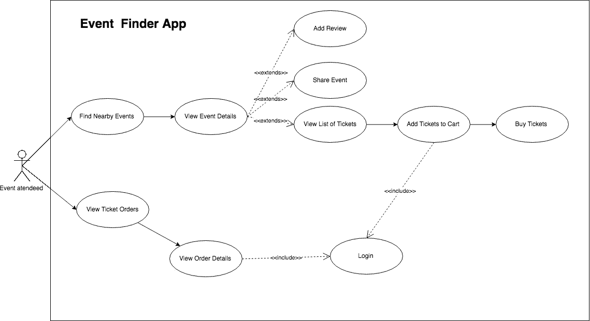
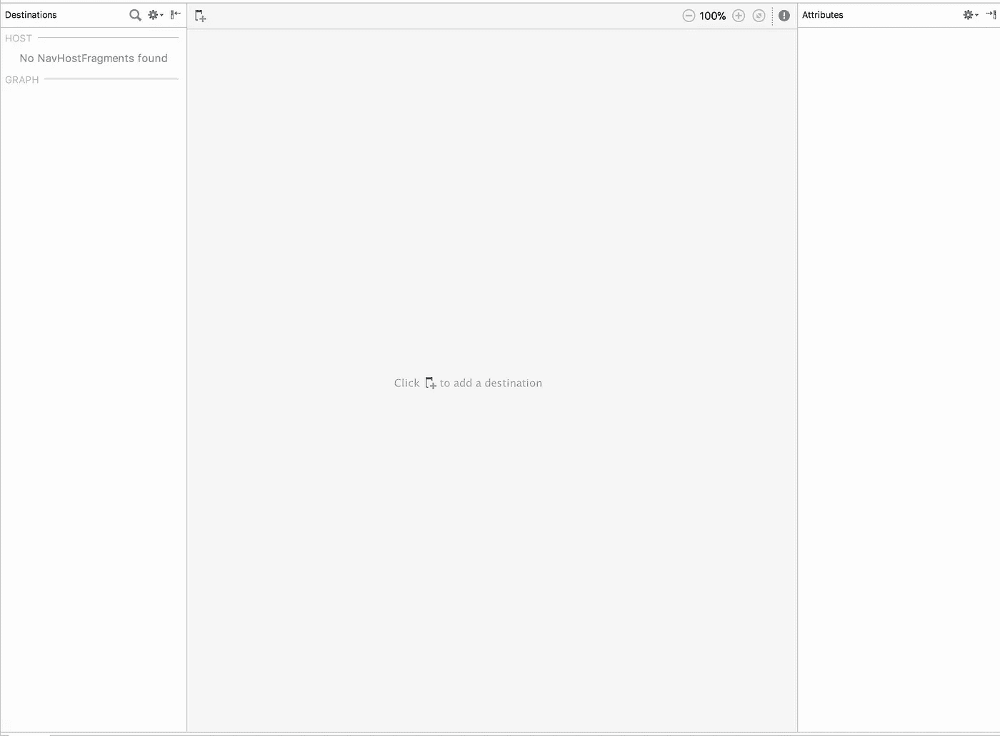
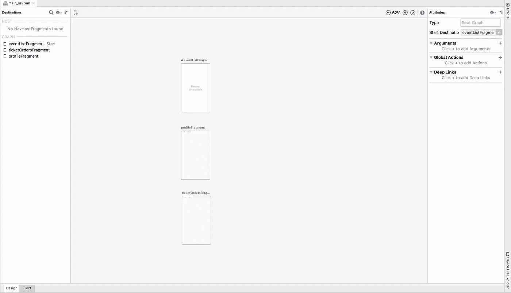
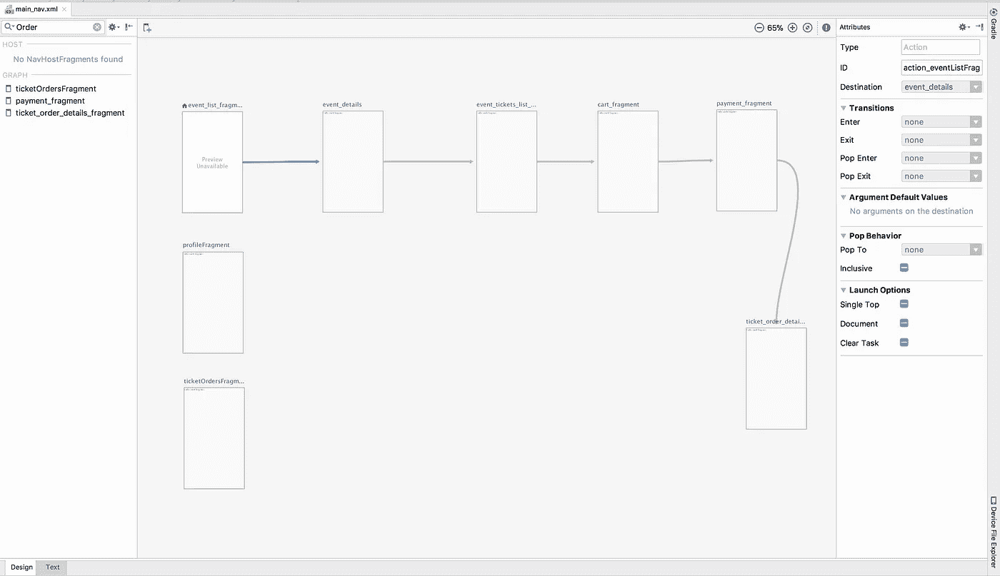

# Android 导航组件—第 2 部分

> 原文：<https://medium.com/google-developer-experts/android-navigation-components-part-2-ca643eb301e3?source=collection_archive---------2----------------------->


photo by burst.shopify.com

两周前，在谷歌 I/O 大会上，谷歌发布了许多优秀的工具，帮助开发者加快开发过程，开发出更好的应用。

其中一些公告是 Android 导航组件。导航组件是 Android Jetpack 库集的库部分。

这个库的创建是为了帮助在 android 应用中实现一致的导航。

在我之前的[帖子](/google-developer-experts/android-navigation-components-part-1-236b2a479d44)中，我谈到了我认为你应该创建或规划你的应用程序结构的准备工作。

了解应用程序结构是帮助您更好地启动或迁移应用程序以使用导航组件的关键。

如果你没有机会阅读我之前的帖子，我建议你在继续之前先阅读一下[这里](/google-developer-experts/android-navigation-components-part-1-236b2a479d44)。

在我之前的文章中，我举了一个例子，一个应用程序可以查找附近的活动，并允许用户购买门票。
在帖子的最后，我们得到了下面的用例图:



如果你把这个图顺时针旋转 90 度，你会得到一个看起来像树的东西。在这个树中，您会注意到:

1.  用户需要做的最重要的动作在更高的层次上。
2.  用户需要做的最不重要的动作在较低的级别。
3.  为了实现某些操作，用户需要遵循一组步骤。
4.  有一些流依赖于嵌套流(登录是一个嵌套流)。

在开始实现导航组件之前，让我们看一下这个库的主要概念:

## 导航图

导航图是描述一组导航目的地及其连接的图。

如果你看一下上面的用例图，它可以用一个单独的导航图或一组多个导航图来表示，这取决于你决定使用的实现(单活动或多活动应用)。

## 导航目的地

导航目的地可以是应用程序中的屏幕或任何视图。在上面的用例图中，导航目的地相当于用户可以做的不同用例。

## 导航动作

导航动作是连接一个目的地和另一个目的地的链接。
一个动作知道它正在连接哪些目的地，以及它们之间将流动的信息类型。

## 导航主机

导航主机是一个组件，它知道导航图中的所有目的地和动作。
它处理不同目的地之间的导航。

# 在项目中实现导航组件

为了开始在你的应用中实现导航组件，你需要首先将你正在使用的 Android Studio 版本升级到最新的 3.2 Canary 版本。

这将确保您拥有所有最新的工具，如导航编辑器，以支持您实现导航。你可以在这里找到最新版本的 Android Studio [。](https://developer.android.com/studio/preview/?utm_source=android-studio)

## 添加导航组件依赖关系

## **创建导航图形文件**

开始使用导航组件的第一步是创建一个导航图资源文件。

正如我前面提到的，这个文件是我们在应用程序中定义不同目的地以及它们如何连接的地方。

一个应用程序可以有多个导航图，这些导航图可以嵌套在一起。

要创建一个导航图文件，在你的应用程序模块内的任何地方点击右键，选择选项**新建**->Android 资源文件。

这将打开一个模板来创建一个新的 Android 资源文件。

通过给出文件名来填充模板，并使用**资源类型**下拉菜单来选择导航资源类型。

完成后，按 ok，该文件的导航编辑器将打开，如下所示。



上面显示的导航编辑器分为 3 个不同的部分。从左至右:

1.  该部分显示了图中所有目的地的列表以及导航图所在的位置。
2.  在中间和大部分，您可以看到图形中所有目的地及其连接的可视化表示。
    如果您在布局中使用工具命名空间，数据也将在这里呈现，您可以很好地查看您的应用程序和样本数据。
3.  第三个也是最右边的部分是属性部分。仅当您选择目的地或操作时，此部分内容才会显示。此部分将显示并允许修改所选项目的属性，无论是动作还是目的地

## 向图表中添加目的地

通过在应用程序中添加不同的目的地，开始构建导航图。我鼓励你从上到下开始构建导航图。

我发现这种方式更容易，因为用例图的最顶层只有少量的目的地。

如果我们在作为本文示例的 Event Finder 应用程序中添加最顶端的目的地，我们将得到如下结果:



如您所见，我们有 3 个目的地，它们是应用程序的入口点。这些目的地彼此不相连，因此不会有将它们链接在一起的动作。

稍后我将展示如何导航到这些目的地中的每一个。

现在，让我们添加购买机票的片段，并拥有一个相互连接的目的地流。

为此，您应该首先重复向导航图添加新目的地的过程。

要开始进行连接，请选择您想要开始的目的地，并拖动一条连接结束目的地的线。

以这篇文章为例，我们现在将有这样的导航图:



## 托管导航图

实际上，这个导航图除了给用户在应用程序中的旅程提供一个很好的视觉表现之外，什么也没做。

这是因为导航图需要一个称为导航主机的特殊容器。

该组件采用导航图，并提供使用`NavController`导航不同目的地的机制。

导航主机为我们完成所有繁重的工作，比如处理片段事务和执行导航所需的所有其他事情。

如果你使用 Google 现在推荐的单活动应用程序类型的结构，你的应用程序将有一个活动，只有一个导航主机和一个导航图。

如果您正在进行迁移，建议将您的流程分成不同的活动，并在产品化阶段为每个活动提供一个导航图和主机。

无论您是启动新应用程序还是迁移现有应用程序，您的活动布局都可能是相同的，并且将仅包含导航主机，如下所示:

在上面的代码片段中需要注意的两件事是自定义属性:

*   `app:navGraph`:定义哪个导航图将与导航主机关联
*   `app:defaultNavHost`:布尔值，如果设置为真，将允许导航主机在按下系统后退按钮时进行拦截。

现在，如果您启动具有导航主机的活动，它将在屏幕上显示导航图中设置为起点的目的地。

> **pro-tip** :如果你想可视化你的片段在孤立状态下的样子，在导航图中将片段设置为起始目的地。
> 
> 为此，在导航编辑器中右键单击目的地顶部，并选择“设为起始目的地”。

## 在目的地之间导航

既然导航图被托管在`NavFragmentHost`中，让我们看看如何从一个目的地移动到另一个目的地。

在此处显示的示例中，导航到一个目的地的过程是在起始目的地发生事件后完成的。例如，当单击列表中的事件时，导航到 EventDetails 片段。

为了在目的地之间导航，导航主机有一个叫做`NavController`的组件。

`NavController`组件负责管理导航主机内导航的全过程。

要在目的地内执行导航，您需要首先从导航主机获取 NavController。

通过使用`NavHostFragment` `findNavController`的静态方法来这样做:

```
val navController = Navigation.*findNavController*(fragment)
```

获得`NavController`后，可以这样导航到活动详情目的地:

`navController.navigate(R.id.event_details_fragment)`

R.id.event_details_fragment 是 EventDetailsFragmen 的目的地 id

要导航回上一个目的地，过程是类似的，您需要首先获取 NavController，然后像这样调用 **navigateUp** 函数:

`navController.navigateUp()`

您通常会实现这个方法来处理在目的地按下**向上按钮**。使用这种方法时，导航控制器会计算出上升对您的目的地意味着什么。

## **在目的地之间传递数据**

在不同的目的地之间导航是核心的事情，但是大多数时候我们不仅仅是去另一个目的地，而且我们需要在这个过程中发送某种信息。

我们仍然通过以两种不同的方式使用捆绑包来做到这一点:

*   使用导航组件安全参数 Gradle 插件的类型安全方式。
*   一种非类型安全的方法，我们像往常一样自己构造包。

我将在下一篇文章中讨论安全参数，以及其他一些我觉得很酷但现在没有必要的东西。

使用第二种方法，为了在目的地之间传递信息，我将首先在目的地中用一个名为 bundleArgs 的函数创建一个伴随对象，该函数将接受目的地需要的任何参数并返回一个包。

```
//EventDetailsFragment.kt **companion object** {
  **private const val ARG_EVENT** = **"event"

  fun** bundleArgs(event: Event): Bundle {
    **return** Bundle().*apply* **{ 
      this**.putParcelable(**ARG_EVENT**, event)
    **}** }
}
```

这种方法有助于我保留与绑定参数和将它们提取到目的片段中相关的所有内容。

要导航到此目的地并传递信息包，您需要使用 navigate 方法的重载之一，该重载接受操作和参数:

```
val args = EventDetailsFragment.bundleArgs(event)
navController.navigate(R.id.*event_details_fragment*, args)
```

> 在导航目的地中提取这些参数的方式保持不变。

# 结论

在做了我在上一篇[文章](/google-developer-experts/android-navigation-components-part-1-236b2a479d44)中推荐的准备工作后，实现或迁移到导航组件的使用变得简单明了。

这是因为 api 是清晰的，并且在最新版本的 Android Studio 中支持它们的工具非常棒。

到目前为止，您已经准备好开始在自己的项目中实现导航组件，如果您正在开始一个新项目，您可以使用 Google 推荐的单个活动应用程序来实现；如果您正在迁移一个大型应用程序，您可以通过多个活动及其自己的导航图来实现。

我期待着在下一篇文章中看到你，告诉你引擎盖下发生了什么，以及一些提示和技巧，如提供的扩展功能，直接用 NavController 挂钩应用程序的 BottomNav。

> 如果您有任何问题或意见，请随时在下面的评论区留言或发推文给我。

[](https://twitter.com/DarioMungoi) [## 达里奥·蒙古伊·🇲🇿(@达里奥·蒙古伊)|推特

### 达里奥·蒙古伊·🇲🇿的最新推文。安卓@shopify(🇨🇦)。谷歌开发专家(安卓)…

twitter.com](https://twitter.com/DarioMungoi) 

下次见！

**资源:**

[安卓 ADB 播客—导航专题](https://storage.googleapis.com/androiddevelopers/android_developers_backstage/ADB%2092%20Navigation%20Conversation.mp3)