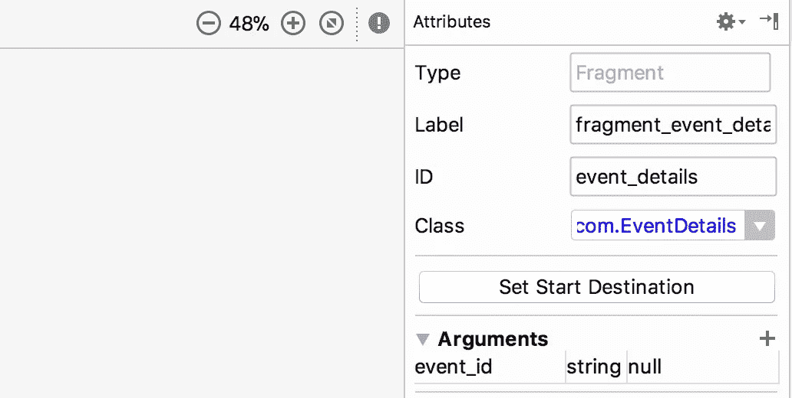
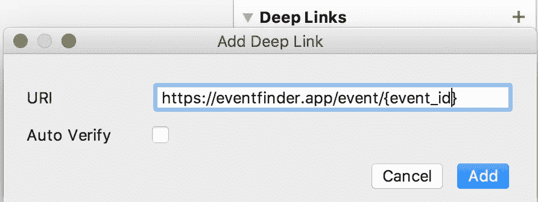

# Android 导航组件—第 3 部分

> 原文：<https://medium.com/google-developer-experts/android-navigation-components-part-3-19554ec9ae83?source=collection_archive---------0----------------------->

两周前，我开始写关于 Android 导航组件的文章。

Android 导航组件库是 Google I/O 2018 期间宣布并发布的 Android JetPack 库集的一部分。

我在这一系列的文章中谈到了在使用这个库之前理解你的应用程序结构的重要性。

然后，我写了第二篇文章，向您展示如何实现导航组件，以及在您很好地理解了您的应用程序结构之后，实现导航组件是多么的容易。

如果你还没有机会查看前两个帖子，你可以在这里找到它们[，在这里](/google-developer-experts/android-navigation-components-part-1-236b2a479d44)找到它们[。](/google-developer-experts/android-navigation-components-part-2-ca643eb301e3)

这篇文章将涵盖的内容不仅仅是上一篇文章中提到的从一个目的地到另一个目的地的简单情况。

这篇文章的主题被分成独立的部分，你可以直接跳到与你最相关的主题。

我会试着把这篇文章作为一篇直播文章，并随着我开始遇到更多有趣的值得分享的东西而更新它。

本文结束时，你将能够:

*   使用安全 args Gradle 插件在目的地之间传递数据。
*   设置导航组件以使用不同的视图。
*   处理两个活动目的地之间的导航。
*   向目标添加深度链接支持。

# 以安全的方式传递数据——安全的 args 插件

在本系列的前一部分中，我谈到了如何使用 bundle 将数据从一个目的地传递到另一个目的地，就像您一直在做的那样。

这种解决方案很好，但是它不能防止开发人员传递随机的包或者在从中提取参数时使用错误的密钥。

为了防止这种小错误发生，导航组件库附带了一个名为 safe args 的 Gradle 插件。

安全参数允许你在编辑器中定义你的目标参数，它会生成代码来帮助你捆绑和解绑这些参数。

要使用 safe args 插件，您需要首先将类路径添加到项目`build.gradle`文件中的 Gradle 插件:

```
classpath "android.arch.navigation:navigation-safe-args-gradle-plugin:1.0.0-alpha01"
```

然后将插件应用到应用程序模块 Gradle 构建文件。

```
apply **plugin**: **'com.android.application'** apply **plugin**: **'kotlin-android'** apply **plugin**: **'kotlin-android-extensions'**//Apply Safe Args Plugin
apply **plugin**: **'androidx.navigation.safeargs'** android {
 ...
}
```

与 Gradle 同步项目后，您可以开始使用导航编辑器为应用程序中的目的地添加安全参数。

为此，您必须在导航图中单击目的地顶部，转到属性面板，并开始添加目的地可以接收的所有参数。



编辑器将允许您定义参数名称、类型(Int、String、Reference)和默认值。

添加所有参数后，项目需要重新构建，Gradle 插件将生成两个文件，一个允许设置参数，另一个帮助从包中检索参数。

## 设置参数

安全参数插件将生成一个**方向**类。生成的类实现了`NavDirections`接口，这个接口描述了导航操作。

> 我在上一篇文章中提到的导航操作主要由一个动作和它的参数组成。

生成的类将提供 setters 来定义所有已定义的参数。
在定义参数之后，可以将这个类的一个实例传递给`NavController` navigate 函数。

对于 Events Finder 应用程序来说，设置`eventId`参数并导航到事件详细信息的目的地如下所示:

## 检索参数

在目标端，safe args 插件将生成一个类，该类将已定义的参数作为变量，并生成一个静态方法，该方法接收一个包并检索所有参数的值。

对于这个 posts 应用程序示例，通过 safe args 插件使用生成的类检索参数如下所示:

# 设置导航组件以使用不同的视图。

到目前为止，展示如何进行实际导航的示例都是“手动”进行的。

我说的“手动”是指完成实现 UI 组件监听器的过程，在这个监听器的实现中，获取 Nav 控制器并调用 navigate 方法。

所有这些都是正确的，这样做是没问题的，但是在我们有导航抽屉这样的东西的情况下，经历那个过程会很无聊，会增加很多不必要的代码。

为了帮助减少样板文件，Google 创建了一组静态函数，帮助设置导航组件和一些常见的 UI 组件，如工具栏和底部导航视图。

这些函数位于 NavigationUI 类中。这个类包含了绑定 ActionBar、NavigationView 和底部导航视图的函数。

如果你已经注意到在以前的文章中显示的图表，事件查找器应用程序的主要目的地没有连接它们的箭头(动作)。

这是因为顶级目的地将由特定的导航组件连接。

本文中的示例只有 3 个顶级目的地，根据材料设计规格，底部导航视图是适合使用的导航组件。

## 使用底部导航视图设置导航控制器

正如我提到的，使用底部导航组件设置导航控制器很容易，通过调用 NavigationUI 类的以下静态函数即可完成:

```
setupWithNavController(bottomNav, **navHost**)
```

当这个设置完成后，点击事件和底部导航项目的选择状态都将由导航控制器来处理。

使该功能工作的唯一要求是确保底部导航菜单项中的 **id 的**与导航图目的地的 **id 的**相同。

## 用自定义视图设置导航控制器

正如我前面提到的，NavigationUi 类只包含支持 NavigationUi 中一小组 UI 组件的函数。如果您有一个自定义视图，您将必须创建您的函数。

要创建您自己的函数，您需要依次遵循以下两个步骤:

1.  处理自定义 UI 组件的 click 事件，并使用 Nav 控制器导航到所需的目的地。
2.  在`addOnNavigatedListener`内听导航完成，并在导航完成后做所需的工作。(例如:检查当前选择的项目)。

这些是 NavigationUtils 类中现有函数遵循的完全相同的步骤，您可以在下面看到设置底部导航视图的函数的实现:

# 在活动之间导航

虽然谷歌正在推荐和推动单活动应用程序模型，但这并不是目前大多数应用程序使用的模型。

如果你正在开发的应用是这种情况，这应该不是问题。

有一个很好的方法可以开始使用导航组件，并转移(或不转移)到单活动应用程序模型，而不必破坏一切。

这包括识别哪些目的地当前处于同一级别，并在活动中托管的同一导航图中将它们分组在一起。

如果你看一下 Event Finder 应用程序的用例图，我们可以这样设置:

1.  同一级别的前三个目的地在 **main_nav_graph.xml** 中，托管在 **MainActivity** 中。
2.  事件详细信息目的地和虚拟结账流程位于同一个导航图中(**check out _ flow _ nav _ graph**)。 **xml** 托管在 **CheckoutFlowActivity** 中。
3.  **CheckoutFlowActivity** 将是 **main_nav_graph.xml** 中的一个目的地，我们可以从该图中的任何目的地导航到该目的地，就像前面的帖子和下面的帖子中所示的同一图中的任何其他目的地一样:

导航控制器将知道您正在调用的操作是针对活动目的地的，它将进行启动活动所需的所有调用，并传递它所需的参数。

## 从活动目的地向上导航

要向上导航，例如从`CheckoutFlowActivity`到`MainActivity`，你必须按照导航组件库存在之前推荐的方式进行。

如[该](https://developer.android.com/training/implementing-navigation/ancestral)页面上提供的文档所示，您必须:

1.  在 CheckoutActivity 清单声明中定义一个元数据标记，指定`MainActivity`是`CheckoutFlowActivity`的父级。

```
<**meta-data
    android:name="android.support.PARENT_ACTIVITY"
    android:value=".home.MainActivity"** />
```

2.使用 NavUtils 类进行导航。使用这个类导航到父活动，在大多数情况下只需要我们调用`navigateUpFromSameTask`函数。

但是，如果这个活动可以通过深层链接访问，向上导航会将用户带出应用程序。

为了纠正这种行为，文档建议进行必要的检查，并使用父任务重新创建任务，如果需要，可以向上导航。

# 到目的地的深层链接

深度链接是我一直认为非常痛苦的事情之一，尤其是在 Firebase 动态链接发布之前。

如果你不知道什么是深层链接，根据 developer.android.com 网站上的文档:

> **深层链接**是将用户直接带到应用程序中特定内容的 URL。在 Android 中，你可以通过添加[意图过滤器](https://developer.android.com/guide/components/intents-filters.html)并从输入的意图中提取数据来建立深度链接，以驱使用户进行正确的活动。

当用户收到并打开深层链接时，会发生两件事:

1.  如果用户没有安装应用程序，她将被带到 playstore 下载应用程序，当下载完成时，打开应用程序将带她到应用程序中的特定内容。
2.  如果用户确实安装了应用程序，打开深层链接会将她带到特定内容。

正如我在上面写的，处理不同的场景是一件非常复杂的事情，由于 Firebase 动态链接和现在的导航组件，在应用程序中实现深度链接是一件简单而愉快的事情。

在这篇文章中，我不会详细介绍 Firebase 动态链接，但是我强烈建议你阅读这篇由 Joe Birch 撰写的文章。

要在活动应用程序查找器上实现深度链接，将用户直接带到活动详细信息屏幕，您应该:

1.  单击 main_nav_graph.xml 中的事件详细信息片段目的地，并在属性面板上单击表示深度链接的加号。
2.  在打开的小对话框中，插入用于标识目的地的 [Uri](https://developer.android.com/reference/kotlin/java/net/URI) ，完成后点击“添加”按钮。

*正如您在下图中看到的，Uri 以花括号内的“event_id”结束。这是定义一个占位符，您可以用运行时指定的实际参数替换它。
示例:将用户带到 id 号为 2334456 的事件详细信息的深层链接如下:* `[**https://eventfinder.app/event/2334456**](https://eventfinder.app/event/2334456)`



3.在签出活动清单定义中指定导航图。您可以通过复制并粘贴以下行来完成此操作:

```
<**nav-graph android:value="@navigation/main_nav"**/>
```

在清单合并步骤中，这一行将被扩展，新清单将具有处理深层链接所需的所有配置。

为了测试一切是否正常，有一个 ADB 命令允许您在给定 URI 和应用程序包名称的情况下启动一个活动。

```
adb shell am start -a android.intent.action.VIEW -d "[https://eventfinder.app/event/2334456](https://eventfinder.app/event/2334456)" com.eventfinder.app
```

正如我在这篇文章的开头提到的，它并不打算从头到尾阅读，我打算随着导航库变得更加成熟，以及我遇到更多有趣的事情来分享，继续更新它。

这是关于导航组件的“介绍”系列的最后一篇文章，我希望你能够通过阅读它们学到一些新的东西。

如果您有任何问题、建议或只是想分享您使用导航组件的经验，请不要犹豫，在下面的部分发表评论或给我发推文:

[](https://twitter.com/DarioMungoi) [## 达里奥·蒙古伊·🇲🇿(@达里奥·蒙古伊)|推特

### 达里奥·蒙古伊·🇲🇿的最新推文。安卓@shopify(🇨🇦)。谷歌开发专家(安卓)…

twitter.com](https://twitter.com/DarioMungoi) 

下次见！

分米