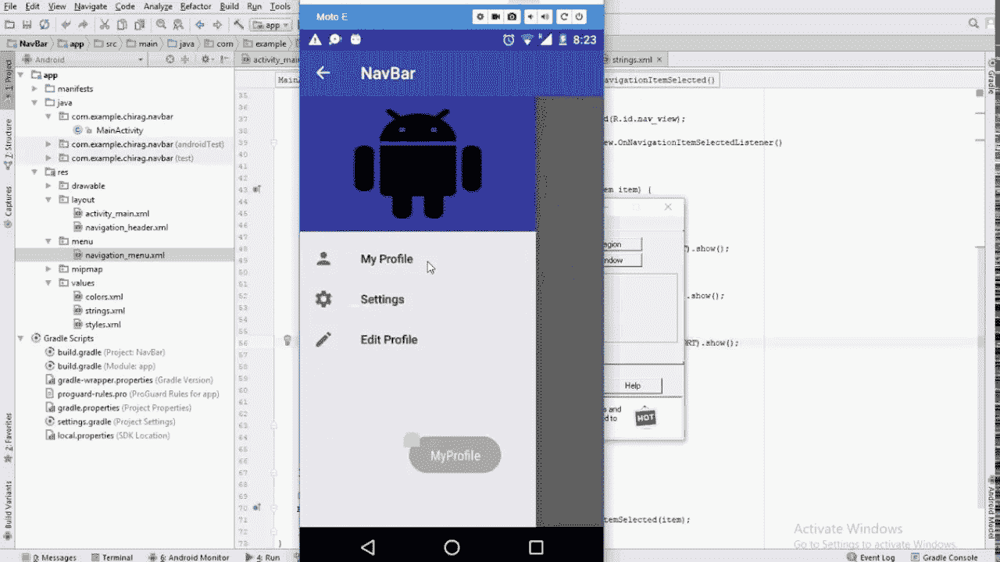
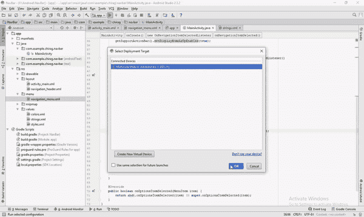

# Android:导航抽屉

> 原文：<https://medium.com/quick-code/android-navigation-drawer-e80f7fc2594f?source=collection_archive---------0----------------------->



大家好。这篇文章谈到了另一个常用的 UI 模式，即“导航抽屉”。通过导航抽屉，用户可以通过点击“汉堡”图标导航到应用程序的许多屏幕或功能。从左侧滑动也是将抽屉带入视野的一种方式，然后屏幕滑入，显示许多物品。你可以点击这些项目，进入这些屏幕使用该应用程序的功能。所以让我们开始吧！

# **第一步:**

创建一个全新的 Android Studio 项目，并将其命名为“NavigationDrawer”。选择一个“空活动”作为您的主要活动，因为我们将从头开始构建屏幕。将这段代码复制粘贴到 activity_main.xml 文件中。

您可能会在包含头文件的第 32 行遇到错误。不要担心，我们将在下一步创建头文件，这将清除错误。

我们正在使用“NavigationView”小部件，它是支持设计库的一部分，因此请确保您的 Build.gradle 文件(应用程序级别)中有最新的 gradle 依赖项:

```
compile ‘com.android.support:design:X.X.X’
```

如果你不确定一个简单的谷歌搜索就能解决问题，记得用最新的版本号替换掉“Xs”。来自[最佳 android 教程](https://blog.coursesity.com/best-mobile-app-design-courses/)的 Android 开发对于初学者来说是一个很好的起点。

# 第二步:

接下来，我们需要创建一个布局资源文件，作为导航抽屉的标题。这是如何-

右键单击 res 文件夹→单击新建→选择布局资源文件。将文件命名为“nav_header.xml ”,然后单击 enter。将以下代码复制粘贴到新创建的布局文件中，以定义导航抽屉的标题部分

在完成创建标题之后，我们需要创建一个菜单资源文件来保存要在抽屉中显示的项目。下面是如何创建菜单资源文件:

右键点击 res 文件夹→选择新建→Android 资源文件→选择资源类型下拉列表下的‘菜单’。

将该文件命名为“navigation_menu.xml ”,并将以下代码复制粘贴到该文件中。

上面的代码将为抽屉创建三个项目，您可以在预览模式下查看它们。它们看起来像“溢出”菜单中的项目，但这个资源文件将用于填充抽屉中的项目。

> 找到关于各种编程语言的[快速代码](http://www.quickcode.co/)的免费课程。获取 [Messenger](https://www.messenger.com/t/1493528657352302) 的新更新。

# 第三步:

在最后一步，我们将在 MainActivity.java 文件中编写 Java 代码，它将作为大脑，负责导航抽屉的行为。所以复制粘贴下面的代码，我会在后面的段落中解释代码行的含义。

将包名重命名为您在开始时选择的名称，您可以在 Manifest.xml 文件中找到包名。对于这一点，强烈建议[学习 Java](https://blog.coursesity.com/best-java-tutorials/) ，因为它是官方的 Android 语言。

在第 14–16 行，我们声明了导航抽屉所需的实例变量，稍后我们使用 onCreate()函数中的 findViewById 方法找到它们。然后，我们在“nv”变量(即导航视图)上添加一个“setNavigationItemSelectedListener ”,以侦听从抽屉中选择特定项目时的任何单击事件。“onNavigationItemSelected”方法中的代码只是显示一条 toast 消息。您可以用想要实现的任何功能替换代码。

最后，我们重写“onOptionsItemSelected()”方法，该方法负责正确响应菜单资源文件中指定的项目。为了简洁起见，我跳过了许多更好的细节；)

如果你正确地遵循了所有的步骤，它应该看起来有点像这样



Navigation Drawer

就这样伙计们！你已经创建了一个功能齐全的导航抽屉，祝贺你自己，或者去找一个可以分享你成功的人。点击下面的链接，获得更生动的编码体验。

我希望你们喜欢这个，一定要点击“鼓掌”按钮，这将鼓励我写更多这样的东西。一如既往，快乐编码:D

请点击👏按钮下面几下，以示支持！⬇⬇

谢谢！别忘了**关注下面的**快速码。