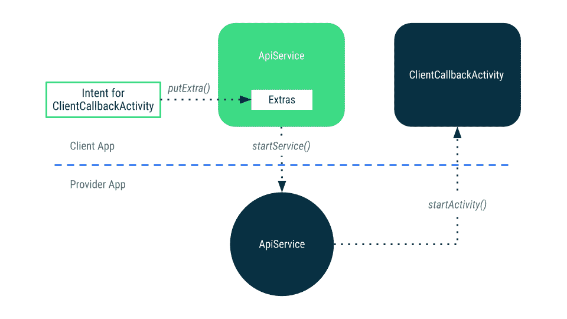
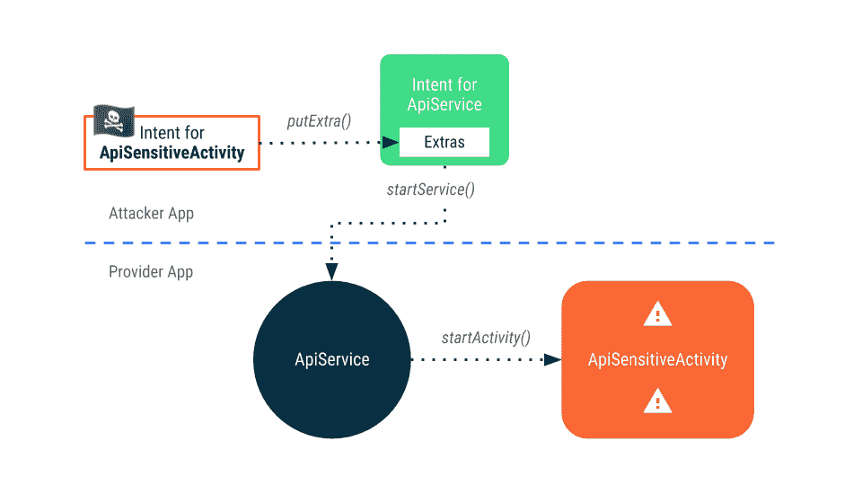
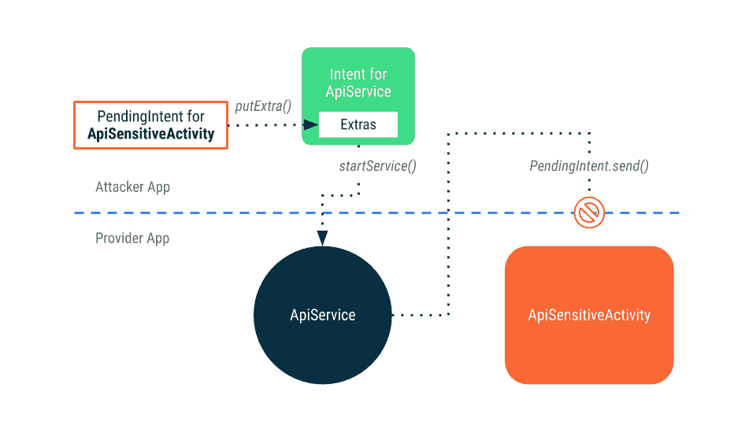

# Android 嵌套意图

> 原文：<https://medium.com/androiddevelopers/android-nesting-intents-e472fafc1933?source=collection_archive---------4----------------------->

Illustration by [Molly Hensley](https://dribbble.com/Molly_Hensley)

你的应用程序是否提供了一个服务，当某个动作发生时，它会启动另一个应用程序的`Activity`作为回调？例如，它是否接受一个`Intent`作为另一个`Intent`的额外参数，该参数用作一个`startActivity()`调用的参数？

您知道这会让您的应用程序易受攻击吗？

在这篇文章的其余部分，我将解释使用这种方法的问题，并提供一个解决方案，让您的应用程序更安全地提供相同的功能。

# 问题是

我们期望这种类型的交互的工作方式是这样的:

*Flowchart showing how an Intent to start a callback activity is added as an extra to an Intent to start a service, which then uses it to start the provided Activity.*

在这里，客户端应用程序为其`ClientCallbackActivity`创建一个`Intent`，并将其作为额外项添加到`Intent`中，它将使用该额外项来启动提供者应用程序的`ApiService`。处理完请求后，提供商应用程序使用客户端应用程序提供的`Intent`来启动`ClientCallbackActivity`。

❗️The 这里需要注意的是，提供者应用程序在自己的应用程序`Context`中调用`startActivity()`。这有两个后果，都不是最理想的:

*   由于`ClientCallbackActivity`正由提供商应用程序启动，因此必须将其标记为`exported`，这不仅允许提供商应用程序启动它，还允许设备上的任何其他应用程序启动它。
*   传递给 ApiService 的嵌套的`Intent`可用于启动任何属于提供商应用程序的`Activity`。这包括私人的、潜在敏感的、不可出口的活动！

为了演示，考虑如果调用应用程序没有为它自己的活动提供一个`Intent`，即:`ClientCallbackActivity`，而是放入一个`Intent`来启动提供者应用程序内的私有活动，会发生什么。

*Flowchart showing how a carefully constructed Intent can be used to start ApiSensitiveActivity in Provider App, even though it isn’t exported and shouldn’t be able to be started by other apps.*

因为使用了嵌套的`Intent`，提供商应用很难防范针对私人的、潜在敏感活动的`Intent`。因为提供者应用程序直接在意向上调用`startActivity()`，所以即使它没有被导出，它也能够启动`ApiSensitiveActivity`。

# 解决方案:挂起内容

解决方案很简单:提供商应用程序可以接受一个`[PendingIntent](https://developer.android.com/reference/kotlin/android/app/PendingIntent)`，而不是接受一个`Intent`。

一个`Intent`和一个`PendingIntent`的区别在于一个`PendingIntent`总是用它被创建时的身份来处理:

*Flowchart showing how accepting a PendingIntent is processed as the identity of the app that created it, preventing it from calling non-exported activities in Provider App.*

因为回调是作为`PendingIntent`提供的，所以当提供者应用程序对其调用`send()`时，`startActivity()`会像攻击者应用程序调用它一样进行，并且由于攻击者应用程序没有启动`ApiSensitiveActivity`的权限，所以系统会阻止活动启动。

这对提供商应用程序来说当然是一个好处，但我们的应用程序，客户端应用程序呢？好吧，既然我们已经提供了一个`PendingIntent`，那么`ClientCallbackActivity`现在有可能成为一个私有的、非导出的活动。这一改变让两个应用程序都有了更好的安全性！

如果你熟悉通知或警报管理器 API，你会注意到它们使用`PendingIntent`来激活动作并向应用发出警报。这就是系统使用`PendingIntent`的原因，它们是作为创建它们的应用程序来处理的，而不是普通的意图。

# 摘要

使用`Intent`作为一种机制来实现对`Activity`的回调会导致提供者和客户端应用程序中的漏洞。这是因为`Intents`总是在调用它们的应用程序的`Context`中处理。这个`Context`提供了在提供者应用程序中启动任何未导出活动的可能性，并强制客户端应用程序导出应该接收回调的活动。

相比之下，`PendingIntents`总是在创建它们的`Context`中被处理。这不仅允许提供者应用自由地使用它们，而不暴露未导出的活动，而且允许客户端指定任何活动(包括未导出的活动)来接收回调。

了解更多关于 Android 12 如何帮助保护应用程序免受嵌套意图的不安全启动。