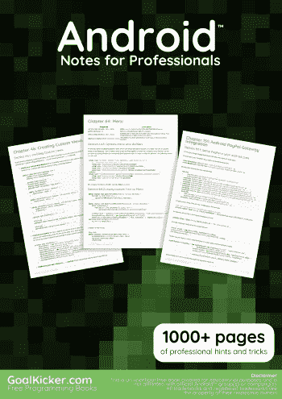
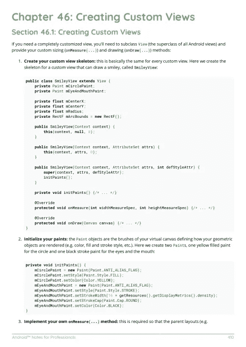

# 电子书:Android 专业人员笔记

> 原文：<https://medium.easyread.co/android-notes-for-professionals-book-ba349baf8c6a?source=collection_archive---------1----------------------->

## GoalKicker.com 免费下载安卓的电子书

**下载这里:**[**【http://books.goalkicker.com/AndroidBook/】**](http://books.goalkicker.com/AndroidBook/)

*《Android Notes for Professionals》一书由* [*栈溢出文档*](https://archive.org/details/documentation-dump.7z) *编译而成，内容由栈溢出的美文人士撰写。文本内容由-SA 在知识共享协议下发布。见本书末尾的致谢，感谢对各章节做出贡献的人。除非另有说明，图像可能是其各自所有者的版权*

*本书以教育为目的，不隶属于 Android 集团、公司或 Stack Overflow。所有商标属于其各自的公司所有者*

*1325 页，2018 年 1 月出版*

# 章

1.  Android 入门
2.  布局
3.  安卓版 Gradle
4.  RecyclerView onClickListeners
5.  导航视图
6.  目的
7.  Android 中的 JSON 与 org.json
8.  安卓工作室
9.  资源
10.  数据绑定库
11.  例外
12.  获取计算视图维度
13.  异步任务
14.  共享首选项
15.  仿真器
16.  材料设计
17.  棉绒警告
18.  服务
19.  将文件存储在内部和外部存储器中
20.  网络视图
21.  项目 SDK 版本
22.  回收视图
23.  Android 版谷歌地图 API v2
24.  端口缓冲模式
25.  9 片图像
26.  安卓 NDK
27.  回收查看装饰品
28.  摄像机 2 API
29.  查看寻呼机
30.  卡片视图
31.  HttpURLConnection
32.  SQLite
33.  安卓调试桥
34.  黄油刀
35.  支持不同分辨率、尺寸
36.  滑音
37.  翻新 2
38.  对话
39.  ACRA
40.  绿岛
41.  格式化字符串
42.  通知
43.  报警管理器
44.  碎片
45.  处理者
46.  创建自定义视图
47.  广播接收机
48.  活动
49.  小吃店
50.  API-23 +中的运行时权限
51.  记录和使用 Logcat
52.  VectorDrawable 和动画 VectorDrawable
53.  工具属性
54.  烤
55.  接口
56.  动画家
57.  位置
58.  主题、风格、属性
59.  清单文件
60.  可包装的
61.  媒体播放器
62.  Multidex 和 dex 方法限制
63.  使用同步适配器进行数据同步
64.  菜单
65.  在 Android Studio 中即时运行
66.  毕加索
67.  蓝牙和蓝牙 LE API
68.  机器人
69.  内存泄漏
70.  通用图像加载器
71.  齐射
72.  小工具
73.  日期和时间选择器
74.  集成 Google 登录
75.  应用内计费
76.  浮动操作按钮
77.  内容提供者
78.  匕首 2
79.  领域
80.  使用 JUnit 在 Android 中进行单元测试
81.  Android 版本
82.  Wi-Fi 连接
83.  传感器管理器
84.  Android 中的资源本地化
85.  进度条
86.  自定义字体
87.  震动
88.  谷歌感知 API
89.  文本到语音(TTS)
90.  UI 生命周期
91.  纺纱机
92.  数据加密/解密
93.  用 Espresso 测试用户界面
94.  编写 UI 测试— Android
95.  绿色机器人事件巴士
96.  OkHttp
97.  使用图标字体增强 Android 性能
98.  处理深层链接
99.  使用 SurfaceView 绘制画布
100.  重火力点
101.  崩溃报告工具
102.  检查互联网连接
103.  Android 版脸书软件开发工具包
104.  在 Android 中解压缩文件
105.  Android Places API
106.  为 Android 应用创建自己的库
107.  Gson
108.  设备显示指标
109.  文本视图
110.  列表视图
111.  构建向后兼容的应用程序
112.  装货设备
113.  ProGuard——混淆和缩小你的代码
114.  检测 Android 中的震动事件
115.  Typedef 批注:@IntDef，@StringDef
116.  捕捉屏幕截图
117.  MVP 架构
118.  方向改变
119.  曝光
120.  安全性
121.  PackageManager
122.  图像视图
123.  手势检测
124.  瞌睡模式
125.  Android 声音和媒体
126.  搜索视图
127.  相机和画廊
128.  回拨 URL
129.  Twitter APIs
130.  抽屉
131.  颜色；色彩；色调
132.  约束布局
133.  渲染脚本
134.  壁画
135.  滑动以刷新
136.  AutoCompleteTextView
137.  使用 ADB 安装应用程序
138.  IntentService
139.  AdMob
140.  隐含的意图
141.  发布到游戏商店
142.  Firebase 实时数据库
143.  图像压缩
144.  电子邮件验证
145.  键盘
146.  纽扣
147.  TextInputLayout
148.  底部板材
149.  CoordinatorLayout 布局和行为
150.  编辑文本
151.  Android PayPal 网关集成
152.  Firebase 应用程序索引
153.  Firebase 崩溃报告
154.  显示谷歌广告
155.  Android Vk Sdk
156.  Android 中本地化的日期/时间
157.  倒计时定时器
158.  条形码和二维码读取
159.  奥托事件总线
160.  可转换的
161.  Android 中使用附着库的端口映射
162.  创建覆盖(总是在顶部)窗口
163.  ExoPlayer
164.  使用 UIAutomator 进行应用程序间 UI 测试
165.  媒体会话
166.  语音到文本转换
167.  文件提供者
168.  XMPP 注册登录和聊天的简单例子
169.  Android 认证器
170.  RecyclerView 和 LayoutManagers
171.  音频管理器
172.  作业调度
173.  客户和客户经理
174.  将 OpenCV 集成到 Android Studio 中
175.  分屏/多屏活动
176.  线
177.  媒体商店
178.  时间利用
179.  触摸事件
180.  android 中的指纹 API
181.  MVVM(建筑)
182.  BottomNavigationView
183.  android 中的 ORMLite
184.  Youtube-API
185.  表格布局
186.  用 RxJava 改造 2
187.  日夜主题(AppCompat v23.2 / API 14+)
188.  快捷方式经理
189.  鲁卡奇
190.  Android 项目的 Jenkins CI 设置
191.  android 中的 Zip 文件
192.  矢量绘图
193.  快车道
194.  定义自定义范围的步长值(增量)SeekBar
195.  OpenGL ES 2.0+入门
196.  检查数据连接
197.  Android Java 原生界面(JNI)
198.  使用 Android 的 FileIO
199.  性能优化
200.  机器人电器
201.  魔石
202.  严格模式策略:一个在编译时捕捉 bug 的工具。
203.  国际化和本地化(I18N 和 L10N)
204.  在 android 项目上设置 Retrolambda 的快速方法。
205.  如何使用 SparseArray
206.  Firebase 云消息传递
207.  共享元素转换
208.  安卓的东西
209.  视频视图
210.  取景器
211.  库匕首 2:应用程序中的依赖注入
212.  用模式格式化电话号码。
213.  如何安全地存储密码
214.  Android 内核优化
215.  颜料
216.  音轨
217.  什么是 ProGuard？安卓里用的是什么？
218.  创建 Android 定制 rom
219.  Android 上的 Java
220.  RecyclerView 中的分页
221.  android 版 Genymotion
222.  处理触摸和运动事件
223.  创建闪屏
224.  约束集
225.  CleverTap
226.  将库发布到 Maven 资源库
227.  亚行外壳
228.  Ping ICMP
229.  AIDL
230.  使用 Kotlin 进行 Android 编程
231.  自动调整文本视图大小
232.  签署您的 Android 应用程序以供发布
233.  活动识别
234.  安全共享首选项
235.  安全共享首选项
236.  位图缓存
237.  VirtualBox 中的 Android-x86
238.  JCodec
239.  设计模式
240.  奥基奥
241.  android 上的 Google 登录集成
242.  张量流
243.  Android 游戏开发
244.  通知频道 Android O
245.  蓝牙低能耗
246.  Leakcanary
247.  向 Android 项目添加 FuseView
248.  使用 ContentValues 类访问 SQLite 数据库
249.  增强警报对话框
250.  硬件按钮事件/意图(PTT、LWP 等。)
251.  斯潘纳·莱斯特林
252.  尺蠖
253.  优化的视频视图
254.  Google Drive API
255.  动画警报对话框
256.  注释处理器
257.  同步适配器定期同步数据
258.  为 Toast 消息创建单例类
259.  法斯特森
260.  Android 架构组件
261.  杰克逊
262.  谷歌 Play 商店
263.  有效加载位图
264.  获取系统字体名称并使用字体
265.  智能卡
266.  将越南语字符串转换为英语字符串 Android