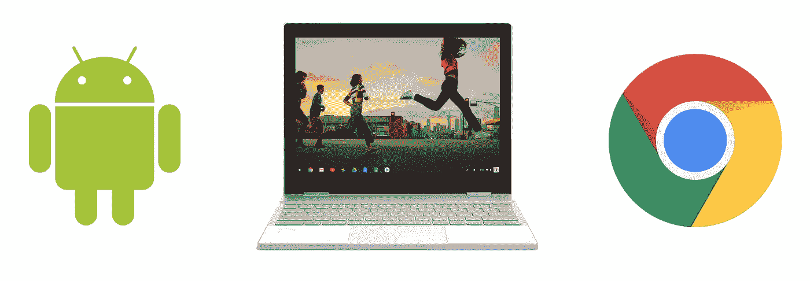

# Chrome 操作系统上的 Android 实现拖放

> 原文：<https://medium.com/androiddevelopers/android-on-chrome-os-implementing-drag-drop-2cc2bdcdc621?source=collection_archive---------9----------------------->

## 向您的 Android 应用程序添加拖放功能

虽然[拖放](https://developer.android.com/guide/topics/ui/drag-drop.html)从 Honeycomb 3.0 开始就可以用于 Android，但是越来越多的大屏幕 Android 设备(平板电脑、可折叠和 Chrome OS)使得这项功能更加有用，也更加重要。

这篇文章将向你展示如何通过创建一个可以从 Chrome OS 文件管理器接收文件的拖放目标来实现拖放。它还演示如何将 TextView 设置为可拖动项。

完整示例的源代码可以在[这里](https://github.com/android/user-interface-samples/tree/main/AndroidOnChromeOSDragAndDropDemo)找到。

请注意:这里找到的所有代码都是根据 [Apache 2.0 许可证](https://www.apache.org/licenses/LICENSE-2.0)授权的，并不是任何谷歌官方产品的一部分。

2021 年 10 月 21 日更新:移除了不再需要的特殊 Chrome OS MIME 类型，并将代码片段转换为 Kotlin。

# Chrome 操作系统、平板电脑、可折叠和大屏幕注意事项

*   您必须通过**requestDragAndDropPermissions**请求权限，才能访问从应用程序外部拖入的项目
*   您的可拖动项目必须有标志**视图。 *DRAG_FLAG_GLOBAL*** 以便被拖出到其他应用程序

# 设置放置目标

先把**这边的事情摆好**再说。Android 使用 **DragListeners** 来设置目标以响应拖动事件。侦听器告诉系统它可以接收哪种类型的项目，提供视觉反馈，并处理成功的投放。

## 翁德拉格

首先创建一个空的 [OnDragListener](https://developer.android.com/reference/android/view/View.OnDragListener.html) :

每当 Android 中发生拖动事件时，就会调用 onDrag 。例如，如果一个用户开始从文件管理器中拖动一个文件，这就是你告诉你的用户界面视觉响应，并表明它可以接收文件。 **onDrag** 还定义了当项目悬停在目标上方以及实际被放下时会发生什么。

查看官方文档，了解不同[拖动事件](https://developer.android.com/guide/topics/ui/drag-drop.html#AboutDragEvent)的完整描述，简短版本如下:

*   **拖动任何一项都会触发动作 _ 拖动 _ 启动**。您的目标应该过滤它可以接收的有效项目，并提供它是就绪目标的视觉指示。
*   **动作 _ 拖动 _ 进入**和**动作 _ 拖动 _ 退出**在项目被拖动并进入/退出目标区域时触发。提供视觉反馈，让用户知道他们正在拖放区。
*   **动作 _ 掉落**在物品实际掉落时触发。在此处理项目。
*   **拖放成功或取消时，触发 ACTION_DRAG_ENDED** 。将用户界面恢复到正常状态。

现在让我们充实一下每个 **onDrag** 行动案例。

## 动作 _ 拖动 _ 开始

每当开始拖动时，都会触发此事件。我们需要指出我们是否可以接收这个特定的项目(返回真)或不(返回假)，并在视觉上让用户知道我们是否可以。拖动事件将包含一个 **ClipDescription** ，它包含关于被拖动项目的信息。

在 **ACTION_DRAG_STARTED** 中，我们检查项目的 **MIME** 类型，以决定这个目标是否可以接收它。在这个例子中，我们允许纯文本和 PNG 图像，并通过将背景染成深绿色来表明目标是有效的。

> 注意:在过去，从 Chrome OS 文件管理器中拖入的文件会有**application/x-arc-uri-list**MIME 类型，现在不再是这样了。就像在其他 Android 设备上一样使用标准的 MIME 类型。

## 进入、退出和结束

这是视觉/触觉反馈逻辑的地方。在本例中，当项目悬停在目标区域上方时，我们会使绿色背景变亮，以指示用户可以成功放下它。最后，您希望将 UI 重置为正常的非拖放状态。

## 动作 _ 丢弃

这是项目实际放到目标上时发生的事件。需要使用 **ContentResolver** 来访问文件项。

注意:要从其他应用程序/窗口接收项目，你必须请求**拖拽权限**。这对于 Android 大屏手机、平板、可折叠、Chrome OS 设备尤为重要。

## 目标范围

现在我们有了一个侦听器，我们需要将它附加到我们希望接收拖动事件的视图:

## 测试一下

现在你应该有一个工作的**下降目标**——在移动到这篇文章的**拖动项目**部分之前测试它。从文件管理器拖动一个文本文件或 PNG 文件到你的应用程序，你应该看到预期的视觉指示，并能够将项目拖放到目标区域。

# 设置拖动项目

拖动过程通常由长按触发**。要指示一个项目可以被拖动，添加一个 [LongClickListener](https://developer.android.com/reference/android/view/View.OnLongClickListener.html) ，它为系统提供要传输的数据，并指示它是什么类型的数据。您还可以在这里设置项目被拖动时的外观。**

对于这个例子，我们有一个可以从 TextView 中拖出的纯文本项。内容设置为文本视图的文本内容，MIME 类型设置为 **ClipDescription。 *MIMETYPE_TEXT_PLAIN*** 。注意:您也可以使用 [**newPlainText**](https://developer.android.com/reference/android/content/ClipData.html#newPlainText(java.lang.CharSequence,%20java.lang.CharSequence)) 创建一个纯文本拖动项，但是我们在这里的做法更加透明，并且更容易扩展到其他数据类型。

对于被拖动文本的**视觉方面**，使用内置的[dragshaodbuilder](https://developer.android.com/reference/android/view/View.DragShadowBuilder.html)获得标准的半透明拖动外观。查看文档中的[开始拖动](https://developer.android.com/guide/topics/ui/drag-drop.html#StartDrag)以获得更复杂的示例。

最后，当实际的拖动开始时，设置 **DRAG_FLAG_GLOBAL** 标志来表示这个项目可以被拖动到其他应用程序中。

把这些放在一起，你就有了一个可以在 Chrome OS 上使用的拖放应用程序！

在 GitHub 上获取演示应用[的完整源代码。](https://github.com/android/user-interface-samples/tree/main/AndroidOnChromeOSDragAndDropDemo)

> 这里找到的所有代码都获得了 Apache 2.0 许可证的许可。这里没有任何谷歌官方产品的一部分。