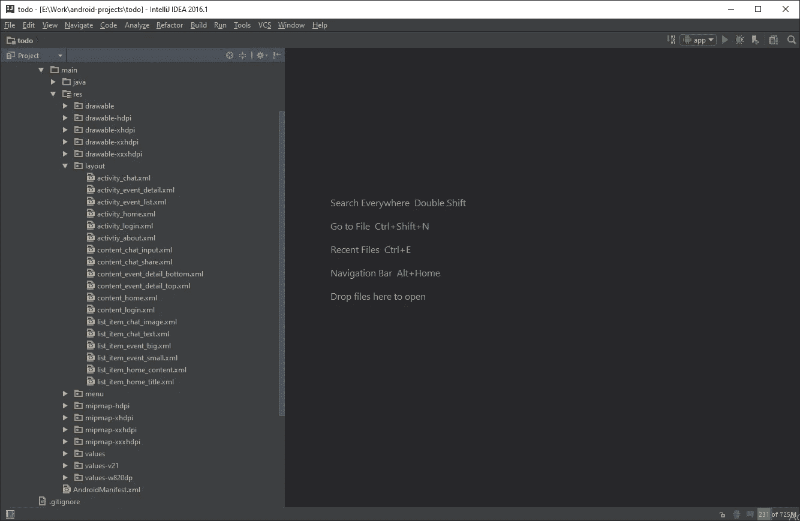
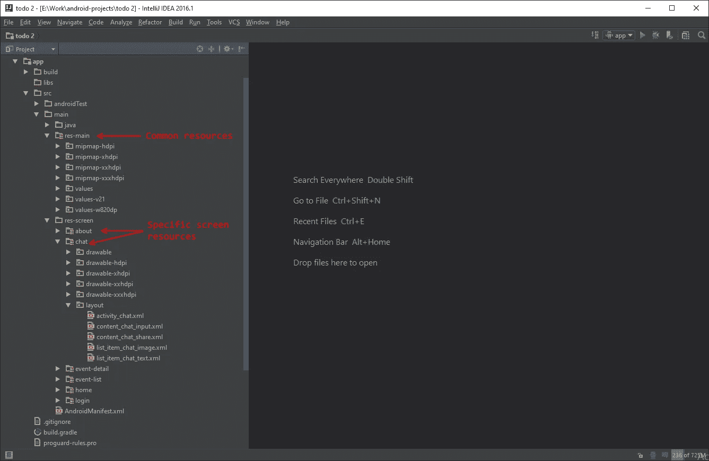
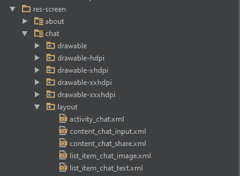

# Android 项目结构——替代方式

> 原文：<https://medium.com/google-developer-experts/android-project-structure-alternative-way-29ce766682f0?source=collection_archive---------0----------------------->

我们都知道 android 项目结构的样子——把所有的图片放在这个文件夹中，所有的布局放在那个文件夹中。但是……在项目开发过程中，文件数量迅速增长，导航和搜索所需文件变得很困难。



Typical android project structure

# 资源文件夹—每个屏幕

如果你的屏幕包含了大量的布局、可绘制性和尺寸，为每个屏幕创建单独的资源文件夹是有意义的。



Resource folder — per screen android project structure

正如你在上面的图片中看到的，我们在*主*文件夹中有两个根文件夹:

*   *res-main* 包含在多个屏幕上使用的所有公共资源。
*   *res-screen* 包含每个屏幕的资源文件夹，例如*关于*、*聊天*、*事件详情*、*事件列表*、*主页*、*登录*

让我们看看*聊天*屏幕资源文件夹中有什么。



Resource folder

聊天本身由几个 *xml 布局*文件组成，所以我们创建了*聊天布局*文件夹，并将所有这些文件移到这里。它也有很多*。仅在聊天屏幕上使用的 png* 图像，因此我们将所有这些图像文件移动到*聊天 drawable-hdpi* 、 *drawable-xhdpi* 、 *drawable-xxhdpi* 和 *drawable-xxxhdpi* 文件夹中。

当实现*聊天*的横向布局或平板版本时，我们将在*聊天*屏幕资源文件夹中制作*布局-陆地*和*布局-sw720dp* 文件夹。

# 如何声明屏幕资源文件夹？

打开 *app.gradle* 文件，在 *android* 部分声明 *sourceSets* 。更多关于资源合并[这里](http://tools.android.com/tech-docs/new-build-system/resource-merging)。

```
sourceSets {
    main {
        res.srcDirs = [
                'src/main/res-main',
                'src/main/res-screen/about',
                'src/main/res-screen/chat',
                'src/main/res-screen/event-detail',
                'src/main/res-screen/event-list',
                'src/main/res-screen/home',
                'src/main/res-screen/login',
        ]
    }
}
```

不用显式声明所有资源文件，您可以编写简单的脚本，将给定文件夹的所有子文件夹添加到 *srcDirs。*

```
sourceSets {
    main {
        file('src/main/res-screen')
                .listFiles()
                .each { res.srcDirs += it.path }
    }
}
```

> **注意:**以上仅在项目视图中有效

# 结论

如果你有一个大项目，并希望安排你的文件夹，迅速看到哪些布局，可画，价值等。属于哪个屏幕试着使用*资源文件夹——per screen*Android 项目结构。

# 常见问题解答

我有以下错误:“URI 没有注册”

*   在 Android Studio / Intellij IDEA 中，点击*菜单—文件—无效缓存/重启…*
*   等到项目被编入索引