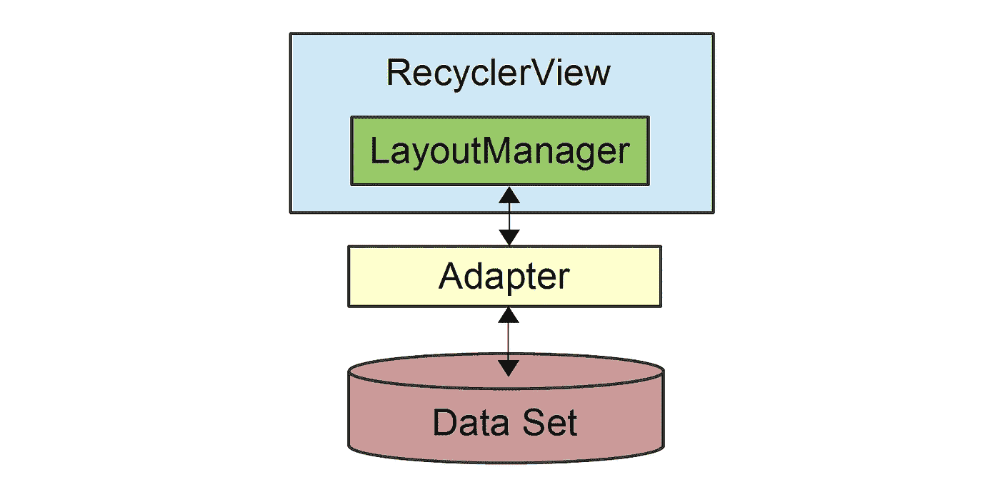

# Android:面向初学者的 Recyclerview(第 1 部分)

> 原文：<https://medium.com/globant/android-recyclerview-for-beginners-part-1-b089ff2862f6?source=collection_archive---------0----------------------->

*   ***Android 平台中的 RecyclerView*** 是很多 Android 应用中经常出现的重要组件。
*   ***RecyclerView*** 使用一个适配器来表示我们想要显示为列表的信息。
*   它只为可视屏幕创建足够的组件，并允许用户滚动列表。
*   ***RecyclerView*** 是 **listview** 的更高级版本，基于 View holder 设计模式工作。使用 recyclerview，我们可以显示网格以及项目列表。

> 顾名思义，**在**视图保持器**模式的帮助下，一旦视图**超出范围(屏幕),就会回收视图。简单地说，我们可以说 ***【回收】*** 将组件保留在屏幕上，并简单地通过表示来改变数据。

*   ListView 也可以有**viewpowners**，但是默认情况下这是不可用的，这迫使我们添加更多的代码来提高列表的性能。
*   **布局管理器:**负责在 Recyclerview 中测量和定位项目视图。
*   通过改变 layout manager a***recycler view***可以用来实现标准的垂直滚动列表、统一网格、交错网格、水平滚动集合等等。
*   它的主要工作是管理 adapter 提供的大型数据集的布局。它将每个项目视图定位到其在 ***回收视图*** 中的适当位置。此外，它还重用了对用户不再可见的视图。

> 还有一些常用的布局管理器:
> 
> **1。)LinearLayoutManager** 根据方向将项目排列成 1 列或 1 行。例如，水平 **LinearLayoutManager** 将从左到右将项目放在一行中。
> 
> **2。)GridLayoutManager** 它将所有组件排列在一个大小相等的单元格网格中，从左到右、从上到下添加它们。一个单元中只能放置一个组件，并且网格的每个区域都具有相同的大小。

*   使用 recyclerview，我们可以显示网格以及项目列表
*   ***适配器*** :适配器提供了从特定于应用的数据集到视图的绑定，这些视图显示在 ***RecyclerView*** 中。

> 牢记三件事 ***:***
> 
> `1\. ) **RecyclerView.Adapter**` -处理数据收集并将其绑定到视图
> 
> `2\. ) **LayoutManager**` -帮助定位物品
> 
> `3\. ) **ItemAnimator**` **-** 帮助为常见操作制作项目动画，如添加或删除项目

Simple data diagram

*   ItemAnimator : Recyclerview。ItemAnimator 将动画显示 ViewGeoup 修改，如通知给适配器的添加/删除/选择。
*   有了这几点，我们就可以理解 recyclerview 内部是如何工作的了，在我的下一篇博客中，我们将通过例子来理解 ***RecyclerView*** 。

快乐阅读:)