# Android strings.xml —需要记住的事情

> 原文：<https://medium.com/google-developer-experts/android-strings-xml-things-to-remember-c155025bb8bb?source=collection_archive---------1----------------------->

这篇文章是关于 android 的一些琐事，比如— *strings.xml*

# 不要重复使用

> 不要在不同的屏幕上重复使用字符串。

1.假设你在*登录*和*注册*屏幕上有一个加载对话框。两者都有加载对话框，你决定使用同一个字符串— *R.string.loading* 。

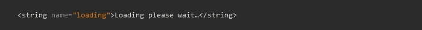

res/values/strings.xml

以后如果你决定使用一个不同的，你将不得不创建两个新的字符串，并用 java 代码进行修改。如果从一开始就使用两个字符串，那么只需修改 *strings.xml* 文件。

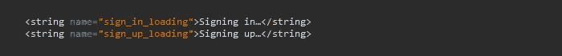

res/values/strings.xml

2.您永远不知道您的应用程序可能支持哪种语言。在一种语言中，你可以在不同的上下文中使用同一个单词，但在另一种语言中，你必须在不同的上下文中使用不同的单词。

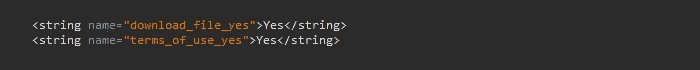

res/values/strings.xml

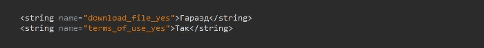

res/values-UA/strings.xml

请注意，英文版的 *strings.xml* 对*r . string . download _ file _ Yes*和*r . string . terms _ of _ use _ Yes*字符串使用了同一个单词“Yes”。

但是乌克兰语版本的 *strings.xml* 使用了两个不同的单词——“гаразд”表示*r . string . download _ file _ yes*和“так”表示 *R.string.terms_of_use_yes。*

# **分开**

> 通过前缀和注释分隔属于同一屏幕的字符串

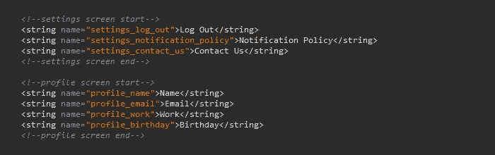

res/values/strings.xml

1.  为每个字符串添加*屏幕名称前缀*有助于立即识别当前字符串属于哪个屏幕。
2.  Clean *strings.xml* 文件有助于轻松维护字符串并将其翻译成不同的语言——一屏接一屏。

> 为每个屏幕创建单独的 strings.xml 文件

如果您愿意，您可以为每个屏幕创建 *strings.xml* 文件— *设置—strings . XML*、*配置文件—strings . XML*。但通常，应用程序有 10-20 个屏幕。所以在我看来，在每个语言文件夹中有 10-20 个 strings.xml 文件会带来巨大的混乱。

# 格式

> 使用 Resources#getString(int id，Object… formatArgs)格式化字符串

不要通过 **+** 操作符进行字符串连接，因为在其他语言中，单词的顺序可能会有所不同。

res/values/strings.xml

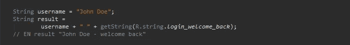

java code

正确的做法是使用[*Resources # getString(int id，Object…formatArgs)*](https://developer.android.com/reference/android/content/res/Resources.html#getString%28int,%20java.lang.Object...%29)*。*

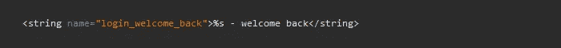

res/values/strings.xml

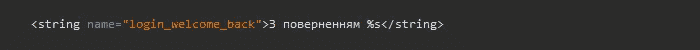

res/values-UA/strings.xml

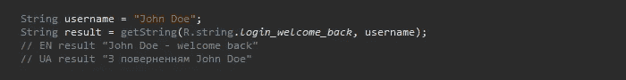

java code

# 复数

> 将 Resources # getQuantityString(int id，int quantity)用于数量字符串

永远不要在 java 代码中解析复数，因为不同的语言对于数量的语法一致性有不同的规则。

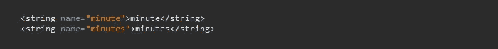

res/values/strings.xml

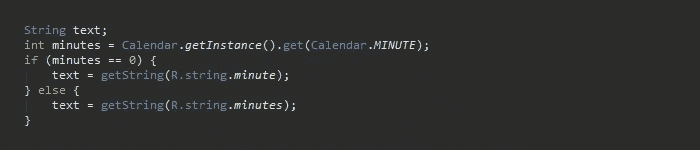

java code

正确的做法是使用[*Resources # getQuantityString(int id，int quantity*](https://developer.android.com/reference/android/content/res/Resources.html#getQuantityString%28int,%20int%29) *)。*

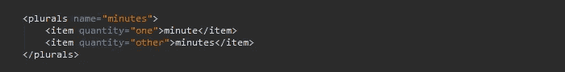

res/values/strings.xml

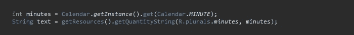

java code

# 单词突出显示

> 使用 html 文本突出显示静态单词

如果你想在*文本视图中改变一些单词的颜色，那么* [*前景颜色跨度*](https://developer.android.com/reference/android/text/style/ForegroundColorSpan.html) 并不总是最好的选择，因为高亮显示是通过索引来完成的，在多语言应用中并不安全。最好在你的 *strings.xml* 文件中使用 *html 字体颜色标签*。

假设你有文本“发现和玩游戏”并且你想用蓝色突出显示“发现”单词和“播放”单词。

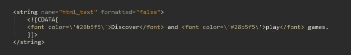

res/values/strings.xml

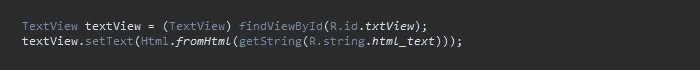

java code