# Android Studio 设计工具 UX 更改—拆分视图

> 原文：<https://medium.com/androiddevelopers/android-studio-design-tools-ux-changes-split-view-dcde75e88a0c?source=collection_archive---------5----------------------->

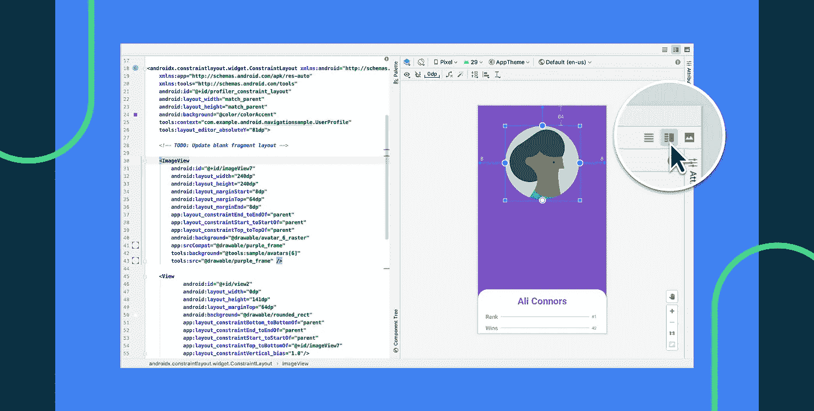

> 在本文中，我们将介绍 Android Studio 3.6 中设计编辑器的新行为，深入了解 UX 变化的一些细节，并展示您可以用它做的很酷的新事情。以下帖子由 Amaury Medeiros(软件工程师)和 Paris Hsu (UX 设计师)代表版面编辑团队撰写。

# 介绍设计工具拆分视图

在 Android Studio 3.6 中，我们正在改变您切换设计文件编辑模式的方式。我们现在只在设计编辑器中打开设计文件，它有三种不同的模式(图 2)，而不是通过选择左下角的相应选项卡在“文本”和“设计”编辑器之间进行选择(图 1)。请继续阅读，找出我们所做的改变及其背后的动机。

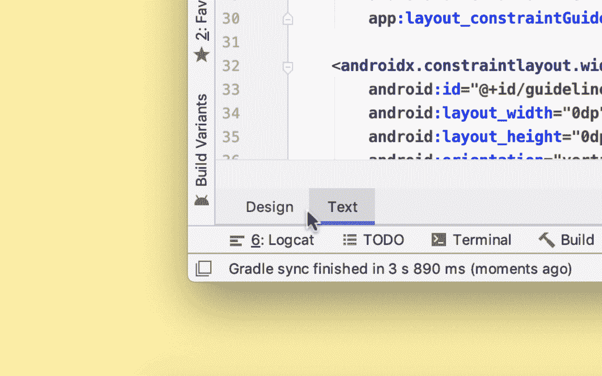

Figure 1 — Design / Text view (Before)

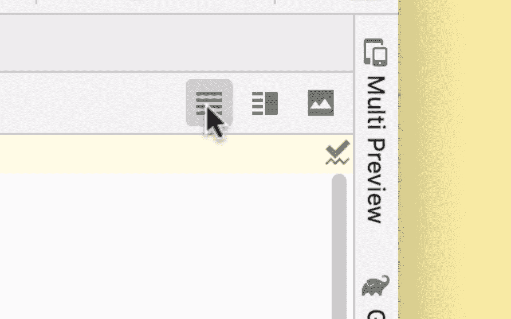

Figure 2 — Split view (After)

您可以通过点击编辑器右上角的相应按钮或使用键盘快捷键来选择以下模式(如果您使用的是 Mac，请使用 *Ctrl + Shift +左/右箭头*，否则请使用 *Alt + Shift +左/右箭头*):

*   ***代码*** :提供 XML 文本编辑器的功能。
*   ***Design*** :由一个包含设计编辑器(如导航图、布局)的视图组成，可用于图形化编辑文件。
*   ***分割*** :并排显示*代码*和*设计*，这样您可以在编辑文本的同时预览您的设计。

以前版本的用户可能会发现新的*分割*视图体验类似于在预览窗口打开的情况下简单地编辑 XML 文件。然而，我们将在这一部分解释一些关键的区别。

## 保留每个文件的状态

如上所述，*分割*视图显示的是一个文件的*设计*旁边对应的*代码*。如果您使用*分割*视图预览资源文件，然后切换到*设计*模式使用我们的图形工具编辑资源，我们现在保留设计编辑器的状态，如缩放级别和选择。

我们知道并行编辑多个资源文件是一种常见的情况。每个文件都有不同的需求，所以你可能想在*设计*模式下编辑一个特定的文件，在*分割*模式下编辑另一个，在*代码*模式下编辑另一个(图 3)。编辑器现在保留每个文件的编辑器状态，因此您可以在文件之间切换，而不必担心丢失预览状态。

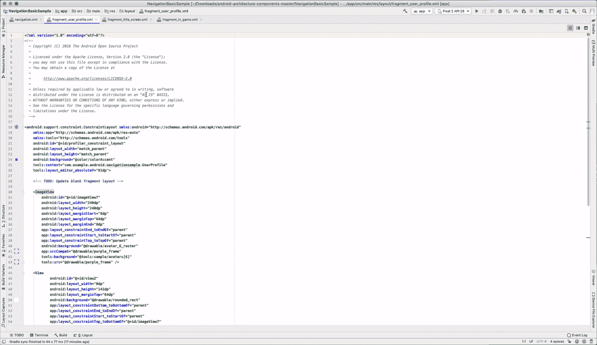

Figure 3 — Switching files that are different modes

在以前的版本中，*预览*窗口的状态会在你切换文件时被重置。想象你正在*文本*模式下编辑某个文件 A，并放大了*预览*窗口，然后切换到*设计*模式下编辑文件 B。切换回文件 A 会重置*预览*状态，即使文件 B 没有使用它(图 4)。

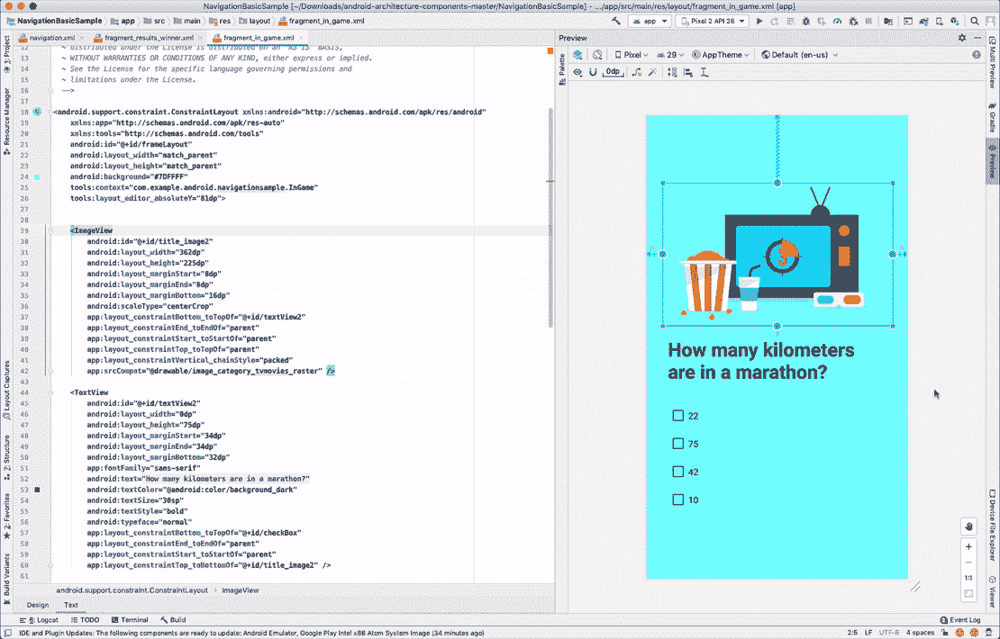

Figure 4 — Preview panel losing zoom level on file switch

## 预览工具窗口已被删除

您可以使用新添加的 *Split* 视图预览您的资源文件，因此我们不再需要预览工具窗口。以前，每当您使用*文本*编辑器打开一个资源文件时，我们都会显示这个工具窗口。如果您将编辑器更改为 *Design* 或者打开一个非资源文件，我们将隐藏工具窗口(图 5)。由于 Android Studio / IntelliJ 中没有其他工具窗口不共享相同的行为，这可能会令人困惑。

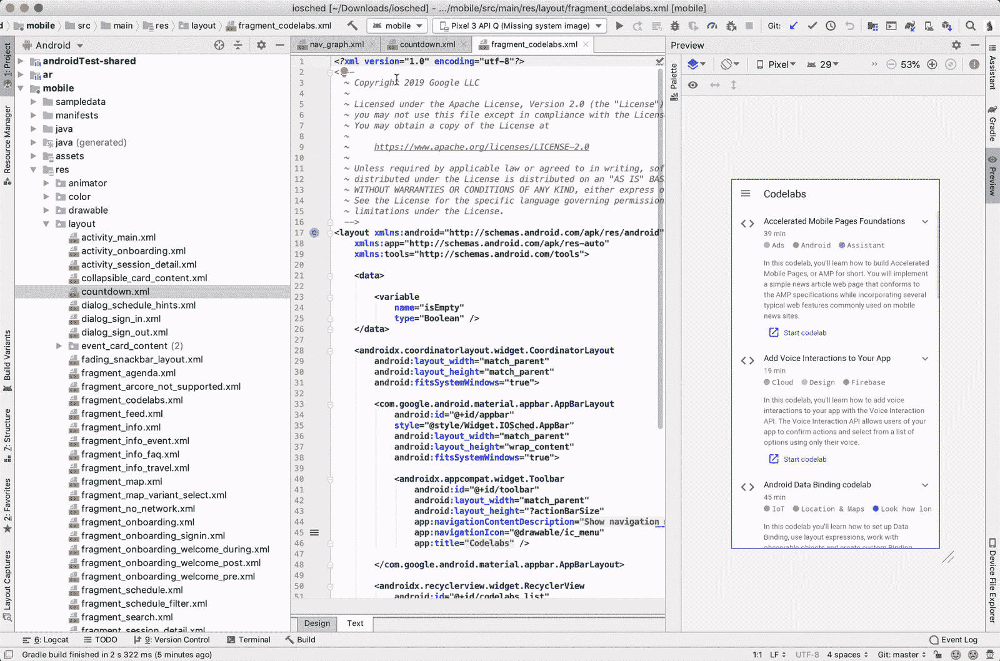

Figure 5 — Preview tool window disappearing on file switch

## 拆分视图包含所有工具窗口

说到工具窗口，*分割*视图包含了你在*设计*模式下看到的所有工具窗口。在以前的版本中，预览工具窗口只提供了*调色板*工具窗口，这意味着你需要在*文本* +预览到*设计*之间来回切换，以查看你的组件树。

# 导航编辑器支持

除了上面提到的可用性变化，我们还想改进对更多类型资源文件的预览支持。我们很高兴地宣布，您可以使用新的*分割*模式打开导航图形文件，并在导航编辑器中预览结果的同时编辑这些文件。这对于大而复杂的图形特别有用。例如，如果您有多层嵌套图，您可能需要在“设计”和“文本”编辑器之间切换几次，以将代码中的特定片段与其对应的图形部分匹配起来，如图 6 所示。现在，您只需要单击 XML 部分的<片段>标签，就可以在图形部分显示该片段，即使它位于嵌套图中，如图 7 所示。类似地，通过在编辑器的图形部分选择感兴趣的组件，您可以很容易地在大型导航图中找到元素。文本选择跳转到相应的 XML 标签。

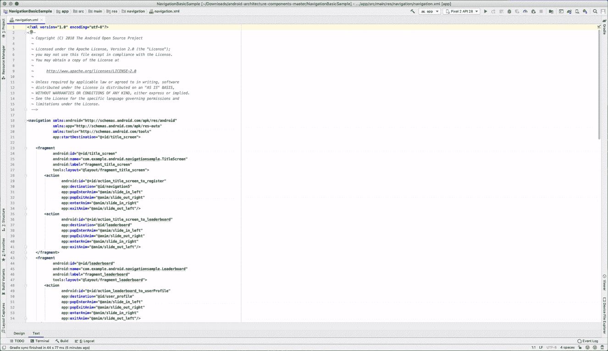

Figure 6 — Finding target (before)

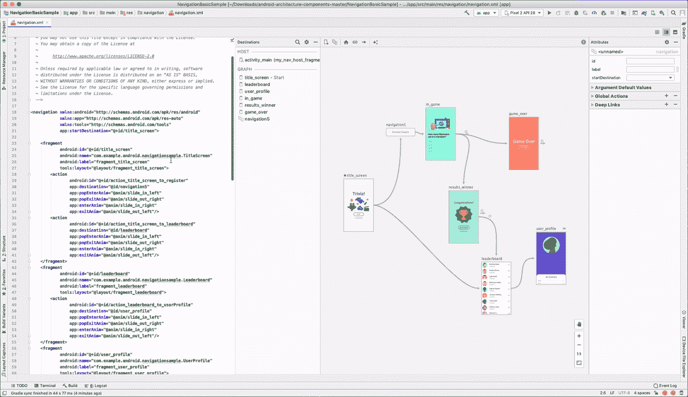

Figure 7 — Finding target (after)

# 抽取式支架

我们现在提供了在*设计*模式下打开 drawable 的选项，这样文本编辑器就不会占用宝贵的 UI 空间。这很有用，例如，如果您需要放大很多以检查特定资产。

以前，您只能使用 XML 编辑器打开 drawables，我们会提供使用预览窗口预览 drawable 的选项。图 8 和图 9 分别显示了在我们将 UX 变更引入设计编辑器之前和之后，详细验证矢量可绘制路径的例子。

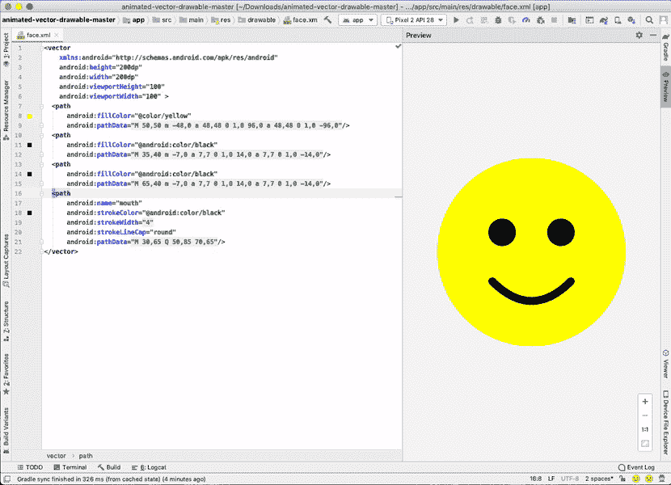

Figure 8 — Drawable example (before)

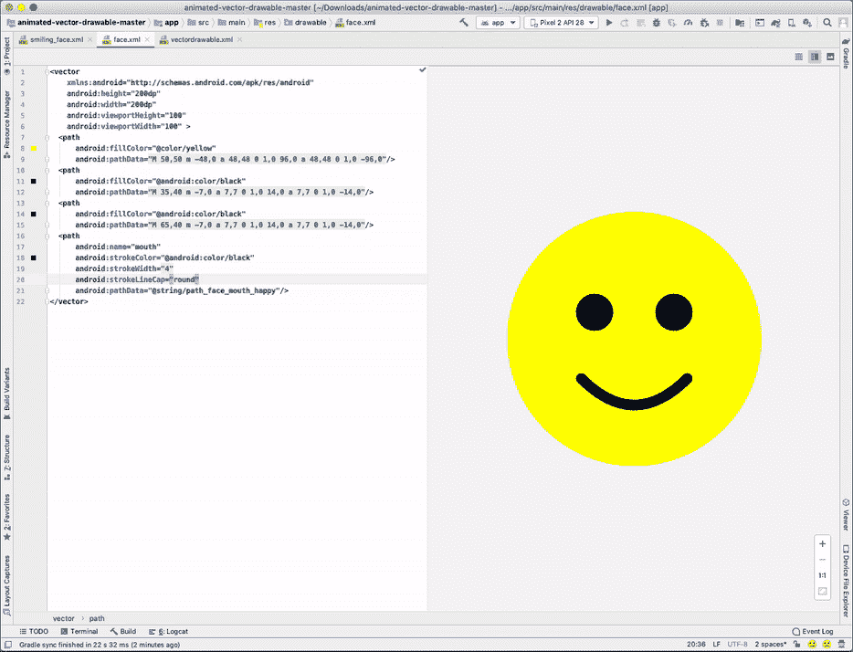

Figure 9 — Drawable example (after)

# 支持替代用法

我们知道，许多开发人员有一个设置，不清楚如何最好地融入 Android Studio 3.6 中引入的 UX 变化。在这里，我们将带您浏览一些场景。

## 文本编辑器+预览

对于目前在开发 UI 时使用*文本+* *预览*面板作为默认设置的开发者来说，我们相信新的*拆分*模式提供了非常相似的体验。

## 浮动预览窗口

对于在浮动窗口中使用*预览*面板的开发人员，您可以通过执行以下操作获得类似的体验(图 10):

1.  在编辑器中，右键单击要浮动的文件的选项卡。
2.  在上下文菜单中，点击*垂直分割*。该文件的另一个实例在垂直分割配置*中的单独选项卡中打开。*
3.  将新标签拖到 Android Studio 之外，创建一个浮动窗口。
4.  在新选项卡中，选择*设计*模式，使该窗口作为您的浮动预览。

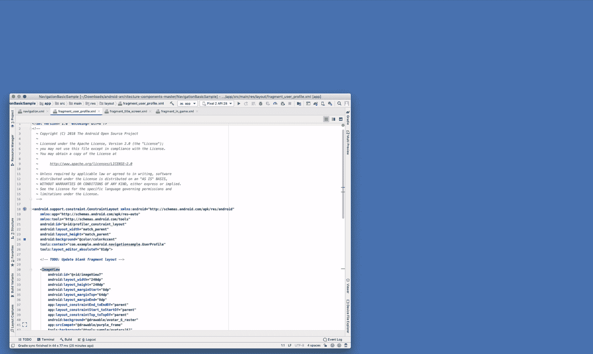

Figure 10 — Split as floating window

## 垂直预览窗口

最后，对于那些垂直使用*预览*面板的人来说，将它附加到文本编辑器的底部(在垂直监视器中特别有用)。您现在可以通过执行以下操作来获得类似的体验(图 11):

1.  在编辑器中，右键单击要预览的文件的选项卡。
2.  在上下文菜单中，点击*水平分割。*
3.  在新选项卡中，选择*设计*模式。

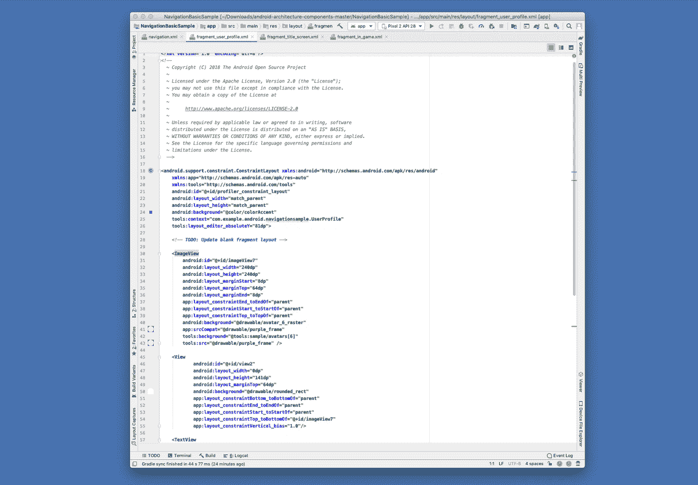

Figure 11 — Split vertically

# 我们需要您的反馈

我们一直努力为我们的用户提供最好的体验！告诉我们您的想法，并让我们知道我们是否可以做些什么来改进您的工作流程。另外，考虑报名参加我们的[调查研究](https://userresearch.google.com/)。

如果你在新的 UX 变更中遇到任何问题，或者如果你对我们如何进一步提高你的生产力有什么想法，请[提交一个 bug](https://issuetracker.google.com/issues/new?component=192747&template=1023344) 。我们将继续优化性能，修复错误，并采纳您的建议和反馈。谢谢大家！