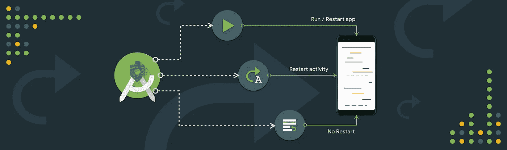
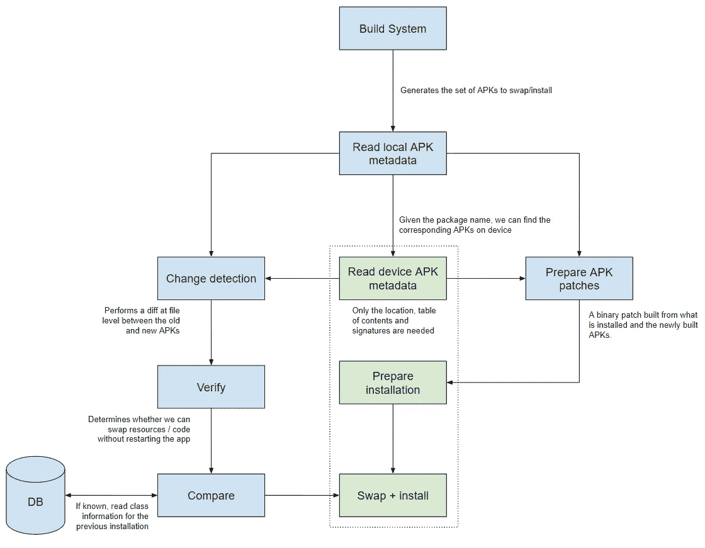

# Android Studio 项目 Marble:应用更改

> 原文：<https://medium.com/androiddevelopers/android-studio-project-marble-apply-changes-e3048662e8cd?source=collection_archive---------2----------------------->

## 深入探讨 Android Studio 团队如何构建即时运行的继任者 Apply Changes。

这是 Android 工作室团队发布的一系列博客中的第一篇，深入了解了 [*项目大理石*](https://android-developers.googleblog.com/2019/01/android-studio-33.html) *的一些细节和幕后情况。从发布*[*Android Studio 3.3*](https://android-developers.googleblog.com/2019/01/android-studio-33.html)*开始，Project Marble 就是一个多版本，致力于打造 IDE 坚如磐石的基本功能。以下帖子由应用更改团队的 Jon Tsao(产品经理)、Esteban de la Canal(技术主管)、杨奇煜 Sanglard(工程师)和 Alan Leung(工程师)撰写。*

Android Studio 的一个关键目标是提供工具，让您可以快速编辑和验证应用程序中的代码更改。当我们创建 Instant Run 时，我们希望显著地加速您的开发流程，但是我们知道这个特性没有达到预期。作为项目大理石的一部分，我们一直在努力重新思考即时运行，并在 Android Studio 中用一个更实用的解决方案来取代它。最初[在 Android Studio 3.5 的金丝雀频道中预览了](https://androidstudio.googleblog.com/2019/01/android-studio-35-canary-1-available.html)，应用更改是可预见地加速开发工作流的新方法。在这篇文章中，我们想对这个特性，它是如何工作的，以及我们到目前为止的旅程给出更多的见解。

# 瞬间奔跑

通过即时运行，我们希望解决两个问题:1)降低设备的构建和部署速度，2)能够在不丢失状态的情况下将更改部署到应用。为了在即时运行中实现这一点，我们依赖于在构建时重写 apk 来注入钩子，从而允许动态替换类。要更详细地了解 Instant Run 背后的架构，请参见几年前的这篇文章。

对于简单的应用程序，这种解决方案通常是好的，但对于更复杂的应用程序，这可能会导致更长的构建时间或由应用程序和 Instant Run 的构建过程之间的冲突引起的令人头疼的错误。随着这些问题的出现，我们继续投资改进后续版本的即时运行。然而，我们从来没有能够完全解决这些问题，并使功能符合我们的期望。

我们后退一步，决定从头开始构建一个新的架构，这就是应用更改。与即时运行不同，应用更改不再修改构建期间的 APK。相反，我们依靠 Android 8.0 (Oreo)和更新的设备和仿真器支持的运行时工具来动态地重新定义类。

# 应用更改

对于运行在 Android 8.0 或更新版本上的设备和仿真器，Android Studio 现在提供了三个按钮来控制应用程序的重启量:

*   **运行**将继续部署所有更改并重启应用程序。
*   **应用更改**将尝试应用您的资源和代码更改，并仅重启您的活动，而不重启您的应用。
*   **应用代码更改**将尝试只应用你的代码更改而不重启任何东西。

兼容的代码更改通常仅限于在方法体内更改的代码。

# 原则

根据 Instant Run 的经验和反馈，我们采用了一些原则来应用指导我们的架构和决策制定的变更:

1.  **分离构建/部署速度和丢失状态**。我们希望将降低构建/部署速度与能够在不丢失状态的情况下看到您的更改这两个问题分开。快速构建和部署应该是*所有*类型部署的目标，无论是常规运行/调试会话还是热交换代码。作为构建应用更改的一部分，我们已经发现了许多围绕构建和部署速度进行优化的领域，我们将在未来的帖子中详细介绍这些领域。
2.  **功能的稳定性至关重要**。即使该功能以极快的速度运行了 100 次中的 99 次，如果应用程序因为该功能而崩溃了一次，并且你花了半个小时试图找出原因，那么你已经失去了在它运行的其他 99 次中获得的生产力提升。由于我们坚持这一原则，应用更改，不像即时运行，不再修改你的 APK 在建设。一个副产品是，在这个初始版本中，我们已经针对稳定性进行了优化，应用更改平均比即时运行稍慢，但我们将继续提高构建和部署速度。
3.  **没有魔法**。我们采纳了您对即时运行按钮行为的不可预测性和不一致性的反馈，该按钮将在必要时自动决定是否重新启动您的应用程序或活动。我们希望始终保持清晰和透明，以了解您对应用更改的预期，以及如果您有不兼容的更改会发生什么，因此，如果我们检测到您的更改与应用更改不兼容，我们现在会明确提示您。

# 体系结构

让我们深入了解应用更改是如何工作的。应用更改需要弄清楚如何应用设备上安装/运行的应用程序和刚刚在 Android Studio 中编译的应用程序之间的差异。这个过程可以分为两个不同的步骤:1)找出差异，2)将差异发送到设备并应用它。

为了快速确定差异，应用更改会避免从设备获取完整的 APK。取而代之的是，它执行一个快速请求给设备，以拉已安装的 APK 的相应的[目录](https://en.wikipedia.org/wiki/Zip_(file_format)#Central_directory_file_header)和[签名](https://source.android.com/security/apksigning)。通过将这两条信息与新构建的 APK 进行比较，应用更改可以高效地生成自上次部署以来已更改文件的列表，而无需检查全部内容。请注意，该算法不依赖于构建系统，因为增量不是根据以前的构建计算的，而是根据设备上安装的内容计算的。由于“应用更改”仅对 APK 文件之间的差异进行操作，因此它不要求 Gradle 插件版本与 Gradle 同步。事实上，应用更改将在所有构建系统上工作。

生成已更改的文件列表后，根据更改的内容，需要执行不同的操作来将这些更改应用到正在运行的应用程序，这也决定了应用程序需要重新启动多长时间才能使这些更改生效:

**资源/资产档案发生变化**。
在这种情况下，应用程序被重新安装，但是应用程序仅经历一次活动重启，并且被修改的资源被拾取。只有改变的资源被发送到设备。

[**。dex**](https://source.android.com/devices/tech/dalvik/dex-format) **文件已更改**。
Android 8.0 的 Android 运行时提供了交换加载类的字节码的能力，只要新的字节码不改变内存中现有的对象布局。这意味着对与应用更改兼容的代码更改的限制:方法、类名和签名不会更改，它们的字段也不会更改。

这种机制在类级别有效，而不是在。dex 级别。否则，如果一个. dex 文件包含数百或数千个类，那么尝试交换所有的类将是低效的，即使只有一个类发生了变化。相反，我们比较。索引并计算已经更改的确切类，并且只尝试交换那些类。如果交换成功(即，类布局没有改变)，则应用程序也在后台安装，以避免应用程序的运行版本和安装版本之间的不一致。

**。dex 文件和资源文件已经更改**。
这个案例是以上两个案例的结合。首先执行代码步骤，如果成功，安装将使用新资源继续进行。为了加载新的资源，需要重新启动主活动。这是一个全有或全无的操作，如果您的代码更改无法应用，则运行的应用程序上不会有任何更改。

**还有什么变化吗**。
最坏的情况，像 AndroidManifest.xml 或 native 这样的文件。所以文件变了。在这种情况下，我们不可能在不重启应用程序的情况下应用更改。“应用更改”和“应用代码更改”操作都不会尝试部署，并且还会通知用户应用程序需要重新启动。

*Flow of the architecture described above*

*关于架构的更多细节，请听 Android 开发者后台播客的* [*最近一集*](http://androidbackstage.blogspot.com/2019/02/episode-108-instant-re-run.html) *，其中技术负责人 Esteban de la Canal 深入探讨了应用变化。*

# 比较。dex 文件

上一节解释了应用更改需要比较和提取设备中被更改(修改/添加/删除)的单个类。为了在不增加从设备获取大块内容的开销的情况下做到这一点，它在后台进程中利用 [D8](https://android-developers.googleblog.com/2018/04/android-studio-switching-to-d8-dexer.html) 的 DEX 文件分析功能来检查每个内容。dex 文件 Android Studio 部署到设备。基于校验和的指纹是在。并将结果临时存储在主机工作站上的缓存数据库中。通过将新编译的指纹与以前编译的指纹进行比较，应用更改能够在短时间内有效地提取更改的类。

# 三角推进

如上所述，只有已更改的文件才会发送到设备。我们称之为“三角洲推进”。与上面提到的 DEX 文件比较类似，应用更改需要计算已安装的 apk 和最近构建的 apk 之间的不同文件，而不必从设备获取所有内容。这一次，它只获取压缩文件的[中心目录](https://en.wikipedia.org/wiki/Zip_(file_format)#Central_directory_file_header),并对相应 apk 之间的差异进行保守估计。通过只传输发生变化的部分，Android Studio 传输的数据比完整的 APK 上传要少得多。在大多数使用案例中，总负载减少到几个 KiB，而不是几个 MiB。

# 后续步骤

金丝雀发布频道上的 Android Studio 3.5 现在提供了应用更改。我们欢迎您到[下载最新的 Android Studio](https://developer.android.com/studio/preview/install-preview) ，并尝试在您的项目中应用更改，并尽早给我们反馈。提醒一下，你可以[同时运行 Android Studio 的稳定版和金丝雀发布版](https://developer.android.com/studio/preview/install-preview#install_alongside_your_stable_version)。如果您在使用应用更改时遇到任何问题，请[提交一个 bug](https://issuetracker.google.com/issues/new?component=550294&template=1207130) 并附上您相应的 [idea.log 文件](https://intellij-support.jetbrains.com/hc/en-us/articles/207241085-Locating-IDE-log-files)。我们将继续优化部署性能，修复错误，并采纳您的建议和反馈。