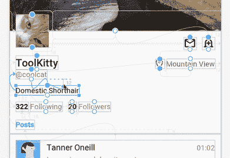

# Android Studio 项目大理石:布局编辑器

> 原文：<https://medium.com/androiddevelopers/android-studio-project-marble-layout-editor-608b6704957a?source=collection_archive---------3----------------------->

## 深入探讨 Android Studio 3.5 的布局编辑器 UX 改进

*这是 Android 工作室团队深入了解* [*项目大理石*](https://android-developers.googleblog.com/2019/01/android-studio-33.html) *的一些细节和幕后的一系列博客文章中的第五篇。从发布*[*Android Studio 3.3*](https://android-developers.googleblog.com/2019/01/android-studio-33.html)*开始，Project Marble 就是一个多版本，致力于打造 IDE 坚如磐石的基本功能。以下帖子由 Paris Hsu(交互设计师)代表版面编辑团队*撰写。

[**布局编辑器**](https://developer.android.com/studio/write/layout-editor) 是 Android Studio 中的设计工具之一，它使开发人员能够跨多个设备预览和构建布局。当用 [ConstraintLayout](https://developer.android.com/training/constraint-layout/index.html) 构建新布局时，布局编辑器特别强大。我们从许多应用程序开发人员那里听说，他们喜欢我们在布局编辑器中引入的新功能，例如预览不同屏幕尺寸的布局，或者允许指定占位符文本和图像的[样本数据](https://developer.android.com/studio/write/layout-editor#sample-data)。然而，我们也收到了强烈的反馈，即有几个性能和容易出错的可用性问题使编辑 XML 成为唯一的出路，特别是在使用 ConstraintLayout 时，这经常使开发人员在设计工具中处于无意和尴尬的状态。

因此，我们在 Marble 项目中着手解决这些**性能和可用性问题**,今天我们很高兴向大家介绍进展的最新情况。虽然这篇文章将主要关注可用性问题，但我们想让你知道[的构建性能](/androiddevelopers/improving-build-speed-in-android-studio-3e1425274837)也是 Project Marble 的一个关注点。事实上，设计图面在很大程度上依赖于构建速度，因为在每次鼠标抬起时:XML 被更新，由构建处理，并加载到布局库呈现引擎中——在 JVM 上的 Android Studio 中运行的 Android UI 系统的模拟。因此，我们也确保在我们所有提高可用性的努力中，没有任何改变会影响性能。现在，让我们来了解一下 Android Studio 3.5 迄今为止在可用性方面的重大改进，以及我们接下来的步骤。

# **那么我们做了什么？**

布局编辑器的核心目标之一是为您提供最准确的布局预览，从而加快设计迭代。带着这个目标，我们从应用程序开发人员最近的一系列可用性研究中获得了结果，对这些问题进行了优先排序，并在一些技术调查后，我们在 Marble 项目期间选择了以下六个最佳领域来优化布局编辑器:

1.  约束可视化和选择
2.  约束创建
3.  约束删除
4.  视觉刷新
5.  设备捕捉行为
6.  毛利的维度资源

# ***改进#1 —约束可视化和选择***

目前在布局编辑器中有两种可视化约束的方式: *(1)在设计图面*上用箭头&锚定和 *(2)在属性面板*上用约束小部件，如下图所示:

Android Studio 3.4 Constraints Visualization

我们从您那里了解到，虽然当前的可视化有助于说明约束类型、约束方向和边距值，但它缺少一个部分:*快速*识别*关系*的能力——快速查看这些约束所连接的内容的摘要。我们发现在一个复杂的布局中，很难看到箭头指向哪里，因为许多组件相互重叠。

为了解决这个反馈，我们在属性面板中添加了一个**约束部分**，它以一种易于理解的格式列出了当前所选 UI 组件的约束关系，如下所示:

Android Studio 3.5 Constraints Visualization

Constraint Section (New)

现在，您可以看到您为该组件创建了多少个约束，这些约束指向哪些组件，以及它们的约束余量或偏差。

此外，有了这个新的约束部分，我们从可视化到利用率又进了一步。我们想:“如果我们也允许您从列表中选择这些约束，就像您从组件树中选择组件一样，会怎么样？”

Selecting Constraints from the Constraint Section on Property Panel

这样，将在设计图面上的约束和列表上的约束之间创建一个心理映射，使您在构建布局时可以轻松找到约束:

Vice versa, selecting Constraints from the Design Surface

使用新的选择模式，我们还解决了一些我们遇到的约束删除问题(在下面的改进 3 中有更深入的讨论)。现在当一个约束在列表上被选中时，你可以使用*删除*键来删除该约束。

Constraints selected and using the *Delete* key

这里需要注意的一点是，我们在可用性研究中也注意到，许多开发人员不知道设计图面上的**缩放控件**，如果不放大，布局编辑器上的一些交互将更难执行。我们相信，新的可视化将通过提供一种在属性面板上选择约束的替代方法来帮助减轻一些表面交互。然而，我们确实想在这里对我们的缩放控件大声喊出来:你可以在工具栏上访问它们，或者简单地使用键盘快捷键 *Ctrl/Cmd+* 放大， *Ctrl/Cmd-* 缩小，按住*空格键*平移:

Using Zoom and Pan Controls

# **改进 2——约束创建**

目前，在布局编辑器中创建约束有三种方式:

1.  从组件的定位点拖动到目标组件的定位点
2.  从组件的锚点拖动到目标组件的中心
3.  使用属性面板上约束小部件的“+”按钮

通过可用性研究，我们确定了这些工作流中的几个难点，并对它们进行了一些改进。

对于交互选项#1，以前在拖动时，我们使用闪烁的绿点作为是否可以约束到该锚点的指示。我们决定**去掉绿点**，因为它们会造成视觉混乱。我们得到的反馈是，因为点在闪烁，所以很难区分，例如，*填充(约束)*和*非填充(非约束)*锚。因此，我们采用了一个依赖于用户意图的系统。当拖动时，我们简单地隐藏您不能约束的锚点，而不是闪烁的绿点，当您拖动到目标组件时，如果它们包含可约束的锚点，我们还会给它们一个**蓝色重叠**:

Displaying Possible Target Constraint Anchors (Old)

Displaying Possible Target Constraint Anchors (New)

事实上，当有重叠的锚时，蓝色覆盖特别有用；它有助于识别您试图约束到的目标组件:

Constraining to overlapping anchors (Old)

Constraining to overlapping anchors (New)

对于交互选项#2，当鼠标悬停在上下文菜单中的选项上时，我们添加了 **ghost anchors** ，以便直观地了解选项所指的目标组件锚点:

Drag to component center to create constraints (Old)

Drag to component center to create constraints (New)

当它们是重叠组件时，这尤其有用:

Drag to multiple components center to create constraints (Old)

Drag to multiple components center to create constraints (New)

最后，对于交互选项#3，我们从应用程序开发人员那里听说，由于缺乏信任，他们不使用约束小部件，因为在他们与小部件交互后，几乎没有视觉/系统反馈。为了解决这个问题，我们希望新添加的约束部分(改进#1)也是一种**提高使用小部件**创建约束的可学性的方法。我们认为这是一种在您与小部件交互后提供添加了哪个约束的即时反馈的方式:

Using the constraint widget to create constraints (New)

# **改进 3 —约束删除**

以前，要在布局编辑器中删除一个约束，单击该约束的锚点，它就会被删除。

Click anchor to delete constraints (Old)

虽然这种约束删除快速而简单，但我们从开发人员那里了解到，他们发现这很容易出错。在复杂的布局中，您可能有较小的组件，许多开发人员在试图选择组件时会意外删除约束，尤其是在屏幕缩小的情况下。

因此，有了选择约束的新能力，我们也更新了**和** **改进了删除约束的方式**:

1.  选择约束，然后使用*删除*键
2.  或者，我们为旧的删除模型添加了一个键盘修饰符:按住 *Ctrl/Cmd* 并将鼠标悬停在锚点上，约束将变为红色，表示它将在单击时被删除

Select constraints and use delete key (New)

Hold “Ctrl/Cmd” and click on anchor to delete (New)

# 改进#4 —视觉刷新

本着 Project Marble 的精神，我们还为布局编辑器提供了视觉刷新，使调色板更加一致:

Design mode components style and colors (New)

Design surface visual refresh

我们特别关注清理**蓝图模式**，因为我们从开发人员那里听说，他们发现这种仅包含轮廓的视图在编辑布局时非常有用，不会分散 UI 内容的注意力。我们更新了颜色饱和度，使其更具凝聚力，去掉了高对比度的白线，并为之前为空的组件添加了文本支持。

Blueprint mode before and after

# 改进 5 —设备捕捉行为

使用 ConstraintLayout 的最有价值的原因之一是确保您的应用程序布局在多个设备上看起来很棒，布局编辑器为您提供了一种简单的方法，通过在工具栏上的不同设备之间循环来实现这一点。我们也允许定制尺寸捕捉。然而，当我们在 Project Marble 期间研究该功能时，我们意识到我们的默认设备列表非常旧，并且自定义大小捕捉行为不是非常直观。因此，我们在这两个方面都做了改进，包括**更新的设备尺寸**、**总是暴露大小调整手柄**，以及**改进对齐方式**。我们还添加了一个蓝色的覆盖图来表示常见设备尺寸的**区域，从小型、普通到超大。**

Device snapping to different screen sizes (Old)

Device snapping to different screen sizes (New)

# 改进 6 —利润的维度资源

最后但同样重要的是，我们对 constraint 小部件和 default margin 下拉列表进行了更新，以允许**将维度资源用于边距:**我们为它们都添加了一个“@…”，尽管设计在不断发展，但下面是当前的迭代:

Using dimension resources for margins

Using dimension resources for default margins

# 下一步是什么？

大理石计划不会就此结束！我们有许多计划来继续支持和改进布局编辑器的体验。当然，直接在 XML 中编辑布局文件仍然只是一次点击，但是我们希望您在布局编辑器上看到一些有用的交互，当在 Android Studio 中创建和编辑布局时，这些交互可以大大提高生产率。

如果您在使用布局编辑器时遇到任何问题，或者对可以提高您工作效率的新功能有什么想法，请[提交一个 bug](https://issuetracker.google.com/issues/new?component=192747&template=1023344) 。我们将继续优化编辑器的性能，修复错误，并采纳您的建议和反馈。