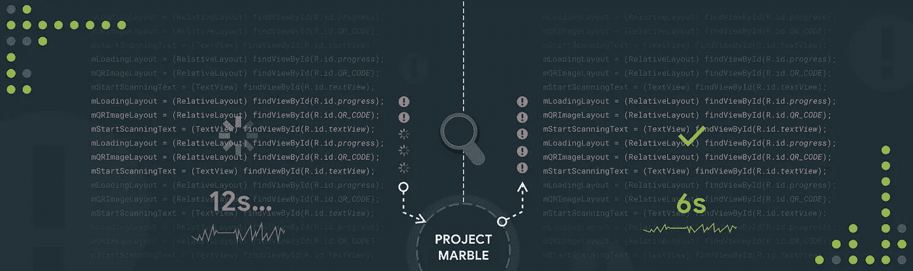

# Android Studio 项目 Marble: Lint 性能

> 原文：<https://medium.com/androiddevelopers/android-studio-project-marble-lint-performance-8baedbff2521?source=collection_archive---------4----------------------->



Illustration by [Akshay Potnis](https://www.linkedin.com/in/potnisakshay)

## 关于最近 Lint 性能修复的详细信息，以及我们制作的用于查明瓶颈的工具。

这是 Android 工作室团队深入了解大理石项目幕后细节的系列博客文章的第四篇。从发布[*Android Studio 3.3*](https://android-developers.googleblog.com/2019/01/android-studio-33.html)*开始，Project Marble 是一个多版本，专注于打造 IDE 坚如磐石的基本功能。如果你错过了，我们已经在项目大理石上发布了以下博客:*

*   [项目大理石:应用更改](/androiddevelopers/android-studio-project-marble-apply-changes-e3048662e8cd)
*   [提高 Android Studio 的构建速度](/androiddevelopers/improving-build-speed-in-android-studio-3e1425274837)
*   [Android 模拟器:Marble 项目改进](/androiddevelopers/android-emulator-project-marble-improvements-1175a934941e)

*这篇博文是由从事 Android Lint 工作的工程师 Matthew Gharrity 撰写的。*

[Android Lint](https://developer.android.com/studio/write/lint) 是我们用于发现潜在代码问题的静态分析框架。您在 IDE 编辑器中看到的许多警告来自 Lint，开发人员通常将 Lint 设置为在持续集成服务器上运行，以便在每次新代码更改时强制执行这些警告。Lint 现在已经发展到数百个检测器，每个检测器都在寻找不同的潜在问题。

但是，我们收到了强烈的反馈，Lint 可能会很慢——尤其是在 CI 服务器上分析大型代码库的时候。因此，本着“大理石计划”的精神，我们对 Lint 的性能以及如何改进进行了调查。在这篇博文中，我们将解释我们如何修复一些顶级性能问题的技术细节——在 Studio 3.3 中实现了大约 2 倍的加速——我们甚至会提供一个开源工具，您可以使用它来查明您自己构建中的 Lint 性能瓶颈。

# 低垂的果实

首先，Studio 3.3 的一些性能修复是普通挖掘 CPU 配置文件和堆转储的结果。我们要感谢 Twitter 上的[塞萨尔·普尔塔](https://twitter.com/cesardielo)提供了 Lint 经历极端减速的可再现实例，并让我们在现场用一个剖析器进行挖掘。这种协作导致了一些关键的修正:

*   我们修复了一个 Lint 检查中的内存泄漏，其中一个匿名内部类意外捕获了对一些 Lint 数据结构的引用。
*   我们修复了从 Gradle 运行 Lint 时的内存泄漏，其中用于运行 Lint 的自定义类加载器通过线程局部变量和 JNI 全局引用保留。
*   我们修复了 Lint 在同一个 Gradle 守护进程中多次运行时造成的额外类加载。

仅这些修复就让我们在内部 Lint 性能基准测试中获得了 3 倍的速度提升，在 Twitter 的代码库上获得了大约 2 倍的速度提升。添加内存泄漏回归测试是为了防止将来出现类似的错误。

# 查明瓶颈的工具

接下来，我们开始寻找单个棉绒检测器中的瓶颈。有一些挑战。

*   Lint 中没有每个检测器的性能属性——添加这个属性可能会很棘手。例如，Lint 在单次通过每个源文件时，在数百个不同的检测器之间进行多路复用。将所有可能的调用路径包装到检测器代码中可能容易出错，并且会污染我们的源代码。
*   在 Lint 上使用传统的分析器工作得很好，但是挖掘结果非常耗时并且难以自动化。工程时间是有限的，所以实际上这限制了我们可以测试的样本项目的数量。然而，对各种各样的样本项目进行测试是至关重要的，因为一些性能瓶颈只出现在特定的项目拓扑上。
*   即使有时间来挖掘分析器结果，CPU 跟踪也会有开销问题，甚至[安全点偏差](http://jeremymanson.blogspot.com/2010/07/why-many-profilers-have-serious.html)也与 CPU 采样有关。
*   开发人员可以编写他们自己的定制 Lint 检查，因此任何在我们的内部检查中寻找瓶颈的手工工作对于在第三方检查中寻找瓶颈都没有帮助。

考虑到这些因素，我们创建了一个工具来帮助自动查明各个 Lint 检查中的性能问题。该工具依靠 Java 字节码插装在感兴趣的方法之前和之后注入代码。这个想法很简单:我们使用一个正则表达式来查找与 Lint 检测器相关联的所有方法，只检测那些方法来收集计时信息，然后将计时信息返回给相关联的 Lint 检测器。然后可以将结果打印到控制台。

为了插装 Java 字节码，我们使用了 [YourKit 探测器](https://www.yourkit.com/docs/java/help/probe_class.jsp)，尽管也可能使用其他插装代理。

应用这个工具就像给 Gradle 添加一个 JVM 标志一样简单，所以我们能够非常快速地在大量项目中使用这个工具。大多数项目的结果看起来都很正常。然而，一个值得注意的例外是一个名为[Android-studio-grad le-test](https://github.com/kageiit/android-studio-gradle-test)的开源压力测试项目。以下是原始结果:

```
Number of probe hits: 4720354
Total time in LintDriver.analyze(): 221482ms
Total time inside detectors: 177446ms InvalidPackageDetector 176853ms
               MergeMarkerDetector 363ms
                    GradleDetector 38ms
                PrivateKeyDetector 27ms
  TrustAllX509TrustManagerDetector 25ms
            CordovaVersionDetector 18ms
            UnusedResourceDetector 13ms
                  ManifestDetector 12ms
              MissingClassDetector 10ms
                             [...]
```

在这个项目中，`InvalidPackageDetector`占用了皮棉分析的绝大部分时间！对于上下文，该检测器检查对 Android 不支持的 Java 语言 API 的调用。经过进一步的调查，我们发现在某些情况下`InvalidPackageDetector`会多次扫描 jar 文件，这可能会成为有许多模块和二进制依赖项的项目的瓶颈。修复很简单，这个项目的速度提高了 4 倍。在 Twitter 的代码库上，这个修复导致了 16%的速度提升。

这个瓶颈在传统的分析器中也是显而易见的。然而，如果没有自动化工具的帮助，我们可能永远不会有时间去调查足够多的项目来找到一个使瓶颈变得明显的项目。

## 剖析内存分配以查找冗余计算

性能调试就是收集数据并寻找令人惊讶的结果。在我们的例子中，收集的数据是每个检测器的时间信息，令人惊讶的是一些检测器花费的时间比预期的要多。然而，另一个很好的跟踪指标是内存分配。如果检测器分配的内存比预期的多，这可能是检测器正在进行冗余计算的信号——即使检测器碰巧运行得相对较快。

因此，我们将 YourKit 探针与[内存分配工具](https://github.com/google/allocation-instrumenter)结合起来，以便将内存分配归属于各个 Lint 检测器。下面是在上面的同一个测试项目中这样做的原始结果。

```
Total allocations within detectors: 262 MB
  MergeMarkerDetector 240 MB
   PrivateKeyDetector 7 MB
       GradleDetector 6 MB
    AndroidTvDetector 2 MB
                [...]
```

结果立刻使`MergeMarkerDetector`产生了怀疑。对于上下文，该检测器寻找 git 风格的合并标记，例如意外遗留在源代码中的`<<<<<<`。经过进一步调查，我们发现`MergeMarkerDetector`偶尔也会查看非源文件，对于某些项目来说，这可能包括任意大的二进制文件。修复很简单，最好的部分是我们不需要找到这个 bug 成为明显的性能问题的项目——分配信息足以让我们走上正确的道路。

## 关于 YourKit 探针的详细信息

我们写的 YourKit 探测器是在 GitHub 上[开源的；请随意使用它，并为您自己的自定义皮棉检查添加覆盖范围！`README`解释了如何指向您的本地 YourKit 安装，如何生成检测 Lint 调用所需的 JVM 参数，以及如何解释工具打印出的结果。](https://github.com/google/android-lint-performance-probe)

请注意，探测器在查找 Lint 性能问题时存在一些限制:

*   该探针目前依赖于与您的工具包捆绑在一起的 Java byte code instrumentation 代理，它不是一个免费的分析器(尽管有一个免费的试用版)。原则上，该工具可以适用于使用替代的工具代理。
*   有相当大量的前期计算，例如解析和类型属性，这不能归因于任何单独的 Lint 检测器。如果在这个预计算阶段存在性能问题，探测器将无法找到它。
*   缓存效应可能会扭曲单个检测器的性能数据。例如，第一次运行 Lint 检查可能会导致在第一次解析调用时发生的初始缓存未命中。

# 包扎

上面描述的 Lint 性能改进已经在 Studio 3.3 中实现，我们将继续监控 Lint 性能以捕捉回归。如果您在自己的项目中运行 Lint 时遇到了重大的性能问题，请先查看我们的 Lint [性能提示](https://groups.google.com/d/msg/lint-dev/RGTvK_uHQGQ/FjJA12aGBAAJ)。如果这没有帮助，请随意[提交一个 bug](https://issuetracker.google.com/issues/new?component=192718&template=842813) ，并考虑用我们的 YourKit 探针附上运行 Lint 的结果。如果您对 Lint 有一般性的问题或建议，我们还有 [lint-dev 邮件列表](https://groups.google.com/d/forum/lint-dev)。