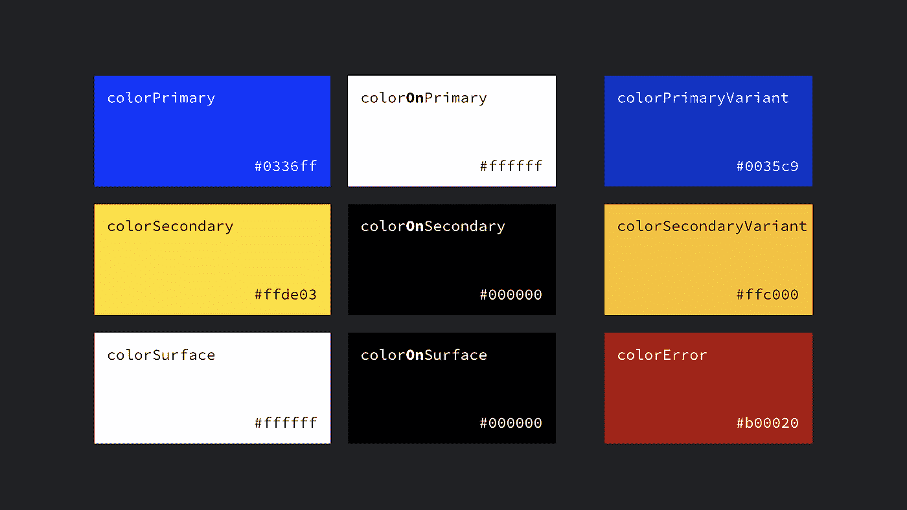
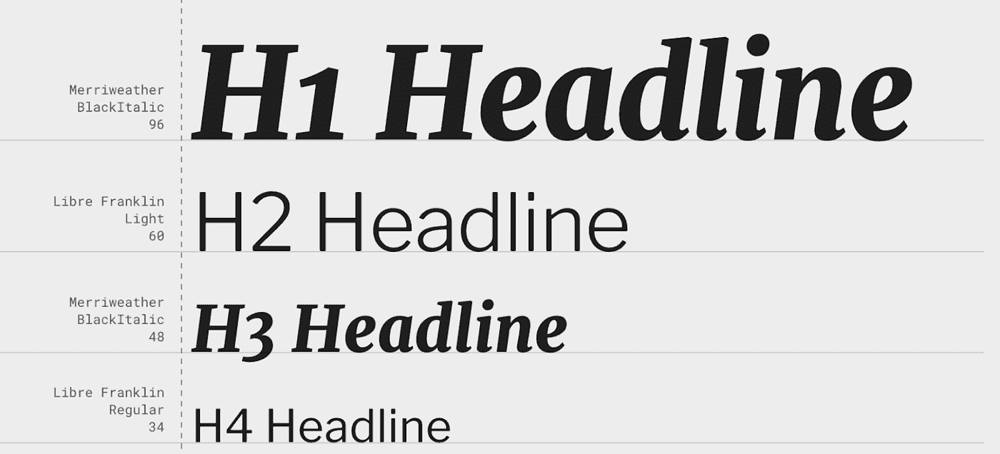
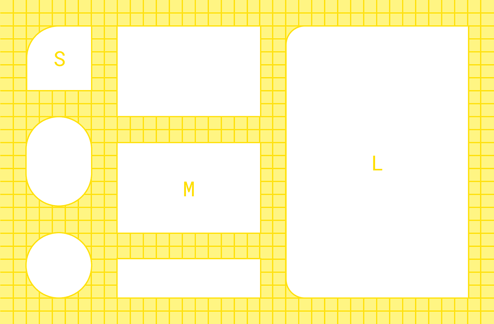
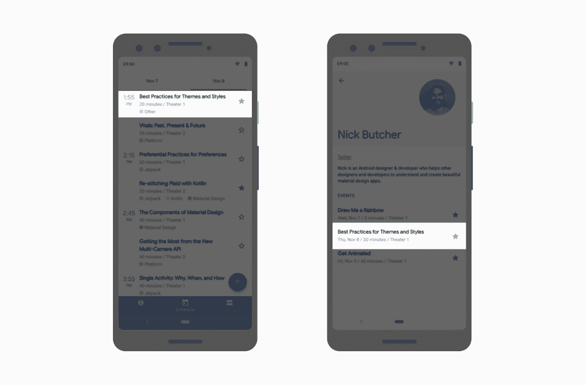

# Android 样式:通用主题属性

> 原文：<https://medium.com/androiddevelopers/android-styling-common-theme-attributes-8f7c50c9eaba?source=collection_archive---------1----------------------->

Illustration by [Virginia Poltrack](https://twitter.com/VPoltrack)

在本系列关于 Android 样式的前一篇文章中，我们讨论了主题和样式之间的区别，以及主题如何允许您编写更加灵活的样式和布局来隔离变化:

 [## Android 风格:主题与风格

### Android 风格系统提供了一种强大的方式来指定你的应用程序的视觉设计，但它很容易被误用…

medium.com](/androiddevelopers/android-styling-themes-vs-styles-ebe05f917578) 

特别地，我们推荐使用主题属性来提供一个间接指向资源的点，这样你就可以改变它们(例如在[黑暗主题](https://developer.android.com/guide/topics/ui/look-and-feel/darktheme))。也就是说，如果您发现自己正在编写一个直接的资源引用(或者更糟，一个硬编码的值😱)在布局或样式中，考虑是否应该使用主题属性。

但是有哪些主题属性可以使用呢？这篇文章强调了你应该知道的常见问题；那些来自材料、AppCompat 或平台的。这不是一个完整的列表(为此，我建议浏览下面定义它们的 attrs 文件链接),但这些是我一直使用的属性。

# 颜色；色彩；色调

这些颜色中有许多来自于[材质颜色系统](https://material.io/design/color/)，它定义了可以在整个应用程序中使用的颜色的语义名称([实现为主题属性](https://material.io/develop/android/theming/color))。

*   `?attr/colorPrimary`应用的主要品牌颜色。
*   `?attr/colorSecondary`应用的次要品牌颜色，通常是主要品牌颜色的亮色补充。
*   `?attr/colorOn[Primary, Secondary, Surface etc]`与指定颜色形成对比的颜色。
*   `?attr/color[Primary, Secondary]Variant`给定颜色的交替色调。
*   `?attr/colorSurface`组件表面的颜色，如卡片、表单和菜单。
*   `?android:attr/colorBackground`屏幕的背景。
*   `?attr/colorPrimarySurface`在亮主题的`colorPrimary`和暗主题的`colorSurface`之间切换。
*   `?attr/colorError`显示错误的颜色。

其他方便的颜色:

*   `?attr/colorControlNormal`图标/控件在正常状态下应用的颜色。
*   `?attr/colorControlActivated`图标/控件处于激活状态(如选中)时所应用的颜色。
*   `?attr/colorControlHighlight`应用于控制突出显示的颜色(如波纹、列表选择器)。
*   `?android:attr/textColorPrimary`最突出的文字颜色。
*   `?android:attr/textColorSecondary`次要文字颜色。

# 迪曼斯

*   `?attr/listPreferredItemHeight`列表项目的标准(最小)高度。
*   `?attr/actionBarSize`工具栏的高度。

# 抽屉

*   `?attr/selectableItemBackground`互动项目的波纹/高光(同样适用于前景！！)
*   无界的涟漪。
*   `?attr/dividerVertical`可用作可视元素之间的垂直分隔线的可绘制图形。
*   `?attr/dividerHorizontal`可用作可视元素之间的水平分隔线的可绘制图形。

# 文本外观

Material [定义了](https://material.io/design/typography/the-type-system.html#type-scale)一种文字比例——你应该在整个应用程序中使用的一组离散的文本样式，每种样式都由[提供](https://material.io/develop/android/theming/typography/)作为主题属性，可以设置为`textAppearance`。查看[材质类型比例生成器](https://material.io/design/typography/the-type-system.html#)来帮助生成不同字体的比例。

*   `?attr/textAppearanceHeadline1`默认为轻 96sp 文字。
*   `?attr/textAppearanceHeadline2`默认为浅色 60sp 文字。
*   `?attr/textAppearanceHeadline3`默认为常规 48sp 文本。
*   `?attr/textAppearanceHeadline4`默认为常规 34sp 文本。
*   `?attr/textAppearanceHeadline5`默认为常规 24sp 文本。
*   `?attr/textAppearanceHeadline6`默认为中等 20sp 文本。
*   `?attr/textAppearanceSubtitle1`默认为常规 16sp 文本。
*   `?attr/textAppearanceSubtitle2`默认为中等 14sp 文本。
*   `?attr/textAppearanceBody1`默认为常规 16sp 文本。
*   `?attr/textAppearanceBody2`默认为常规 14sp 文本。
*   `?attr/textAppearanceCaption`默认为常规 12sp 文本。
*   `?attr/textAppearanceButton`默认为中等大小写 14sp 文本。
*   `?attr/textAppearanceOverline`默认为常规全大写 10sp 文本。

# 形状

材料采用[形状系统](https://material.io/design/shape)，该系统[作为小、中、大部件的主题属性](https://material.io/develop/android/theming/shape/)实现。注意，如果你在一个定制组件上设置一个形状外观，你可能想要使用一个`[MaterialShapeDrawable](https://developer.android.com/reference/com/google/android/material/shape/MaterialShapeDrawable.html)`作为它的背景，它理解并实现这个形状。

*   `?attr/shapeAppearanceSmallComponent`用于按钮、芯片、文本字段等。默认为 4dp 圆角。
*   `?attr/shapeAppearanceMediumComponent`用于卡片、对话框、日期选择器等。默认为 4dp 圆角。
*   `?attr/shapeAppearanceLargeComponent`用于底层纸张等。默认为 0dp 圆角(即方形！)

# 按钮样式

这可能看起来非常具体，但是 Material 定义了三种*类型的*按钮:[包含](https://material.io/components/buttons/#contained-button)、[文本](https://material.io/components/buttons/#text-button)和[轮廓](https://material.io/components/buttons/#outlined-button)。MDC 提供了主题属性，可以用来设置一个`MaterialButton`的`style`:

*   `?attr/materialButtonStyle`默认为包含(或者只是省略样式)。
*   `?attr/borderlessButtonStyle`为文本样式按钮。
*   `?attr/materialButtonOutlinedStyle`用于勾勒风格。

# 漂浮物

*   `?android:attr/disabledAlpha`默认禁用小部件的 alpha。
*   `?android:attr/primaryContentAlpha`应用于前景元素的 alpha。
*   `?android:attr/secondaryContentAlpha`应用于二次元的 alpha。

# App vs Android 命名空间

您可能已经注意到，有些属性被
`?**android**:attr/foo`引用，而其他属性则被`?attr/bar`引用。这是因为有些是由 Android 平台定义的，因此您需要`android`部分通过它们的名称空间来引用它们(就像布局中的视图属性一样:`android:id`)。那些没有来自静态库(即 AppCompat 或 MDC ),它们被编译到你的应用程序中，所以不需要名称空间(类似于你如何在布局中使用`app:baz`)。有些元素在平台和库中都定义了*，例如`colorPrimary`。在这些情况下，最好使用非平台版本，因为这可以在所有 API 级别上使用，也就是说，它们在库中被复制，以精确地反向移植它们。在这些情况下，我在上面列出了非平台版本。*

> *偏好可以在所有 API 级别上使用的非平台属性*

# *更多资源*

*要获得可供使用的主题属性的完整列表，请访问真理之源:*

*   *[安卓平台](https://android.googlesource.com/platform/frameworks/base/+/refs/heads/master/core/res/res/values/attrs.xml)*
*   *[AppCompat](https://android.googlesource.com/platform/frameworks/support/+/androidx-master-dev/appcompat/appcompat/src/main/res/values/attrs.xml)*

*材料设计组件:*

*   *[颜色](https://github.com/material-components/material-components-android/blob/master/lib/java/com/google/android/material/color/res/values/attrs.xml)*
*   *[形状](https://github.com/material-components/material-components-android/blob/master/lib/java/com/google/android/material/shape/res/values/attrs.xml)*
*   *[类型](https://github.com/material-components/material-components-android/blob/master/lib/java/com/google/android/material/typography/res/values/attrs.xml)*

# *自己做*

*有时没有一个主题属性来抽象出你想要根据主题而变化的东西。别担心…创造你自己的！这里有一个来自[谷歌输入/输出应用](https://github.com/google/iosched)的例子，它在两个屏幕上显示了会议会话列表。*

**

*Two screens listing conference sessions*

*它们很大程度上是相似的，但是左边的屏幕必须为粘性时间标题留出空间，而右边的屏幕没有。我们通过抽象在主题属性后对齐项目的位置来实现这一点，以便我们可以根据主题改变它们，并在两个不同的屏幕上使用相同的布局:*

*1.在 [attrs.xml](https://github.com/google/iosched/blob/89df01ebc19d9a46495baac4690c2ebfa74946dc/mobile/src/main/res/values/attrs.xml#L41) 中定义主题属性*

*2.在不同的主题中提供[不同的](https://github.com/google/iosched/blob/89df01ebc19d9a46495baac4690c2ebfa74946dc/mobile/src/main/res/values/themes.xml#L51) [值](https://github.com/google/iosched/blob/89df01ebc19d9a46495baac4690c2ebfa74946dc/mobile/src/main/res/values/themes.xml#L78):*

*3.[使用](https://github.com/google/iosched/blob/89df01ebc19d9a46495baac4690c2ebfa74946dc/mobile/src/main/res/layout/item_session.xml#L61)在**两个**屏幕上使用的*单个*布局中的主题属性(每个使用上述主题之一):*

# *质疑(标记)一切*

*知道了什么样的主题属性是可用的，你就可以在设计布局、风格或绘图时使用它们。使用主题属性使得支持主题化(像[黑暗主题](https://developer.android.com/guide/topics/ui/look-and-feel/darktheme))和编写更加灵活、可维护的代码变得更加容易。要深入了解这一点，请加入我们这个系列的下一篇文章:*

* [## Android 风格:偏好主题属性

### 所有事物的主题属性

medium.com](/androiddevelopers/android-styling-prefer-theme-attributes-412caa748774)*