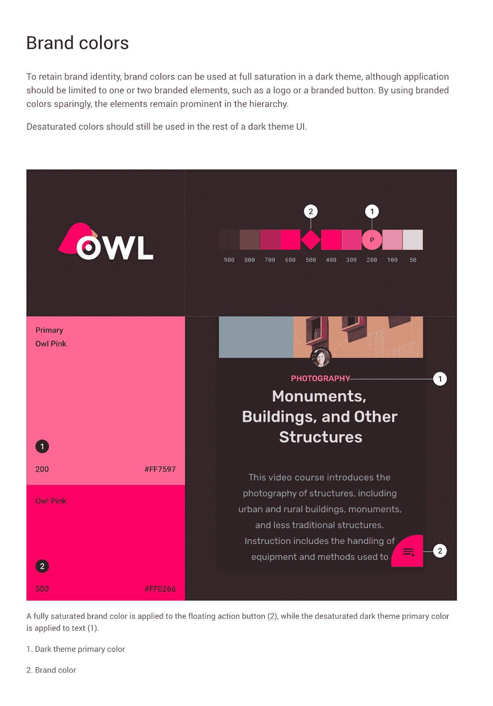

# Android 风格:偏好主题属性

> 原文：<https://medium.com/androiddevelopers/android-styling-prefer-theme-attributes-412caa748774?source=collection_archive---------0----------------------->

Illustration by [Virginia Poltrack](https://twitter.com/VPoltrack)

## 所有事物的主题属性

在本系列关于 Android 样式的前几篇文章中，我们讨论了主题和样式之间的区别，以及为什么根据主题和使用的常见主题属性来区分您希望改变的东西是一个好主意:

 [## Android 风格:主题与风格

### Android 风格系统提供了一种强大的方式来指定你的应用程序的视觉设计，但它很容易被误用…

medium.com](/androiddevelopers/android-styling-themes-vs-styles-ebe05f917578)  [## Android 样式:通用主题属性

### 在本系列关于 Android 风格的前一篇文章中，我们讨论了主题和风格之间的区别…

medium.com](/androiddevelopers/android-styling-common-theme-attributes-8f7c50c9eaba) 

这使我们能够创建更少的布局或样式，隔离主题中的变化。实际上，你很大程度上想要通过主题改变颜色，因此你应该总是通过主题属性来引用颜色。

> *始终*通过主题属性引用颜色*

这意味着您可以将这样的代码视为一种气味:

相反，您应该引用一个主题属性，允许您根据主题改变颜色，例如，在[深色主题](https://developer.android.com/guide/topics/ui/look-and-feel/darktheme)中提供一个不同的值:

即使你目前不支持替代主题(什么-没有黑暗主题？？)，我推荐遵循这种方法，因为它会使采用主题更加容易。

# 合格的颜色？

您*可以通过在不同的配置中提供替代值来改变*的颜色(例如在`res/**values**/colors.xml`中定义的`@color/foo`和在`res/**values-night**/colors.xml`中设置的替代值)，但是我建议使用主题属性。

颜色层的变化迫使你给颜色起一个语义名称，也就是说，你可能不会给一种颜色起一个名称，并在 T4 配置中提供一个暗色的变体，这将会非常令人困惑。相反，你可能会尝试使用一个语义上的名字，比如 T5。这样做的问题是，它既要声明颜色，又要提供值。因此，它没有指出这可以或会因主题而异。

变化`@colors`也可以鼓励你创造更多的颜色。如果不同的情况需要具有相同值的新的语义命名的颜色(即，不是背景而是相同的颜色)，那么您仍然需要在您的颜色文件中创建新的条目。

通过使用主题属性，我们将语义颜色的声明与提供它们的值分开，并使调用点更清楚地知道颜色将随主题而变化(因为它们使用了`?attr/`语法)。保持你的颜色声明为字面命名的值，鼓励你定义你的应用程序使用的调色板，并在主题级别改变它们，保持你的颜色文件小且可维护。

> *定义应用程序使用的调色板，并在主题级别改变它们*

这种方法的额外好处是引用这些颜色的布局/样式变得更加可重用。因为主题可以重叠或变化，间接意味着你不需要仅仅为了改变一些颜色而创建替换的布局或样式——你可以将相同的布局用于不同的主题。

# 总是吗？

我在*“总是*通过主题属性引用颜色”*上加了一个星号，因为有些时候你可能不希望主题改变颜色。例如，[材料设计指南](https://material.io/design/color/dark-theme.html#ui-application)指出了您可能希望在浅色和深色主题中使用相同品牌颜色的场合。

在这些罕见的情况下，直接引用颜色资源是完全有效的:

# 技术发展水平

另一种情况是当你使用`[ColorStateList](https://developer.android.com/reference/android/content/res/ColorStateList)` [s](https://developer.android.com/reference/android/content/res/ColorStateList) 时，你可能不会在你的布局/样式中直接引用主题属性。

如果`primary_20`是一个`ColorStateList`，它本身引用颜色值的主题属性，这可能是有效的(见下文)。虽然通常用于在不同的状态下(按下，禁用等)提供不同的颜色，`ColorStateList` s 还有另一个对主题化有用的功能。它们允许您指定要应用于颜色的 alpha 值:

这种单品- `ColorStateList`(即只提供单一的默认颜色，每个状态不提供不同的颜色)有助于减少您需要维护的颜色资源的数量。也就是说，不要定义一个新的颜色资源来手动设置您的原色的 alpha 值(根据配置！相反，这会改变当前主题中的任何内容。如果你的原色改变了，你只需要在一个地方更新它，而不需要找出所有被调整过的地方。

虽然这种技术很有用，但是需要注意一些注意事项。

1.如果指定的颜色*也*具有 alpha 值，则 alpha 值*被组合*，例如，将 50%的 alpha 值应用于 50%的不透明白色将产生 25%的白色:

出于这个原因，最好将主题颜色指定为完全不透明，并使用`ColorStateList`来修改它们的 alphas。

2.alpha 组件只是在 API 23 中添加的，所以如果你的 min sdk 比这个低，一定要使用支持这个行为的`[AppCompatResources.getColorStateList](https://developer.android.com/reference/androidx/appcompat/content/res/AppCompatResources.html#getColorStateList(android.content.Context,%20int))`(并且总是使用`android:alpha`名称空间，而不是`app:alpha`名称空间)。

3.我们经常使用一种速记法来将一种颜色设置为可绘制的

一个`View`的背景是可绘制的，这个简写将给定的颜色强制给一个`[ColorDrawable](https://developer.android.com/reference/android/graphics/drawable/ColorDrawable)`。然而，没有办法将一个`ColorStateList`转换成一个`Drawable`(在 API 29 之前，当`[ColorStateListDrawable](https://developer.android.com/reference/android/graphics/drawable/ColorStateListDrawable)`被引入来解决这个问题时)。但是，我们可以绕过此限制:

请确保您的背景色调支持您的视图需要的状态，例如，如果它需要在禁用时更改。

# 执行

所以你确信你应该使用主题属性和`ColorStateList`,但是你如何在你的代码库或团队中强制执行呢？您可以在代码审查期间保持警惕，但这并不能很好地扩展。更好的方法是依靠工具来捕捉这一点。本文概述了如何添加 lint 检查来查找文字颜色的使用，并且可以扩展到涵盖本文中的所有建议:

 [## 让 Android Lint 主题感知

### 使用 Android Lint API 来识别屏幕和 drawable 没有准备好黑暗主题。还有，用它来维持黑暗主题…

proandroiddev.com](https://proandroiddev.com/making-android-lint-theme-aware-6285737b13bc) 

# 间接

使用主题属性和`ColorStateList`将颜色分解到你的主题中使你的布局和样式更加灵活*，促进重用并保持你的代码库精简和可维护。*

*在下一篇文章中加入我们，我们将更多地关注主题的使用以及它们是如何交互的:*

* [## Android 风格:主题覆盖

### 在本系列关于 Android 风格的前几篇文章中，我们已经看到了风格和主题之间的区别…

medium.com](/androiddevelopers/android-styling-themes-overlay-1ffd57745207)*