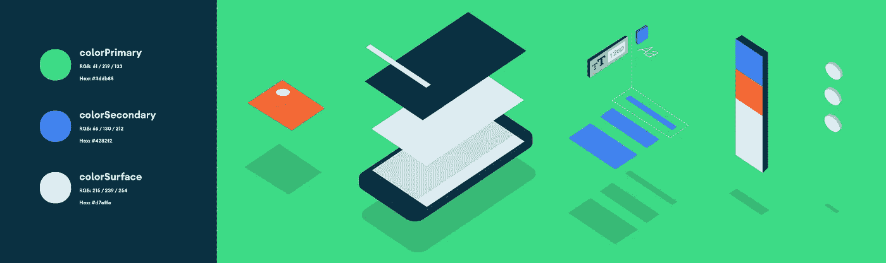
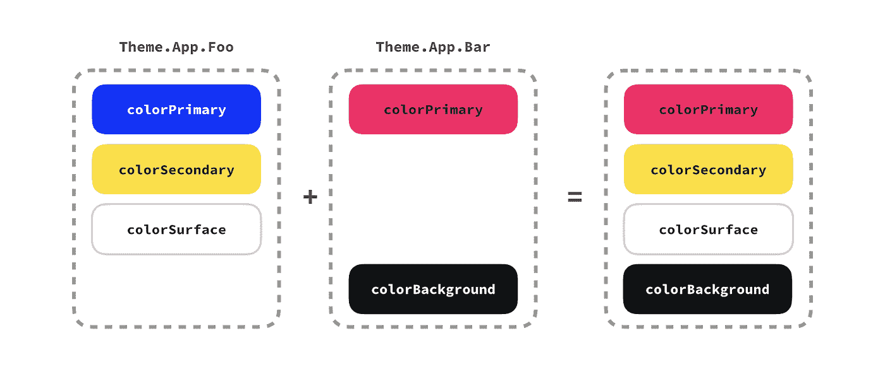
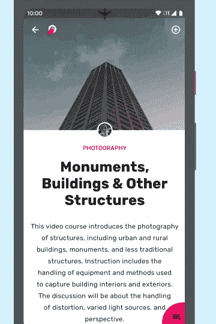

# Android 风格:主题覆盖

> 原文：<https://medium.com/androiddevelopers/android-styling-themes-overlay-1ffd57745207?source=collection_archive---------0----------------------->



Illustration by [Virginia Poltrack](https://twitter.com/VPoltrack)

在本系列关于 Android 样式的前几篇文章中，我们已经看到了样式和主题之间的[差异](/androiddevelopers/android-styling-themes-vs-styles-ebe05f917578)，讨论了使用主题和主题属性的[好处](/androiddevelopers/android-styling-prefer-theme-attributes-412caa748774)，并强调了一些要使用的[常见属性](/androiddevelopers/android-styling-common-theme-attributes-8f7c50c9eaba)。

今天我们将关注实际上使用主题的*，它们如何应用到你的应用程序中，以及对你如何构建它们的影响。*

# 范围

在之前的一篇文章中，我们[提到了](/androiddevelopers/android-styling-themes-vs-styles-ebe05f917578#0d0e):

> 一个`[Theme](https://developer.android.com/reference/android/content/res/Resources.Theme.html)`作为一个`[Context](https://developer.android.com/reference/android/content/Context)`的属性被访问，并且可以从任何有上下文的对象中获得，例如`Activity`、`View`或 `ViewGroup`。这些对象存在于一棵树中，其中一个`Activity`包含`ViewGroup` s，后者包含`View` s 等等。在这个树的任何一层指定一个主题会级联到后代节点，例如在一个`ViewGroup`上设置一个主题会应用到其中所有的`View`(与只应用到单个视图的样式形成对比)。

在这个树的任何一层设置一个主题都不会取代当前有效的主题，它会覆盖当前有效的主题。考虑下面的`Button`哪个物种有一个主题，但是谁的父代也指定了一个主题:

如果在两个主题中都指定了一个属性，那么最局部的“胜利”，即那些在`Bar`中的胜利，将被应用到按钮上。主题`Foo`中指定的属性，但主题`Bar`中未指定的属性**也将应用于按钮。**



Themes overlay each other

这看起来像是一个人为的例子，但这种技术对于用不同的外观设计应用程序的子部分非常有用，例如在一个明亮的屏幕上有一个黑色的工具栏，或者这个屏幕(来自 [Owl 示例应用程序](https://github.com/material-components/material-components-android-examples/tree/develop/Owl))有一个很大的粉红色主题，但显示相关内容的底部有一个蓝色主题:



A blue sub-section within a pink themed screen.

这可以通过在蓝色区域的根部设置一个主题来实现，它会级联到其中的所有视图。

# 过度覆盖

当主题覆盖树中任何更高的主题时，重要的是要考虑*你的主题指定了什么*以确保它不会意外地*替换*你想要保留的属性。例如，你可能想改变一个视图的背景颜色(通常由`colorSurface`控制),但不想改变其他，也就是说，你想保留当前主题的其余部分。为此我们可以使用一种叫做**主题叠加**的技术。

这些主题被设计成覆盖另一个主题。它们的范围尽可能窄，即它们只定义(或继承)尽可能少的属性。事实上，主题叠加通常(但不总是)没有父级，例如:

> 主题覆盖是范围很窄的主题，定义尽可能少的属性，旨在覆盖另一个主题

按照惯例，我们以“ThemeOverlay”开头命名这些。MDC (和 [AppCompat](https://android.googlesource.com/platform/frameworks/support/+/androidx-master-dev/appcompat/appcompat/src/main/res/values/themes.xml#76) )提供了许多方便的主题覆盖图[，你可以用它们将你的应用程序的一个部分的颜色从亮变暗:](https://github.com/material-components/material-components-android/blob/master/lib/java/com/google/android/material/theme/res/values/themes_overlay.xml)

*   `[ThemeOverlay.MaterialComponents.Dark](https://github.com/material-components/material-components-android/blob/3fba0eeade07f2915056f539047cce40fb31274b/lib/java/com/google/android/material/theme/res/values/themes_overlay.xml#L34-L45)`
*   `[ThemeOverlay.MaterialComponents.Light](https://github.com/material-components/material-components-android/blob/3fba0eeade07f2915056f539047cce40fb31274b/lib/java/com/google/android/material/theme/res/values/themes_overlay.xml#L21-L32)`

根据定义，主题叠加图并不指定许多东西，也不应该孤立使用，例如作为你活动的主题。事实上，你可以想出两种可以在应用中使用的主题:

1.  **“充实”的主题**。这些详细说明了你在屏幕上需要的一切。它们继承了另一个“完整”主题，如`Theme.MaterialComponents`，应该用于主题化一个`Activity`。
2.  **主题叠加**。仅适用于*整个主题，即不应孤立使用，因为可能不会指定重要和必要的内容。*

# 无处不在

总有一个主题在起作用，即使你没有在你的应用程序中指定一个主题，你也会继承一个默认的主题。因此，上面的例子是一个简化，你不应该在`View`中使用完整的主题，而应该使用主题叠加:

这些覆盖物不会孤立存在，但它们本身会覆盖在外围`Activity`的主题上。

# 成本:收益

使用主题有运行时成本；每次你声明一个`android:theme`，你就创建了一个新的`[ContextThemeWrapper](https://developer.android.com/reference/android/view/ContextThemeWrapper)`，它分配了新的`Theme`和`Resources`实例。它还引入了更多要解决的间接样式级别。小心不要过度使用主题*或*，尤其是在重复出现的情况下，如`RecyclerView`项目布局或个人资料，以监控它们的影响。

# 在上下文中使用

我们说过一个`Theme`与一个`Context`相关联——这意味着如果你在代码中使用一个`Context`来检索一个资源，那么要小心使用正确的`Context`*。例如，您可以在代码中的某个地方检索一个`Drawable`:*

```
someView.background = AppCompatResources.getDrawable(**requireContext()**, R.drawable.foo)
```

如果 drawable 引用了一个主题属性(所有 drawable 都可以从 API 21+中执行，而`VectorDrawable` s [可以通过 Jetpack 从 API 14+中执行](/androiddevelopers/draw-a-path-rendering-android-vectordrawables-89a33b5e5ebf#0a52))，那么你应该确保使用正确的`Context`来加载`Drawable`。如果你不这样做，当你试图将一个主题应用到一个子层次结构时，你可能会感到沮丧，并想知道为什么你的`Drawable`不尊重它。例如，如果你使用一个`Fragment`或`Activity`的`Context`来加载`Drawable`，这将不考虑应用在树中较低位置的主题。取而代之的是使用最接近资源使用位置的`Context` *:*

```
someView.background = AppCompatResources.getDrawable(**someView.context**, R.drawable.foo)
```

# 错误应用

我们已经讨论了存在于树中的主题和上下文:`Activity` > `ViewGroup` > `View`等等。扩展这个心智模型来包含`Application`类可能很有诱惑力，毕竟您可以在清单中的`<application>`标签上指定一个主题。**不要被这个**骗了！！

`Application``Context`**不**保留任何主题信息，你可以在你的清单中设置的主题仅仅是作为任何没有明确设置主题的`Activity`的后备。因此，你不应该使用`Application` `Context`到[加载资源](https://riggaroo.co.za/dark-mode-musings-beware-of-the-context/)，这些资源可能会因主题(如可绘制性或颜色)而异，或者解析主题属性。

> *千万不要使用* `*Application*` `*Context*` *来加载主题资源*

这也是为什么我们为一个`Activity`指定了一个“完整的”主题，并把它们构造成从任何应用程序范围的主题扩展而来——一个`<activity>`的主题不会覆盖在`<application>`的主题上

# 建立

希望这篇文章已经解释了主题如何覆盖树中的祖先，以及这种行为如何在设计我们的应用程序时有用。使用`android:theme`标签来主题化布局的各个部分，并使用主题叠加来调整您需要的属性。请注意使用正确的主题和上下文来加载资源，并注意应用程序上下文！