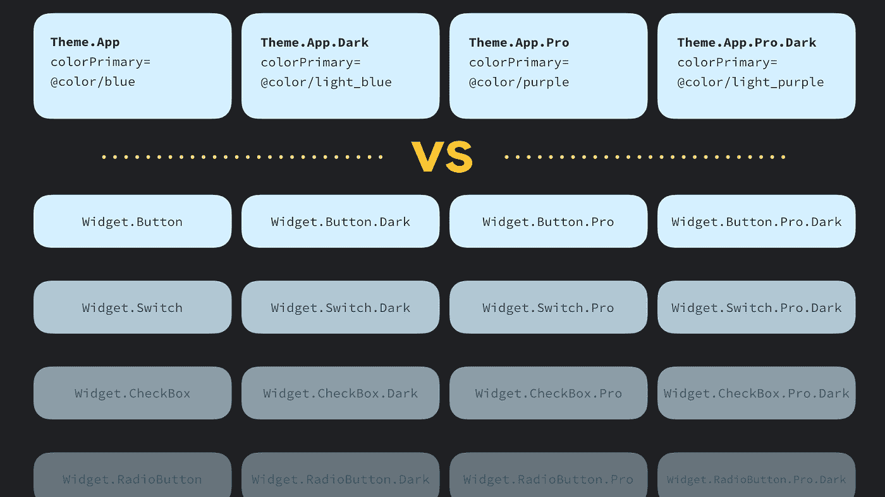

# Android 风格:主题与风格

> 原文：<https://medium.com/androiddevelopers/android-styling-themes-vs-styles-ebe05f917578?source=collection_archive---------0----------------------->

Illustration by [Virginia Poltrack](https://twitter.com/VPoltrack)

Android 风格系统提供了一种强大的方式来指定你的应用程序的视觉设计，但是它很容易被误用。正确使用它可以使主题和风格更容易维护，使品牌更新不那么可怕，并使其直接支持黑暗模式。这是一系列文章的第一篇，我和 Chris Banes 将着手揭开 Android 风格的神秘面纱，这样你就可以制作出时尚的应用程序，而不用担心被人发现。

在第一篇文章中，我将看看样式系统的构建模块:主题和样式。

# 主题！=风格

主题和风格都使用相同的语法，但是服务于非常不同的目的。您可以将这两者视为键-值存储，其中键是属性，值是资源。让我们来看看每一个。

# 什么是时尚？

样式是视图属性值的集合。你可以把一个风格想象成一个`Map<**view** attribute, resource>`。也就是说，键都是视图属性，即小部件声明的属性，您可以在布局文件中设置。样式特定于单一类型的小部件，因为不同的小部件支持不同的属性集:

> 样式是视图属性的集合；特定于单一类型的小部件

如你所见，样式中的每个键都是你可以在布局中设置的:

将它们提取到一个样式中使得跨多个视图重用和维护变得容易。

# 使用

样式由布局中的各个视图使用:

视图只能应用一种样式——这与其他样式系统形成对比，例如 web 上的 css，其中组件可以设置多个 css 类。

# 范围

应用于视图**的样式仅**应用于那个视图的*，而不应用于它的任何子视图。例如，如果你有一个有三个按钮的`ViewGroup`，在`ViewGroup`上设置`InlineAction`样式将不会把那个样式应用到按钮上。样式提供的值与布局中直接设置的值相结合(使用[样式优先顺序](/androiddevelopers/whats-your-text-s-appearance-f3a1729192d)解析)。*

# 什么是主题？

主题是命名资源的集合，以后可以通过样式、布局等引用。它们为 Android 资源提供了语义名称，因此您可以在以后引用它们，例如`colorPrimary`是给定颜色的语义名称:

这些命名的资源被称为主题属性，所以一个主题就是`Map<**theme** attribute, resource>`。主题属性不同于视图属性，因为它们不是特定于单个视图类型的属性，而是在语义上命名为的指针，指向在应用程序中更广泛应用的值。主题为这些命名的资源提供了具体的值。在上面的例子中，`colorPrimary`属性指定这个主题的主要颜色是蓝绿色。通过用一个主题来抽象资源，我们可以在不同的主题中提供不同的具体值(比如`colorPrimary`=橙)。

> 主题是命名资源的集合，在应用程序中非常有用

主题类似于界面。编程到一个接口允许你从实现中分离公共契约，允许你提供*不同的*实现。主题起着类似的作用；通过根据主题属性编写布局和样式，我们可以在不同的主题下使用它们，提供不同的具体资源。

大致相当的伪代码:

这允许您改变`MyView`的呈现方式，而不必创建它的变体:

# 使用

您可以在具有`Context`的组件上指定主题，例如`Activity`或`Views` / `ViewGroup` s:

你也可以通过用一个`[ContextThemeWrapper](https://developer.android.com/reference/android/view/ContextThemeWrapper.html#ContextThemeWrapper(android.content.Context,%20int))`包装一个现有的`Context`来在代码中设置一个主题，然后你可以用它来[膨胀](https://developer.android.com/reference/android/view/LayoutInflater.html#from(android.content.Context))一个布局等等。

主题的力量真的来自于你如何使用它们；您可以通过引用主题属性来构建更加灵活的小部件。不同的主题在以后提供了具体的价值。例如，您可能希望在视图层次结构的某个部分设置背景颜色:

我们可以通过使用`?attr/themeAttributeName`语法委托给主题，而不是设置静态颜色(`#ffffff`或`@color`资源)。这个语法的意思是:在主题中查询这个语义属性的值。这种程度的间接性允许我们提供不同的行为(例如，在浅色和深色主题中提供不同的背景颜色),而不必创建多个布局或样式，这些布局或样式除了一些颜色变化之外大部分是相同的。它隔离了主题中正在变化的元素。

> 使用`?attr/themeAttributeName`语法在主题中查询这个语义属性的值

# 范围

一个`[Theme](https://developer.android.com/reference/android/content/res/Resources.Theme.html)`作为一个`[Context](https://developer.android.com/reference/android/content/Context)`的属性被访问，并且可以从任何一个有`Context`的对象中获得，例如`Activity`、`View`或`ViewGroup`。这些对象存在于一棵树中，其中一个`Activity`包含`ViewGroup` s，后者包含`View` s 等等。在这个树的任何级别指定一个主题级联到后代节点，例如在一个`ViewGroup`上设置一个主题适用于其中所有的`View`(与只适用于单个视图的样式相反)。

这可能是非常有用的，比如说，如果你想要一个黑暗的主题部分，而不是一个明亮的屏幕。点击阅读更多关于这种行为的信息[。](/androiddevelopers/android-styling-themes-overlay-1ffd57745207)

请注意，此行为仅适用于布局膨胀时。虽然`Context`提供了一种`[setTheme](https://developer.android.com/reference/android/content/Context#setTheme(int))`方法，或者`Theme`提供了一种`[applyStyle](https://developer.android.com/reference/android/content/res/Resources.Theme?hl=en#applyStyle(int,%20boolean))`方法，但是这些都需要在膨胀之前被称为*。膨胀后设置新主题或应用样式不会更新现有视图。*

# 单独关注

理解不同的职责以及风格和主题的相互作用，有助于使你的风格资源更易于管理。

例如，假设你的应用程序有一个蓝色主题，但一些专业屏幕有一个花哨的紫色外观**和**，你想提供带有调整颜色的[深色主题](https://developer.android.com/guide/topics/ui/look-and-feel/darktheme)。如果你试图只使用样式来实现这一点，你必须为专业/非专业和浅色/深色的排列创建 4 种样式。由于样式特定于一种视图类型(`Button`、`Switch`等)，你需要在你的应用程序中为每种视图类型创建这些排列。

Exploding permutations of widgets/styles without theming

相反，如果我们使用样式**和**主题，我们可以将根据主题改变的部分隔离为主题属性，因此我们只需要为每个视图类型定义一个样式。对于上面的例子，我们可以定义 4 个主题，每个主题为`colorPrimary`主题属性提供不同的值，然后这些样式引用并自动反映主题的正确值。

这种方法可能看起来更复杂，因为您需要考虑样式和主题的交互，但是它有隔离每个主题的变化部分的好处。因此，如果你的应用程序从蓝色更名为橙色，你只需要在一个地方进行更改，而不是分散在整个样式中。这也有助于对抗风格的扩散。理想情况下，每种视图类型只有少量的样式。如果你不利用主题化，你的`styles.xml`文件很容易失去控制，爆发出相似风格的不同变体，这成为一个令人头疼的维护问题。

加入我们的下一篇文章，我们将探索一些常见的主题属性以及如何创建自己的主题属性:

 [## Android 样式:通用主题属性

### 在本系列关于 Android 风格的前一篇文章中，我们讨论了主题和风格之间的区别…

medium.com](/androiddevelopers/android-styling-common-theme-attributes-8f7c50c9eaba)