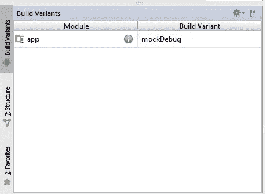
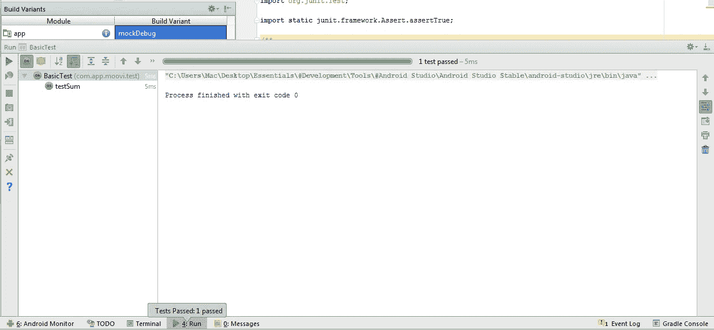

# Android Testing 4 - 设置测试环境

> 原文：<https://medium.com/google-developer-experts/android-testing-4-configura%C3%A7%C3%A3o-do-ambiente-para-testes-9e37330afd7c?source=collection_archive---------3----------------------->


我个人万岁,首先祝你新年快乐,祝你作为 Android 开发人员在职业生涯中取得了许多成就和进步。
在解释了依赖注入以及如何构建一个模型,使我们能够在前面的[帖子](/google-developer-experts/android-testing-part-3-mvp-model-e-dependency-injection-32a9036d18d6#.iiceogq9e)中进行测试并获得更清晰和可读的代码之后,我们将继续这个系列,在本文中,我将向您展示如何创建一个允许在 Android 上编写和运行单元测试的环境所需的设置。

在 Android 上编写测试已经成为一项非常简单的任务,因为创建了“Android 测试支持库”,其中包含执行单元测试(Unit Tests)和仪器测试(Instrumented Tests)等所需的所有 API。

要开始使用此库在应用中编写和运行测试,只需按照以下步骤操作:

# 通过 Gradle 添加库

因为在本文中,我将只关注单元测试,所以使用支持库 API 的第一步是将“app”模块的 build.gradle 文件中所需的依赖项应用到项目中。

```
dependencies {
    testCompile 'junit:junit:4.12'
    testCompile 'org.mockito:mockito-core:1.10.19'
}
```

第一个不可或缺的库是 JUnit 测试框架,它可以轻松创建代码以实现测试自动化和结果呈现。
通过[JUnit](http://junit.org/junit4/),可以使用一组测试结果的方法来测试一个函数(方法)是否按预期工作。

第二个库,但不是创建基本单元测试所必需的,是 [Mockito](https://github.com/mockito/mockito) 框架,简而言之,它允许使用单元测试依赖的某些 Android 组件的“开放”版本。(Mockito 只能在下一篇文章中正确使用和解释)

通过将库正确添加到项目中,下一步是创建一个密封环境,该环境包括简单地创建一个测试环境,在该环境中,这些环境与任何类型的依赖项隔离运行。

**示例:**对于本项目,显示事件列表取决于后端、Internet 连接以及可能影响此任务的其他因素。

因此,创建一个密封的环境将允许我们创建这些必要组件的虚假实现,并使用依赖注入(T1)的概念将这些实现注入到我们想要测试的组件中。
为了实现这一目标,我们可以使用依赖注入库,如[Dagger](http://square.github.io/dagger/),或者本文中介绍的最简单的方法是使用 Gradle 插件中提供的*build flavours*功能。

## 创建 flavours

Build flavours 是 Gradle 插件中提供的一项功能,它允许我们创建具有常见基本功能的不同版本的应用程序,并根据创建版本的目的创建更多不同的功能。

一个非常经典的例子是付费和免费版本的应用程序,其中两者具有共同的功能,但付费版本通常具有比免费版本更多的功能。

创建 build flavours 非常简单,第一步是在 gradle 中定义版本,如下面的脚本所示。

```
android{ //outras configuracoes
  productFlavors {
    mock {
        applicationId **"co.app.evently.mock"** versionName **"1.0.0"** }
    prod{
        applicationId **"co.app.evently"** versionName **"1.0.0"** }
  }
}
```

接下来,您需要同步项目并添加目录,如下图所示。
**注意:**在创建项目时,必须自动生成**main** 、**androidTest**目录。

```
app(**module**)
-->**src**
   -->androidTest(**contém código dos testes unitários de integração)
   -->main (contem código comum entre a versão de testes e produção. Ex: EventListFragment**)
   -->mock (**contém código da versão exclusivamente para testes**)
   -->prod (**contém código da versão de produção**)
   -->test (**contém código dos testes unitários)**
```

您一次只能在一个版本上工作,只需更改设置,如下图所示。
当选择其中一个版本时,项目将只能看到相应目录中的现有文件,以及与所选版本无关的普通主目录中的文件。



使用此功能,您可以在每个版本中创建一个类 **Injection**,该类将根据所选版本提供不同的存储库版本(在上一篇文章中解释过),也就是说,在 mock 版本中,类 **Injection**将具有方法 **provvedEventListRepository()** ,该方法将返回一个带有错误数据的实现(仅用于测试),并且在生产版本中,将使用相应的存储库实现从服务器加载数据,如下一篇文章中所述,当为该项目的演示者编写测试时。

现在,我将通过编写一个简单的单元测试来测试环境是否正确配置。

第一步是在 **tests(如上所述)目录中创建一个类,所有测试都将被写入其中。**

要编写测试函数,只需在创建的类中编写该函数,并在方法签名上添加 @Test 注释,以便 JUnitRunner 将此方法识别为要运行的测试。
此函数的主体由要测试的逻辑和 JUnit API 中提供的一组方法组成,这些方法允许您检查执行的操作的结果是否与预期的结果相同。

检查逻辑是否正确的一些方法是:

**assertEquals(期望的 Object,当前 Object):**检查两个对象是否相同,如果对象不同,测试失败。

**assertTrue(boolean expression):** 检查作为参数传递的表达式是否为真。如果表达式为 false,测试将失败。

**assertNotNull(Object object): 检查传入的对象是否为非 null。如果对象为 null,测试将失败。**

使用这些方法,可以编写单元测试,如下面的测试,以检查求和方法是否正常工作。

```
public class BasicTest{

     public int sum(int a, int b){
        return a+b;
     }

     @Test
     public void testSum(){
       int a = 5;
       int b = 4;
       int result = sum(a,b);
       assertTrue(result == 9);
     }
}
```

要运行此测试,只需右键单击文件上方,选择选项 “运行啊...<nome da="" class="">在几秒钟内,a*ndroid studio*将在*Run*选项卡上显示结果,如下图所示。</nome>



通过这种方式,我们结束了另一篇文章,其中可以设置测试环境,编写和运行基本的单元测试。

我们将在下一篇文章中继续编写 presenter 测试,并将本文中提出的一些概念与编写更复杂的测试相关联。

如果你喜欢这篇文章,请点击下面的心脏点击,并与你认为他们也可能会发现有趣的朋友分享。

如果您有任何疑问或建议,请让她在下面的部分中写下评论。

吃下一个!

dm=)