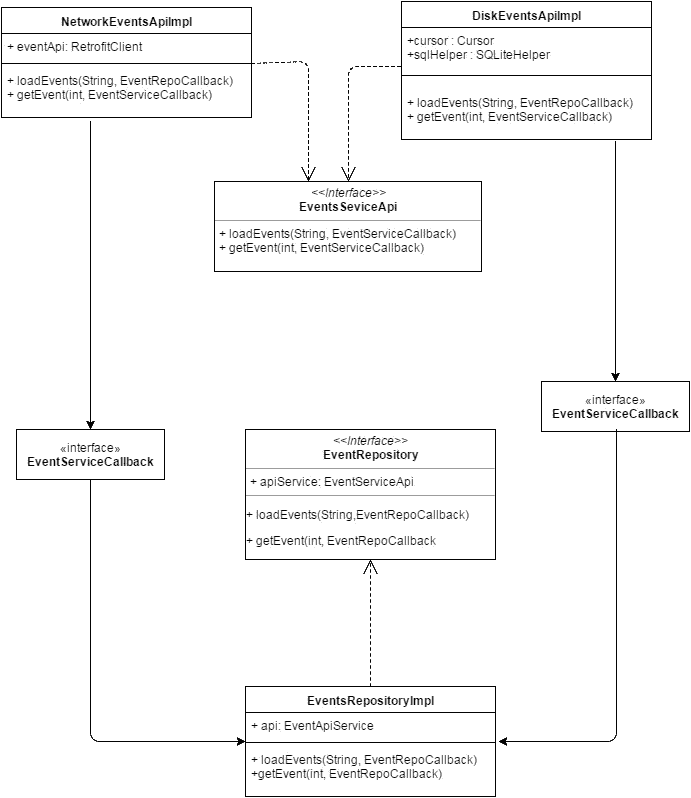
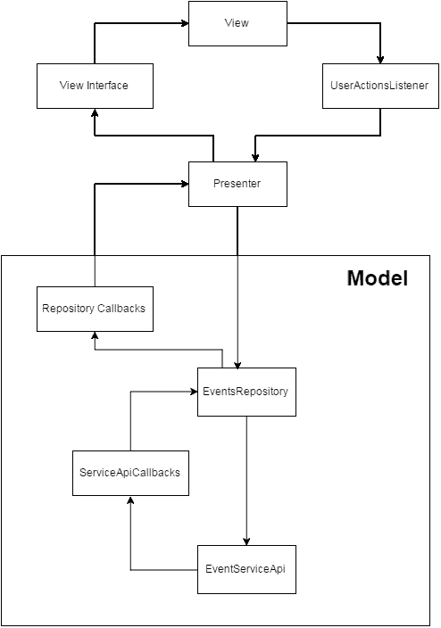

# Android 测试第 3 部分:“模型” MVP 和依赖注入

> 原文：<https://medium.com/google-developer-experts/android-testing-part-3-mvp-model-e-dependency-injection-32a9036d18d6?source=collection_archive---------1----------------------->

在最新的“MVP”帖子中,我谈到了我们应该如何组织一个项目,以便我们可以轻松实现 MVP 架构标准,并演示了如何实现 View 和 Presenter 组件。

本文旨在结束对 MVP 的解释及其在项目中的实现,以便我们可以转到本系列的主要目标,即教你如何为 Android 应用编写测试。

在这篇文章中,我将谈论:

*   依赖注入(Dependency Injection)(T4)为什么谈论它);
*   实现一个干净的通用模型;

## 依赖注入 Dependency Injection

> “依赖注入是用于一个非常便宜的概念的膨胀期”——Daniel Lew(Android @ Trello 和 GDE)

@Daniel Lew Dependency Injection 是一个非常漂亮的术语,对于一个非常简单的概念,我会说它吓人。(主要针对那些刚开始为 android 编程的人)
这是因为这个术语(在 android 中)与 Dagger 类型的库有关,这些库可能非常好,但只是试图理解它是如何工作的,这使得一切都非常混乱。

当代码的一部分依赖于另一部分来执行某些操作时,使用术语*依赖注入(T8),并且我们在依赖它的函数中注入变量。(这么简单)*

一个基本的场景,我相信每个人都曾经在某个时候,是需要一个变量 X 在类 Y,它可以执行 Z 操作。

看一下上面的场景,我们可以很快地说,操作 Z 依赖于 X,并且可以通过两种方式传递给类 Y:

1.  在创建类 Y 时将 X 作为构造函数参数传递。
2.  在类 Y 中创建 X。

这些方法将允许执行 Z 操作,但这里要保留的最重要的是将 X“注入”到 Y 类作为执行 Z 操作的重要变量。

## 依赖注入(Dependency Injection,T10)

将此依赖注入概念放在本系列开头并与模型相关联的主要原因,以及此概念在创建良好测试环境中的重要性,其中主要因素之一是测试不受外部变量/组件的影响。

将模型视为负责从给定源读取/存储数据的组件,假设单个源进行测试将假定我们必须依赖数据源(控制台、磁盘或服务器数据)来执行架构所需的测试。因此,依赖注入的概念将允许我们注入我们为测试而创建的假数据源(T0),并且只关注我们想要测试的组件,而不必担心 REST API 实现或磁盘上的数据是否成功。(T2 ) Non of our business (T3 )。

## 实现一个干净的和通用的模型

应用依赖注入的概念在很大程度上取决于我们如何构建代码。因此,我们必须适当地构建我们的类,以便我们可以利用上述概念提供的好处。

我们的模型将有不同的组件相互连接,如下图所示:



如上图所示(一个并发症),模型由以下类组成:

**EventServiceApi** 此接口定义了任何数据源(磁盘、网络)必须遵循的约定。
除了方法之外,这个接口还包含一个带有回调方法的接口,该接口将用于与存储库(如下所述)进行通信,如下面的代码所示。

有了这个创建的接口,我们可以从不同的源(Disco,REST API)读取数据,只需创建一个新类,根据我们正在实现的数据源实现合同中定义的方法。(示例:EventsService 实现从 REST API 读取数据,我们将在 **loadEvent** 方法中使用 Retrofit 或任何其他机制调用 API)

```
**public interface** EventsServiceApi {

    **interface** EventsServiceApiCallback<T>{
        **void** onEventsLoaded(T events);

    }
    **void** loadEvents(EventsQueryForm form, EventsServiceApiCallback<List<Event>> callback);

}
```

(T10) EventRepository(T11)

EventRepository 接口定义了与 EventServiceApi 接口相同的方法,以及一个带有回调方法的接口,以便它可以将信息发送回 Presenter。

此接口是与 Presnter 的唯一通信点,确保 Presnter 只知道如何请求所需的数据,而不必担心数据的来源。

除了允许与 Presenter 通信的方法和接口之外,EventRepository 的实现包含对 EventServiceApi 类的引用,我们在构建新存储库时传递给所需的 EventServiceApi 实现(无论是从磁盘读取还是从 REST API 读取)。

EventRepository 接口和实现看起来像这样:

```
**public interface** EventsRepository{

    **interface** EventsRepositoryCallback{
        **void** onEventsLoaded(List<Event> events);
    }

    **void** loadEvents(EventsQueryForm queryForm,EventsRepositoryCallback callback);

}**public class** EventsRepositoryImpl **implements** EventsRepoistory {

    **private** EventsServiceApi **mApi**;

    **public** EventsRepositoryImpl(EventsServiceApi api){
        **this**.**mApi** = api;
    }

    @Override
    **public void** loadEvents(EventsQueryForm queryForm, **final** EventsRepositoryCallback callback) {
        **mApi**.loadEvents(queryForm, **new** EventsServiceApi.EventsServiceApiCallback<List<Event>>() {
            @Override
            **public void** onEventsLoaded(List<Event> events) {
                callback.onEventsLoaded(events);
            }
        });
    }
}
```

通过正确创建和结构化模型,最终实现了正确实现 MVP 的目标,该 MVP 将具有相互关联的组件,如下图所示。



在下一篇文章中,我们将继续讨论 *build flavours* ,以及为什么这些在创建测试环境时很重要,以及它们如何与依赖注入的概念相关联。

如果你发现这篇文章很有趣 点击下面的绿色小心脏 并与可能感兴趣的朋友分享。

吃下一个=)

DM