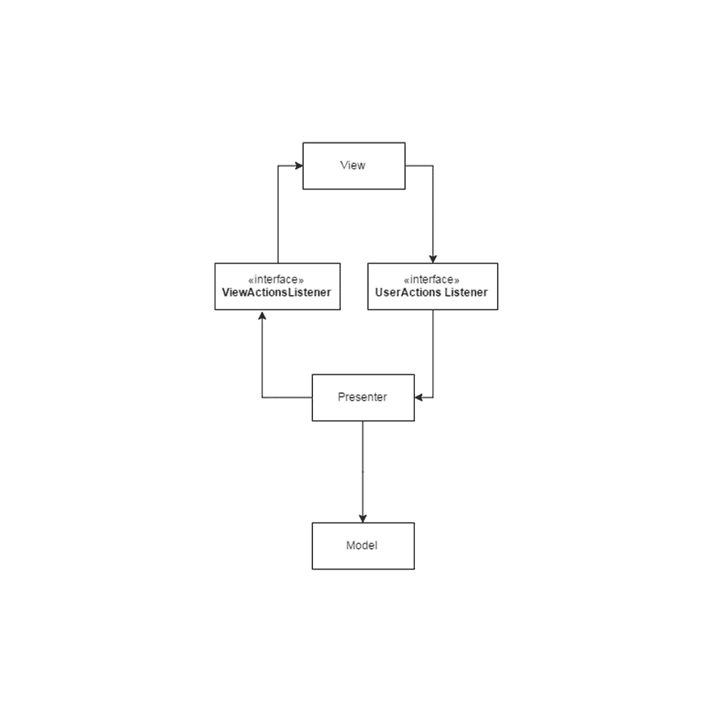

# Android 测试 - 第 1 部分 (架构)

> 原文：<https://medium.com/google-developer-experts/android-testing-parte-1-arquitectura-8f062e8e5be?source=collection_archive---------0----------------------->

在上一篇文章中,我谈到了如何使用 Firebase 崩溃报告,以便我们可以报告用户在应用程序发布到 playstore 后经常遇到的错误/异常。

尽管这个工具提供了强大的功能,但如果我们的应用程序有多个错误和反复出现,用户将继续拥有糟糕的体验,而崩溃报告只会向我们展示我们是多么糟糕的程序员。

# 如何确保应用程序的错误尽可能少?

确保应用程序的高质量和最少的错误只需要对其进行适当的测试。

Android 具有 Android 测试支持库 (T3),它提供了在 Android 应用程序中执行单元测试和仪器测试所需的工具。

## 单元测试 UnitTests

单元测试(从现在开始的*单元测试(T5))是我们只关心测试代码的一小部分功能的测试,独立于其他现有函数。*

以我们设备中的计算器为例,我们可以使用 T6 单元测试来测试它可以独立执行的不同操作(相加,乘法,减法等)的功能。

## T8 仪器测试(T9)

仪器测试(现在称为 *仪器测试* ) 允许我们测试图形界面组件在接收特定的用户交互时是否表现出预期。**示例**:我们可以编写测试来检查每次点击按钮时会发生什么,或者文本是否在其他类型的交互中正确传递给 TextView,而不是运行应用程序并手动执行。

编写测试对于确保应用程序的良好质量非常重要,但更重要的是知道如何编写好的测试。因此,开发一个应用程序必须从编写测试开始,而不是仅仅因为有人(比如我)说它很好而在项目中做出决定。

您需要确保应用程序在编写任何代码行之前具有适当的坚实基础。

## Android App 的架构

几年前,当我开始为 Android 开发应用程序时,我记得我一直在做的事情是打开 eclipse,使用 wizzard 并创建一个新的项目,在这个项目中,由于我对 Activities 和 Fragments 的知识有限,我冒险编写饼和右边的代码,以便在 UI 中显示一些内容,并在与它交互时执行一些操作。
如此天真,导致一些项目不是很糟糕,但有很多代码,复杂且极难维护,更不用说测试了。

为了防止过去的许多“他们”被复制,并使开发人员的世界变得更好,已经创建了各种软件架构标准,以确保:

*   我们可以对软件的不同组件进行适当的责任分离。
*   我们有一个干净,易于维护的代码。
*   我们有一个易于测试的代码。

有许多软件架构标准,如分层架构,Model-View-Controller(MVC),Model-View-Presenter(MVP),Model View View Model(MVVM)等。

为了撰写这些模式中的每一个,都需要专门的帖子,因此,在本文中,我们将只关注 MVP。
[**(链接到我发现有趣的电子书)**](http://www.oreilly.com/programming/free/files/software-architecture-patterns.pdf)

# 模型视图呈现器(MVP)

Model-View-Presenter(以下简称 MVP)是一种软件开发架构标准,它假设给定的软件具有三个不同的组件,包括:

## 模型

模型负责数据的表示以及数据的读写机制。以一个简单的*电子商务应用程序*为例,我们将模型化为表示项目的类和写入或读取项目的数据存储库。(仓库=API,内部存储,文件等)。

## 视图

顾名思义,视图是负责处理从图形界面向用户呈现信息的组件(绘制组件,在其他操作之间更新值)。

## **介绍(T12)**

Presenter 是 View 和 Model 之间的中间组件。T13 其主要作用是确保从模型接收的信息在呈现给用户之前得到适当的处理,以及在用户输入信息存储在模型中之前的反向处理过程。

通过将 MVP 引入 Android,该标准使我们能够非常明确地分离 Fragment 和 Activities 等组件的行为限制,确保这些组件仅充当负责执行图形界面操作以向用户呈现信息的视图。

如上图所示,组件之间的通信是通过接口实现来实现的,该接口允许每个组件独立于其他组件实现,即 View 不知道 Presenter 是如何实现的,并且只要任何 Presenter 实现定义了与其通信合约的接口,它将继续按预期工作。

有了这种非常清晰的角色分离,我们现在可以轻松地编写测试图形界面交互的仪器测试,这些测试与测试 presenter 功能的单元测试分离。

通过对 Android 测试和 MVP 的简短介绍,我们完成了另一篇文章,希望我能更详细地介绍并在下一篇文章中展示 MVP 架构的应用程序是什么样的!

下次吃吧:)

DM