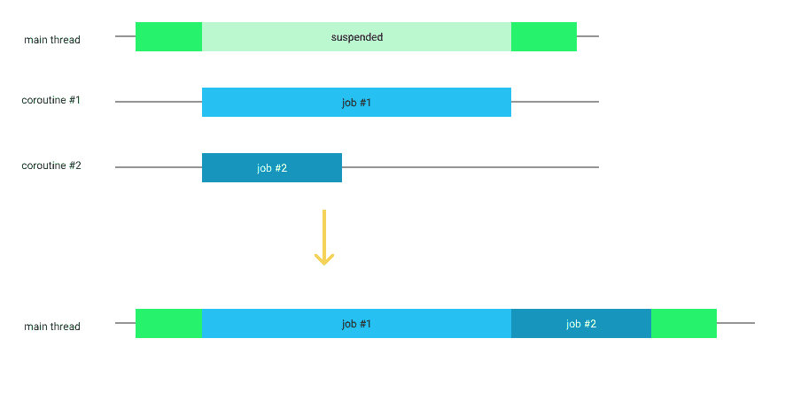

# 用 Espresso 的空闲资源和测试保真度进行 Android 测试

> 原文：<https://medium.com/androiddevelopers/android-testing-with-espressos-idling-resources-and-testing-fidelity-8b8647ed57f4?source=collection_archive---------2----------------------->

# 将您的应用程序与 Espresso 同步

*如果知道为什么需要闲置资源，可以跳到下一节*

与其他 UI 测试框架相比，Espresso 的主要优势在于它可以与你的应用程序同步。这意味着它只会在你的应用空闲时(等待用户输入)做出断言和执行动作。其他测试框架会等到满足某个条件(例如显示一个视图)时再进行测试，但是这在很多情况下被证明是有问题的，会导致不可靠的测试。其他框架依赖于您猜测某个操作将花费的时间。这使得测试很慢，并且不能真正保证确定性。**在浓缩咖啡测试中，你永远都不应该使用** `**Thread.sleep**` **。**

> Espresso 了解 Android 的内部结构，能够预测未来。如果主线程很忙(或者在不久的将来会很忙)，Espresso 会在运行下一个操作之前等待。这种同步机制，以及 Espresso 的其他技巧，使其成为 Android 上最常用的 UI 测试框架。

然而，编写 UI 测试并不容易，大多数问题仍然与同步有关。有些事情是浓缩咖啡不知道的:

*   **动画**。如果动画无限期运行，Espresso 可能会超时等待动画结束。这就是为什么你应该[在你的测试设备中禁用动画](https://developer.android.com/training/testing/espresso/setup#set-up-environment)。
*   **后台操作**。Espresso 不仅查看主线程，还查看 [AsyncTask](https://developer.android.com/reference/android/os/AsyncTask) 线程池。然而，已经没有多少人使用 AsyncTask 了。如果您使用自己的线程池执行器， [Kotlin 协同程序](https://kotlinlang.org/docs/reference/coroutines-overview.html)或 [RxJava](https://github.com/ReactiveX/RxJava) ，您需要一种方法来将它们与 Espresso 同步
*   **调度更新的其他机制**。例如，[数据绑定](https://developer.android.com/topic/libraries/data-binding)使用[编排器](https://developer.android.com/reference/android/view/Choreographer)来发布更新，而不是主 Looper 队列(Espresso 监视的对象)。

当这种情况发生时，你会看到不同的错误，但它通常是一个`NoMatchingViewException`,因为屏幕上显示的(还)不是你告诉 Espresso 期待的。

Espresso 提供的让您指示应用程序何时繁忙的 API 被称为[空闲资源](https://developer.android.com/training/testing/espresso/idling-resource.html)。

# 空闲资源是如何注册的

在测试开始之前，您可以根据需要注册任意多的空闲资源。通常在@Before 方法内的测试类中这样做:

`IdlingRegistry.getInstance().register(myIdlingResource)`

在下一步中，您将学习如何创建空闲资源。

记得在完成后注销它们，例如在@After 方法中:

`IdlingRegistry.getInstance().unregister(myIdlingResource)`

# 创造闲置资源

空闲资源实现了`IdlingResource`接口，您可以创建自己的接口:

然而，我建议你使用浓缩咖啡自带的`[CountingIdlingResource](https://developer.android.com/reference/android/support/test/espresso/idling/CountingIdlingResource)`，它可以让你在每次开始一项任务时呼叫`increment`，在完成任务时呼叫`decrement`。这样，您可以控制同时运行的多个任务。

## 示例 1:小吃店

显示 Snackbars 的测试很难进行 UI 测试，因为它们会启动一个弹出动画，显示一会儿，然后又被另一个动画隐藏起来。Espresso 并不真正知道你的应用程序何时空闲，因为它只看到未来的 [15 ms](https://github.com/android/android-test/blob/master/espresso/core/java/androidx/test/espresso/base/Interrogator.java#L41) 和`Snackbar.LENGTH_SHORT`2 秒。即使禁用动画，Snackbar 也会显示。

您可以在每次显示 Snackbar 时添加一个回调，并在显示和关闭 snack bar 时通知空闲资源。这个例子摘自 [Android 测试代码实验室](https://codelabs.developers.google.com/codelabs/android-testing/#6):

您也可以在 UI 测试中完全禁用 Snackbars，以使它们通过得更快，因为您并没有通过这种方式来验证它们的内容。

看看我们[如何在测试代码实验室](https://github.com/googlecodelabs/android-testing/blob/codelab2019/app/src/test/java/com/example/android/architecture/blueprints/todoapp/tasks/TasksViewModelTest.kt#L212)的单元测试中验证 Snackbar 内容。

## 示例 2:仅从测试中使用的空闲资源

并非所有空闲资源都存在于您的生产代码中。例如，在[测试代码实验室](https://codelabs.developers.google.com/codelabs/android-testing/#9)中，我们使用了一个[databindingdingresource](https://github.com/googlecodelabs/android-testing/blob/codelab2019/app/src/sharedTest/java/com/example/android/architecture/blueprints/todoapp/util/DataBindingIdlingResource.kt)来寻找活动中的绑定，并对它们调用`hasPendingBindings`来判断它们是忙还是闲。

这些工具只在测试中使用，所以**它们是完美的闲置资源**:不需要修改产品代码。

其他例子有 [RxIdler](https://github.com/square/RxIdler) ，一个封装了 RxJava 调度程序的空闲资源和 [okhttp-idling-resource](https://github.com/JakeWharton/okhttp-idling-resource) ，你猜对了，okhttp 请求。我们目前正在[探索如何用 Kotlin 协程](https://github.com/Kotlin/kotlinx.coroutines/issues/242)做到这一点。

## **例 3:修改生产代码😵**

如果您在后台操作中加载数据，并且没有其他空闲资源机制可用，您可以将应用程序中的空闲资源暴露给测试。例如，在视图模型或数据存储库中:

然而，您只是为了测试而修改测试中的代码。理想情况下，我们不应该这样做。

争论的焦点是:**我们应该在生产代码中使用空闲资源吗？**

一方面，它们非常易于使用，并且确实使您的代码更易于测试。另一方面，你在给一个潜在的数百万用户运行的应用程序添加代码，但它什么也不做……**什么也不做。**

如果你走这条路，你应该限制生产中的负面影响。例如，如果你正在使用一个来自[对象](https://github.com/googlecodelabs/android-testing/blob/codelab2019/app/src/main/java/com/example/android/architecture/blueprints/todoapp/util/EspressoIdlingResource.kt)的`CountingIdlingResource`，为调试和发布(或者为不同的风格)创建这个对象的不同版本。发布的版本应该什么都不做:

Snackbar 的例子也是如此，我们在其中添加了侦听器。该版本的扩展功能将替换为:

问题是这些类没有 UI 测试覆盖，所以应该保持简单。

# 生产中闲置资源的替代方法

> 你必须找到*你的*在修改测试代码和保持测试保真度之间的平衡。**高保真是指你测试的就是用户会用的**。否则，测试可能无法捕获特定的 bug。

**假设您想通过让所有后台操作顺序运行而不是并发运行来解决问题**。正如我们之前看到的，你可以使用主线程甚至是`AsyncTask`线程来完成这个任务。这很棒，因为您只需要在测试中注入一些测试执行器或替换一些调度程序。但是，请考虑以下代码:

这将启动两个协同程序，它们将在生产中并发运行。如果你不熟悉协程，这就像在一个线程池中执行两个 Runnables。在测试中，我们可以将*的执行简化为一系列操作，但是远程数据源调用总是首先执行。*

Running asynchronous jobs sequentially for tests

这种行为是忠诚的吗(它符合生产中的现实吗)？差不多！但是，您可能会遗漏低端设备或有限连接等边缘情况。

使用这种方法，您可以避免生产中的资源闲置，但是**您应该意识到后果**并弥补缺失的情况。例如，您可能应该添加一系列确定性单元测试来验证您没有在 UI 测试中测试的情况，其中作业#2 在作业#1 之前完成。

注意:协同例程的解决方案正在开发中，并在[EspressoIdlingResource integration](https://github.com/Kotlin/kotlinx.coroutines/issues/242)中进行了跟踪。这个想法是能够设置一个可以注册为空闲资源的调度程序。

# 摘要

1.如果可以的话，使用你正在使用的库提供的空闲资源来完成主线程之外的工作。

2.否则，决定是否要通过添加类似`[CountingIdlingResource](https://developer.android.com/reference/android/support/test/espresso/idling/CountingIdlingResource)`的闲置资源来修改生产代码。如果您正在修改代码，请确保它具有较低的影响。如果你正在修改你的应用程序的行为以避免资源闲置，请确保你了解反响并在不同的测试中增加覆盖率。

3.如果您的测试范围可以更小，您总是可以用一个假的来替换您的依赖项。在 [codelab](https://codelabs.developers.google.com/codelabs/android-testing/#0) 中，所有的“片段”测试都使用 FakeTasksRepository，所以速度很快。参见测试代码实验室的[任务 FragmentTest](https://github.com/googlecodelabs/android-testing/blob/codelab2019/app/src/sharedTest/java/com/example/android/architecture/blueprints/todoapp/tasks/TasksFragmentTest.kt#L55) 和其余的`@MediumTest`