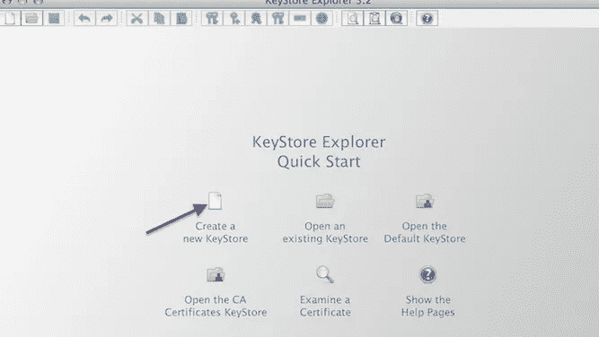
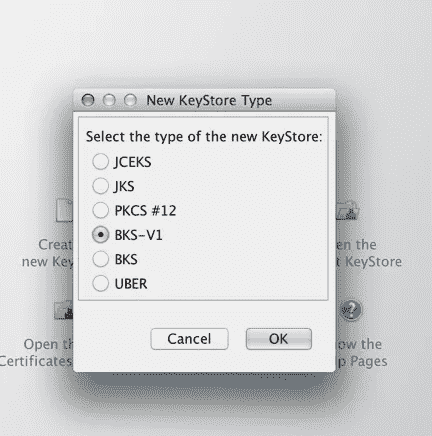
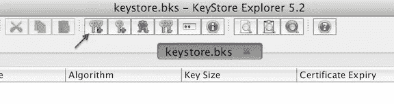
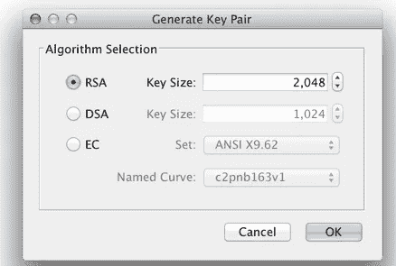
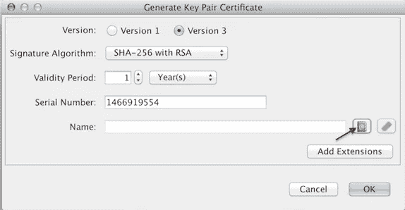
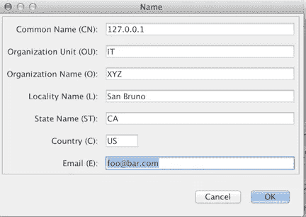

# 带嘲讽的 Android 测试

> 原文：<https://medium.com/walmartglobaltech/android-testing-with-mocking-fcec5b9f71c2?source=collection_archive---------0----------------------->

如今，设备农场中的 Android 测试自动化正在成为一种规范。在不同设备上以最佳速度和最大可靠性进行大规模测试，促使测试社区提出了不同的模拟解决方案。这些解决方案中的许多都提供了模拟服务器的托管版本，该版本作为实例运行，并且可以使用模拟服务器访问存根服务端点。

通常，自动化 web 测试是在像 Jenkins 这样的持续集成系统中执行的，其中一个主作业创建多个子作业，每个子作业:

*   打开与云服务提供商的连接
*   构建代码
*   启动模拟服务器和应用程序
*   与模拟端点进行交互以驱动测试

然而，对于 android 原生应用，挑战稍微困难一些，因为没有应用服务器或模拟服务器可以启动。APK 文件是上传到云中的设备来运行测试的文件。这就需要将模拟服务器作为 APK 的一部分来运行。

有许多模拟服务器可以完成这项工作。我们调查了其中的一些，最终选择了 wiremock，原因如下。

# Android 上的 Wiremock

Wiremock 运行在 Jetty 容器上，这使得它成为运行在 Android 应用程序中的完美候选。wiremock jar 可以作为一个 jar 导入到 android 项目中，模拟服务器可以按如下方式启动:

```
WireMockServer **wireMockServer** = **new** WireMockServer(8080);
```

Sam Edward 的[博客](http://handstandsam.com/2016/01/30/running-wiremock-on-android/)为我们在 Android 上运行 wiremock 提供了一个很好的起点。

# HTTPS 端点

Wiremock 支持使用 Java 密钥库(JKS)作为默认密钥库类型的 HTTPS。但是，android JVM 不支持 JKS，android 中默认的密钥库类型是[弹力城堡密钥库(BKS)](https://bouncycastle.org/specifications.html) 。因此，要让 HTTPS 在 Android 上使用 wiremock，需要采取几个步骤。

以下是你可以遵循的步骤:

*请注意，提供这些说明是为了生成自签名证书，该证书不适用于生产环境。*

## 在 JVM 中添加服务提供者

*   以 root**<Java home>/JRE/lib/security/Java . security**的身份打开文件
*   在所有 service.providers 的末尾添加行**security . provider . 11 = org . bouncy castle . JCE . provider . bouncy castle provider**
*   保存并退出文件。
*   有时，JVM 设置需要重新启动系统才能生效。

## 创建 BKS 密钥库

*   下载 [Keystore Explorer](http://www.keystore-explorer.org/) 或 [Portecle](http://portecle.sourceforge.net/) 开源工具。这两个软件工作起来几乎一样。
*   从菜单中，单击“创建新的密钥库”



*   选择 BKS-V1 作为密钥库



*   您将看到一个没有密钥对的新的空密钥库。
*   单击保存。
*   系统将提示您输入密码。为简单起见，键入“password ”,因为这是 Wiremock 默认选择的。在确认密码字段中键入相同的密码。
*   用文件名保存密钥库。文件名可以是任何文件名，但是为了清楚起见，您可以给出扩展名，例如 keystore_bks。
*   按照以下步骤生成密钥部分和自签名证书:
*   点击顶部菜单上的“生成密钥对”按钮



Generate Key Pair

*   将出现一个对话框。选择确定，不做任何更改。



*   将出现一个新对话框
*   点击书本图标，如下所示:



*   出现提示后，输入证书申请信息:



*   输入完整信息后，单击确定。
*   验证后再次单击“确定”
*   出现提示时，输入别名。可以输入‘Android _ keystore’。
*   在此输入密码。这应该与您输入的密码相匹配。我们的密码是“密码”
*   单击确定
*   此时，您的 BKS 密钥库应该可以使用了。

# Wiremock 更新:

为支持 BKS 密钥库类型，对 wiremock 进行了以下更改:

*   在类**wire mock/src/main/Java/com/github/tomakehurst/wire mock/jetty 9/jetty http server . Java**中，‘**createhttpsconnect**通过系统的密钥库类型设置密钥库类型。

```
**private** ServerConnector createHttpsConnector(
        HttpsSettings httpsSettings,
        JettySettings jettySettings) {*//Added to support Android https communication.* **CustomizedSslContextFactory sslContextFactory = new CustomizedSslContextFactory();
    sslContextFactory.setKeyStorePath(httpsSettings.keyStorePath());**
    sslContextFactory.setKeyManagerPassword(httpsSettings.keyStorePassword());
    **sslContextFactory.setKeyStoreType(httpsSettings.keyStoreType());**
    **if** (httpsSettings.hasTrustStore()) {
        sslContextFactory.setTrustStorePath(httpsSettings.trustStorePath());
        sslContextFactory.setTrustStorePassword(httpsSettings.trustStorePassword());
        **sslContextFactory.setTrustStoreType(httpsSettings.trustStoreType());**
    }
    sslContextFactory.setNeedClientAuth(httpsSettings.needClientAuth());

    HttpConfiguration httpConfig = createHttpConfig(jettySettings);
    httpConfig.addCustomizer(**new** SecureRequestCustomizer());

    **final int** port = httpsSettings.port();

    **return** createServerConnector(
            jettySettings,
            port,
            **new** SslConnectionFactory(
                    sslContextFactory,
                    **"http/1.1"** ),
            **new** HttpConnectionFactory(httpConfig)
    );
}
```

请注意，代码将自动接收系统的密钥库类型。

*   由于 Android 在 SSLParams.java 没有方法'**setEndpointIdentificationAlgorithm**'*'，因此创建了一个新的类**CustomizedSslContextFactory.java**，它覆盖了' **customize** 方法*

```
***public class** CustomizedSslContextFactory **extends** org.eclipse.jetty.util.ssl.SslContextFactory  {

    **public void** customize(SSLEngine sslEngine)
    {
        SSLParameters sslParams = sslEngine.getSSLParameters();
        *// sslParams.setEndpointIdentificationAlgorithm(_endpointIdentificationAlgorithm);* sslEngine.setSSLParameters(sslParams);

        **if** (**super**.getWantClientAuth())
            sslEngine.setWantClientAuth(**super**.getWantClientAuth());
        **if** (**super**.getNeedClientAuth())
            sslEngine.setNeedClientAuth(**super**.getNeedClientAuth());

        sslEngine.setEnabledCipherSuites(**super**.selectCipherSuites(
                sslEngine.getEnabledCipherSuites(),
                sslEngine.getSupportedCipherSuites()));

        sslEngine.setEnabledProtocols(**super**.selectProtocols(sslEngine.getEnabledProtocols(),sslEngine.getSupportedProtocols()));
    }

}*
```

# *Android 应用程序更新*

*   *如果您正在本地构建 wiremock，那么 wiremock jar 是通过运行**生成的。/gradlew 组装**。这保存在' **builds/libs '中。***
*   *将 wiremock jar 复制到 Android 项目中的 **<根> /builds/libs** 目录下。*
*   *在 Android 项目的 **build.gradle** 文件中，需要添加以下依赖项:*

```
***def** versions = [
        jackson: **'2.6.1'**,
        jetty  : **'9.2.13.v20150730'** ]dependencies {
compile **"com.google.guava:guava:18.0"** compile **"org.eclipse.jetty:jetty-server:**$versions.jetty**"** compile **"org.eclipse.jetty:jetty-servlet:**$versions.jetty**"** compile **"org.eclipse.jetty:jetty-servlets:**$versions.jetty**"** compile **"com.fasterxml.jackson.core:jackson-core:**$versions.jackson**"**,
        **"com.fasterxml.jackson.core:jackson-annotations:**$versions.jackson**"**,
        **"com.fasterxml.jackson.core:jackson-databind:**$versions.jackson**"** compile **"org.apache.httpcomponents:httpclient:4.5"** compile **"org.skyscreamer:jsonassert:1.2.3"** compile **"xmlunit:xmlunit:1.6"** compile **"com.jayway.jsonpath:json-path:2.0.0"** compile **"org.slf4j:slf4j-api:1.7.12"** compile **"net.sf.jopt-simple:jopt-simple:4.9"** compile fileTree(dir: **'libs'**, include: **'wiremock-2.0.8-beta.jar'**)androidTestCompile **'org.apache.httpcomponents:httpclient-android:4.3.5.1'
}**configurations {
    all*.exclude group: **'commons-logging'**, module: **'commons-logging'** all*.exclude group: **'com.android.support'**, module: **'support-annotations'** all*.exclude group: **'asm'**, module: **'asm'** }*
```

*   *如果您直接使用已发布的 wiremock 库，您的 build.gradle 条目将如下所示:*

```
*androidTestCompile(**"com.github.tomakehurst:wiremock:2.0.8-beta"**)* 
```

*   *将之前生成的 BKS 密钥库推送到仿真器的 **/sdcard/** 位置。为此，启动您的仿真器并运行' **adb push < keystore 文件> /sdcard/。**’*
*   *在测试代码中，按如下方式启动 Wiremock 服务器:*

```
*WireMockServer **wireMockServer** = **new** WireMockServer(*wireMockConfig*().port(BuildConfig.***PORT***).httpsPort(9943).keystoreType(**"BKS"**).keystorePath(**"/sdcard/keystore_bks"**));*
```

*   *存根响应:*

```
*String uri = **"/api/840dbdf2737a7ff9/conditions/q/CA/atlanta.json"**;

String jsonBody = *asset*(getApplication(), **"atlanta-conditions.json"**);
*assertFalse*(jsonBody.isEmpty());
**wireMockServer**.stubFor(*get*(*urlMatching*(uri))
        .willReturn(*aResponse*()
                .withStatus(200)
                .withBody(jsonBody)));*
```

*   *通过 https 协议访问存根资产*

```
*String serviceEndpoint = **"https://127.0.0.1:"** + 9943;*
```

*   *调用 url(我们使用的是 OkHttpClient)*

```
*OkHttpClient okHttpClient = HttpsSettings.*allowAllCertificates*();
Request request = **new** Request.Builder()
        .url(serviceEndpoint + uri)
        .build();

Response response = okHttpClient.newCall(request).execute();*
```

*   *举个运行中的例子，你可以克隆[https://github.com/abhagupta/androidHttpMockingExamples](https://github.com/abhagupta/AndroidHttpMockingExamples)回购，感谢**山姆·爱德华兹**为 Android 嘲讽提供了原始代码。这是他的[回购](https://github.com/handstandsam)。*

*示例:[https://github . com/abhagupta/AndroidHttpMockingExamples/blob/master/app/src/androidTest/Java/com/handstandsam/http mocking/tests/wiremock/wiremockapplicationtestcase . Java](https://github.com/abhagupta/AndroidHttpMockingExamples/blob/master/app/src/androidTest/java/com/handstandsam/httpmocking/tests/wiremock/WireMockApplicationTestCase.java)是导入密钥库并运行测试的测试。*

# *摘要*

*Android 上的模仿对于创建可靠的测试非常方便。Wiremock 提供了在应用程序内部运行服务器的特性，这使得它成为运行 android 应用程序的绝佳候选。有了 wiremock 的最新更新，您可以为 android 应用程序创建一个大规模的并行测试套件。*