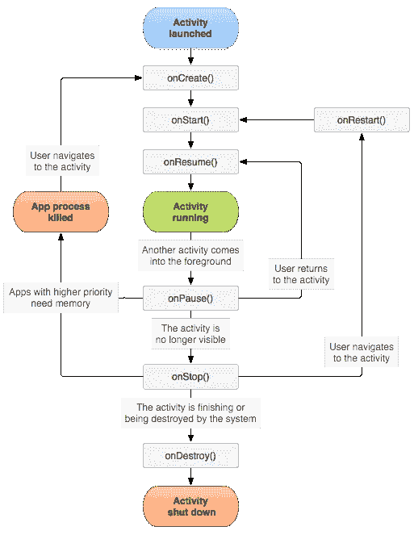
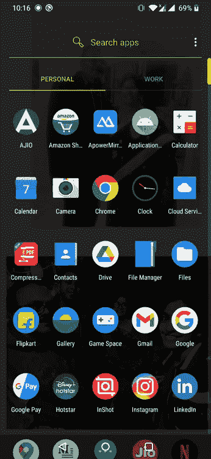
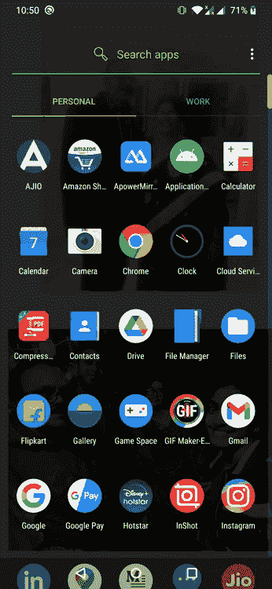

# [Android]:初学者理解活动生命周期-第 1 部分

> 原文：<https://medium.com/globant/android-understanding-activity-lifecycle-for-beginners-part-1-dfa4adae715f?source=collection_archive---------2----------------------->


pic credit-Google

*   ***安卓活动*** 是非常重要的组件，也是作为安卓开发者首先要了解的。

# **什么是活动？**

*   用户在手机应用程序屏幕上看到的一切都是活动。一个活动提供了一个窗口，应用程序可以在其中绘制用户界面。
*   我们日常使用的移动应用程序有多个屏幕，例如，假设我们有一个应用程序，其中用户首先**登录或注册**，并在**保存**按钮上单击用户导航到应用程序的**主屏幕**。这些都是执行不同操作的不同屏幕，这意味着我们的移动应用程序包含用户在屏幕上看到的多个活动。
*   为了提供这种用户体验，您应该知道如何管理组件的生命周期。Android 生命周期有不同的回调方法，例如，如果用户在生命周期中打开一个应用程序 create 方法 gets 调用，如果你正在使用音乐应用程序，你想切换到打开新的应用程序来查看通知消息，而不是暂停 gets 调用的新回调，所以每个回调都允许你执行特定的工作，以适应给定的状态变化。

# 活动生命周期概念:

*   一个 Android 活动在其整个生命周期中会经历许多状态。
*   理解生命周期阶段的框图



pic credit — developer.android

*   让我们一步一步来理解每种方法-
*   1. ***onCreate( )-*** 这个方法在活动第一次被创建时被调用。在这个方法中，您执行基本的应用程序启动逻辑，该逻辑在活动的整个生命周期中应该只发生一次。这是活动的基本设置，比如声明用户界面。
*   示例:

```
override fun onCreate(savedInstanceState: Bundle?) {
    super.onCreate(savedInstanceState)
    setContentView(R.layout.*activity_main*)
    Log.d("lifecycle","onCreate invoked");
}
```

*   在本例中，通过将文件的资源 ID`**R.layout.**`***activity _ main***传递给 setContentView()来指定 XML 布局文件。setContentView()做了什么指定视图的布局参数被忽略。视图的宽度和高度默认设置为`[ViewGroup.LayoutParams#MATCH_PARENT](https://developer.android.com/reference/android/view/ViewGroup.LayoutParams#MATCH_PARENT)`。要使用自己的布局参数，请调用`[setContentView(android.view.View, android.view.ViewGroup.LayoutParams)](https://developer.android.com/reference/android/app/Activity#setContentView(android.view.View,%20android.view.ViewGroup.LayoutParams))`。
*   现在，如你所见，我在代码中使用了 Log.d()来理解 onCreate()何时被调用。所以我创建了一个简单的程序，它有一个按钮“点击我”，这是用户可以看到的第一个屏幕，即主活动



**Application shows for onCraete(), onStart(), onResume()**

*   我打开我的应用程序，在这个应用程序上，我的第一个活动也就是主活动被打开，这个 ***OnCreate()*** 被调用。
*   2. ***onStart() —*** 当活动对用户可见时，这个方法被调用。当活动进入开始状态时，系统调用这个回调函数，这个方法是应用程序初始化维护 UI 的代码的地方。

```
override fun onStart() {
    super.onStart()
    Log.d("lifecycle","onStart invoked");
}
```

*   3.***【on resume()***—当活动开始与用户交互时，调用此方法。

```
override fun onResume() {
    super.onResume()
    Log.d("lifecycle","onResume invoked");
}
```

*   在活动开始、重新开始(onRestart()发生在 onStart()之前)或暂停(onPause())后，调用 onResume()。当活动处于 onResume()状态时，应用程序用户就可以使用该活动了。
*   如果要更新数据，可以创建一个数据更新函数，并将该函数放在 onResume()中。或者在 onResume()中放一个 loadData 函数。
*   4.***【on pause()***—当活动对用户不再可见时，调用此方法。当您导航到另一个活动 SecondActivity 时，您可以在您的 activity(比如 MainActivity)中覆盖 onPause()，当您返回到 MainActivity 时，您可以覆盖 onResume()。

```
override fun onPause() {
    super.onPause()
    Log.d("lifecycle","onPause invoked activity 2");
}
```

*   5.***【onStop()***—当活动对用户不再可见时，调用此方法。

```
override fun onStop() {
    super.onStop()
    Log.d("lifecycle","onStop invoked");
}
```

*   6.***on destroy()***—在 activity 销毁之前调用此方法。您的活动被销毁前收到的最后一个呼叫。这可能是因为活动即将结束(有人对它调用了 finish()，或者是因为系统为了节省空间而临时销毁了活动的这个实例。

```
override fun onDestroy() {
    super.onDestroy()
    Log.d("lifecycle","onDestroy invoked");
}
```

*   7.***【onRestart()***—在 activity 销毁之前调用此方法。当当前活动重新显示给用户时，在`onStop()`之后调用`onRestart()`。

```
override fun onRestart() {
    super.onRestart()
    Log.d("lifecycle","onRestart invoked");
}
```

*   让我们通过示例程序步骤来理解-



**Understanding of onPause, onStop**

> 现在，正如你在上面的 **gif** 中看到的，我已经创建了一个简单的程序，在这个程序中，带有按钮“Click me”**main Activity**的屏幕 1 首先被调用，单击按钮时，用户导航到带有文本“Go Back”**second Activity 的新活动。**

*   在这个导航过程中，我们调用了不同的方法:
*   (一)。点击应用程序，我们可以看到屏幕点击我主活动
*   **1。onCreate() — MainActivity(第一个活动)被调用**
*   **2。onStart() —主活动**
*   **3。onResume() — MainActivity()**

> (b .)现在按下 **ClickMe** 用户导航到新屏幕，即**第二个活动**

*   **1。onPause() — MainActivity()**
*   **2。onCreate() — SecondActivity 被调用**
*   **3。onStart() — SecondActivity**
*   **4。onResume() —第二个活动**
*   **5。onStop() —主活动**

> 如果用户点击 SecondActivity 的文本**“返回”**

*   **1。onPause- SecondActivity**
*   **2。onCreate() — MainActivity 被调用**
*   **3。onStart() —主活动**
*   **4。onResume() —主要活动**
*   **5。onStop() —SecondActivity**

主要活动代码:

```
 class MainActivity : AppCompatActivity() {
    override fun onCreate(savedInstanceState: Bundle?) {
        super.onCreate(savedInstanceState)
        setContentView(R.layout.*activity_main*)
        Log.d("lifecycle", "onCreate invoked Activity 1");
        val button: Button = findViewById(R.id.*btnFindMe*)
        button.setOnClickListener **{** val intent = Intent(this, SecondActivity::class.*java*)
            startActivity(intent)
        **}** }

    override fun onStart() {
        super.onStart()
        Log.d("lifecycle", "onStart invoked Activity 1");
    }

    override fun onResume() {
        super.onResume()
        Log.d("lifecycle", "onResume invoked Activity 1");
    }

    override fun onPause() {
        super.onPause()
        Log.d("lifecycle", "onPause invoked Activity 1");
    }

    override fun onStop() {
        super.onStop()
        Log.d("lifecycle", "onStop invoked Activity 1");
    }

    override fun onDestroy() {
        super.onDestroy()
        Log.d("lifecycle", "onDestroy invoked Activity 1");
    }

    override fun onRestart() {
        super.onRestart()
        Log.d("lifecycle", "onRestart invoked Activity 1");
    }

}
```

第二个活动的代码—

```
 class SecondActivity : AppCompatActivity() {
    override fun onCreate(savedInstanceState: Bundle?) {
        super.onCreate(savedInstanceState)
        setContentView(R.layout.*second_activity*)
        Log.d("lifecycle", "onCreate invoked activity 2");
        val txtClick: TextView = findViewById(R.id.*txtClickMe*)
        txtClick.setOnClickListener **{** val intent = Intent(this, MainActivity::class.*java*)
            startActivity(intent)
        **}** }

    override fun onStart() {
        super.onStart()
        Log.d("lifecycle", "onStart invoked activity 2");
    }

    override fun onResume() {
        super.onResume()
        Log.d("lifecycle", "onResume invoked activity 2");
    }

    override fun onPause() {
        super.onPause()
        Log.d("lifecycle", "onPause invoked activity 2");
    }

    override fun onStop() {
        super.onStop()
        Log.d("lifecycle", "onStop invoked activity 2");
    }

    override fun onDestroy() {
        super.onDestroy()
        Log.d("lifecycle", "onDestroy invoked activity 2");
    }

    override fun onRestart() {
        super.onRestart()
        Log.d("lifecycle", "onRestart invoked activity 2");
    }
}
```

*   主活动 xml-

```
<?xml version="1.0" encoding="utf-8"?>
<RelativeLayout android:id="@+id/RelativeLayout01"
    android:layout_width="fill_parent"
    android:layout_height="fill_parent"
    xmlns:android="http://schemas.android.com/apk/res/android">

    <Button android:id="@+id/btnFindMe"
        android:layout_width="wrap_content"
        android:layout_height="wrap_content"
        android:layout_centerInParent="true"
        android:text="Click me"></Button>

</RelativeLayout>
```

*   第二个活动 xml-

```
<?xml version="1.0" encoding="utf-8"?>
<androidx.constraintlayout.widget.ConstraintLayout
    xmlns:android="http://schemas.android.com/apk/res/android"
    android:layout_width="match_parent"
    android:layout_height="match_parent">
    <TextView
        android:id="@+id/txtClickMe"
        android:layout_width="wrap_content"
        android:layout_height="wrap_content"
        android:text="Go Back!"
        app:layout_constraintBottom_toBottomOf="parent"
        app:layout_constraintLeft_toLeftOf="parent"
        app:layout_constraintRight_toRightOf="parent"
        app:layout_constraintTop_toTopOf="parent" />

</androidx.constraintlayout.widget.ConstraintLayout>
```

*   我使用了这个简单的代码，在其中我们可以理解活动的生命周期流程。
*   如果你是初学者，正在学习 Android，我建议你一步一步地去理解活动生命周期流程。理解每一步，流畅地练习，保持简单

# 你必须努力保持它的简单和有意义。


credit — Google

*   快乐编码:)