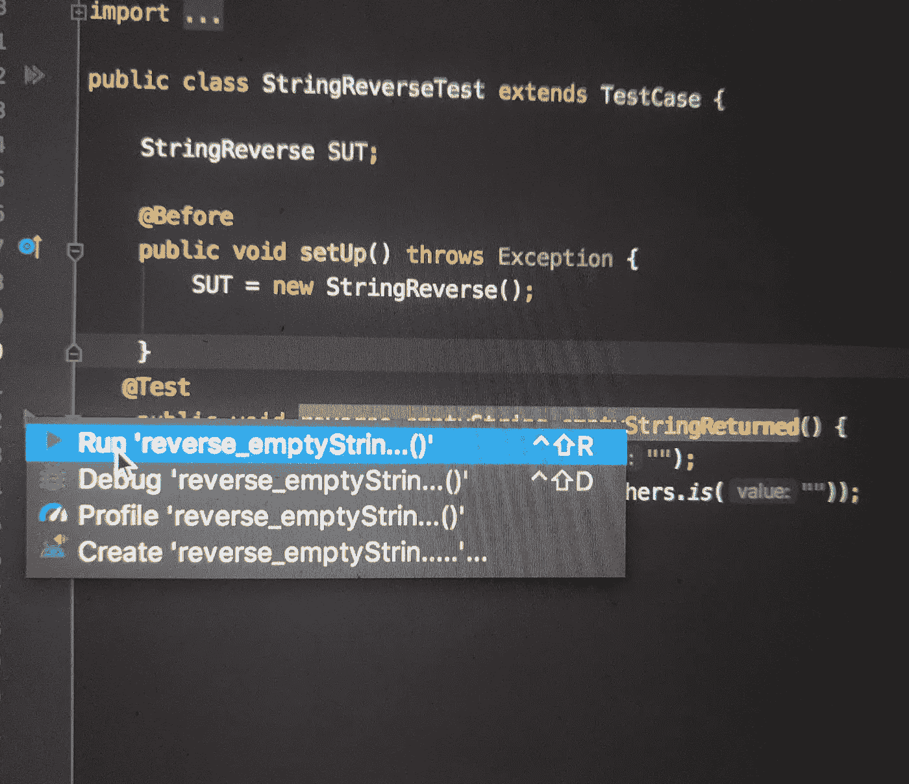

# Android:面向初学者的单元测试

> 原文：<https://medium.com/globant/android-unit-testing-for-beginners-f64f07e07a78?source=collection_archive---------0----------------------->


*   ***什么是单元测试？***
*   单元测试的目的是对系统的每个模块或单元进行识别、分析和修复缺陷。
*   单元测试是软件开发中至关重要的特性。它由用于检查代码业务逻辑的测试用例组成。
*   一般来说，测试意味着确保“这个东西”做它应该做的事情。
*   单元测试由测试用例组成，用于检查代码的**业务逻辑。确保类做它应该做的事情。**
*   ***以下是 Android 中使用的一些测试框架:***

1.  **JUnit**
2.  **莫奇托**
3.  **Powermock**
4.  **机器人电力**
5.  **浓缩咖啡**
6.  **汉克莱斯特**

*   让我们从 JUnit 测试框架开始，通过简单的 java 字符串反向示例来理解

```
public class StringReverse {
    public String reverse(String string){
        StringBuilder stringBuilder = new StringBuilder();
        for(int i = stringBuilder.length() - 1 ;i >= 0 ; i--){
             stringBuilder.append(string.charAt(i));
        }
        return stringBuilder.toString();
    }
}
```

*   假设我们编写了一个反转字符串的 JAVA 类，我们需要通过编写单元测试用例来测试它。
*   为了创建测试用例，你需要右击并点击
*   **转到>测试**


*   单击 Test 后，您将能够创建扩展 TestCase 类的测试类 StringReverseTest。
*   现在，在开始使用 StringReverseTest 类之前，我们应该理解我们将在测试类中使用的一些注释的含义。
*   ***JUnit 测试框架*** — JUnit 是一个测试框架，它使用注释来识别指定测试的方法。
*   让我们来看看一些基本的注释:

1.  **@BeforeClass :** 在类中任何测试方法之前运行一次。
2.  **@AfterClass** —在类中的所有测试都运行后运行一次。
3.  **@Before** —测试前运行
4.  **@后**——测试后运行
5.  **@Test** —这是要运行的测试方法

*   因此，在 StringReverseTest 类中，我们编写了方法 setUp()

```
public class StringReverseTest extends TestCase {

    StringReverse SUT;

    @Before
    public void setUp() throws Exception {
        SUT = new StringReverse();
     }
}
```

*   超类的`@Before`方法将在当前类的方法之前运行，除非它们在当前类中被覆盖。
*   现在在**之后，@在**之前，我们已经使用了 **@Test** ，它告诉使用它的公共 void 方法可以作为**测试**案例运行。
*   我写了 3 个方法来测试字符串反转

1.  ***测试方法是否有空字符串***

```
@Test
 public void reverse_emptyString_emptyStringReturned() {
     String result = SUT.reverse("");
    Assert.*assertThat*(result, CoreMatchers.*is*(""));
 }
```

*   在开始之前，我们应该理解断言
*   ***什么是断言？***


*   断言是一种用于确定测试用例通过或失败状态的方法。
*   assert 方法由 org.junit.Assert 类提供，该类扩展了 java.lang.Object 类。
*   **Assert . Assert that()**—**Assert that()**来自 Assert 对象的 JUnit 方法，可用于检查特定值是否与预期值匹配。
*   现在我们可以运行方法***reverse _ empty string _ empty string returned()。*** 我们如何通过点击绿色箭头或右击并点击运行来运行该方法。



*   现在，在运行这个测试用例之后，你可以看到这个测试用例将通过，因为两个表达式都传递空字符串。

2. ***测试方法是否有相同的单字符字符串***

```
@Test
public void reverse_singleCharString_singleCharStringReturned() {
    String result = SUT.reverse("b");
    *assertThat*(result, *is*("b"));
}
```

*   这里测试用例将通过，因为它正在反转单个字符的字符串。

3. ***测试方法是否有相同的多个字符串***

```
@Test
public void reverse_multipleCharString_multipleCharStringReturned() {
    String result1 = SUT.reverse("ababcc");
    *assertThat*(result1, *is*("abcabc"));
}
```

*   在这个测试用例中，将得到错误，因为传递的值不是先前传递的字符串的反码。
*   预期的字符串应该与传递的字符串相反，即
*   ababcc → ccbaba
*   这些是单元测试案例的一些基本例子
*   注意:-在这个程序中，我遵循了测试用例方法名的一些基本命名惯例
*   **<工作单元> _ <状态下测试> _ <预期行为>**
*   这应该是我们练习时应该遵循的模式。

快乐阅读:)