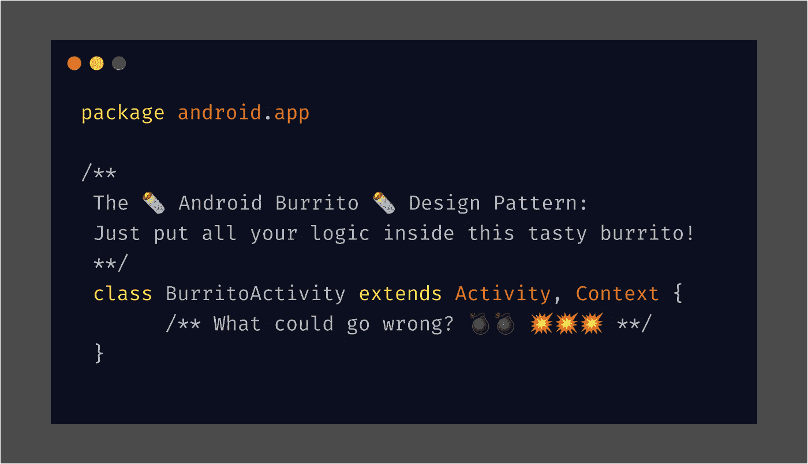
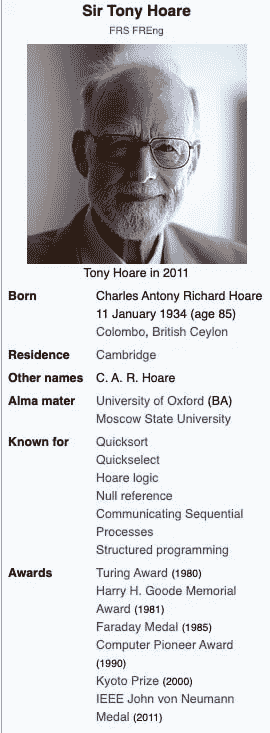

# Android 的十亿美元错误

> 原文：<https://blog.kotlin-academy.com/androids-billion-dollar-mistake-s-63518cc3ba26?source=collection_archive---------0----------------------->



一篇关于*十亿美元的错误*，那些被假设的错误和那些*保持沉默的错误*，以及关于*不要用糟糕的文档误导新开发人员的重要性*的文章。

# 十亿美元的错误报价

你听说过十亿美元的报价吗？大概是:

> 我称之为我的十亿美元错误。这是 1965 年零引用的发明。当时，我正在用面向对象语言(ALGOL W)设计第一个用于引用的综合类型系统。我的目标是确保所有引用的使用都是绝对安全的，由编译器自动执行检查。但是我无法抗拒放入空引用的诱惑，仅仅是因为它太容易实现了。这导致了数不清的错误、漏洞和系统崩溃，在过去的四十年里，这可能造成了数十亿美元的痛苦和损失。
> 
> 2009 年伦敦 QCon 上的东尼·霍尔[https://en.wikipedia.org/wiki/Tony_Hoare](https://en.wikipedia.org/wiki/Tony_Hoare)

# 托尼·霍尔是编程英雄🦸

如果你像我一样，当第一次听到这句话时，你的反应是:“哇。我也犯了很多错误，但通常不会花那么多钱！”。

最近我对此有了更深的思考，我现在认为**东尼·霍尔**是一个伟大的编程英雄！不仅仅是因为他在那个十亿美元的错误之外所做的令人印象深刻的工作



不，我的主张是，他还因为公开承担了它的“错误”而伟大！

你认为他是唯一一个犯了十亿美元错误的程序员吗？再想想。IT 部门是巨大的。脸书、谷歌、亚马逊、苹果、微软的市值在 5000 亿到 1 万亿美元之间。任何让他们的估值损失 0.2%的编程错误都是一个十亿美元的错误。

不，东尼·霍尔被称为犯了十亿美元错误的人的真正原因是**他明确公开地将自己的决定描述为一个错误，并通过这样做发出了一个明确的信号，事情必须改变**。

**我的朋友们，这个**对软件行业非常有益，这就是 Kotlin 和其他编程语言在它们的类型系统中内置了[零安全的原因](https://kotlinlang.org/docs/reference/null-safety.html)。它们仍然有`null`，这本身不是问题，但是它被集成到类型系统中*以确保所有引用绝对安全，检查由编译器自动执行*。

东尼·霍尔是真正的男子汉，一个没有自我意识的程序员，他为错误承担责任，这样我们就能认识到错误，我们都应该心存感激。

在 Android 世界，事情有点不同。在深入探讨之前，让我们先从一个简单的例子开始。

## 沙地匈牙利旋转

直到 2019 年 5 月，世界上大多数的 sAndroid mCodebases 都被匈牙利语的一个[无意义的 mVariant 所困扰。它的缺点是没有给 Android Studio 中简单的代码高亮规则带来任何好处，还有一个明显的缺点是*使得所有东西都不那么可读*。](https://jakewharton.com/just-say-no-to-hungarian-notation/)

当你在 2019 年之前提出这个问题时，你通常会得到两个答案之一:

*   这是现状，所以很好。
*   我们 Android 团队只是说，如果你在 Android 开源项目中贡献代码，就必须遵守这个约定。

但是实际上

*   第一个回答是*错*。我们知道这一点，因为自从匈牙利记谱法被废除后，没有人抱怨要恢复它。
*   第二个答案是*差*，它属于[非错范畴](https://en.wikipedia.org/wiki/Not_even_wrong)。这种说法本质上是说其他人都错了。那么显而易见的问题是:*为什么？*。因为每个人都在学习 Android 文档和示例，这种惯例无处不在。这正是你应该做的创建一个约定的艰苦而一致的工作。它只是碰巧是一个有害的惯例。

是什么杀死了 2019 年 5 月的 mHungarian 符号？不是承认错误，而是引进科特林。为什么我们要等这么久？

# Android 的十亿美元错误💣

# 定义“错误”一词

Android 显然是一个巨大的商业成功，我并没有相反的说法。Android 和 iPhone 已经成功地对智能手机世界实施了双重垄断，因此接下来发生的事情可能也不是战术上的“错误”。无论如何，我们必须使用 Android 团队提供的任何工具。

我也认为从用户的角度来看，Android 是一个很好的操作系统。你可以更喜欢 iOS，我没意见，但这并不能让 Android 变坏。

在本文的`Context`中，*错误*是指专门误导开发者走上一条会给他们带来痛苦和磨难的道路。

我也不认为这是 Android SDK 中唯一的大错误，甚至是 Android SDK 中最重要的错误。

如果你对了解 Android 的不好的部分感到好奇，那么#androiddev Reddit 社区已经整理了一个非常有用的列表，列出了他们在 Android 中发现的不好的地方。但在这里，我将关注一个有趣的基本错误。

# Android 玉米煎饼设计模式🌯

关于 Android 的一件悲哀的事情是，官方的 Android 样本遵循以色列费勒卡马乔所谓的 [Android 玉米煎饼设计模式](https://speakerdeck.com/rallat/androiddevlikeaprodroidconsf?slide=24):只是把*所有的东西*都包在一个玉米煎饼里🌯做*所有事情*的`GodActivity`和/或`GodFragment`。

看看`[😱 camera-samples/Camera2BasicFragment.kt 😭](https://github.com/android/camera-samples/blob/f555592364979f4005db0bea40753e0de52c8d86/Camera2BasicKotlin/Application/src/main/java/com/example/android/camera2basic/Camera2BasicFragment.kt#L60-L817)`的精彩源代码吧。我不得不剪切文件的大部分以适合一个要点，但它仍然是可读的:

See in its full glory at [https://github.com/android/camera-samples/blob/f555592364979f4005db0bea40753e0de52c8d86/Camera2BasicKotlin/Application/src/main/java/com/example/android/camera2basic/Camera2BasicFragment.kt#L60-L817](https://github.com/android/camera-samples/blob/f555592364979f4005db0bea40753e0de52c8d86/Camera2BasicKotlin/Application/src/main/java/com/example/android/camera2basic/Camera2BasicFragment.kt#L60-L817)

每当你建议在`Activity`里再放一个东西的时候，上帝就会杀死一只小猫。这正是 Android 官方文档和示例至今所做的事情。

如果你遵循 Android 玉米煎饼设计模式，会出什么问题？

# 猛撞

`Activity`是一种特殊的环境，充满了随时可能爆炸的地雷。最明显的问题是，由于这种复杂的生命周期，你的`Activity`随时可能被系统杀死。使用像`Application`这样生命周期更简单的`Context`要安全得多。

# 内存泄漏

`Activity`是一个昂贵的对象，它依赖于整个用户界面。抓住活动对象不放是很容易掉入陷阱的。随之而来的是内存泄漏。事实上，这是一个如此常见的陷阱，以至于你甚至会在 Android SDK 本身的类中看到这个错误，无论是在一些蹩脚的三星 fork 中还是在 Android 开源项目本身中。这是一个如此普遍的问题，以至于 square 的好人投入时间和精力来自动检测这些问题。

[](https://github.com/square/leakcanary) [## 方形/泄漏金丝雀

### LeakCanary 是一个用于 Android 的内存泄漏检测库。-正方形/leakcanary

github.com](https://github.com/square/leakcanary) 

# 即时遗留代码

`Legacy code`经常被用作一个模糊的术语，意思是“*代码难以理解，以至于你害怕改变它*”。Michael Feathers 的经典著作:[《有效地使用遗留代码》](https://www.amazon.de/Working-Effectively-Legacy-Robert-Martin/dp/0131177052)有一个更为精确和可操作的定义:任何没有被单元测试自动覆盖的代码都有资格成为遗留代码。

> *任何遵循 Android 玉米煎饼设计模式的代码都立即被视为遗留代码。*

我一直想知道为什么 Android 官方文档如此强调仪器测试。

根据我的经验，这些很难写，基本上很慢——它们必须在 Android 设备上运行——最糟糕的是，当它们失败时，它们通常不会告诉你什么。

我走了完全相反的方向，写了许多简单、快速、集中的 JVM 测试，并且有了更好的结果。事实上，谷歌的测试团队有一篇精彩的文章，解释了为什么端到端测试是一个明显的好主意，但在实践中却失败了:

> ***对更多的端到端测试说不***
> 
> *好主意经常在实践中失败，在测试领域，一个普遍的好主意经常在实践中失败，那就是围绕端到端测试构建的测试策略。*
> 
> *[…请阅读整篇文章，非常好……]* [*Google 测试博客:对更多端到端测试说不*](https://testing.googleblog.com/2015/04/just-say-no-to-more-end-to-end-tests.html)

所以仪器化的 Android 测试不是一个好主意。

但是老实说，如果你把你的逻辑放在 Android 组件里面，那几乎是你能做的全部:

> 检验玉米煎饼的唯一方法是尝一尝。

回想起来，Android 玉米煎饼的设计模式显然是错误的，这让我很好奇:它来自哪里，它是如何存活到今天的？

# 安卓卷饼设计模式是怎么成为一个东西的？

# 有的`Context`📚

给你一些`Context`，这是 Android SDK 1.0 的两个最基本的构建模块:

*   [Android . content . context](https://developer.android.com/reference/android/content/Context?hl=en)提供对关于应用环境的所有全局信息的访问。它允许访问特定于应用程序的资源和类，以及对应用程序级操作的向上调用，如启动活动、广播和接收意图等。
*   [android.app.Activity](https://developer.android.com/reference/android/app/Activity?hl=en) 为应用程序提供了相当于`main()`的功能，但增加了移动操作系统所需的许多功能，最重要的是复杂的[活动生命周期](https://developer.android.com/guide/components/activities/activity-lifecycle?hl=en)。

这两个概念有什么关系？

# 活动就是背景

这是一个在 Android 1.0 中犯的致命错误

```
package android.app;import android.content.Context;class Activity extends Context { 
}
```

但首先要讲一点理论。

# 构图的遗传🙄

从你的[面向对象编程](https://en.wikipedia.org/wiki/Object-oriented_programming) 101 课程中，你可能记得对象之间有两种非常不同的关系:

*   **继承**:房子**是**建筑
*   **构图**:一栋房子**有一个**房间

[优于继承的组合](https://en.wikipedia.org/wiki/Composition_over_inheritance)是一个众所周知的设计原则，在一些有影响力的书籍中有所陈述，如

*   [设计模式:可重用面向对象软件的元素(1994)](https://en.wikipedia.org/wiki/Design_Patterns) ，作者:Erich Gamma、Richard Helm、Ralph Johnson 和 John Vlissides
*   约书亚·布洛赫的《有效的 Java》

Android 仅仅是另一个 SDK ( [软件开发工具包](https://en.wikipedia.org/wiki/Software_development_kit))，但是是否有理由说明这个原理在这里并不适用？嗯，不，我知道如果他们今天有机会重写`Activity`，Android 团队不会这样做，因为…

# 碎片！是上下文🤔

如果你看一下 [androidx.app.Fragment](https://developer.android.com/reference/androidx/fragment/app/Fragment.html?hl=en) ，Android SDK 的另一个构建块与 Activity 非常相似，但在**之后**引入，你会意识到它确实**而不是**扩展了上下文。相反，片段**具有**上下文。

那么，为什么 Android 团队会改变主意，尽管是悄悄的？

# 在 Android 中，一切都需要上下文📱

你可以也应该避免墨西哥卷饼的设计模式。你无法逃避的是，在 Android 中，你需要一个上下文来做基本上所有的事情:

```
class SomeThirdPartyClass {
    fun doStuff(contex: Context) = TODO()
}
```

但即使是这种平庸的课程也是一颗等待爆炸的地雷。

活动**是一个**上下文，所以很容易将`this@Activity`作为参数传递给`doStuff()`。但是这样做是错误的，你不能确定`SomeThirdPartyClass`正在做正确的事情，或者你正在做正确的事情。崩溃、内存泄漏和不可测试性随之而来。

我想指出，我说的不仅仅是一个历史性的短视决定。

# 文件和样品今天仍然是糟糕的

2014 年，我是一个年轻的没有经验的 Android 开发者团队中的一个年轻的没有经验的 Android 开发者。我们试图了解这些东西是如何工作的，并使用 Android 文档和样本作为蓝图。回想起来，这是一个可怕的错误。我们最终得到了一个痛苦的难以理解、难以测试、甚至更难修改的烂摊子。不是因为我们没有遵循“Android 最佳实践”，而是*正是因为我们遵循了！*

快进到今天，虽然已经在几个领域取得了进展，但很大一部分官方 Android 文档和示例仍然写得很差。它继续误导新一代没有经验的开发人员。正如 Bob 叔叔会告诉你的，大多数开发人员都是新手，因为 IT 行业每五年就要翻一番。

我意识到，对于某些学派来说，所有这些都是公平的游戏:“*那些错误是愚蠢的，我是一个真正的程序员，不会上当。你不能阻止愚蠢的人变得愚蠢，不是吗？*”。

但是我来自*为人类而设计*学派，所以在我看来，当一个程序员犯了一个错误，那是程序员的错，但是当十多年过去了，成千上万的程序员一次又一次地犯同样的错误，那么就是设计者和文档作者没有做好工作。理想情况下，做正确的事应该很容易，搬起石头砸自己的脚应该更难。

所以是时候说清楚了，卷饼活动和片段是不可以的。已经过了修改文档和样本的时间了。

# “犯了错误”😔

我确实明白，尽管这些错误在今天是痛苦的，但它们是在特定的历史背景下犯下的。Android 项目必须发布一些东西或者变得无关紧要，当智能手机远不如今天强大时，这是一个不同的领域。

JavaScript 也是如此。[它的设计在短短十天内匆匆完成](https://thenewstack.io/brendan-eich-on-creating-javascript-in-10-days-and-what-hed-do-differently-today/)，然后在[网景导航器 1.0](https://fr.wikipedia.org/wiki/Netscape_Navigator) 中出货，剩下的就是历史了。

并不是说没有解决方案可以让这种历史错误变得可控。

聪明人一旦痛苦地意识到问题所在，通常会很快找到解决方案。

这正是东尼·霍尔无我的诚实的伟大之处:它立刻让人意识到这里有一个问题需要解决。这就是今天 Android 世界所缺乏的。Android 官方文档延续至今，用奇妙的 Android 卷饼设计模式杀死小猫。

请允许我引用东尼·霍尔的话来结束我的发言:

> 这导致了数不清的错误、漏洞和系统崩溃，在过去的十年中，这可能造成了数十亿美元的痛苦和损失。

# 单击👏说“谢谢！”并帮助他人找到这篇文章。

了解卡帕头最新的重大新闻。学院、[订阅时事通讯](https://kotlin-academy.us17.list-manage.com/subscribe?u=5d3a48e1893758cb5be5c2919&id=d2ba84960a)、[观察 Twitter](https://twitter.com/ktdotacademy) 并在 medium 上关注我们。

如果您需要 Kotlin 工作室，请查看我们如何帮助您: [kt.academy](https://www.kt.academy/) 。

[](https://kotlin-academy.us17.list-manage.com/subscribe?u=5d3a48e1893758cb5be5c2919&id=d2ba84960a)